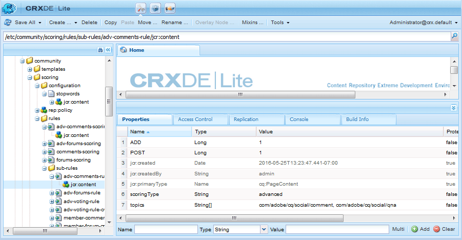

# 高级评分和徽章{#advanced-scoring-and-badges}

## 概述 {#overview}

高级评分允许授予徽章，以识别会员为专家。 高级评分根据成员创建的内容的数量&#x200B;*和*&#x200B;质量分配积分，而基本评分则仅根据创建的内容数量分配积分。

此差异是由于用于计算得分的得分引擎。 基本的评分引擎应用简单的数学。 高级评分引擎是一种自适应算法，它奖励通过主题的自然语言处理(NLP)推导的贡献有价值和相关内容的活动成员。

除内容相关性外，评分算法还考虑成员活动，如投票和答案百分比。 虽然基本评分可以定量计算，但高级评分会通过算法来使用它们。

因此，高级评分引擎需要足够的数据来使分析有意义。 随着算法不断根据所创建内容的体积和质量进行调整，不断重新评估成为专家的成就阈值。 还有成员旧员额的&#x200B;*衰减*&#x200B;的概念。 如果专家成员停止参与他们获得专家身份的主题事项，在某个预定点（参见[评分引擎配置](#configurable-scoring-engine)），他们可能失去其专家身份。

设置高级评分与基本评分基本相同：

* 基本和高级评分和徽章规则以相同方式应用于内容](implementing-scoring.md#apply-rules-to-content)[
   * 基本和高级评分及徽章规则可应用于相同内容
* [为组件启用标](implementing-scoring.md#enable-badges-for-component) 记通用

在设置得分和徽章规则方面的差异是：

* 可配置的高级评分引擎
* 高级评分规则：
   * `scoringType` 设置为高 **[!UICONTROL 级]**
   * 需要秒

* 高级徽章规则：
   * `badgingType` 设置为高 **[!UICONTROL 级]**
   * `badgingLevels` 设置为要授予的专家级别数
   * 需要`badgingPaths`阵列标记，而不是阈值阵列映射点到标记

>[!NOTE]
>
>要使用高级评分和徽章功能，请安装[专家识别包](https://www.adobeaemcloud.com/content/marketplace/marketplaceProxy.html?packagePath=/content/companies/public/adobe/packages/cq640/social/cq-social-expert-identification-pkg)。

## 可配置的评分引擎{#configurable-scoring-engine}

高级评分引擎提供OSGi配置，其参数影响高级评分算法。

* **[!UICONTROL 评]**
分权重对于主题，指定在计算得分时应给予最高优先级的动词。可以输入一个或多个主题，但仅限于每个主题**一个动词。**&#x200B;请参阅[主题和动词](implementing-scoring.md#topics-and-verbs)。

   输入为`topic,verb`，逗号转义。 例如：

   `/social/forum/hbs/social/forum\,ADD`

   对于QnA和论坛组件，默认设置为ADD动词。

* **[!UICONTROL 评分范围]**

   高级得分的范围由此值（最高可能得分）和0（最低可能得分）定义。

   默认值为100，因此评分范围为0-100。

* **[!UICONTROL 实体衰减时间间隔]**

   此参数表示所有实体得分被延迟的小时数。 这要求不再在社区站点的分数中包含旧内容。

   默认值为216000小时（~24年）。

* **[!UICONTROL 评分增长率]**

   这指定得分。 在0到评分范围之间，超过这一范围，增长将放缓，以限制专家人数。

   默认值为 50。

## 高级评分规则{#advanced-scoring-rules}

在基本评分中，获得徽章所需的数量是已知的。

在高级评分中，根据系统内的质量数据量不断调整所需数量。 得分会以类似钟形曲线的方式持续计算。

如果某位成员在某个主题上获得了专家徽章，而该主题不再有效，那么他们可能会因为随着时间的推移而衰败而失去其徽章。

### ScoringType {#scoringtype}

评分规则是一组评分子规则，每个子规则都声明`scoringType`。

要调用高级评分引擎，`scoringType`应设置为`advanced`。

请参阅[评分子规则](implementing-scoring.md#scoring-sub-rules)。

### 秒数{#stopwords}

高级评分包会安装一个配置文件夹，其中包含一个秒词文件：

* `/etc/community/scoring/configuration/stopwords`

高级评分算法使用包含在秒词文件中的词的列表来识别在内容处理期间被忽略的常见英语词。

不希望修改此文件。

如果秒词文件缺失，高级评分引擎将引发错误。

## 高级标记规则{#advanced-badging-rules}

高级标记规则属性与[基本标记规则属性](implementing-scoring.md#badging-rules)不同。

除了将点与徽章图像关联之外，只需确定允许的专家数量和要授予的徽章图像。

| **属性** | **类型** | **值描述** |
|---------------|----------|--------------------------------------------------------------------------------------------------------------------------------------------------------------------------------------------------------------------------------------------------------------------------------------------------------------------------------------------------------------------------------|
| badgingPath | String[] | （必需）徽章图像的多值字符串，最高为badgingLevels的数量。 必须对徽章图像路径进行排序，以便将第一个路径授予最高专家。 如果标记数少于badgingLevels所指示的标记数，则数组中的最后一个标记将填充数组的其余部分。 示例条目：/etc/community/badging/images/expert-badge/jcr:content/expert.png |
| 标记级别 | 长整型 | （可选）指定要授予的专业知识级别。 例如，如果应有专家和几乎是专家（两个徽章），则值应设置为2。 badgingLevel应与为badgingPath属性列出的专家相关徽章图像的数量相对应。 默认值为1。 |
| badgingType | 字符串 | （必需）将评分引擎标识为“基本”或“高级”。 如果设置为“高级”，则默认值为“基本”。 |
| scoringRules | 字符串[] | （可选）用于将标记规则限制为由列出的评分规则标识的评分事件的多值字符串。示例条目：/etc/community/scoring/rules/adv-comments-scoring默认不限制。 |

## 包含的规则和徽章{#included-rules-and-badge}

### 包含的徽章{#included-badge}

此测试版中包含一个基于奖励的专家徽章：

* 专家

   `/etc/community/badging/images/expert-badge/jcr:content/expert.png`

为了让专家徽章显示为活动的奖励，必须做两件事：

* `badges` 必须为功能（如论坛或问题与答案组件）启用
* 高级评分和标记规则必须应用于放置组件的页面（或上级）

请参阅以下基本信息：

* [为组件启用徽章](implementing-scoring.md#enable-badges-for-component)
* [应用规则](implementing-scoring.md#apply-rules-to-content)

### 包含评分规则和子规则{#included-scoring-rules-and-sub-rules}

测试版中包含两个用于[论坛功能](functions.md#forum-function)的高级评分规则（每个用于论坛和论坛功能的评论组件）：

1. /etc/community/scoring/rules/adv-comments-scoring

   * `subRules[]` =

      /etc/community/scoring/rules/subrules/adv-comments-rule

      /etc/community/scoring/rules/subrules/adv-porting-rule-owner

      /etc/community/scoring/rules/subrules/adv-porting-rule

2. /etc/community/scorning/rules/adv-forums-scorning

   * `subRules[]` =

      /etc/community/scoring/rules/subrules/adv-forums-rule

      /etc/community/scoring/rules/subrules/adv-comments-rule

      /etc/community/scoring/rules/subrules/adv-porting-rule-owner

**注释:**

* `rules`和`sub-rules`节点的类型都为`cq:Page`
* `subRules` 是规则节点类[] 型“字符串”的属 `jcr:content` 性
* `sub-rules` 可能在各种评分规则之间共享
* `rules` 应该位于每个人都具有读取权限的存储库位置
   * 规则名称必须唯一，而不管位置

### 包含标记规则{#included-badging-rules}

版本中包含两个与[高级论坛和评论评分规则](#included-scoring-rules-and-sub-rules)对应的高级标记规则。

* /etc/community/badging/rules/adv-comments-badging
* /etc/community/badging/rules/adv-forums-badging

**注释:**

* `rules` 节点的类型  `cq:Page`
* `rules`应该位于每个人都具有读取权限的存储库位置
   * 规则名称必须唯一，而不管位置
