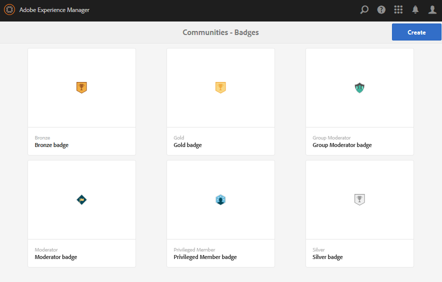

# 徽章控制台 {#badges-console}

## 关于徽章 {#about-badges}

社区徽章控制台提供了添加自定义徽章的功能，当会员获得（授予）或在社区中承担特定角色（分配）时，可向其显示自定义徽章。

### 徽章可见性 {#badge-visibility}

目前，社区成员获得或分配的徽章将与其姓名和头像一起显示在以下位置：

* 个人资料
* [论坛](forum.md)
* [问题与解答](working-with-qna.md)
* [排行榜](enabling-leaderboard.md)
* [构思](ideation-feature.md)

在创作环境中，访问徽章控制台

* 从全局导航：**[!UICONTROL 工具>社区>徽章]**

此控制台会显示当前可用的徽章，以及可从中添加新徽章的徽章。

## 创建徽章 {#create-badge}

通过上传合适的小图像（72dpi，高度在26-32像素之间）并提供名称来创建标记。 标记图像存储在位于`/etc/community/badging/images`的存储库中，并会自动复制到发布环境。

如果发布环境是发布者的场，则需要配置[用户同步](sync.md)。

* **[!UICONTROL 上传图像]**

   （*必需*）JPEG或PNG格式的72dpi建议大小为32 x 32像素的标记图像。

* **[!UICONTROL 名称]**

   （*必需*）标记名称。 它是默认的`Display Name`以及存储库节点名称。 如果`Name`不是有效的存储库节点名称，则会对其进行修改。

* **[!UICONTROL 显示名称]**

   （*可选*）要在UI中显示标记的名称。 默认为为`Name`输入的未更改文本。

* **[!UICONTROL 描述]**

   （*可选*）标记的描述。

## 附加信息 {#additional-information}

有关设置评分和标记规则的详细信息，请参阅[评分和徽章](implementing-scoring.md)。

有关管理成员的徽章，请参阅[成员控制台](members.md)。
