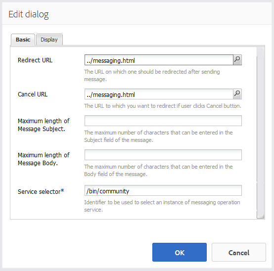

# 消息功能{#messaging-feature}

除了在论坛和评论中发生的公开可见的互动外，AEM Communities的消息传递功能使社区成员能够更加私下地彼此互动。

当创建[社区站点](overview.md#communitiessites)时，可以包括此功能。

消息功能可以：

* 向一个或多个社区成员发送消息
* 向社区成员组发送消息
* 发送包含附件的邮件
* 转发消息
* 回复邮件
* 删除消息
* 恢复已删除的消息

要启用和修改消息功能，请访问

* [为管理](messaging.md) 员配置消息
* [对开发人](essentials-messaging.md) 员来说消息基本

>[!NOTE]
>
>不支持在作者编辑模式下将`Compose Message, Message, or Message List`组件（位于`Communities`组件组中）添加到页面。

## 配置消息传递组件{#configuring-messaging-components}

为社区站点启用消息传递后，将完全设置该站点，无需进一步配置。 如果需要更改默认配置，则会提供此信息。

### 配置消息列表符（消息框）{#configuring-message-list-messagebox}

为了修改&#x200B;**收件箱**、**已发送项目**&#x200B;和&#x200B;**垃圾桶**&#x200B;页面的邮件列表配置，请以[作者编辑模式](sites-console.md#authoring-site-content)打开站点。

在`Preview`模式中，选择&#x200B;**[!UICONTROL 消息]**&#x200B;链接以打开主消息页面。 然后，选择&#x200B;**[!UICONTROL 收件箱、已发送项目或垃圾桶]**&#x200B;以配置该邮件列表的组件。

在`Edit`模式下，选择页面上的组件。

要访问配置对话框，必须通过选择`link`图标来取消继承。

配置完成后，必须通过选择`broken link`图标来恢复继承。

取消继承后，可以选择`configure`图标以打开配置对话框。

#### 基本选项卡{#basic-tab}

* **[!UICONTROL 服务选择器]**
(*必需*)将其设置为“AEM Communities消息 `serviceSelector.name` 操作服 [务”属性的值](messaging.md#messaging-operations-service)。

* **[!UICONTROL 合成页]**
(*必需*)成员单击按钮时要打开的 `Reply` 页面。目标页应包含&#x200B;**[!UICONTROL 撰写消息]**&#x200B;表单。

* **[!UICONTROL 作为资源的回]**
复/视图如果选中，则回复URL和视图URL将引用资源，否则数据将作为查询参数在URL中传递。

* **[!UICONTROL 用户档案显]**
示表单用于显示发件人用户档案的用户档案表单。

* **[!UICONTROL 废纸]**
篓文件夹如果选中，则此邮件列表组件仅显示标记为已删除（废纸篓）的邮件。

* **[!UICONTROL 文件夹路径]**
(*必需*)引用为AEM Communities消息 `inbox.path.name` 操作 `sentitems.path.name` 服务设置 [的值和值](messaging.md#messaging-operations-service)。为`Inbox`配置时，请使用`inbox.path.name`值添加一个条目。 为`Outbox`配置时，请使用`sentitems.path.name`值添加一个条目。 配置`Trash`时，添加两个同时具有这两个值的条目。

#### 显示选项卡{#display-tab}

* **[!UICONTROL 标记读取]**
按钮如果选中，则显示 
`Read`按钮。

* **[!UICONTROL 标记为未读]**
按钮如果选中，将显示 
`Mark Unread` 按钮。

* **[!UICONTROL 删除按]**
钮如果选中，将显示 
`Delete`按钮。如果还选中&#x200B;**`Message Options`**，将重复删除功能。

* **[!UICONTROL 消息选]**
项如果选中，则显示 
**`Reply`**、 **`Reply All`**&#x200B;和 **`Forward`**  **`Delete`** 允许重发或删除消息的按钮。如果还选中&#x200B;**`Delete Button`**，将重复删除功能。

* **[!UICONTROL 每页消]**
息指定的数量是分页方案中每页显示的最大消息数。如果未指定数字（留空），则显示所有消息，且不显示分页。

* **[!UICONTROL 时间戳]**
模式为一种或多种语言提供时间戳模式。默认值为en、de、fr、it、es、ja、zh_CN、ko_KR。

* **[!UICONTROL 显示用]**
户选择 
**`Sender`** 或确 **`Recipients`** 定是否显示发送者或收件人。

### 配置起草消息{#configuring-compose-message}

要修改合成消息页面的配置，请以[作者编辑模式](sites-console.md#authoring-site-content)打开站点。

在`Preview`模式中，选择&#x200B;**[!UICONTROL 消息]**&#x200B;链接以打开主消息页面。 然后选择“新建消息”按钮以打开`Compose Message`页面。

在`Edit`模式中，选择包含邮件正文的页面上的主组件。

要访问配置对话框，必须通过选择`link`图标来取消继承。

配置完成后，必须通过选择`broken link`图标来恢复继承。

取消继承后，可以选择`configure`图标以打开配置对话框。

#### 基本选项卡{#basic-tab-1}

* **[!UICONTROL 重定]**
向URL输入发送消息后显示的页面的URL。例如， 
`../messaging.html`。

* **[!UICONTROL 取消]**
URL如果发送方取消消息，则输入显示的页面URL。例如， 
`../messaging.html`。

* **[!UICONTROL 邮件主题的最]**
大长度“主题”字段中允许的最大字符数。例如，500。 默认值为无限制。

* **[!UICONTROL 消息正文的最]**
大长度内容字段中允许的最大字符数。例如，10000。 默认值为无限制。

* **[!UICONTROL 服务选择器]**
(*必需*)将其设置为“AEM Communities消息 **`serviceSelector.name`** 操作服 [务”属性的值](messaging.md#messaging-operations-service)。

#### 显示选项卡{#display-tab-1}

* **[!UICONTROL 显示主题]**
字段如果选中，则显示 
`Subject` 字段，然后启用向邮件添加主题。未选中默认值。

* **[!UICONTROL 主题]**
标签输入要显示在 
`Subject` 字段. 默认值为`Subject`。

* **[!UICONTROL 显示附加文件]**
字段如果选中，则显示 
`Attachment` 字段并启用向邮件中添加文件附件。未选中默认值。

* **[!UICONTROL 附加文]**
件标签输入要在 
`Attachment` 字段. 默认值为&#x200B;**`Attach File`**。

* **[!UICONTROL 显示内容]**
字段如果选中，则显示 
`Content` 字段，并启用添加消息正文。未选中默认值。

* **[!UICONTROL 内容]**
标签输入要在 
`Content` 字段. 默认值为&#x200B;**`Body`**。

* **[!UICONTROL 使用富文本编]**
辑器如果选中，则表示自定义内容文本框的使用情况与其自己的富文本编辑器。未选中默认值。

* **[!UICONTROL 时间戳]**
模式为一种或多种语言提供时间戳模式。默认值为en、de、fr、it、es、ja、zh_CN、ko_KR。

