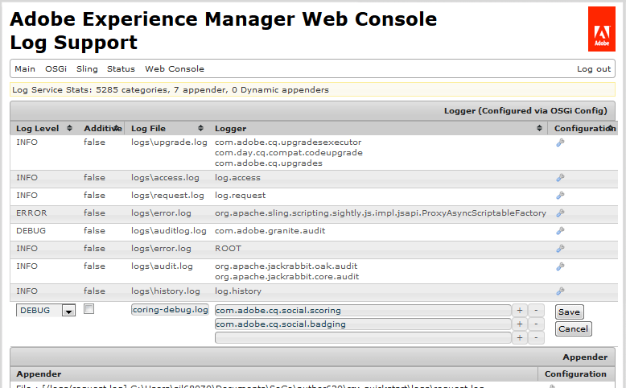

# 评分和徽章基础 {#scoring-and-badges-essentials}

AEM Communities评分和徽章功能提供识别和奖励社区成员的能力。

有关设置该功能的详细信息，请参阅

* [社区评分和徽章](implementing-scoring.md)

本页包含其他技术详细信息：

* 如何 [将徽章显示](#displaying-badges) （图像或文本）
* 如何打开大量调试 [日志记录](#debug-log-for-scoring-and-badging)
* 如何访 [问与评分](#ugc-for-scoring-and-badging) 和徽章相关的UGC

>[!CAUTION]
>
>在CRXDE Lite中可见的实现结构可能会发生变化。

## 显示标记 {#displaying-badges}

徽章是以文本形式显示还是以图像形式显示在HBS模板的客户端上。

例如，在 `this.isAssigned` 中 `/libs/social/forum/components/hbs/topic/list-item.hbs`搜索：

```
{{#each author.badges}}

  {{#if this.isAssigned}}

    <div class="scf-badge-text">

      {{this.title}}

    </div>

  {{/if}}

{{/each}}

{{#each author.badges}}

  {{#unless this.isAssigned}}

    

  {{/unless}}

{{/each}}
```

如果为true，则isAssigned表示为角色分配了标记，该标记应显示为文本。

如果为false，则“已分配”表示标记已通过获得的得分获得，并且标记应显示为图像。

对此行为所做的任何更改都应在自定义脚本中进行（覆盖或叠加）。 请参 [阅客户端自定义](client-customize.md)。

## 用于评分和徽章的调试日志 {#debug-log-for-scoring-and-badging}

为了帮助调试评分和徽章，可以设置自定义日志文件。 如果该功能出现问题，可向客户支持提供此日志文件的内容。

有关详细说明，请 [访问创建自定义日志文件](../../help/sites-deploying/monitoring-and-maintaining.md#create-a-custom-log-file)。

要快速设置幻灯片文件：

1. 访问 **[!UICONTROL Adobe Experience ManagerWeb控制台日志支持]**，例如

   * http://localhost:4502/system/console/slinglog

1. 选择 **[!UICONTROL 添加新记录器]**

   1. 选择 `DEBUG` 日志 **[!UICONTROL 级别]**
   1. 输入日志文 **[!UICONTROL 件的名]**&#x200B;称，例如

      * logs/scoring-debug.log
   1. 输入两 **[!UICONTROL 个Logger]** （类）条目(使用 `+` 图标)

      * `com.adobe.cq.social.scoring`
      * `com.adobe.cq.social.badging`
   1. Select **[!UICONTROL Save]**




要查看日志条目：

* 从Web控制台

   * 在“状态 **[!UICONTROL ”菜单]** 下
   * 选择 **[!UICONTROL 日志文件]**
   * 搜索日志文件名，如 `scoring-debug`

* 在服务器的本地磁盘上

   * 日志文件位&#x200B;*于&lt;server-install-dir*>/crx-quickstart/logs/&lt;*log-file-name*>.log
   * 例如，`.../crx-quickstart/logs/scoring-debug.log`


## 用于评分和徽章的UGC {#ugc-for-scoring-and-badging}

当所选SRP是JSRP或MSRP，但不是ASRP时，可以视图与评分和徽章相关的UGC。 (如果不熟悉这些术语，请参 [阅社区内容存储](working-with-srp.md)[和存储资源提供者概述](srp.md)。)

访问评分和标记数据的描述使用JSRP，因为UGC可以使用 [CRXDE Lite](../../help/sites-developing/developing-with-crxde-lite.md)。

**作者JSRP**:在作者环境中进行实验，结果在UGC中，仅在作者环境中可见。

**发布时的JSRP**:同样，如果在发布环境上进行测试，则必须对发布实例使用管理权限访问CRXDE Lite。 如果发布实例在生产模 [式](../../help/sites-administering/production-ready.md) （nosamplecontent运行模式）中运行 [，则需要启用](../../help/sites-administering/enabling-crxde-lite.md)CRXDE Lite。

UGC在JSRP上的基本位置是 `/content/usergenerated/asi/jcr/`。

### 评分和标记API {#scoring-and-badging-apis}

以下API可供使用：

* [com.adobe.cq.social.scoring.api](https://docs.adobe.com/content/docs/en/aem/6-3/develop/ref/javadoc/com/adobe/cq/social/scoring/api/package-summary.html)
* [com.adobe.cq.social.badging.api](https://docs.adobe.com/content/docs/en/aem/6-3/develop/ref/javadoc/com/adobe/cq/social/badging/api/package-summary.html)

开发人员可从Adobe [库](deploy-communities.md#LatestReleases) 获取已安装版本的最新Javadoc。 请参 [阅将Maven用于社区：Javadocs](maven.md#javadocs)。

**UGC在存储库中的位置和格式可能会发生更改，但不会发出警告**。

### 示例设置 {#example-setup}

存储库数据的屏幕快照来自为两个不同AEM站点上的论坛设置评分和徽章：

1. 具有唯一id的AEM站点（使用向导创建的社区站点）:

   * 使用在入门教程中创建的入门教程( [参与)站点](getting-started.md)
   * 找到论坛页面节点

      * `/content/sites/engage/en/forum/jcr:content`
   * 添加评分和徽章属性

      * `scoringRules = [/etc/community/scoring/rules/comments-scoring,`

         `/etc/community/scoring/rules/forums-scoring]`
      * `badgingRules =[/etc/community/badging/rules/comments-scoring,`

         `/etc/community/badging/rules/forums-scoring]`
   * 找到论坛组件节点

      * `/content/sites/engage/en/forum/jcr:content/content/primary/forum`

         ( `sling:resourceType = social/forum/components/hbs/forum`)
   * 向显示标记添加属性

      * `allowBadges = true`
   * 用户登录、创建论坛主题并获得铜牌奖


1. 没有唯一 *id* 的AEM站点：

   * 使用社 [区组件指南](components-guide.md)
   * 找到论坛页面节点

      * `/content/community-components/en/forum/jcr:content`
   * 添加评分和徽章属性

      ```
      scoringRules = [/etc/community/scoring/rules/comments-scoring,
      /etc/community/scoring/rules/forums-scoring]
      ```

      ```
      badgingRules =[/etc/community/badging/rules/comments-scoring,
      /etc/community/badging/rules/forums-scoring]
      ```

   * 找到论坛组件节点

      * `/content/community-components/en/forum/jcr:content/content/forum`

         ( `sling:resourceType = social/forum/components/hbs/forum`)
   * 向显示标记添加属性

      * `allowBadges = true`
   * 用户登录、创建论坛主题并获得铜牌奖


1. 用户会使用cURL获得一个审查方徽章：

```shell
curl -i -X POST -H "Accept:application/json" -u admin:admin -F ":operation=social:assignBadge" -F "badgeContentPath=/etc/community/badging/images/moderator/jcr:content/moderator.png" http://localhost:4503/home/users/community/w271OOup2Z4DjnOQrviv/profile.social.json
```

由于用户获得了两枚铜牌，并被授予版主徽章，因此用户在论坛条目中的显示方式如下：


>[!NOTE]
>
>此示例不遵循以下最佳实践：
>
>* 评分规则名称应具有全局唯一性；他们不应以同一个名字结尾。\
   >  不要执行 *的* 示例：\
   >  /etc/community/scorning/rules/site1/forums-scorning\
   >  /etc/community/scorning/rules/site2/forums-scorning
   >
   >
* 创建不同AEM站点的唯一徽章图像

>


### 访问评分UGC {#access-scoring-ugc}

首选 [使用](#scoring-and-badging-apis) API。

为便于调查，以JSRP为例，包含分数的基本文件夹是

* `/content/usergenerated/asi/jcr/scoring`

的子节点 `scoring`是评分规则名称。 因此，最佳实践是，在服务器上对规则名称进行评分是全局唯一的。

对于“Geometrixx参与”站点，用户及其得分所在的路径包含评分规则名称、社区站点的站点ID()、唯一 `engage-ba81p`ID和用户ID:

* `.../scoring/forums-scoring/engage-ba81p/6d179715c0e93cb2b20886aa0434ca9b5a540401/riley`

对于“社区组件”指南站点，用户及其得分位于使用评分规则名称、默认ID()、唯一ID和用户ID构 `default-site`建的路径中：

* `.../scoring/forums-scoring/default-site/b27a17cb4910a9b69fe81fb1b492ba672d2c086e/riley`

得分存储在属性中， `scoreValue_tl` 该属性可能仅直接包含值或间接引用atomicCounter。


### 访问标记UGC {#access-badging-ugc}

首选 [使用](#scoring-and-badging-apis) API。

为便于调查，以JSRP为例，将包含分配或奖励标记信息的基本文件夹

* /content/usergenerated/asi/jcr

后跟用户用户档案的路径，以标记文件夹结尾，如

* /home/users/community/w271OOup2Z4DjnOQrviv/用户档案/徽章

#### 奖章 {#awarded-badge}


#### 已分配徽章 {#assigned-badge}


## 附加信息 {#additional-information}

要根据点显示成员的排序列表，请执行以下操作：

* [用于包含在](functions.md#leaderboard-function) 社区站点或组模板中的排行榜功能。
* [通栏组件](enabling-leaderboard.md)，通栏功能的特色组件，用于页面创作。

