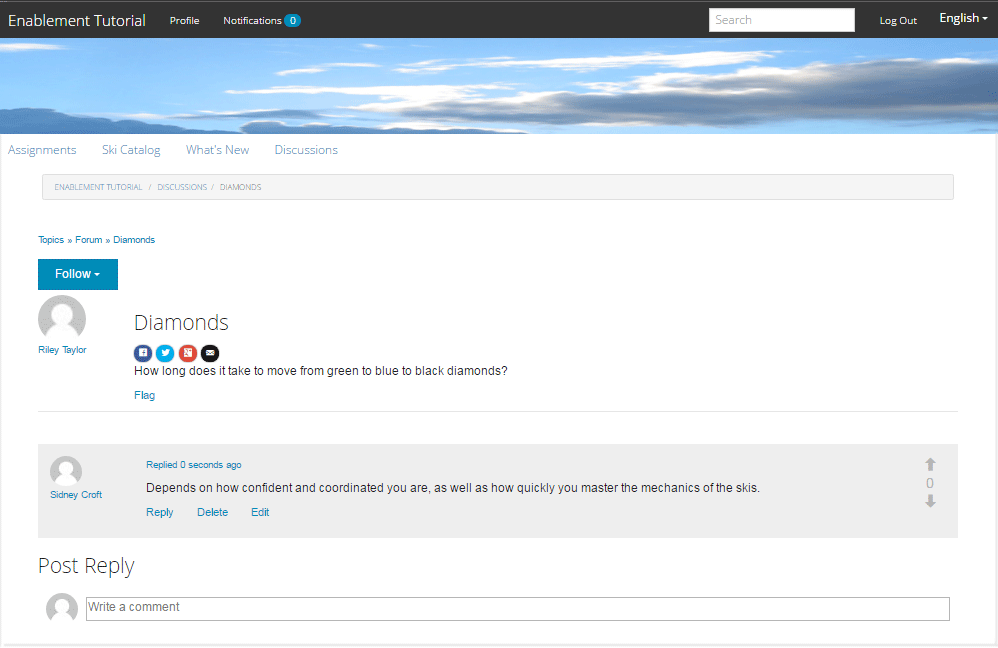

# 体验已发布的站点{#experience-the-published-site}

**[⇐创建和分配支持资源](resource.md)**

## 在发布时浏览到新站点{#browse-to-new-site-on-publish}

现在，新创建的社区网站及其支持资源和学习路径已发布，接下来便可以体验启用教程网站。

首先，浏览到创建站点时显示的URL，然后浏览到发布服务器(例如，

* author URL = [http://localhost:4502/content/sites/enable/en.html](http://localhost:4502/content/sites/enable/en.html)
* 发布URL = [http://localhost:4503/content/sites/enable/en.html](http://localhost:4503/content/sites/enable/en.html)

如果设置了[默认主页](enablement-create-site.md#changethedefaulthomepage)，则只需浏览到[http://localhost:4503/](http://localhost:4503/)即可启动该网站。

首次访问已发布的网站时，网站访客通常尚未登录，且为匿名访客。

**http://localhost:4503/content/sites/enable/en.html**

## 匿名网站访客{#anonymous-site-visitor}

系统会立即向匿名网站访客显示此专用支持社区网站的登录页面。 请注意，无法自行注册，也无法使用Facebook或Twitter登录。

请注意，此主页显示了四个菜单项：`Assignments, Ski Catalog, What's New`和`Discussions`，但未登录则无法访问任何内容。

>[!NOTE]
>
>可以授予对启用网站的匿名访问权限，而不允许网站访客自行注册。\
>如果启用资源设置为`show in catalog`和`allow anonymous access`，则匿名网站访客将可以查看目录中的资源。

### 阻止对JCR {#prevent-anonymous-access-on-jcr}的匿名访问

已知限制通过jcr内容和json向匿名访客公开社区网站内容，但是&#x200B;**[!UICONTROL 允许匿名访问]**&#x200B;对于网站内容禁用。 但是，可以使用Sling限制作为解决方法来控制此行为。

要保护您的社区站点内容免遭匿名用户通过jcr内容和json访问，请执行以下步骤：

1. 在AEM创作实例中，转到https://&lt;host>:&lt;port>/editor.html/content/site/&lt;sitename>.html。

   >[!NOTE]
   >
   >请勿转到本地化的站点。

1. 转到&#x200B;**[!UICONTROL Page Properties]**。

   

1. 转到&#x200B;**[!UICONTROL Advanced]**&#x200B;选项卡。
1. 启用&#x200B;**[!UICONTROL 身份验证要求]**。

   

1. 添加登录页面的路径。 例如，`/content/......./GetStarted`。
1. 发布页面。

## 已登记的成员{#enrolled-member}

此体验依赖于`Riley Taylor`和`Sidney Croft`创建的](enablement-setup.md#publishcreateenablementmembers)和[被分配给&#x200B;*滑雪课程*&#x200B;学习路径的&#x200B;*社区滑雪类*&#x200B;组成员。

登录方式

* `Username: riley`
* `Password: password`

如果用户配置文件不是通过自注册创建的，则会在成员首次登录时显示其配置文件页面，以便他们可以根据需要进行验证和修改。

成员下次登录时，将显示由第一个菜单项标识的主页。

### 指定任务 {#assignments}

在“工作总揽”页面中，会向成员显示专门分配给他们的所有学习路径和启用资源。

每个分配都提供关于

* 分配类型
* 是否是新任务
* 名称
* 与分配类型相关的详细信息
* 任务联系人、专家和作者（如果提供）

分配类型由卡左上角的图标指示。 道路图像用于学习路径，其中包含已包含的支持资源数量。

选择&#x200B;*滑雪课程*&#x200B;将显示学习路径引用的两个启用资源。

选择&#x200B;*滑雪课程1*&#x200B;将打开启用资源的详细信息页面。

从详细信息页面中，成员能够学习[比率](rating.md)课程并添加[注释](comments.md)。 任何成员活动都将反映在网站的新增功能部分中。

在创作环境中可访问的报表部分中，将记录与启用资源的交互。

### 滑雪目录{#ski-catalog}

“滑雪目录”页面是使用`Tutorial`命名空间中的标记标记的启用资源目录。 两个&#x200B;*滑雪课程*&#x200B;资源使用`Skiing`标记进行标记，这样，如果选择了`All`或`Tutorial: Sports / Skiing`以外的任何标记，则不会显示任何内容。

如果未直接或通过学习路径为成员分配支持资源，则可以与位于目录中的支持资源进行交互，并通过评论和评级提供反馈。

### 讨论 {#discussions}

除了对启用资源（[在启用](enablement-create-site.md#step33asettings)时）进行评级和评论外，创建`Enablement Tutorial`的社区站点模板还包括[论坛函数](functions.md#forum-function)（标题为`Discussions)`）。

选择`Discussions`链接并发布主题。

注销并以Sidney Croft(sidney / password)的身份登录并回复问题，以及关注主题。

请注意，除了内联审核之外，还有一些选项可用于在社交媒体上共享主题或通过电子邮件发送主题。

### 新增功能 {#what-s-new}

`What's New`菜单项是此社区站点结构中[活动流函数](functions.md#activity-stream-function)的标题。

仍以Sidney的身份登录，请选择`What's New`链接以显示活动。

## 受信任的社区成员{#trusted-community-member}

此体验假定已为` [Quinn Harper](enablement-setup.md#publishcreateenablementmembers)`分配了[审查方](enablement-create-site.md#moderation)和[资源联系人](resource.md#settings)的角色。

登录方式

* `Username: quinn`
* `Password: password`

登录后，请注意有一个新的菜单项`Administration`，该菜单项出现是因为成员被赋予了审查者的角色。

首页由第一个菜单项“工作总揽”来标识。 Quinn是主持人和支持资源联系人，未注册任何支持资源或学习路径，因此没有可显示的内容。

### 管理 {#administration}

有的是，两个学习者（`Riley Taylor`和`Sidney Croft. By s`）选择`Administration`链接以访问审核控制台的活动，Quin能够使用[批量审核控制台](moderation.md)审核其帖子。

选择侧面板图标可打开用于搜索社区内容的过滤器。

将鼠标悬停在评论卡片上会显示审核操作。

## 创作报告{#reports-on-author}

有两种方法可访问关于学习者的报告和支持资源。

在创作时，导航到&#x200B;**社区、[资源控制台](resources.md)**，其中管理了启用资源，在选择社区站点后，可以生成报表

* 所有支持资源和学习路径
* 一条特定的支持资源或学习路径

导航到&#x200B;**社区、[报表控制台](reports.md)**，并根据

* 支持资源和学习路径的分配
* 在特定时段内向社区站点发布的帖子
* 特定时段内社区网站的查看次数（网站访问次数）

* 帖子和视图可以针对所有内容，也可以针对特定内容：

   * 论坛
   * 论坛 - 主题
   * 问题与解答
   * 问题与解答 - 问题
   * 博客
   * 博客文章
   * 日历
   * 日历事件

### 资源控制台{#resources-console}

通过进行少量活动并与发布时的资源进行交互，查看有关作者的报表很值得一看。

* 在作者时
* 使用管理权限登录
* 从主菜单导航到&#x200B;**[!UICONTROL Communities > Resources]**
* 选择`Enablement Tutorial`站点
* 选择`Report`图标以获取所有资源的摘要
* 选择一个资源，然后为该资源的报表选择`Report`图标

请注意，显示Adobe Analytics数据可能为时过早，这可能需要1到12小时才能显示。 但是，基本的SCORM报表已经可用。

#### 滑雪课程资源报告{#ski-lessons-resource-report}

#### 滑雪课程用户报表{#ski-lessons-user-report}

* 选择&#x200B;**[!UICONTROL Communities > Resources]**

* 打开卡`Enablement Tutorial`
* 打开卡`Ski Lessons`
* `select Report, User Report`

### 报表控制台{#reports-console}

“报表”控制台允许在

* **** 任何支持社区网站的分配
* **** 任何社区站点的视图
* **** 任何社区站点的帖子

对于分配报表：

* 在作者时
* 使用管理权限登录
* 导航至&#x200B;**[!UICONTROL 社区>报表>分配报表]**
* 从下拉菜单中选择&#x200B;**[!UICONTROL Site]**（选择`Enablement Tutorial`）

* 选择&#x200B;**[!UICONTROL 组]**（选择`Community Ski Class`）

* 选择&#x200B;**[!UICONTROL Assignment]**（选择`Ski Lessons`）

* 选择&#x200B;**[!UICONTROL 生成]**

对于有关视图的报表：

* 在作者时
* 使用管理权限登录
* 导航到&#x200B;**[!UICONTROL 社区>报表>查看报表]**
* 从下拉菜单中选择&#x200B;**[!UICONTROL Site]**（选择`Enablement Tutorial`）

* 选择&#x200B;**[!UICONTROL 内容类型]**（选择`all`）

* 选择&#x200B;**[!UICONTROL 日期范围]**（选择`Last 7 days`）

* 选择&#x200B;**[!UICONTROL 生成]**

**[⇐创建和分配支持资源](resource.md)**
