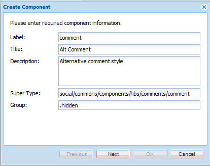

# 创建组件{#create-the-components}

扩展组件的示例使用了注释系统，该系统实际上由两个组件组成

* 注释 — 包含的注释系统，即放置在页面上的组件
* 评论 — 用于捕获已发布评论的实例的组件

两个组件都需要放置到位，尤其是在自定义已发布评论的外观时。

>[!NOTE]
>
>每个网站页面只允许一个评论系统。
>
>许多社区功能已经包括一个注释系统，其resourceType可修改为引用扩展注释系统。

## 创建注释组件{#create-the-comments-component}

这些方向指定了除`.hidden`之外的&#x200B;**组**&#x200B;值，以便组件可以从组件浏览器(Sidekick)中使用。

删除自动创建的JSP文件是因为将改用默认的HBS文件。

1. 浏览到&#x200B;**CRXDE|Lite**([http://localhost:4502/crx/de/index.jsp](http://localhost:4502/crx/de/index.jsp))

1. 为自定义应用程序创建一个位置：

   * 选择`/apps`节点

      * **创建文** 件夹名 **[!UICONTROL 称]**
   * 选择`/apps/custom`节点

      * **创建文** 件夹名 **[!UICONTROL 称组件]**


1. 选择`/apps/custom/components`节点

   * **[!UICONTROL 创建>组件……]**

      * **标签**: *评论*
      * **标题**: *替换注释*
      * **描述**: *替代注释样式*
      * **超级类型**: *social/commons/components/hbs/comments*
      * **群组**: *自定义*
   * 选择&#x200B;**[!UICONTROL Next]**
   * 选择&#x200B;**[!UICONTROL Next]**
   * 选择&#x200B;**[!UICONTROL Next]**
   * 选择&#x200B;**[!UICONTROL OK]**


1. 展开刚刚创建的节点：`/apps/custom/components/comments`
1. 选择&#x200B;**[!UICONTROL Save All]**
1. 右键单击`comments.jsp`
1. 选择&#x200B;**[!UICONTROL Delete]**
1. 选择&#x200B;**[!UICONTROL Save All]**


### 创建子注释组件{#create-the-child-comment-component}

这些方向将&#x200B;**Group**&#x200B;设置为`.hidden`，因为页面中应仅包含父组件。

删除自动创建的JSP文件是因为将改用默认的HBS文件。

1. 导航到`/apps/custom/components/comments`节点
1. 右键单击节点

   * 选择&#x200B;**[!UICONTROL 创建>组件……]**

      * **标签**: *评论*
      * **标题**: *替换注释*
      * **描述**: *备用注释样式*
      * **超级类型**: *social/commons/components/hbs/comments/comments/comments*
      * **组**: `*.hidden*`
   * 选择&#x200B;**[!UICONTROL Next]**
   * 选择&#x200B;**[!UICONTROL Next]**
   * 选择&#x200B;**[!UICONTROL Next]**
   * 选择&#x200B;**[!UICONTROL OK]**


1. 展开刚刚创建的节点：`/apps/custom/components/comments/comment`
1. 选择&#x200B;**[!UICONTROL Save All]**
1. 右键单击`comment.jsp`
1. 选择&#x200B;**[!UICONTROL Delete]**
1. 选择&#x200B;**[!UICONTROL Save All]**

 

### 复制和修改默认HBS脚本{#copy-and-modify-the-default-hbs-scripts}

使用[CRXDE Lite](../../help/sites-developing/developing-with-crxde-lite.md):

* 复制 `comments.hbs`

   * 从[/libs/social/commons/components/hbs/comments](http://localhost:4502/crx/de/index.jsp#/libs/social/commons/components/hbs/comments)
   * 至[/apps/custom/components/comments](http://localhost:4502/crx/de/index.jsp#/apps/custom/components/comments)

* 将`comments.hbs`编辑为：

   * 更改`data-scf-component`属性的值(~line 20):

      * 发件人 `social/commons/components/hbs/comments`
      * 收件人 `/apps/custom/components/comments`
   * 修改以包含自定义注释组件（~第75行）：

      * 替换 `{{include this resourceType='social/commons/components/hbs/comments/comment'}}`
      * 具有`{{include this resourceType='/apps/custom/components/comments/comment'}}`


* 复制 `comment.hbs`

   * 从[/libs/social/commons/components/hbs/comments/comments](http://localhost:4502/crx/de/index.jsp#/libs/social/commons/components/hbs/comments/comment)
   * 至[/apps/custom/components/comments/comments](http://localhost:4502/crx/de/index.jsp#/apps/custom/components/comments/comment)

* 将`comment.hbs`编辑为：

   * 更改data-scf-component属性的值(~ line 19)

      * 发件人 `social/commons/components/hbs/comments/comment`
      * 收件人 `/apps/custom/components/comments/comment`

* 选择`/apps/custom`节点
* 选择&#x200B;**[!UICONTROL Save All]**

## 创建客户端库文件夹{#create-a-client-library-folder}

为避免明确包含此客户端库，可以使用默认注释系统的clientlib的类别值(`cq.social.author.hbs.comments`)，但随后，也会为默认组件的所有实例包含此clientlib。

使用[CRXDE Lite](../../help/sites-developing/developing-with-crxde-lite.md):

* 选择`/apps/custom/components/comments`节点
* 选择&#x200B;**[!UICONTROL 创建节点]**

   * **名称**: `clientlibs`
   * **类型**: `cq:ClientLibraryFolder`
   * 添加到&#x200B;**[!UICONTROL 属性]**&#x200B;选项卡：

      * **** `categories` **** `String` **NameTypeValue** `cq.social.author.hbs.comments` `Multi`
      * **** `dependencies` **** `String` **NameTypeValue** `cq.social.scf` `Multi`

* 选择&#x200B;**[!UICONTROL Save All]**
* 选择`/apps/custom/components/comments/clientlib`s节点后，创建3个文件：

   * **名称**: `css.txt`
   * **名称**: `js.txt`
   * **名称**:customcommentsystem.js

* 输入“customcommentsystem.js”作为`js.txt`的内容
* 选择&#x200B;**[!UICONTROL Save All]**


## 注册SCF模型并查看{#register-the-scf-model-view}

在扩展（覆盖）SCF组件时， resourceType不同（覆盖使用在`/libs`之前通过`/apps`搜索的相对搜索机制，以使resourceType保持相同）。 因此，必须编写JavaScript（在客户端库中）来注册SCF JS模型并查看自定义resourceType。

输入以下文本作为`customcommentsystem.js`的内容：

### customcommentsystem.js {#customcommentsystem-js}

```xml
(function($CQ, _, Backbone, SCF) {
    "use strict";
 
    var CustomComment = SCF.Components["social/commons/components/hbs/comments/comment"].Model;
    var CustomCommentView = SCF.Components["social/commons/components/hbs/comments/comment"].View;

    var CustomCommentSystem = SCF.Components["social/commons/components/hbs/comments"].Model;
    var CustomCommentSystemView = SCF.Components["social/commons/components/hbs/comments"].View;
 
    SCF.registerComponent('/apps/custom/components/comments/comment', CustomComment, CustomCommentView);
    SCF.registerComponent('/apps/custom/components/comments', CustomCommentSystem, CustomCommentSystemView);

})($CQ, _, Backbone, SCF);
```

* 选择&#x200B;**[!UICONTROL Save All]**

## 发布应用程序{#publish-the-app}

要在发布环境中体验扩展组件，需要复制自定义组件。

一种方法是

* 从全局导航

   * 选择&#x200B;**[!UICONTROL 工具>部署>复制]**
   * 选择 `Activate Tree`
   * 设置`Start Path`:至`/apps/custom`
   * 取消选中`Only Modified`
   * 选择`Activate`按钮
