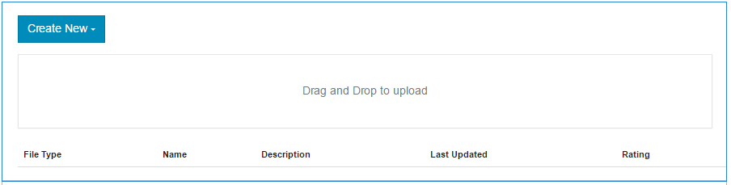

# 文件库功能{#file-library-feature}

## 简介 {#introduction}

文件库功能为登录站点访客（社区成员）提供了一个位置，供他们上传、管理和下载社区站点内的文件。

文档的本节介绍

* 将文件库功能添加到AEM站点
* `File Library`组件的配置设置

## 将文件库添加到页面{#adding-a-file-library-to-a-page}

要在创作模式下将`File Library`组件添加到页面，请找到该组件

* `Communities / File Library`

并将其拖动到页面上的位置。

有关必要的信息，请访问[社区组件基础知识](basics.md)。

当包含[必需的客户端库](essentials-file-library.md#essentials-for-client-side)时，`File Library`组件的显示方式如下：

## 配置文件库{#configuring-file-library}

选择要访问的已放置`File Library`组件，然后选择打开编辑对话框的`Configure`图标。

 

### “注释”选项卡{#comments-tab}

在&#x200B;**[!UICONTROL 注释]**&#x200B;选项卡下，指定是否显示已上载文件的注释以及如何显示这些注释：

* **[!UICONTROL 允许对文件进]**
行注释如果选中，允许对已上载的文件进行注释。默认为未选中。

* **[!UICONTROL 每页注]**
释限制每页显示的注释数以及显示的回复数。默认为 
**10**.

* **[!UICONTROL 最大文]**
件大小此值将限制已上载的文件大小。默认限制为104857600(10 Mb)。

* **[!UICONTROL 最大消]**
息长度可输入到文本框中的最大字符数。默认为4096个字符。

* **[!UICONTROL 允许的文]**
件类型使用“点”分隔符以逗号分隔的文件扩展名列表。例如：.jpg、.jpeg、.png、.doc、.docx、.pdf。 如果指定了任何文件类型，则不允许指定那些未指定的文件类型。 默认值未指定，因此允许所有文件类型。

* **[!UICONTROL 富文本编]**
辑器如果选中，可以输入带有标记的注释。默认为未选中。

* **[!UICONTROL 删除]**
注释如果选中，则允许用户删除自己的注释。选中默认值。

* **[!UICONTROL 允]**
许标记如果选中，则将启用向文件添加标记的功能。默认为未选中。

* **[!UICONTROL 允许]**
的命名空间如果选中“允许标记”，则可用的标记将限于选中的命名空间。如果未选中任何项，则允许全部选中。 默认为所有命名空间。

* **[!UICONTROL 建议]**
限制如果选中“允许标记”，则此设置将限制要显示的建议标记数。如果设置为-1，则没有限制。 默认值为-1。

* **[!UICONTROL 允]**
许投票如果选中，将启用文件的投票功能。默认为未选中。

* **[!UICONTROL 允许]**
遵循如果选中此项，则为博客文章加入以下功能，允许成员通  知新帖子。默认为未选中。

* **[!UICONTROL 允许线程]**
回复如果选中，允许回复已发布的评论。默认为未选中。

### “用户协调”选项卡{#user-moderation-tab}

在&#x200B;**[!UICONTROL 用户审核]**&#x200B;选项卡下，配置审核注释（如果允许进行注释）:

* **[!UICONTROL 预审核]**
如果选中，注释必须经过批准，才能显示在发布站点上。默认为未选中。

* **[!UICONTROL 删]**
除注释如果选中，则向发布注释的访客提供删除注释的功能。选中默认值。

* **[!UICONTROL 拒绝]**
注释如果选中，允许受信任的成员审核者拒绝注释。默认为未选中。

* **[!UICONTROL 关闭／重新打]**
开注释如果选中，允许受信任的成员审核者关闭并重新打开注释。默认为未选中。

* **[!UICONTROL 标记]**
注释如果选中，允许访客将注释标记为不合适。默认为未选中。

* **[!UICONTROL 标记原]**
因列表如果选中，允许访客从下拉列表中选择其标记评论为不合适的原因。默认为未选中。

* **[!UICONTROL 自定义标]**
志原因如果选中，允许访客输入自己将评论标记为不合适的原因。默认为未选中。

* **[!UICONTROL 审核]**
阈值输入通知审核者之前访客必须标记评论的次数。默认值为一次(
**1**)。

* **[!UICONTROL 标记]**
限制输入评论在隐藏到公共视图之前必须标记的次数。此数字必须大于或等于 
**审核阈值**。默认值为5。

## 附加信息 {#additional-information}

有关开发人员的详细信息，请参阅[File Library Essentials](essentials-file-library.md)页面。

有关已发布主题和注释的审核，请参阅[审核用户生成的内容](moderate-ugc.md)。

有关标记已发布的主题和评论，请参阅[标记用户生成的内容](tag-ugc.md)。
