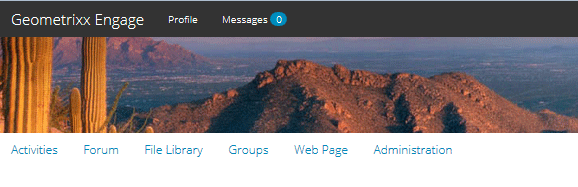

# 社区功能 {#community-functions}

社区体验预期的功能类型是众所周知的。 社区功能可以作为社区功能提供。 本质上，它们是预先连接的一个或多个页面，用于实现社区功能，该功能不仅需要在创作模式下向页面添加组件。 它们是用于定义社区站点模板结构 [的构件块](sites.md) ，从中创建社 [区站点](sites-console.md)。

创建社区站点后，可以使用标准AEM创作模式将内容添加到生 [成的页面](../../help/sites-authoring/editing-content.md)。

许多社区功能可立即使用，如社区功能控制台中所示。 将来版本中将提供更多社区功能，还可创建自定义功能。

>[!NOTE]
>
>创建社区站点的控 [制台](sites-console.md)、社 [区站点模板](sites.md)、社 [区组模板](tools-groups.md)[和社区功](functions.md) 能的控制台仅在作者环境中使用。

## 社区功能控制台 {#community-functions-console}

在创作环境中，要访问社区功能控制台

* 从全局导航： **[!UICONTROL “工具”>“社区”>“社区功能”]**

## 预建函数 {#pre-built-functions}

以下是与AEM Communities一起提供的职能的简要说明。 每个功能都由一个或多个AEM页面组成，其中包含连接到功能中的社区组件，该功能可轻松融入社 [区站点模板中](sites.md)。

社区站点模板为社区站点提供了结构，包括登录名、用户用户档案、通知、消息、站点菜单、搜索、主题和品牌功能。

### 标题和URL设置 {#title-and-url-settings}

**标题** 和 **URL** 是所有社区功能的通用属性。

当在修改社区站点结构时将社区功 [能添加](sites-console.md#modifying-site-properties) 到社区站点模板或添加社区功能时，将打开该功能的对话框，以便可以配置标题和URL。

#### 配置功能详细信息 {#configuration-function-details}

* **[!UICONTROL 标题]**
(
*必需*)站点功能菜单中显示的文本

* **[!UICONTROL URL]**(*必需*)用于生成URI的名称。 该名称必须符合AEM和 [JCR实](../../help/sites-developing/naming-conventions.md) 施的命名约定。

例如，使用根据入门教程创建的 [站点](getting-started.md) (如果

* 标题=网页
* URL =页面

然后，页面的URL为http://local_host:4503/content/sites/engage/en/page.html，页面的菜单链接将显示为：

### 活动流功能 {#activity-stream-function}

活动流函数是具有活动流组件的 [页面](activities.md) ，所有视图均被选中(所有活动、用户活动和以下)。 另请参 [阅活动流](essentials-activities.md) Essentials开发人员。

添加到模板时，将打开以下对话框：

#### 配置功能详细信息 {#configuration-function-details-1}

* 请参 [阅标题和URL设置](#title-and-url-settings)
* **[!UICONTROL 显示“我的活动”视图]**&#x200B;如果选中，活动页面将包含一个选项卡，该选项卡基于当前成员在社区中生成的过滤器活动。 选中默认值。

* **[!UICONTROL 显示“所有活动”视图]**&#x200B;如果选中，活动页面将包含一个选项卡，其中包含当前成员有权访问的社区中生成的所有活动。 选中默认值。

* **[!UICONTROL 显示“新闻源”视图]**&#x200B;如果选中，活动页面将包含一个选项卡，根据当前成员所遵循的过滤器活动将显示该选项卡。 选中默认值。

### 指定任务功能 {#assignments-function}

分配功能是定义社区站点以 [进行启用的基本功能](overview.md#enablement-community)。 它允许向社区成员分配启用资源。 另请参 [阅Assignments Essentials](essentials-assignments.md) for developers。

此功能可作为Enablement Add-on的 [一个功能](enablement.md)。 Enablement Add-on需要额外的许可才能用于生产环境。

添加到模板时，唯一的配置是标题 [和URL设置](#title-and-url-settings)。

### 博客功能 {#blog-function}

博客功能是一个页面，其中 [配置了Blog组件](blog-feature.md) ，用于标记、文件上传、跟踪成员以进行自我编辑、投票和审核。 另请参 [阅适用于开发](blog-developer-basics.md) 人员的Blog Essentials。

添加到模板时，将打开以下对话框：

* 请参 [阅标题和URL设置](#title-and-url-settings)
* **[!UICONTROL 允许特权成]**&#x200B;员如果选中此项，博客将仅允许特权成员通过允许选择特权成员组来 [创建文章](users.md#privileged-members-group)。 如果未选中，则允许所有社区成员进行创建。 默认为未选中。

* **[!UICONTROL 允许文件上]**&#x200B;传如果选中，博客将包含成员上传文件的功能。 选中默认值。

* **[!UICONTROL 允许线程]**&#x200B;化回复如果未选中，博客将允许对文章回复（评论），但不允许对评论进行回复。 选中默认值。

* **[!UICONTROL 允许特色内]**&#x200B;容如果选中此选项，则可以将该想法标识为特 [色内容](featured.md)。 选中默认值。

### 日历功能 {#calendar-function}

日历功能是将日历组件配置为允 [许标记](calendar.md) 的页面。 另请参 [阅面向开发人](calendar-basics-for-developers.md) 员的Calendar Essentials。

添加到模板时，将打开以下对话框：

* 请参 [阅标题和URL设置](#title-and-url-settings)
* **[!UICONTROL 允许固]**&#x200B;定如果选中，论坛将允许主题回复固定到评论列表的开头。 选中默认值。

* **[!UICONTROL 允许特权成]**&#x200B;员如果选中此项，博客将仅允许特权成员通过允许选择特权成员组来 [创建文章](users.md#privileged-members-group)。 如果未选中，则允许所有社区成员进行创建。 默认为未选中。

* **[!UICONTROL 允许文件上]**&#x200B;传如果选中，博客将包含成员上传文件的功能。 选中默认值。

* **[!UICONTROL 允许线程]**&#x200B;化回复如果未选中，博客将允许对文章回复（评论），但不允许对评论进行回复。 选中默认值。

* **[!UICONTROL 允许特色内]**&#x200B;容如果选中此选项，则可以将该想法标识为特 [色内容](featured.md)。 选中默认值。

### 目录功能 {#catalog-function}

目录功能使Enablement Community成 [员能够](overview.md#enablement-community) 浏览未分配给他们的Enablement Resources。 请参 [阅为开发人员添](tag-resources.md) 加 [标签Enablement Resources和Catalog Essentials](catalog-developer-essentials.md) 。

如果社区站点的属性设置为true，则所有目录中将显示该站点的所有支持 ` [Show in Catalog](resources.md)`资源和学习路径。 要明确包含资源和学习路径，必须对目录 [应用预过](catalog-developer-essentials.md#pre-filters) 滤器。

当添加到模板时，配置允许指定用于配置向站点命名空间显示的标记过滤器的标记访客:

* 请参 [阅标题和URL设置](#title-and-url-settings)
* **[!UICONTROL 选择所有命名空间]**

   * 选定的标记命名空间定义哪些标记可供访客选择，以过滤目录中列出的启用资源的列表。
   * 如果选中此项，则社区站点允许的所有标记命名空间均可用。
   * 如果未选中，则可以选择社区站点允许的一个或多个命名空间。
   * 选中默认值。

### 特色内容功能 {#featured-content-function}

特色内容功能是配置了特色内 [容组件](featured.md) ，以允许添加和删除评论的页面。

可能允许或禁止每个组件使用功能内容(请参 [阅博客](#blog-function)、日历 [功能、论](#calendar-function)坛功能 [、](#forum-function)构思函数、函 、函数和问题解函数)。

添加到模板时，唯一的配置是标题 [和URL设置](#title-and-url-settings)。

### 文件库功能 {#file-library-function}

文件库函数是配置了“文件库 [”组件](file-library.md) ，以允许添加和删除注释的页面。

添加到模板时，唯一的配置是标题 [和URL设置](#title-and-url-settings)。

### 论坛功能 {#forum-function}

论坛功能是一个页面，其“论 [坛”组件配置为](forum.md) ：标记、文件上传、跟踪、成员自编辑、投票和审核。

添加到模板时，将打开以下对话框：

#### 配置功能详细信息 {#configuration-function-details-2}

* 请参 [阅标题和URL设置](#title-and-url-settings)
* **[!UICONTROL 允许固]**&#x200B;定如果选中，论坛将允许主题回复固定到评论列表的开头。 选中默认值。

* **[!UICONTROL 允许特权成]**&#x200B;员如果选中此选项，则论坛将仅允许特权成员通过允许选择特权成员组来 [发布主题](users.md#privileged-members-group)。 如果未选中，则允许所有社区成员发布。 默认为未选中。

* **[!UICONTROL 允许文件上]**&#x200B;传如果选中，论坛将包含成员上传文件的功能。 选中默认值。

* **[!UICONTROL 允许线程]**&#x200B;回复如果未选中，论坛将允许对主题进行评论，但不允许对这些评论进行回复。 选中默认值。

* **[!UICONTROL 允许特色内]**&#x200B;容如果选中此选项，则可以将该想法标识为特 [色内容](featured.md)。 选中默认值。

### 组函数 {#groups-function}

>[!CAUTION]
>
>组功能不能 *是站* 点结构 *或社区站点模板中的第一个* ，也不能是唯一的功能。
>
>任何其他函数(如页 [面函数](#page-function))必须首先包含并列出。

“组”功能使社区成员能够在发布环境的社区站点内创建子社区。

根据 [设置](sites-console.md#groupmanagement) ，当社区站点模板中包含“组”功能时 ，这些组可以是公共的或私有的，并且可以配置一个或多个社区组模板以在实际创建社区组时(如从发布环境)提供模板选项。 社 [区组模板](tools-groups.md) ，指定为组页面（如论坛和日历）创建哪些社区功能。

创建社区组时，会为新组动态创建成员组，可以将成员分配到新组或加入新组。 For more information, see [Managing Users and User Groups](users.md).

自Communities功 [能包1起](deploy-communities.md#latestfeaturepack)，社区组在创作环境下使用Communities Sites的 [“组”控制台创建](groups.md)，并且在启用后可在发布环境中创建。

添加到模板时，将打开以下对话框：

* 请参 [阅标题和URL设置](#title-and-url-settings)
* **[!UICONTROL 选择组模]**&#x200B;板一个下拉菜单，允许选择一个或多个启用的组模板，新社区组(在发布环境中)的将来创建者可从中进行选择。

* **[!UICONTROL 允许特权成]**&#x200B;员如果选中此选项，则论坛将仅允许特权成员通过允许选择特权成员安全组来 [发布主题](users.md#privileged-members-group)。 如果未选中，则允许所有社区成员发布。 默认为未选中。

* **[!UICONTROL 允许创建发]**&#x200B;布如果选中此选项，则授权社区成员可以在发布环境中创建组。 如果未选中，则只能在作者环境下从“社区站点的组”控制台创建新组（子社区）。

   Default is `checked`.

### 构思功能 {#ideation-function}

构思函数是包含一个构思组件 [的页面](ideation-feature.md)。

添加到模板时，将打开以下对话框，其中指定模板的默认标题和URL名称以及默认显示设置：

* 请参 [阅标题和URL设置](#title-and-url-settings)
* **[!UICONTROL 允许特权成]**&#x200B;员如果选中此选项，则论坛将仅允许特权成员通过允许选择特权成员安全组来 [发布主题](users.md#privileged-members-group)。 如果未选中，则允许所有社区成员发布。 默认为未选中。

* **[!UICONTROL 允许文件]**&#x200B;上传如果选中，则此想法将包括允许成员上传文件的功能。 选中默认值。

* **[!UICONTROL 允许线程]**&#x200B;化回复如果未选中，该想法将允许对主题进行回复（注释），但不允许对注释进行回复。 选中默认值。

* **[!UICONTROL 允许特色内]**&#x200B;容如果选中此选项，则可以将该想法标识为特 [色内容](featured.md)。 选中默认值。

### 排行榜功能 {#leaderboard-function}

通栏功能是包含一个通栏组件 [的页面](enabling-leaderboard.md)。

**注意**: 在从包含通栏功能的社区模 *板创建* 社区站点后，通栏组件将需要进一步配置。 需要指定领 [导板](enabling-leaderboard.md#rules-tab) 组件的规则，具体取决于社区站点 [的评分和徽章](implementing-scoring.md) 配置。

添加到模板时，将打开以下对话框，其中指定模板的默认标题和URL名称以及默认显示设置：

* 请参 [阅标题和URL设置](#title-and-url-settings)
* **[!UICONTROL 显示徽章]**&#x200B;如果选中此项，则会在通栏中包含标记图标的列。

   默认为未选中。

* **[!UICONTROL 显示徽章名称]**&#x200B;如果选中，则该徽章名称的列将包括在排行榜中。

   默认为未选中。

* **[!UICONTROL 显示头像]**&#x200B;如果选中此项，则会员的头像图像将包含在排行榜中，旁边是其名称链接，指向其成员用户档案。

   默认为未选中。

### 页面功能 {#page-function}

页面功能会向社区站点添加一个空白页面，该页面已连接到社区站点的功能中： 登录、菜单、通知、消息、主题和品牌。 内容可以使用标准AEM创作模 [式添加到页面](../../help/sites-authoring/editing-content.md)。

添加到模板时，唯一的配置是标题 [和URL设置](#title-and-url-settings)。

### 问题与解答功能 {#qna-function}

QnA函数是一个页面，其中配 [置了QnA组件](working-with-qna.md) ，用于标记、文件上传、跟踪成员以进行自编辑、投票和审核。

添加到模板时，配置允许对特权成员进行限制：

* 请参 [阅标题和URL设置](#title-and-url-settings)
* **[!UICONTROL 允许固]**&#x200B;定如果选中，论坛将允许主题回复固定到评论列表的开头。 选中默认值。

* **[!UICONTROL 允许特权成]**&#x200B;员如果选中此选项，QnA论坛将仅允许特权成员通过允许选择特权成员组来发 [布问题](users.md#privileged-members-group)。 如果未选中，则允许所有社区成员发布。 默认为未选中。

* **[!UICONTROL 允许文件上]**&#x200B;传如果选中， QnA论坛将包含成员上传文件的功能。 选中默认值。

* **[!UICONTROL 允许线程]**&#x200B;化回复如果未选中，问题与答案论坛将允许对已发布的问题进行评论（回答），但不允许对答案进行回复。 选中默认值。

* **[!UICONTROL 允许特色内]**&#x200B;容如果选中此选项，则可以将该想法标识为特 [色内容](featured.md)。 选中默认值。

## 创建社区功能 {#create-community-function}

通过选择“社区功能”控制台顶部 `Create Community Function` 的图标，可以创建社区功能。 可以创建基于相同AEM Blueprint的多个函数，然后通过在作者编辑模式下打开进行唯一自定义。

### 社区功能名称 {#community-function-name}

在“社区函数名称”面板上，将配置名称、说明以及是否启用或禁用该函数：

* **[!UICONTROL 社区函数名]**&#x200B;用于显示和存储的函数名

* **[!UICONTROL 社区功能说]**&#x200B;明显示功能说明

* **[!UICONTROL 禁用／启用]**&#x200B;控制函数是否可引用的切换开关

### AEM Blueprint {#aem-blueprint}

在面 `AEM Blueprint` 板上，可以选择作为社区功能的基础实现的蓝图。

社区功能是一个由一个或多个页面组成的迷你站点，预先连接这些页面以包含在社区站点中，包括登录名、用户用户档案、通知、消息、站点菜单、搜索、主题和品牌功能。 创建该函数后，可以在作者编 [辑模式下打开该函](#open-community-function) 数，并自定义页面和／或组件设置。

由于社区函数是作为Blueprint的 [Live](../../help/sites-administering/msm.md#live-copies) [copy实现的](../../help/sites-administering/msm-livecopy.md#creatingablueprint)，因此可以转出对函数所做的更改，该函数影响从社区站点模板或社区组模板创建的 [所有社区站点页面，该模](sites.md) 板包含该函数。 还可以取消页面与其父蓝图的关联，以便进行页面级别修改。

另请参阅 [多站点管理器](../../help/sites-administering/msm.md)。

### 缩略图 {#thumbnail}

在缩略图面板上，可以上传图像以在“社区功能” [控制台中显示](#community-functions-console)。

## 打开社区功能 {#open-community-function}

选择图 `Open Community Function` 标以进入创作编辑模式，以创作页面内容并修改功能组件的配置。

### 配置组件 {#configuring-components}

社区功能将作为AEM Blueprint的Live Copy实施，其详细信息将在多站点管 [理器下记录](../../help/sites-administering/msm.md)。

不仅可以创作页面内容，还可以配置组件。

如果在创建的社区站点的页面上配置组件，则可能需要取消继 [承](../../help/sites-administering/msm-livecopy.md#changing-live-copy-content) ，才能配置组件。 配置完成后，应重新建立继承。

有关配置详细信息，请 [访问作者的](author-communities.md) Communities组件。

## 编辑社区功能 {#edit-community-function}

选择图 `Edit Community Function` 标以使用与创建社区函数相同的面板编辑 [该函数的属性](#create-community-function)，包括启用或禁用该函数。
