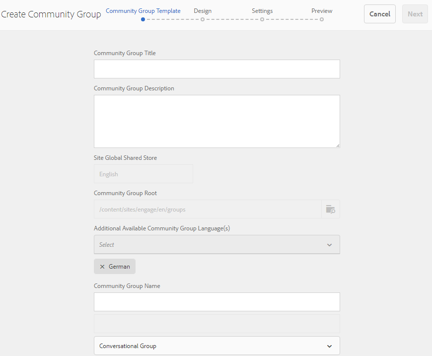
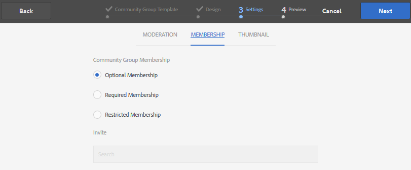

# 社区组控制台 {#community-groups-console}

当社区站点的[模板结构](sites-console.md#step1)包含[组函数](functions.md#groups-function)时，“组”控制台将提供创建社区组的访问权限。

* 组可以嵌套在其他组中。 当新组](tools-groups.md)的[结构包含组函数时，会发生这种情况。
* 仅对于创作环境，有一个与站点创建向导类似的组创建向导。
* 向社区站点结构或社区组结构添加群组功能时，可以配置成员是否可以从发布环境创建群组。

在包含的三个组模板中，只有`Reference Group`模板的结构中包含组函数。

社区组的几个方面包括：

* 创建：可以在创作时创建新群组，也可以在发布时（可选）创建新群组
* 控制：组可以是开放的或秘密的
* 嵌套：组可以包含零个或多个组

>[!NOTE]
>
>在[存在社区组控制台之前在发布环境中创建的社区组](https://helpx.adobe.com/in/experience-manager/6-3/communities/using/version-history.html#FeaturePack1FP1)将不会在社区组控制台中列出，因此，无法使用控制台进行修改。

>[!NOTE]
>
>此群组控制台只能从社区站点控制台访问，不要与成员[群组控制台](members.md)混淆，以管理成员群组。
>
>成员组是在发布环境中注册的用户组，使用[tunnel service](deploy-communities.md#tunnel-service-on-author)从创作环境访问。

## 组创建 {#group-creation}

要访问“组”控制台，请执行以下操作：

* 在创作时，使用管理员权限登录
* 从全局导航：**[!UICONTROL 社区>站点]**
* 选择现有社区站点文件夹以将其打开
* 在文件夹中选择社区站点的实例

   * 社区站点的结构必须包括组功能
   * 这些屏幕截图来自[在publish](published-site.md)上创建组后的“快速入门”教程

选择&#x200B;**[!UICONTROL Groups文件夹]**&#x200B;以将其打开。

打开后，所有现有的组（无论是在创作时创建还是发布时创建）都会显示。

从此“组”控制台中，可以创作新组。

* 选择&#x200B;**[!UICONTROL 创建组]**&#x200B;按钮

### 步骤1:社区组模板 {#step-community-group-template}

* **[!UICONTROL 社区组标题]**:组的显示标题。

   该标题会显示在群组的已发布网站上。

* **[!UICONTROL 社区组描述]**:群组的描述。
* **[!UICONTROL 社区组根]**:组的根路径。

   默认根是父站点，但根可以移动到网站中的任何位置。 不建议更改。

* **[!UICONTROL 其他可用的社区组语言]** 菜单：使用下拉菜单选择可用的社区组语言。该菜单显示创建父社区站点的所有语言。 用户可以在这些语言中进行选择，以在此单步中的多个区域设置中创建组。 在相应社区站点的“组”控制台中，会以多种指定语言创建同一组。

* **[!UICONTROL 社区组名称]**:在URL中显示的组根页面的名称

   * 请仔细检查该名称，因为创建组后，该名称不容易更改
   * 基本URL将显示在`Community Group Name`的下方
   * 对于有效的URL，附加“.html”

      *例如*、  `http://localhost:4502/content/sites/mysight/en/mygroup.html`

* **[!UICONTROL 社区组模]** 板菜单：使用下拉菜单选择可用的社 [区组模板](tools.md)。

### 步骤2:设计 {#step-design}

#### 社区组主题 {#community-group-theme}

该框架使用`Twitter Bootstrap`为网站引入响应式灵活设计。 可以选择多个预加载的Bootstrap主题之一来设置所选社区组模板的样式，或者可以上传Bootstrap主题。

选择后，将使用不透明的蓝色复选标记覆盖主题。

可以选择与父网站主题不同的主题。

社区网站发布后，可以[编辑属性](#modifying-group-properties)并选择其他主题。

#### 社区团体品牌化 {#community-group-branding}

社区网站品牌化是在每个页面顶部显示为标题的图像。 可以显示与其他网站页面不同的群组的横幅。

图像的大小应与浏览器中页面的预期显示一样宽，高度应为120像素。

在创建或选择图像时，请记住：

* 图像高度将从图像的上边缘裁剪为120像素
* 图像已固定到浏览器窗口的左边缘
* 图像没有调整大小，因此当图像宽度为……

   * 小于浏览器的宽度，图像将水平重复
   * 大于浏览器的宽度，图像将被裁剪

### 步骤3:设置 {#step-settings}

#### 审核 {#moderation}

默认情况下，会继承父社区站点的审核者列表。

可以添加特定于该组的审核者：

* 搜索成员（从发布环境中）以将其添加为审核者

#### 会员资格 {#membership}

成员资格设置允许从三种方式中选择一种来保护社区组。

* 可选成员资格

   如果选择，则社区组为公共组。 站点成员可以参与群组并发布帖子，而无需明确加入群组。 已选中默认值。
* 必需成员资格

   如果选择，则社区组为打开的组。 社区站点成员可以查看组的内容，但必须加入组才能发布内容。 通过选择发布环境中的`Join`按钮来加入成员。 未选择默认值。

* 受限制的成员资格

   如果选中，则社区组为秘密组。 必须明确邀请社区成员。 将在搜索框中输入受邀成员。 稍后可以使用创作环境的[成员和组控制台](members.md)添加成员。 未选择默认值。

#### 缩略图 {#thumbnail}

缩略图是在创作和发布时针对组显示的图像。

组图像的最佳大小为170 x 90像素，采用支持的图像格式（如JPG或PNG）。

如果未添加图像，则会显示默认图像。

### 步骤4:创建群组 {#step-create-group}

如果需要进行任何调整，请使用&#x200B;**Back**&#x200B;按钮进行调整。

选择并启动&#x200B;**创建**&#x200B;后，创建组的过程将无法中断。

完成该过程后，新子社区站点（组）的卡片将显示在社区站点组控制台中，作者可以在此控制台中添加页面内容，或者管理员可以修改站点的属性。

>[!NOTE]
>
>该组以所有语言创建，如[步骤1中指定：在相应社区站点的“社区组”控制台中，使用其他可用社区组语言的社区组模板](groups.md#step1communitygrouptemplate)。

## 创作组内容 {#authoring-group-content}

可以使用与任何其他AEM页面相同的工具创作群组的页面内容。 要打开组进行创作，请选择将鼠标悬停在组卡片上时显示的打开站点图标。

## 修改组属性 {#modifying-group-properties}

在社区组创建过程中指定的现有子社区站点的属性可以通过选择编辑站点图标进行修改，该图标将鼠标悬停在群组卡片上时会显示：

以下属性的详细信息与[组创建](#group-creation)部分中提供的描述匹配。 无论是在发布环境还是创作环境中创建，都可以修改任何嵌套群组。

### 修改基本 {#modify-basic}

基本面板允许修改

* 社区组标题
* 社区组描述

不能修改社区组名称。

选择其他社区组模板对现有社区组站点不会产生任何影响，因为模板和站点之间没有任何连接。

可以修改子社区的[STRUCTURE](#modify-structure)。

### 修改结构 {#modify-structure}

“结构”面板允许修改最初从从创作或发布环境创建子社区站点时所选的社区组模板创建的结构。 从面板，可以

* 将附加的[社区函数](functions.md)拖放到站点结构中
* 在站点结构中社区功能的实例上：

   * **`gear icon`**

      编辑设置，包括显示标题和URL名称以及[特权成员组](users.md#privilegedmembersgroups)

   * **`trashcan icon`**

      从站点结构中删除（删除）函数

   * **`grid icon`**

      修改功能在网站顶级导航栏中显示的顺序

>[!CAUTION]
>
>虽然显示标题可能会发生更改而不会产生副作用，但不建议编辑属于社区站点的社区函数的URL名称。
>
>例如，重命名URL不会移动现有UGC，因此会产生“丢失”UGC的效果。

>[!CAUTION]
>
>组函数必须&#x200B;*不*&#x200B;是站点结构中的&#x200B;*第一个函数，也不是唯一的*&#x200B;函数。
>
>必须先包含并列出任何其他函数，如[page函数](functions.md#page-function)。

#### 示例：向子社区（组）结构添加日历功能 {#example-adding-a-calendar-function-to-a-sub-community-group-structure}

### 修改设计 {#modify-design}

“设计”面板允许修改主题：

* [社区组主题](#community-group-theme)
* [社区组品牌](#community-group-branding)

   * 滚动到面板底部以更改品牌图像

### 修改设置 {#modify-settings}

“设置”面板允许添加社区[审核者](#moderation)。

### 修改成员资格 {#modify-membership}

[MEMBERSHIP](#membership)面板仅供参考。 无论是可选的、必需的还是受限的，都无法更改已建立的组成员资格类型。

### 修改缩略图 {#modify-thumbnail}

通过[THUMBNAIL](#thumbnail)面板，可以上传图像，以在发布环境以及创作环境的社区站点的“组”控制台中将社区组表示给站点访客。

## 发布群组 {#publishing-the-group}

新建或修改社区组后，可以通过选择`Publish Site`图标来发布（激活）该组。

成功发布群组后，将显示一条消息：

>[!CAUTION]
>
>父社区站点和父组应已发布。
>
>社区网站和嵌套群组应以自上而下的方式发布。

## 删除群组 {#deleting-the-group}

通过选择删除组图标（将鼠标悬停在群组上方时显示），从社区组控制台中删除群组。

这会删除与组关联的所有项目，例如，组的所有内容都将被永久删除，用户成员资格也将从系统中删除。
