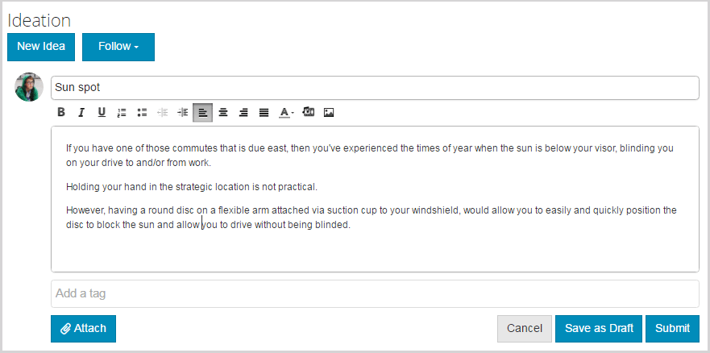

# 构思功能 {#ideation-feature}

>[!CAUTION]
>
>AEM 6.4已结束扩展支持，本文档将不再更新。 有关更多详细信息，请参阅 [技术支助期](https://helpx.adobe.com/cn/support/programs/eol-matrix.html). 查找支持的版本 [此处](https://experienceleague.adobe.com/docs/).

## 简介 {#introduction}

“构思”功能为发布环境中的登录站点访客（社区成员）提供了一个区域，用于：

* 创建想法以与社区共享
* 观看和评论意见
* 遵循一个想法
* 就一个想法投票

此文档部分描述

* 将构思功能添加到AEM网站
* 构思组件的配置设置

## 向页面添加构思 {#adding-a-ideation-to-a-page}

添加 `Ideation` 组件添加到创作模式下的页面，可使用组件浏览器找到 `Communities / Ideation` 并将其拖动到应该显示构思的页面上。

有关必要信息，请访问 [社区组件基础知识](basics.md).

当 [所需的客户端库](ideation.md#essentials-for-client-side) 包含，这是 `Ideation`组件将显示：

## 配置构思 {#configuring-an-ideation}

选择已放置的 `Ideation` 要访问和选择的组件 `Configure` 图标，打开编辑对话框。

 

### “设置”选项卡 {#settings-tab}

在 **[!UICONTROL 设置]** 选项卡，指定构思和注释的设置：

* **[!UICONTROL 构思标题]**
构思的显示标题。 默认为 
`Ideation`。

* **[!UICONTROL 构思描述]**
要显示为构思子标题的描述。 默认为无描述。

* **[!UICONTROL 每页主题数]**
定义每页显示的意见/帖子数。 默认值为10。

* **[!UICONTROL 已审核]**
如果选中此项，则必须批准发布构思和评论，然后才能将其显示在发布网站上。 默认为未选中。

* **[!UICONTROL 已关闭]**
如果选中此选项，则“构思”论坛将不再提供新想法和评论。 默认为未选中。

* **[!UICONTROL 富文本编辑器]**
如果选中，则可以输入带有标记的构思和注释。 默认为未选中。

* **[!UICONTROL 允许标记]**
如果选中此项，则允许成员向其帖子添加标签(请参阅 **[!UICONTROL 标记字段]** 选项卡。 默认为未选中。

* **[!UICONTROL 允许文件上传]**
如果选中此项，则允许将文件附件添加到构思或注释中。 默认为未选中。

* **[!UICONTROL 最大文件大小]**
仅在 
`Allow File Uploads` 复选框。 此字段将限制已上传文件的大小（以字节为单位）。 默认为104857600(10 Mb)。

* **[!UICONTROL 允许的文件类型]**
仅在 
`Allow File Uploads` 复选框。 以逗号分隔的文件扩展名列表，其中带有“圆点”分隔符。 例如：.jpg、.jpeg、.png、.doc、.docx、.pdf。 如果指定了任何文件类型，则将不允许上载未指定的文件类型。 默认值未指定，以便允许使用所有文件类型。

* **[!UICONTROL 最大附加图像文件大小]**
仅当选中允许文件上传时相关。 上传的图像文件可能具有的最大字节数。 默认为2097152(2 Mb)。

* **[!UICONTROL 允许回复]**
如果选中此项，则允许对发布到构思的评论做出回复。 默认为未选中。

* **[!UICONTROL 允许用户删除评论和主题]**
如果选中此项，则允许成员删除他们发布的评论和意见。 默认为未选中。

* **[!UICONTROL 允许跟踪]**
如果选中此项，则为创意帖子包含以下功能，以便允许成员 [通知](notifications.md) 新职位数量。 默认为未选中。

* **[!UICONTROL 允许电子邮件订阅]**
如果选中此项，则允许成员通过电子邮件接收新帖子的通知([订阅](subscriptions.md))。 需要 `Allow Following` 要检查和 [已配置电子邮件](email.md). 默认为未选中。

* **[!UICONTROL 允许投票]**
如果选中，则允许对构思的评论进行投票。 默认为未选中。

* **[!UICONTROL 显示徽章]**
如果选中，则显示已获取和已分配的 [徽章](implementing-scoring.md) 会员的想法。 默认为未选中。

* **[!UICONTROL 允许特色内容]**
如果选中，则能将构思识别为 [特色内容](featured.md). 默认为未选中。

### “用户审核”选项卡 {#user-moderation-tab}

在 **[!UICONTROL 用户审核]** 选项卡，指定如何管理已发布的想法和评论（用户生成的内容）。 有关更多信息，请参阅 [审核用户生成的内容](moderate-ugc.md).

* **[!UICONTROL 拒绝帖子]**
如果选中，则允许受信任的成员审核者拒绝帖子并阻止帖子出现在公共论坛中。 默认为未选中。

* **[!UICONTROL 关闭/重新打开主题]**
如果选中，受信任的成员审核者可以关闭主题以进一步编辑和评论，也可以重新打开主题。 默认为未选中。

* **[!UICONTROL 标记帖子]**
如果选中，则允许成员将他人的主题或评论标记为不适当。 默认为未选中。

* **[!UICONTROL 标记原因列表]**
如果选中，允许成员从下拉列表中选择其标记主题或评论为不适当的原因。 默认为未选中。

* **[!UICONTROL 自定义标记原因]**
如果选中，则允许成员输入自己将主题或评论标记为不适当的原因。 默认为未选中。

* **[!UICONTROL 审核阈值]**
输入在通知审核者之前必须由成员标记主题或评论的次数。 默认值为1（一次）。

* **[!UICONTROL 标记限制]**
输入在主题或评论在公共视图中隐藏之前必须标记的次数。 如果设置为–1，则标记的主题或评论永远不会在公共视图中隐藏。 否则，此数字必须大于或等于审核阈值。 默认值为5。

### 标记字段选项卡 {#tag-field-tab}

在 **[!UICONTROL 标记字段]** 选项卡，可应用的标记（如果允许） **[!UICONTROL 设置]** 选项卡，具体受到的限制，具体取决于所选的命名空间。

* **[!UICONTROL 允许的命名空间]**
相关条件 
`Allow Tagging` 在 **设置** 选项卡。 可应用的标记仅限于所选命名空间类别中的标记。 命名空间列表包括“标准标记”（默认命名空间）以及“包括所有标记”。 默认为“未选中”，这表示允许使用所有命名空间。

* **[!UICONTROL 建议限制]**
输入要作为建议显示给论坛成员的标记数。 值 
**-** 1表示无限制。 默认值为0。

### 排序设置选项卡 {#sort-settings-tab}

在 **[!UICONTROL 排序设置]** 选项卡，指定在显示已发布评论时的排序方式。

* **[!UICONTROL 排序依据]**
检查所有允许的排序选择： 
`Newest, Oldest, Last Updated, Most Viewed, Most Active, Most Followed and Most Liked`. 默认为 `Newest, Oldest, Last Updated`.

* **[!UICONTROL 设置为默认值]**
下拉以选择要显示为默认的选中排序选项之一。 默认为 
`Newest`。

* **[!UICONTROL 选择Analytics排序的时间选项]**
下拉以选择其中一个 
`All, Last 24 Hours, Last 7 Days, Last 30 Days`. 默认为 `All`.

## 网站访客体验 {#site-visitor-experience}

### 创建构思 {#creating-idea}

与所有“社区”功能一样，如果未登录，网站访客只能阅读意见和查看他人的意见（通过评论和投票/称赞）。

登录后，会员可以创建新想法。

在提交构思之前，成员可以保存草稿。

通过选择 `Save as Draft` 按钮，将保存草稿。

在 `My Drafts` 选项卡，选择 `Read More` 要重新进入编辑模式，请执行以下操作：

#### 提供反馈 {#providing-feedback}

构思发布后，其他成员可以登录，打开构思( `Read More`)，并且像这个想法一样，这样会增加投票次数，并发表评论。

### 附加信息 {#additional-information}

有关 [构思要点](ideation.md) 页面。

有关审核已发布的主题和评论，请参阅 [审核用户生成的内容](moderate-ugc.md).

有关标记已发布的主题和评论，请参阅 [标记用户生成的内容](tag-ugc.md).
