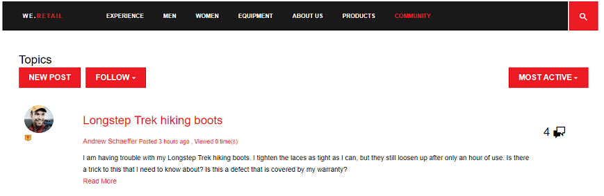

# 社区评分和标记{#communities-scoring-and-badges}

## 概述 {#overview}

AEM Communities评分和徽章功能提供识别和奖励社区成员的能力。

评分、徽章的主要内容是：

* [指](#assign-and-revoke-badges) 定徽章以标识成员在社区中的角色

* [向会员授予](#enable-scoring) 鼓励其参与的徽章的基本奖励（创建的内容数量）
* [高级徽章授](advanced.md) 予，以将成员标识为专家（创建的内容质量）

**注** 意，默认情 [况下不启用标记授予](implementing-scoring.md#main-pars-text-237875536)。

>[!CAUTION]
>
>CRXDE Lite中可见的实现结构在UI可用后可能会发生更改。

## 徽章 {#badges}

徽章放在会员的姓名下，以表明他们在社区中的角色或地位。 标记可以显示为图像或名称。 当显示为图像时，该名称将作为辅助工具的替代文本包含。

默认情况下，标记位于

* /etc/community/badging/images

如果存储在其他位置，则所有人都可以读取它们。

在UGC中，徽章区别于是指派的，还是根据规则获得的。 当前，分配的徽章显示为文本，而应得的徽章显示为图像。

### 徽章管理UI {#badge-management-ui}

社区[标记控制台](badges.md)提供添加自定义标记的功能，这些标记可在成员获得（奖励）或在社区中承担特定角色（分配）时显示。

### 分配标记{#assigned-badges}

基于角色的徽章由管理员根据社区成员在社区中的角色分配给社区成员。

已分配（和已获知）标记存储在所选[SRP](srp.md)中，并且不能直接访问。 在GUI可用之前，分配基于角色的标记的唯一方法是使用代码或cURL进行分配。 有关cURL说明，请参阅标题为[分配和撤销标记](#assign-and-revoke-badges)的部分。

该版本包含三个基于角色的徽章：

* 审查方

   `/etc/community/badging/images/moderator/jcr:content/moderator.png`

* 组管理器

   `/etc/community/badging/images/group-manager/jcr:content/group-manager.png`

* 特权成员

   `/etc/community/badging/images/privileged-member/jcr:content/privileged-member.png`


### 奖章{#awarded-badges}

评分服务会根据社区成员在社区中活动所适用的规则，向社区成员授予奖励标记。

为了让徽章成为活动奖励，必须做两件事：

* 功能组件的标记必须[已启用](#enable-badges-for-component)
* 评分和标记规则必须[应用](#apply-rules-to-content)到放置组件的页面（或上级）

发行版中包括三个基于奖励的徽章：

* 金牌

   `/etc/community/badging/images/gold-badge/jcr:content/gold.png`

* 银牌

   `/etc/community/badging/images/silver-badge/jcr:content/silver.png`

* 铜牌

   `/etc/community/badging/images/bronze-badge/jcr:content/bronze.png`


>[!NOTE]
>
>评分规则可配置为为标记为不当的帖子分配负积分，从而影响得分值。 但是，一旦获得徽章，它就不会因得分降低或评分规则更改而自动删除。
>
>吊销奖章的方式与吊销徽章相同。 请参阅[分配和撤销标记](#assign-and-revoke-badges)部分。 未来的改进将包括用于管理会员徽章的UI。

### 自定义标记{#custom-badges}

可以使用[标记控制台](badges.md)安装自定义标记，并在标记规则中指定或指定标记。

从标记控制台安装后，自定义标记会自动复制到发布环境。

## 启用评分{#enable-scoring}

默认情况下未启用评分。 徽章设置、启用评分和授予的基本步骤是：

* 确定收入积分规则（[评分规则](#scoring-rules)）
* 对于每个得分规则累积的积分，分配[标记](#badges)（[标记规则](#badging-rules)）

* [将评分和徽章规则应用于社区站点](#apply-rules-to-content)
* [启用社区功能的徽章](#enable-badges-for-component)

请参阅[快速测试](#quick-test)部分，以使用论坛和评论的默认评分和徽章规则为社区站点启用评分。

### 将规则应用于内容{#apply-rules-to-content}

要启用评分和标记，请将属性`scoringRules`和`badgingRules`添加到站点内容树中的任意节点。

如果站点已发布，则在应用所有规则和启用组件后，重新发布该站点。

应用于启用徽章的组件的规则是当前节点或其祖先的规则。

如果节点的类型为`cq:Page`（推荐），则使用CRXDE|Lite将属性添加到其`jcr:content`节点。

| **属性** | **类型** | **描述** |
|---|---|---|
| 徽章规则 | String[] | [标记规则](#badging-rules)的数组列表 |
| scoringRules | 字符串[] | [评分规则](#scoring-rules)的数组列表 |

>[!NOTE]
>
>如果评分规则似乎对授予徽章没有影响，请确保评分规则未被徽章规则的scorningRules属性阻止。 请参阅标题为[标记规则](#badging-rules)的部分。

### 为组件{#enable-badges-for-component}启用标记

评分和徽章规则仅适用于通过在[创作模式](author-communities.md)中编辑组件配置来启用徽章的组件实例。

布尔属性`allowBadges`启用／禁用组件实例的标记显示。 可在论坛、 QnA的[组件编辑对话框](author-communities.md)中配置此组件，并通过标记为&#x200B;**显示标记**&#x200B;的复选框对组件进行注释。

#### 示例：论坛组件实例{#example-allowbadges-for-forum-component-instance}的allowBadges


>[!NOTE]
>
>以论坛、QnA和评论中找到的HBS代码为例，可以覆盖任何组件以显示标记。

## 评分规则{#scoring-rules}

评分规则是奖励徽章的评分基础。

很简单，每个评分规则都是一个或多个子规则的列表。 对社区站点内容应用评分规则，以标识启用标记时要应用的规则。

评分规则是继承的，但不是加性的。 例如：

* 如果page2包含评分规则2，其上级page1包含评分规则1
* page2组件上的操作将调用规则1和规则2
* 如果两个规则都包含相同`topic/verb`的适用子规则：

   * 只有规则2的子规则将影响得分
   * 两个子规则的分数不相加

当存在多个评分规则时，将单独维护每个规则的得分。

评分规则是类型为`cq:Page`的节点，其`jcr:content`节点具有指定定义该规则的子规则列表的属性。

分数存储在SRP中。

>[!NOTE]
>
>最佳实践：唯一命名每个评分规则。
>
>评分规则名称应全局唯一；他们不应以同一个名字结尾。
>
>*not*&#x200B;要执行的操作示例：\
>/etc/community/scorning/rules/site1/forums-scorning\
>/etc/community/scorning/rules/site2/forums-scorning

### 评分子规则{#scoring-sub-rules}

评分子规则包含详细描述参与社区的值的属性。

每个评分子规则标识

* 跟踪哪些活动
* 涉及哪些特定的社区功能
* 分数

默认情况下，积分将授予采取操作的成员，除非子规则将内容的所有者指定为接收积分(`forOwner`)。

每个子规则可被包括在一个或多个评分规则中。

子规则的名称通常遵循使用&#x200B;*主题、对象*&#x200B;和&#x200B;*动词*&#x200B;的模式。 例如：

* member-comment-create
* 成员接受投票

子规则是类型为`cq:Page`的节点，其`jcr:content`节点具有指定[动词和主题](#topics-and-verbs)的属性。

<table> 
 <tbody> 
  <tr> 
   <th>属性</th> 
   <th>类型</th> 
   <th> 值描述</th> 
  </tr> 
  <tr> 
   <td><i><code>VERB</code></i></td> 
   <td>长整型</td> 
   <td> 
    <ul> 
     <li>要求；动词与事件动作对应</li> 
     <li>至少有一个动词属性</li> 
     <li>动词必须输入全部大写</li> 
     <li>有多个动词属性，但没有重复</li> 
     <li>值是要应用于此事件的得分</li> 
     <li>值可以是正数或负数</li> 
     <li>版本中支持的动词列表位于<a href="#topics-and-verbs">主题和动词</a>部分</li> 
    </ul> </td> 
  </tr> 
  <tr> 
   <td><code>topics</code></td> 
   <td>String[]</td> 
   <td> 
    <ul> 
     <li>可选；将子规则限制为由事件主题标识的社区组件</li> 
     <li>如果指定：value是事件主题的多值字符串</li> 
     <li>发行版中主题的列表位于<a href="#topics-and-verbs">主题和动词</a>部分</li> 
     <li>默认为应用于与动词关联的所有主题</li> 
    </ul> </td> 
  </tr> 
  <tr> 
   <td><code>forOwner</code></td> 
   <td>布尔型</td> 
   <td> 
    <ul> 
     <li>可选；当会员根据自己拥有的内容行事时不相关</li> 
     <li>如果为true，则将得分应用于所操作内容的所有者</li> 
     <li>如果为false，则将得分应用到执行操作的成员</li> 
     <li>default为false</li> 
    </ul> </td> 
  </tr> 
  <tr> 
   <td><code>scoringType</code></td> 
   <td>字符串</td> 
   <td> 
    <ul> 
     <li>可选；标识评分引擎</li> 
     <li>如果为“basic”，则根据数量指定评分引擎 
      <ul> 
       <li>包含在版本中</li> 
      </ul> </li> 
     <li>如果为“advanced”，则根据质量和数量指定评分引擎 
      <ul> 
       <li>需要<a href="advanced.md">附加的包</a></li> 
      </ul> </li> 
     <li>默认为“basic”</li> 
    </ul> </td> 
  </tr> 
 </tbody> 
</table>

### 包括评分规则和子规则{#included-scoring-rules-and-sub-rules}

此版本包含[论坛功能](functions.md#forum-function)的两个评分规则（论坛功能的论坛和评论组件各有一个规则）:

1. /etc/community/scorning/rules/comments-scorning

   * subRules[] =

      /etc/community/scorning/rules/subrules/member-comment-create

      /etc/community/scorning/rules/subrules/member-receive-vote

      /etc/community/scorning/rules/subrules/member-give-vote

      /etc/community/scorning/rules/subrules/member-is-仲裁

1. /etc/community/scorning/rules/forums-scorning

   * subRules[] =

      /etc/community/scorning/rules/subrules/member-forum-create

      /etc/community/scorning/rules/subrules/member-receive-vote

      /etc/community/scorning/rules/subrules/member-give-vote

      /etc/community/scorning/rules/subrules/member-is-仲裁

**注释:**

* `rules`和`sub-rules`节点的类型都是cq:Page

* `subRules`是字符串类[] 型的属性，该规则的节 `jcr:content` 点

* `sub-rules` 可能在各种评分规则之间共享
* `rules`应该位于具有读取权限的存储库位置，供所有人使用

   * 规则名称必须唯一，无论位置如何

### 激活自定义评分规则{#activating-custom-scoring-rules}

对评分规则或创作环境中的子规则所做的任何更改或添加内容都需要在发布时安装。

## 标记规则{#badging-rules}

标记规则通过指定以下项将评分规则链接到标记：

* 哪个评分规则
* 需要获得特定徽章的分数

标记规则是类型为`cq:Page`的节点，其`jcr:content`节点上具有与得分和标记相关的评分规则属性。

徽章规则由必填的`thresholds`属性组成，该属性是映射到徽章的分数的有序列表。 得分必须按递增值排序。 例如：

* `1|/etc/community/badging/images/bronze-badge/jcr:content/bronze.png`

   * 中国队获得1分铜牌

* `60|/etc/community/badging/images/silver-badge/jcr:content/silver.png`

   * 60分积分时，将颁发银牌

* `80|/etc/community/badging/images/gold-badge/jcr:content/gold.png`

   * 当80分积分累积后，会发现一个金牌

徽章规则与评分规则成对，这些规则决定了积分的累积方式。 请参阅标题为[将规则应用于内容](#apply-rules-to-content)的部分。

徽章规则上的`scoringRules`属性仅限制哪些评分规则可以与该特定徽章规则配对。

>[!NOTE]
>
>最佳实践：创建每个AEM站点特有的徽章图像。


<table> 
 <tbody> 
  <tr> 
   <th>属性</th> 
   <th>类型</th> 
   <th>值描述</th> 
  </tr> 
  <tr> 
   <td>阈值</td> 
   <td>String[]</td> 
   <td><em>(必需</em> )“number|path”形式的多值字符串 
    <ul> 
     <li>数字=分数</li> 
     <li>| =垂直线字符(U+007C)</li> 
     <li>path =徽章图像资源的完整路径</li> 
    </ul> 必须对字符串进行排序，以使数字在值中增加，并且数字和路径之间不应出现空白空格。<br /> 示例条目：<br /> <code>80|/etc/community/badging/images/gold-badge/jcr:content/gold.png</code></td> 
  </tr> 
  <tr> 
   <td>badgingType</td> 
   <td>字符串</td> 
   <td><em>（可选）</em> 将评分引擎标识为“基本”或“高级”。如果需要高级评分引擎，请参阅<a href="advanced.md">高级评分和标记</a>。 默认值为“basic”。</td> 
  </tr> 
  <tr> 
   <td> 
    <code>scoringRules </code></td> 
   <td>String[]</td> 
   <td>（<em>可选</em>）多值字符串，用于将标记规则限制为对由评分规则标识的事件进行评分</td> 
  </tr> 
 </tbody> 
</table>

### 包含标记规则{#included-badging-rules}

版本中包含两个与[论坛和评论评分规则](#includedscoringrules)对应的标记规则。

* /etc/community/badging/rules/comments-badging
* /etc/community/badging/rules/forums-badging

**注释:**

* `rules` 节点的类型为cq:Page
* `rules`应该位于具有读取权限的存储库位置，供所有人使用

   * 规则名称必须唯一，无论位置如何

### 激活自定义标记规则{#activating-custom-badging-rules}

在创作环境中对标记规则或图像所做的任何更改或添加内容都需要在发布时安装。

## 分配和撤销标记{#assign-and-revoke-badges}

可以使用[members控制台](members.md#badges-tab)或使用cURL命令以编程方式将标记分配给成员。

以下cURL命令显示HTTP请求分配和撤销标记所必需的内容。 基本格式为：

cURL -i -XPOST-H *header* -u *signin * -F *operation * -F *badge * *member-用户档案-url*

*header* = &quot;Accept:application/json&quot;\
要传递给服务器的自定义标头（必需）

*signin* = administrator-id:password\
例如：admin:admin

*operation* = &quot;:operation=social:assignBadge&quot; OR &quot;:operation=social:deleteBadge&quot;

*badge* = &quot;badgeContentPath=*badge-image-file*&quot;

*badge-image-file* =徽章图像文件在存储库中的位置\
例如：/etc/community/badging/images/drocidator/jcr:content/moderator.png

*member-用户档案* -url=发布时成员用户档案的端点\
例如：https://&lt;server>:&lt;port>/home/users/community/riley/profile.social.json

>[!NOTE]
>
>*member-用户档案-url*
>
>* 如果[隧道服务](users.md#tunnel-service)已启用，则可以引用作者实例
>* 可能是一个模糊的随机名称——有关可授权ID，请参见[安全清单](../../help/sites-administering/security-checklist.md#verify-that-you-are-not-disclosing-personally-identifiable-information-in-the-users-home-path)

>


### 示例: {#examples}

#### 分配审查方徽章{#assign-a-moderator-badge}

```shell
curl -i -X POST -H "Accept:application/json" -u admin:admin -F ":operation=social:assignBadge" -F "badgeContentPath=/etc/community/badging/images/moderator/jcr:content/moderator.png" /home/users/community/updcs9DndLEI74DB9zsB/profile.social.json
```

#### 撤销分配的银徽章{#revoke-an-assigned-silver-badge}

```shell
curl -i -X POST -H "Accept:application/json" -u admin:admin -F ":operation=social:deleteBadge" -F "badgeContentPath=/etc/community/badging/images/silver/jcr:content/silver.png" /home/users/community/updcs9DndLEI74DB9zsB/profile.social.json
```

>[!NOTE]
>
>使用cURL分配和撤销标记适用于任何标记图像，但当分配标记而不是获得标记时，它们会被标记为已分配标记并相应地进行处理。

## 自定义组件的评分和标记{#scoring-and-badges-for-custom-components}

可以通过将为该组件创建的事件主题与动词相关联来为自定义组件创建评分和徽章规则。

## 主题和动词{#topics-and-verbs}

当成员与社区功能交互时，会发送可触发异步监听器的事件，如通知和评分。

组件的SocialEvent实例将`topic`发生的事件记录为`actions`。 SocialEvent包括返回与操作关联的`verb`的方法。 在`actions`和`verbs`之间存在&#x200B;*n-1*&#x200B;关系。

对于交付的社区组件，下表描述了为[评分子规则](#scoring-sub-rules)中可用的每个`topic`定义的`verbs`。

>[!NOTE]
>
>新的布尔属性`allowBadges`启用／禁用组件实例的标记显示。 在更新的[组件编辑对话框](author-communities.md)中，可通过标记为&#x200B;**显示标记**&#x200B;的复选框对其进行配置。

**[日](calendar.md)**
历组 `topic`件社交活动= com/adobe/cq/social/calendar

| **动词** | **描述** |
|---|---|
| POST | 成员创建日历事件 |
| 添加 | 日历事件上的成员注释 |
| 更新 | 会员的日历事件或评论已编辑 |
| 删除 | 会员的日历事件或评论已被删除 |

**[注](comments.md)**
释组 `topic`件社交活动= com/adobe/cq/social/comment

| **动词** | **描述** |
|---|---|
| POST | 成员创建注释 |
| 添加 | 成员回复评论 |
| 更新 | 已编辑会员的注释 |
| 删除 | 会员的注释已删除 |

**[文件](file-library.md)**
库组 `topic`件SocialEvent= com/adobe/cq/social/fileLibrary

| **动词** | **描述** |
|---|---|
| POST | 成员创建文件夹 |
| 附加 | 成员上传文件 |
| 更新 | 成员更新文件夹或文件 |
| 删除 | 成员删除文件夹或文件 |

**[论](forum.md)**
坛组 `topic`件社交活动= com/adobe/cq/social/forum

| **动词** | **描述** |
|---|---|
| POST | 成员创建论坛主题 |
| 添加 | 成员对论坛主题的回复 |
| 更新 | 会员的论坛主题或回复已编辑 |
| 删除 | 会员的论坛主题或回复已被删除 |

**[日志](blog-feature.md)**
组 `topic`件社交活动= com/adobe/cq/social/日志

| **动词** | **描述** |
|---|---|
| POST | 成员创建博客文章 |
| 添加 | 博客文章上的成员评论 |
| 更新 | 会员的博客文章或评论已编辑 |
| 删除 | 会员的博客文章或评论已被删除 |

**[问题与](working-with-qna.md)**
组件社 `topic` 交事件= com/adobe/cq/social/qna

| **动词** | **描述** |
|---|---|
| POST | 成员创建问题与答案 |
| 添加 | 成员创建问题与答案 |
| 更新 | 会员的问题与答案已编辑 |
| 选择 | 已选择成员的答案 |
| 取消选择 | 会员的答案为取消选择 |
| 删除 | 成员的问题与答案已删除 |

**[审](reviews.md)**
阅组 `topic`件社交活动= com/adobe/cq/social/review

| **动词** | **描述** |
|---|---|
| POST | 成员创建审阅 |
| 更新 | 已编辑会员的审阅 |
| 删除 | 会员的审阅已删除 |

**[评](rating.md)**
级组 `topic`件社交活动= com/adobe/cq/social/tally/rating

| **动词** | **描述** |
|---|---|
| 添加等级 | 会员的内容已评级 |
| 删除等级 | 会员的内容已降级 |

**[投票](voting.md)**
组 `topic`件社交活动= com/adobe/cq/social/tally/poting

| **动词** | **描述** |
|---|---|
| 添加投票 | 会员的内容已投票通过 |
| 删除投票 | 会员的内容已被否决 |

**支持协调**
的组 `topic`件SocialEvent= com/adobe/cq/social/仲裁

| **动词** | **描述** |
|---|---|
| 拒绝 | 会员的内容被拒绝 |
| 不当标志 | 会员的内容已标记 |
| 取消标记为不适当 | 成员的内容未标记 |
| 接受 | 会员的内容由审查方批准 |
| 关闭 | 成员关闭注释和回复 |
| 打开 | 成员重新打开注释 |

### 自定义组件事件{#custom-component-events}

对于自定义组件，实例化一个SocialEvent以将组件的事件记录为`actions`，该`topic`发生。

要支持评分，SocialEvent需要覆盖方法`getVerb()`，以便为每个`action`返回相应的`verb`。 为操作返回的`verb`可以是常用的（如`POST`）或专用于组件的（如`ADD RATING`）。 在`actions`和`verbs`之间存在&#x200B;*n-1*&#x200B;关系。

## 疑难解答 {#troubleshooting}

### 标记未出现{#badges-are-not-appearing}

如果已对网站内容应用了评分和徽章规则，但未为任何活动识别徽章，请确保为该组件的实例启用了徽章。

请参阅[为组件启用标记](#enable-badges-for-component)。

### 评分规则无效{#scoring-rule-has-no-effect}

如果对网站内容应用了评分和徽章规则，并且某些行为将授予徽章，但其他行为不授予徽章，请检查徽章规则是否未限制其适用的评分规则。

请参阅[标记规则](#badging-rules)的`scoringRules`属性。

### 区分大小写的类型{#case-sensitive-typo}

大多数属性和值（特别是动词）都区分大小写。 在评分子规则中使用时，动词必须全部为大写。

如果该功能未按预期工作，请确保数据输入正确。

## 快速测试{#quick-test}

使用[入门教程](getting-started.md)（参与）站点可以快速尝试评分和标记：

* 创作时的访问CRXDE Lite
* 浏览到基页：

   * /content/sites/engage/cn/jcr:content

* 添加badgingRules属性：

   * **名称**: `badgingRules`
   * **类型**: `String`
   * 选择&#x200B;**[!UICONTROL 多]**
   * 选择&#x200B;**[!UICONTROL 添加]**
   * 输入`/etc/community/badging/rules/forums-badging`
   * 选择 `+`
   * 输入`/etc/community/badging/rules/comments-badging`
   * 选择&#x200B;**[!UICONTROL 确定]**

* 添加scoringRules属性：

   * **名称**: `scoringRules`
   * **类型**: `String`
   * 选择&#x200B;**[!UICONTROL 多]**
   * 选择&#x200B;**[!UICONTROL 添加]**
   * 输入`/etc/community/scoring/rules/forums-scoring`
   * 选择 `+`
   * 输入`/etc/community/scoring/rules/comments-scoring`
   * 选择&#x200B;**[!UICONTROL 确定]**

* 选择&#x200B;**[!UICONTROL 保存全部]**


接下来，确保论坛和评论组件允许显示标记：

* 再次使用CRXDE Lite
* 浏览到论坛组件

   * `/content/sites/engage/en/forum/jcr:content/content/primary/forum`

* 根据需要添加allowBadges布尔属性，并确保它为true

   * **名称**: `allowBadges`
   * **类型**: `Boolean`
   * **值**:  `true`


接下来，[重新发布](sites-console.md#publishing-the-site)社区站点。

终于，

* 浏览到发布实例上的组件
* 以社区成员身份登录(例如：weston.mccall@dodgit.com)
* 发布新论坛主题
* 必须刷新页面才能显示标记

   * 注销并以其他社区成员身份登录(例如：aaron.mcdonald@mailinator.com)

* 选择论坛

这应该能让社区成员在论坛帖子上看到一枚铜牌，因为第一个论坛——徽章规则的第一个阈值是1分。



## 附加信息 {#additional-information}

有关开发人员的详细信息，请参阅[Scoring and Badges Essentials](configure-scoring.md)页面。

有关高级评分引擎的信息，请参阅[高级评分和标记](advanced.md)。

可配置的排行榜[组件](enabling-leaderboard.md)和[函数](functions.md#leaderboard-function)简化了成员在社区站点上的显示及其得分。
