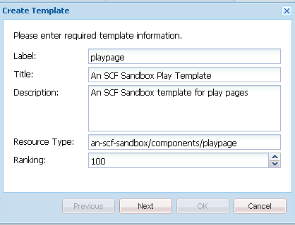
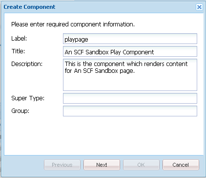

# 初始沙盒应用程序 {#initial-sandbox-application}

>[!CAUTION]
>
>AEM 6.4已结束扩展支持，本文档将不再更新。 有关更多详细信息，请参阅 [技术支助期](https://helpx.adobe.com/cn/support/programs/eol-matrix.html). 查找支持的版本 [此处](https://experienceleague.adobe.com/docs/).

在此部分中，您将创建以下内容：

* 的 **[模板](#createthepagetemplate)** 用于在示例网站中创建内容页面的
* 的 **[组件和脚本](#create-the-template-s-rendering-component)** 用于呈现网站页面的

## 创建内容模板 {#create-the-content-template}

模板可定义新页面的默认内容。 复杂网站可能使用多个模板来创建网站中不同类型的页面。 此外，模板集可以成为用于将更改转出到服务器群集的蓝图。

在本练习中，所有页面都基于一个简单的模板。

1. 在CRXDE Lite的浏览器窗格中

   * 选择 `/apps/an-scf-sandbox/templates`
   * **[!UICONTROL 创建>创建模板]**

1. 在创建模板对话框中，键入以下值，然后单击 **[!UICONTROL 下一个]**:

   * 标签: `playpage`
   * 标题: `An SCF Sandbox Play Template`
   * 描述: `An SCF Sandbox template for play pages`
   * 资源类型: `an-scf-sandbox/components/playpage`
   * 排名： &lt;leave as=&quot;&quot; default=&quot;&quot;>

   Label用于节点名称。

   资源类型显示在 `playpage`将的jcr:content节点作为属性 `sling:resourceType`. 它可标识在浏览器请求时呈现内容的组件（资源）。

   在本例中，使用 `playpage`模板由 `an-scf-sandbox/components/playpage` 组件。 按照惯例，组件的路径是相对的，允许Sling首先在 `/apps` 文件夹和（如果未找到） `/libs` 文件夹。

   

1. 如果使用复制/粘贴，请确保Resource Type值没有前导或尾随空格。

   单击&#x200B;**[!UICONTROL 下一步]**。

1. “允许的路径”是指使用此模板的页面的路径，以便在 **[!UICONTROL 新页面]** 对话框。

   要添加路径，请单击加号按钮 `+` 和类型 `/content(/.&ast;)?` 中。 如果使用复制/粘贴，请确保没有前导或尾随空格。

   注意：允许的路径属性的值是 *正则表达式。* 具有与表达式匹配的路径的内容页面可以使用模板。 在这种情况下，正则表达式匹配 **/content** 文件夹及其所有子页面。

   作者创建下面的页面时 `/content`, `playpage`标题为“SCF沙盒页面模板”的模板将出现在可用模板列表中。

   从模板创建根页面后，可通过修改属性以在正则表达式中包含根路径(即，

   `/content/an-scf-sandbox(/.&ast;)?`

   

1. 单击&#x200B;**[!UICONTROL 下一步]**。

   单击 **[!UICONTROL 下一个]** 在 **[!UICONTROL 允许的父项]** 的上界。

   单击 **[!UICONTROL 下一个]** 在 **[!UICONTROL 允许的子项]** 面板。

   单击&#x200B;**[!UICONTROL 确定]**。

1. 单击“确定”(OK)并完成模板的创建后，您会注意到新模板的“属性”(Properties)选项卡值的角中显示了红色三角形 `playpage`模板。 这些红色三角形表示尚未保存的编辑。

   单击 **[!UICONTROL 全部保存]** 将新模板保存到存储库。

   

### 创建模板的渲染组件 {#create-the-template-s-rendering-component}

创建 *组件* 定义内容并渲染基于 [页面模板](#createthepagetemplate).

1. 在CRXDE Lite中，右键单击 **`/apps/an-scf-sandbox/components`** 单击 **[!UICONTROL 创建>组件]**.
1. 通过将节点的名称（标签）设置为 *播放页面*，则组件的路径为

   `/apps/an-scf-sandbox/components/playpage`

   对应于播放页面模板的资源类型(可选减初始 **`/apps/`** 路径的一部分)。

   在 **[!UICONTROL 创建组件]** 对话框中，键入以下属性值：

   * 标签： **播放页面**
   * 标题： **SCF沙盒播放组件**
   * 描述： **这是为SCF沙盒页面呈现内容的组件。**
   * 超级类型： *&lt;leave blank=&quot;&quot;>*
   * 组:

   

1. 单击 **[!UICONTROL 下一个]** 直到 **[!UICONTROL 允许的子项]** 对话框的面板

   * 单击 **[!UICONTROL 确定]**
   * 单击 **[!UICONTROL 全部保存]**

1. 验证组件的路径与模板的resourceType是否匹配。

   >[!CAUTION]
   >
   >播放页面组件的路径与播放页面模板的sling:resourceType属性之间的对应关系，对于网站的正确运行至关重要。

   
