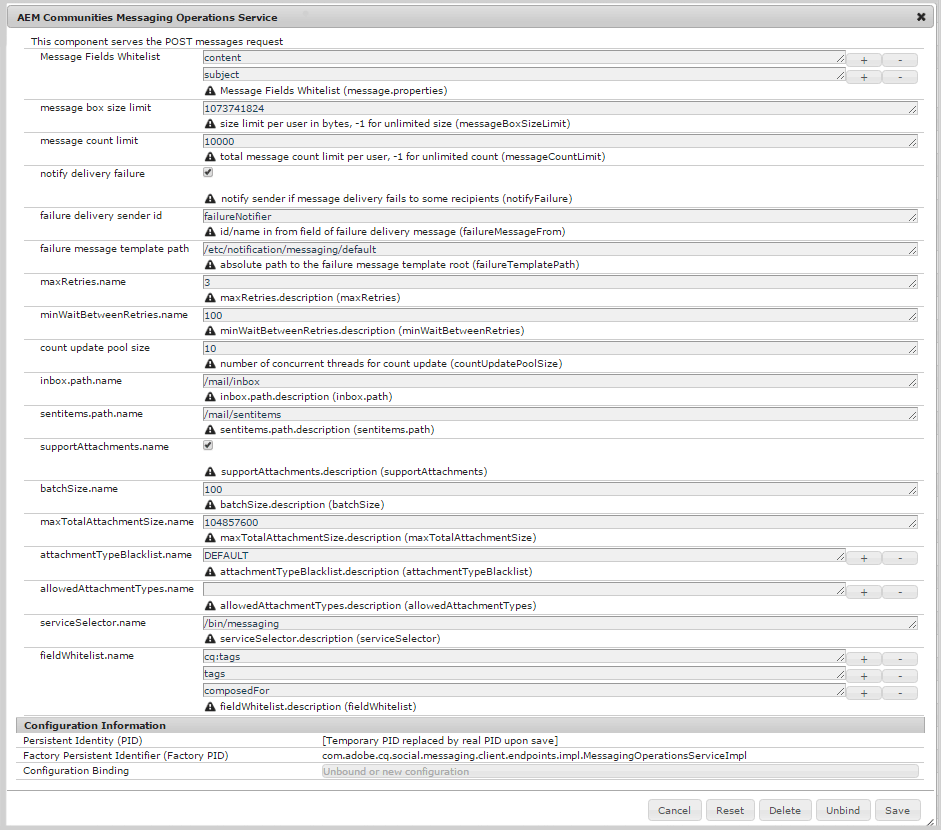

# 配置消息{#configuring-messaging}

## 概述 {#overview}

AEM Communities的消息功能使登录网站访客（成员）能够相互发送消息，当登录网站时，这些消息可供访问。

通过在[社区站点创建](sites-console.md)期间选中一个框，为社区站点启用消息。

本页提供了有关默认配置和可能调整的信息。

有关开发人员的其他信息，请参阅[Messaging Essentials](essentials-messaging.md)。

## 消息操作服务{#messaging-operations-service}

[AEM Communities消息操作服务](http://localhost:4502/system/console/configMgr/com.adobe.cq.social.messaging.client.endpoints.impl.MessagingOperationsServiceImpl)标识处理与消息相关请求的端点、服务应用于存储消息的文件夹，以及如果消息可能包括文件附件，允许哪些文件类型。

对于使用[社区站点控制台](sites-console.md)创建的社区站点，已存在服务实例，收件箱设置为`/mail/community/inbox`。

### 社区消息操作服务{#community-messaging-operations-service}

如下所示，对于使用[站点创建向导](sites-console.md)创建的站点，存在服务配置。 通过选择配置旁的铅笔图标，可以查看或编辑配置：

### 新配置{#new-configuration}

要添加新配置，请选择服务名称旁边的加号“**+**”图标：

* **[!UICONTROL 消息字段]**
允许列表指定合成消息组件的属性，用户可以编辑和保留这些属性。如果添加了新的表单元素，则需要添加元素ID（如果需要）才能存储在SRP中。 默认为两个条目： 
*主* 题和 *内容*。

* **[!UICONTROL 消息框大]**
小限制每个用户的消息框中的最大字节数。默认为 
*1073741824* (1 GB)。

* **[!UICONTROL 消息计]**
数限制每个用户允许的消息总数。值为-1表示允许不限数量的消息，但需遵守消息框大小限制。 默认为 
*10000* (10k)。

* **[!UICONTROL 通知投放]**
失败如果选中，则在消息投放失败到某些收件人时通知发送方。默认为 
*已选中*.

* **[!UICONTROL 失败投放发送]**
者id发送者的名称，显示在投放失败消息中。默认为 
*failure通告程序*。

* **[!UICONTROL 失败消息模]**
板路径投放失败消息模板根的绝对路径。默认为 
*/etc/notification/messaging/default*。

* **[!UICONTROL maxRetries.name]**
尝试重新发送失败消息的次数。默认为 
*3*.

* **[!UICONTROL minWaitBetweenRetries.name在]**
尝试重新发送邮件失败后等待的秒数。默认值为*100 *（秒）。

* **[!UICONTROL 计数更新池]**
大小用于计数更新的并发线程数。默认为 
*10*.

* **[!UICONTROL inbox.path.name]**
(
*必需*)用于文件夹的路径，相对于用户的节点(/home/users/*username*) **`inbox`** 。路径不能以尾随正斜杠“/”结束。 默认值为&#x200B;*/mail/inbox*。

* **[!UICONTROL sentitems.path.name]**
(
*必需*)用于文件夹的路径，相对于用户的节点(/home/users/*username*) **`senditems`** 。路径不能以尾随正斜杠“/”结束。 默认值为&#x200B;*/mail/sentitems*。

* **[!UICONTROL supportAttachments.name]**
如果选中，用户可以向邮件中添加附件。默认为 
*已选中*.

* **[!UICONTROL batchSize.]**
name发送到大量收件人时要一起发送的消息数。默认为 
*100*。

* **[!UICONTROL maxTotalAttachmentSize.name如果]**
选中supportAttachments，此值将指定所有附件所允许的最大总大小（以字节为单位）。默认为 
*104857600* (100 MB)。

* **[!UICONTROL attachmentTypeBlocklist.]**
name阻止列表文件扩展名的，前缀为“
**。**&#x200B;被制度拒绝。如果未列入阻止列表，则允许扩展。 可以使用“**+**”和“**-**”图标添加或删除扩展。 默认值为&#x200B;*DEFAULT*。

* **[!UICONTROL allowedAttachmentTypes.name]**

   **(*需要*** 操作)文件允许列表扩展名的，与阻止列表相反。要允许除已文件外的所列入阻止列表有文件扩展名，请使用“**-**”图标删除单个空条目。

* **[!UICONTROL serviceSelector.name]**
(*必需*)从中调用服务的绝对路径（端点）（虚拟资源）。所选路径的根必须是OSGi config [ `Apache Sling Servlet/Script Resolver and Error Handler`](http://localhost:4502/system/console/configMgr/org.apache.sling.servlets.resolver.SlingServletResolver)的&#x200B;*执行路径*&#x200B;配置设置中的一个，如`/bin/`、`/apps/`和`/services/`。 要为站点的消息功能选择此配置，此端点将作为`Message List and Compose Message components`的&#x200B;**`Service selector`**&#x200B;值提供（请参阅[消息功能](configure-messaging.md)）。 默认值为&#x200B;*/bin/messaging*。

* **[!UICONTROL fieldAllowlist.name]**
Use 
**消息字段允许列表**。

>[!CAUTION]
>
>每次打开`Messaging Operations Service`配置进行编辑时，如果`allowedAttachmentTypes.name`已被删除，则会重新添加一个空条目以配置属性。 单个空条目会有效禁用文件附件。
>
>要允许除的文件外的所有文件扩展列入阻止列表名，请在单击&#x200B;**[!UICONTROL 保存]**&#x200B;之前，使用“**-**”图标（再次）删除单个空条目。

## 疑难解答 {#troubleshooting}

解决问题的一种方法是启用日志中的[调试消息。](../../help/sites-administering/troubleshooting.md)

另请参阅[个人服务的记录程序和作者](../../help/sites-deploying/configure-logging.md#loggers-and-writers-for-individual-services)。

要监视的包为`com.adobe.cq.social.messaging`。
