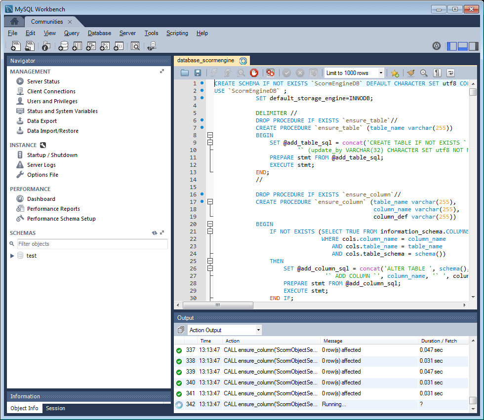

# 用于启用功能的MySQL配置{#mysql-configuration-for-enablement-features}

MySQL是关系数据库，主要用于SCORM跟踪和报告支持资源数据。 其中包括跟踪视频暂停/继续等其他功能的表。

这些说明描述了如何连接到MySQL服务器、建立启用数据库以及使用初始数据填充数据库。

## 要求{#requirements}

在配置MySQL for Communities的启用功能之前，请务必

* 安装[ MySQL Server](https://dev.mysql.com/downloads/mysql/) Community Server版本5.6
   * SCORM不支持版本5.7
   * 可能与作者AEM实例相同
* 在所有AEM实例上，安装MySQL](deploy-communities.md#jdbc-driver-for-mysql)的正式[JDBC驱动程序
* 安装[MySQL Workbench](https://dev.mysql.com/downloads/tools/workbench/)
* 在所有AEM实例上，安装[SCORM包](enablement.md#scorm)

## 安装MySQL {#installing-mysql}

应按照目标 OS的说明下载并安装MySQL。

### 小写表名{#lower-case-table-names}

由于SQL不区分大小写，因此对于区分大小写的操作系统，必须包含一个将所有表名都小写的设置。

例如，要指定Linux OS上的所有小写表名：

* 编辑文件`/etc/my.cnf`
* 在`[mysqld]`部分中，添加以下行：
   `lower_case_table_names = 1`

### UTF8字符集{#utf-character-set}

要提供更好的多语言支持，必须使用UTF8字符集。

将MySQL更改为以UTF8作为其字符集：
* mysql>设置名称“utf8”；

将MySQL数据库更改为默认UTF8:
* 编辑文件`/etc/my.cnf`
* 在`[client]`部分中，添加以下行：
   `default-character-set=utf8`
* 在`[mysqld]`部分中，添加以下行：
   `character-set-server=utf8`

## 安装MySQL Workbench {#installing-mysql-workbench}

MySQL Workbench提供了用于执行SQL脚本的UI，这些脚本安装模式和初始数据。

应按照目标 OS的说明下载并安装MySQL Workbench。

## Enablement Connection {#enablement-connection}

首次启动MySQL Workbench时，除非已用于其他用途，否则它尚不显示任何连接：

### 新建连接设置{#new-connection-settings}

1. 选择`MySQL Connections`右侧的“+”图标。
1. 在对话框`Setup New Connection`中，输入适用于您的平台以用于演示的值，作者AEM实例和MySQL位于同一台服务器上：
   * 连接名称：`Enablement`
   * 连接方法：`Standard (TCP/IP)`
   * 主机名：`127.0.0.1`
   * 用户名: `root`
   * 密码: `no password by default`
   * 默认模式:`leave blank`
1. 选择`Test Connection`以验证与正在运行的MySQL服务的连接

**注释**:

* 默认端口为`3306`
* 所选`Connection Name`作为[JDBC OSGi配置](#configure-jdbc-connections)中的`datasource`名称输入

#### 连接成功{#successful-connection}

#### 新建Enablement Connection {#new-enablement-connection}

## 数据库设置{#database-setup}

打开新的Enablement连接时，请注意存在测试模式和默认用户帐户。

### 获取SQL脚本{#obtain-sql-scripts}

SQL脚本是使用创作实例上的CRXDE Lite获取的。 必须安装[SCORM包](deploy-communities.md#scorm):

1. 浏览到CRXDE Lite
   * 例如，[http://localhost:4502/crx/de](http://localhost:4502/crx/de)
1. 展开`/libs/social/config/scorm/`文件夹
1. 下载 `database_scormengine.sql`
1. 下载 `database_scorm_integration.sql`

下载模式的一种方法是

* 为sql文件选择`jcr:content`节点
* 注意`jcr:data`属性的值是视图链接
* 选择视图链接以将数据保存到本地文件

### 创建SCORM数据库{#create-scorm-database}

要创建的Enablement SCORM数据库为：

* name: `ScormEngineDB`
* 从脚本创建：
   * 架构: `database_scormengine.sql`
   * 数据：`database_scorm_integration.sql`
按照以下步骤操作(
[打开](#step-open-sql-file)、执 [行](#step-execute-sql-script))以安装每 [个SQL脚本](#obtain-sql-scripts) 。[根](#refresh) 据需要刷新以查看脚本执行的结果。

请务必在安装模式之前安装数据。

>[!CAUTION]
>
>如果数据库名称已更改，请确保在
>
>* [JDBC配置](#configure-jdbc-connections)
>* [SCORM配置](#configure-scorm)

>

#### 第1步：打开SQL文件{#step-open-sql-file}

在MySQL Workbench中

* 从文件下拉菜单
* 选择 `Open SQL Script ...`
* 按此顺序，选择以下选项之一：
   1. `database_scormengine.sql`
   1. `database_scorm_integration.sql`

#### 第2步：执行SQL Script {#step-execute-sql-script}

在步骤1中打开的文件的“工作台”窗口中，选择`lightening (flash) icon`以执行脚本。

请注意，执行`database_scormengine.sql`脚本以创建SCORM数据库可能需要一分钟时间。

#### 刷新 {#refresh}

执行脚本后，必须刷新`Navigator`的`SCHEMAS`部分，以查看新数据库。 使用“模式”右侧的刷新图标：

#### 结果：scormenginedb {#result-scormenginedb}

安装和刷新模式后，**`scormenginedb`**&#x200B;将可见。

## 配置JDBC连接{#configure-jdbc-connections}

**Day Commons JDBC连接池**&#x200B;的OSGi配置配置MySQL JDBC驱动程序。

所有发布和作者AEM实例都应指向同一MySQL服务器。

当MySQL在与AEM不同的服务器上运行时，必须在JDBC连接器中指定服务器主机名，而不是“localhost”（它填充了[ScormEngine](#configurescormengineservice)配置）。

* 在每个作者和发布AEM实例上
* 以管理员权限登录
* 访问[ Web控制台](../../help/sites-deploying/configuring-osgi.md)
   * 例如，[http://localhost:4502/system/console/configMgr](http://localhost:4502/system/console/configMgr)
* 找到`Day Commons JDBC Connections Pool`
* 选择`+`图标以创建新配置

* 输入以下值：
   * **[!UICONTROL JDBC驱动程序类]**:  `com.mysql.jdbc.Driver`
   * **DBC connection URIJ**: `jdbc:mysql://localhost:3306/aem63reporting` 如果MySQL服务器与&#39;this&#39; AEM服务器不相同，则指定服务器代替localhost
   * **[!UICONTROL 用户名]**:为MySQL服务器（如果不是“root”）输入已配置的用户名
   * **[!UICONTROL 密码]**:如果没有为MySQL设置口令，请清除此字段，否则请输入MySQL用户名的已配置口令
   * **[!UICONTROL 数据源名称]**:为MySQL连接 [输入的名](#new-connection-settings)称，例如“enablement”
* 选择&#x200B;**[!UICONTROL 保存]**

## 配置Scorm {#configure-scorm}

### AEM Communities ScormEngine服务{#aem-communities-scormengine-service}

**AEM Communities ScormEngine服务**&#x200B;的OSGi配置为启用社区使用MySQL服务器配置SCORM。

安装[SCORM包](deploy-communities.md#scorm-package)时，会出现此配置。

所有发布和作者实例都指向同一MySQL服务器。

当MySQL在与AEM不同的服务器上运行时，必须在ScormEngine服务中指定服务器主机名，而不是“localhost”，该服务通常从[JDBC连接](#configure-jdbc-connections)配置中填充。

* 在每个作者和发布AEM实例上
* 以管理员权限登录
* 访问[ Web控制台](../../help/sites-deploying/configuring-osgi.md)
   * 例如，[http://localhost:4502/system/console/configMgr](http://localhost:4502/system/console/configMgr)
* 找到`AEM Communities ScormEngine Service`
* 选择编辑图标
   
* 验证以下参数值是否与[JDBC Connection](#configurejdbcconnectionspool)配置一致：
   * **[!UICONTROL JDBC连接URI]**: `jdbc:mysql://localhost:3306/ScormEngineDB` *ScormEngineDB* 是SQL脚本中的默认数据库名称
   * **[!UICONTROL 用户名]**:为MySQL服务器（如果不是“root”）输入已配置的用户名
   * **[!UICONTROL 密码]**:如果没有为MySQL设置口令，请清除此字段，否则请输入MySQL用户名的已配置口令
* 关于以下参数：
   * **[!UICONTROL Scorm用户密码]**:不编辑

      仅供内部使用。 它是供AEM Communities使用的特殊服务用户与scorm引擎通信的。
* 选择&#x200B;**[!UICONTROL 保存]**

### Adobe花岗岩CSRF滤镜{#adobe-granite-csrf-filter}

要确保启用课程在所有浏览器中正常工作，必须将Mozilla添加为CSRF过滤器未选中的用户代理。

* 在每个发布AEM实例上
* 以管理员权限登录
* 访问[ Web控制台](../../help/sites-deploying/configuring-osgi.md)
   * 例如，[http://localhost:4503/system/console/configMgr](http://localhost:4503/system/console/configMgr)
* 找到`Adobe Granite CSRF Filter`
* 选择编辑图标
   
* 选择`[+]`图标以添加安全用户代理
* 输入`Mozilla/*`
* 选择&#x200B;**[!UICONTROL 保存]**

