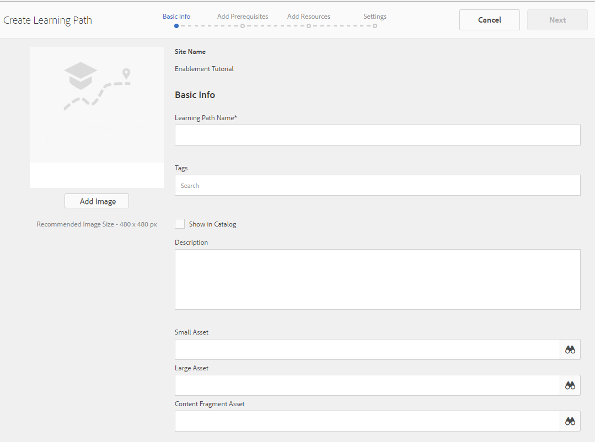
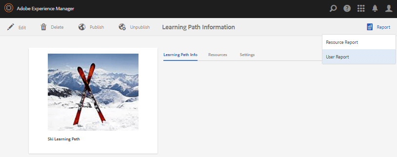

# Enablement Resources Console {#enablement-resources-console}

对于AEM Communities，资源控制台是[Enablement Managers](users.md)创建、管理资源并将资源分配给Enablement Community站点成员的位置。

## 要求{#requirements}

在为社区站点添加启用资源之前，必须正确配置AEM实例，包括：

* SCORM
* FFmpeg

有关详细信息，请参阅[配置Enablement](enablement.md)。

>[!CAUTION]
>
>如果在创建社区站点后安装了SCORM，则必须重新创建安装SCORM之前存在的任何支持资源。

>[!NOTE]
>
>随着[AEM 6.3](deploy-communities.md#latestfeaturepack)的发布以及相应的社区功能包[AEM 6.2 FP3](deploy-communities.md#latestfeaturepack)和[AEM 6.1 FP7](https://docs.adobe.com/content/docs/en/aem/6-1/deploy/communities.html#Latest功能包)的推出，启用功能不再需要[MySQL数据库](mysql.md)。

## 术语 {#terminology}

### 资源 {#resource}

资源对[启用社区](overview.md#enablement-community)至关重要。 它们是分配给成员的材料，使他们能够提高自己的技能。

资源的特性：

* 可能是
   * 图像(JPG、PNG、GIF、BMP)
   * 视频(MP4)
   * Flash(SWF)
   * 文档(PDF)
   * 测验(SCORM)
* 可以从一个或多个学习路径引用

### 学习路径 {#learning-path}

学习路径是一组分组在一起的支持资源的逻辑集合，便于分配给成员。

### 成员组{#members-group}

创建社区站点时，在创建为不同角色配置了各种权限的[站点特定用户组](users.md)时，会使用为URL指定给该站点的名称。 所有这些自动创建的组都前缀为`Community *<site-name>*`。

`Community *<site-name>* Members`组是此类用户组之一，它将发布环境中的注册用户标识为社区成员。 有关示例，请参阅教程[Enablement](getting-started-enablement.md)的AEM Communities快速入门。

对于[参与社区](overview.md#egagementcommunity)，允许站点访客自行注册或使用社交登录是合理的，在此时，会自动将其添加到成员组。

对于[enablement communities](overview.md#enablement-community)，建议将站点设为私有，然后需要管理员将用户添加到成员组。

## 访问社区站点的Enablement Resources {#accessing-a-community-site-s-enablement-resources}

### 导航到Communities资源{#navigate-to-communities-resources}

在创作环境中，要访问“资源”控制台

* 从全局导航：**[!UICONTROL 导航>社区>资源]**

### 选择社区站点{#select-a-community-site}

“社区资源”控制台将显示所有社区站点。

从“资源”控制台中选择网站后，将为特定社区站点创建启用资源。

选择特定社区站点后，即可访问任何现有的支持资源和学习路径以进行管理和修改，并可创建新的支持资源和学习路径。

#### 搜索 {#search-features}

选择侧面板切换图标以搜索启用资源或学习路径。 选择后，控制台左侧将打开一个搜索面板，并提供一个文本框，可在其中输入搜索词。

#### 选择模式 {#selection-mode}

要选择多个启用资源，请将鼠标悬停在卡上并选择复选标记图标，以选择第一个。 选择卡后，选择任何其他卡会将其添加到选择组。 再次选择卡将取消选择。

## 创建资源{#create-a-resource}

向社区站点添加新的启用资源

* 选择`Create`图标
* 从显示的子菜单中，选择`Resource`

此操作将启动

* 描述资源（名称、卡图像和文本）
* 选择资源内容
* 为资源选择封面图像
* 识别资源联系人
* 将资源分配给成员

当资源是课程（即学习路径）的一部分时，仅应将成员分配到学习路径。 可在创建启用资源后添加分配。

### 1基本信息{#basic-info}

* **[!UICONTROL 添加]**

   （*可选*）要在成员分配页面和资源控制台中的启用资源卡上显示的图像。 从服务器的本地文件系统中选择图像。 如果未提供图像，则将为上传的资源生成缩略图。

   ***注意***:建议的图像大小不仅为480 x 480像素。由于卡的响应式设计具有各种浏览器尺寸，因此显示大小将从220 X 165像素到400 x 165像素不等。

* **[!UICONTROL 网站名称]**

   (*readonly*)要向其添加资源的社区站点。

* **[!UICONTROL 资源名称(&amp;A);]**

   (*required*)资源的显示名称。 通过显示名称创建有效的节点名称。

* **[!UICONTROL 标记]**

   （*可选*）可以选择一个或多个标记，将启用资源与一个或多个目录关联。 请参阅[标记Enablement Resources](tag-resources.md)。

* **[!UICONTROL 在目录中显示]**

   取消选中后，Enablement Resource将不会显示在任何目录中。 如果选中此项，则除非[预过滤](catalog-developer-essentials.md#pre-filters)或UI中的成员过滤器，否则启用资源将显示在所有目录中。 默认为未选中。

* **[!UICONTROL 描述]**

   （*可选*）要显示的启用资源说明。

* **[!UICONTROL 较小的资产]**

   （*可选*）从AEM Assets中选择。 在发布环境（如目录中）中表示资源的缩略图。

* **[!UICONTROL 较大的资产]**

   （*可选*）从AEM Assets中选择。 在发布环境中表示资源的大图像，例如在资源的主页上。

* **[!UICONTROL 内容片段资产]**

   （*可选*）从AEM Assets中选择。 在发布环境中可能引用但默认不使用的内容片段。

* 选择&#x200B;**[!UICONTROL 下一个]**

### 2添加内容{#add-content}

虽然它看起来好像可能选择了多个启用资源，但仅允许一个启用资源。

选择右上角的`'+' icon`，以通过标识源开始选择资源的过程。

* **[!UICONTROL 从我的本地文]**
件上传从本地文件系统上传将使用本机文件浏览器选择并上传文件。支持的文件类型包括SCORM.zip（HTML5或SWF）、MP4视频、SWF、PDF和图像类型(JPG、PNG、GIF、BMP)。 文件名将变为添加到资源库的资产名称。

* **[!UICONTROL 浏览资源]**
库从资源库中选择。选择仅限于社区站点中可见的选项。

* **[!UICONTROL 添加外部 URL]**

   输入指向学习内容的链接。

   在打开的对话框中，输入：

   * **[!UICONTROL 标题]**

      启用资源的资产名称。

   * **[!UICONTROL URL]**

      资产的URL。

* **[!UICONTROL 添加 Adobe Connect URL]**

   输入指向Adobe Connect会话的链接。

   在打开的对话框中，输入：

   * **[!UICONTROL 标题]**

      启用资源的资产名称。

   * **[!UICONTROL URL]**

      指向Adobe Connect会话的URL。

* **[!UICONTROL 定义外部资源]**

   输入要显示物料的位置。 成功状态和分数的值是手动输入的（请参阅[报表](reports.md)）。 上传的封面图像可用于提供其他信息。

   在打开的对话框中，输入：

   * **[!UICONTROL 标题]**

      启用资源的资产名称。

   * **[!UICONTROL 位置]**

      物理站点的位置，如教室……

#### 添加的视频资源{#example-of-an-added-video-resource}的示例

* **[!UICONTROL 资源封面图像]**

   封面图像是当首次查看启用资源时要显示的图像。 例如，当视频资源尚未播放时，将显示封面图像。 如果未上传自定义图像，则显示默认图像。 对于视频资源，[可以生成缩略图](enablement.md#ffmpeg)，但仅当上传时，而不是当视频作为URL引用时。 对于位置资源，图像可用于提供其他信息。

   封面图像的建议大小为640 x 360像素。

* 选择&#x200B;**[!UICONTROL 下一个]**

### 3设置{#settings}

>[!NOTE]
>
>不应直接在要从学习路径引用的教育资源中登记学员。 只需在学习路径中登记学员。
>
>如果某个会员同时登记了引用该资源的资源和学习路径，则其分配将同时显示学习路径中的单个资源和资源。

* **[!UICONTROL 社交设置]**

   这些设置控制学习者是否能够提供有关启用资源的输入。 [审核设置](sites-console.md#moderation)是父社区站点的设置。

   * **[!UICONTROL 允许评论]**

      如果选中，则允许成员对资源进行评论。 选中默认值。

   * **[!UICONTROL 允许评级]**

      如果选中，则允许成员对资源进行评级。 选中默认值。

   * **[!UICONTROL 允许匿名访问]**

      如果选中此项，则当社区站点还允许匿名访问时，允许匿名站点访客视图目录中的资源。 默认为未选中。

* **[!UICONTROL 到期日期]**

   *（可选）* 可以选择完成分配的日期。

* **[!UICONTROL 资源作者]**
   *（可选）* 启用资源的作者。使用下拉菜单从[成员组](#members-group)的成员用户中进行选择。

* **[!UICONTROL 资源联系(&amp;A);]**
   *（必需）会* 员可以联系的与启用资源相关的人员。使用下拉菜单从[成员组](#members-group)的成员用户中进行选择。

* **[!UICONTROL 资源专家]**
   *（可选）会* 员可以与具有支持资源相关专业知识的人员联系。使用下拉菜单从[成员组](#members-group)的成员用户中进行选择。

### 4个任务{#assignments}

* **[!UICONTROL 添]**
加受分派者使用下拉菜单从 [成](#members-group) 员（以粗体列出）)中选择要作为学员登记的用户和用户组。成员登录社区站点后，其登记的启用资源（和学习路径）将显示在其[分配](functions.md#assignments-function)页面上。

* 选择&#x200B;**[!UICONTROL 创建]**

成功创建启用资源将返回“资源”控制台，并选择新创建的资源。 从此控制台中，可以[管理资源](#managing-a-resource)。

## 创建学习路径{#create-a-learning-path}

向社区站点添加新的学习路径

* 选择`Create`图标
* 从显示的子菜单中，选择`Learning Path`

此操作将启动

* 确定学习路径
* 提供卡图像以表示学员的学习路径
* 引用要包含在学习路径中的教育资源
* （可选）对资源排序
* （可选）确定入门项目学习路径
* 确定学习路径联系人
* 登记成员

对于包含在学习路径中的支持资源，应仅为学习路径而非个别资源分配任务。

### 基本信息 {#basic-info-1}

* **[!UICONTROL 添加]**

   （*可选*）要在成员分配页面和资源控制台中学习路径的卡片上显示的图像。 从服务器的本地文件系统中选择图像。 如果未提供图像，则将为上传的资源生成缩略图。

   ***注意***:建议的图像大小不再只是480 x 480像素。由于卡的响应式设计具有各种浏览器尺寸，因此显示大小将从220 X 165像素到400 x 165像素不等。

* **[!UICONTROL 网站名称]**

   (*readonly*)要向其添加资源的社区站点。

* **[!UICONTROL 学习路径名称]**

   (*required*)学习路径的显示名称。 通过显示名称创建有效的节点名称。

* **[!UICONTROL 标记]**

   （*可选*）可以选择一个或多个标记，将学习路径与一个或多个目录关联。 请参阅[标记Enablement Resources](tag-resources.md)。

* **[!UICONTROL 在目录中显示]**

   如果未选中，则学习路径将不会显示在任何目录中。 如果选中此项，除非[预过滤](catalog-developer-essentials.md#pre-filters)或UI中的成员过滤器，否则学习路径将显示在所有目录中。 在目录中显示学习路径将间接授予对其所有包含资源的READ访问权限。 默认为未选中。

* **[!UICONTROL 描述]**

   （*可选*）要显示的启用资源说明。

* **[!UICONTROL 较小的资产]**

   （*可选*）从AEM Assets中选择。 在发布环境（如目录中）中表示资源的缩略图。

* **[!UICONTROL 较大的资产]**

   （*可选*）从AEM Assets中选择。 在发布环境中表示资源的大图像，例如在资源的主页上。

* **[!UICONTROL 内容片段资产]**

   （*可选*）从AEM Assets中选择。 在发布环境中可能引用但默认不使用的内容片段。

* 选择&#x200B;**[!UICONTROL 下一个]**

### 添加必备项 {#add-prerequisites}

* **[!UICONTROL 必要的学习路径]**
(
*可选*)选择其他已发布的学习路径后，学员必须先完成这些路径，然后才能选择此学习路径。

* 选择&#x200B;**[!UICONTROL 下一个]**

### 添加资源 {#add-resources}

* **[!UICONTROL 强制执行学习路径中的排序]**

   （*可选*），如果设置为“On”，则添加启用资源的顺序是学员完成学习路径的顺序。 默认为关闭。

* **[!UICONTROL 资源]**

   从为当前社区站点创建的*已发布*支持资源中选择一个或多个资源。

>[!NOTE]
>
>您只能选择与学习路径同级的可用资源。 例如，对于在组中创建的学习路径，只有组级别资源可用；对于在社区站点中创建的学习路径，该站点中的资源可用于添加到学习路径。

* 选择&#x200B;**[!UICONTROL 下一步]**。

### 设置 {#settings-1}

* **[!UICONTROL 添加注册]**

   使用下拉菜单从社区站点的[成员组](#members-group)的成员组（以粗体列出）中进行选择。 在首次创建学习路径时不必添加任务。 可以修改学习路径属性以在以后添加学员。

* **[!UICONTROL 学习路径联系方式(&amp;A);]**

   *（必需）会* 员可以联系的与学习计划相关的人员。使用下拉菜单从社区站点的[成员组](#members-group)的成员用户中进行选择。

* 选择&#x200B;**[!UICONTROL 创建]**

>[!NOTE]
>
>从学习路径引用的启用资源不应列表同一个受助者（学员）（如果有）。
>
>如果某个会员同时登记了启用资源和引用该资源的学习路径，则其分配将同时显示学习路径中的单一资源和资源。

## 管理资源{#managing-a-resource}

要管理单个支持资源

* 从“资源”控制台
* 选择包含资源的社区站点
* 选择资源

对于选定的启用资源，可以：

* 视图属性（默认）
* 编辑属性
* 删除
* 发布
* 取消发布

要上传Enablement Resource的新版本，建议创建新资源，然后从旧版本中取消登记成员并将他们登记到新版本。

### 编辑资源 {#edit-resource}

通过选择铅笔图标，可使用显示的创建启用资源的步骤，以便可以修改提供的任何信息。

如果唯一的更改是修改设置步骤中的分配，则保存更改会导致发布修改。 如果进行了任何其他更改，则在保存后必须显式发布资源。

### 删除资源 {#delete-resource}

通过选择转换图标，启用资源将在确认后变为`Delete`d。

### 发布 {#publish}

在学员能够看到已分配的支持资源之前，必须先发布它：

* 选择`Publish`的世界图标
* 在弹出的对话框中，再次选择&#x200B;**[!UICONTROL 发布]**
* 选择&#x200B;**[!UICONTROL 关闭]**

即使对话框声明已排队操作，它通常也会立即发布。

### 取消发布 {#unpublish}

要临时使启用资源在发布环境中对成员不可访问而不将其删除，请使用`Unpublish`资源的全球图标。

### 报告 {#report}

通过“报告”图标，学员可以访问在发布环境中与分配的支持资源交互时生成的报告。 报告因资源类型而异。

对于所有学习路径，可以根据资源或学员视图报告(`User Report`)。

此报告专门针对当前支持资源或学习路径。 提供的报告深度取决于是否为社区站点许可和启用了[Adobe Analytics](analytics.md)。 [时间轴](#timeline)、[查看器参与](#viewer-engagement)和[按设备参与](#engagement-by-device)报告基于[轮询间隔](analytics.md#report-importer)从Adobe Analytics导入。

对于所有启用资源，无论是否启用Adobe Analytics，都有关于[被分派人状态](#assignee-status)和[评级](#ratings)的报告，以及[报告摘要](#report-summary)表。

#### 时间轴 {#timeline}

“Analytics时间轴”报告显示此启用资源在一段时间内的事件发生时间：

* **视图**

   视图是学员访问资源详细信息页面时

* **播放**

   播放是指学习者与资源交互（如播放视频或打开PDF）时

* **评级**

   评级是指学员为资源分配星级

* **评论**

   评论是指alLearner添加评论时

垂直轴是事件数。

水平轴是日历时间。

[Adobe Analytics](sites-console.md#analytics)。

#### 查看器参与度 {#viewer-engagement}

“Analytics查看器参与度”报告显示视频资源的已查看该资源的学员数，如果未播放到最后，学员在什么时候停止播放该资源。

垂直轴是已查看此资源的学员数。

水平轴是此资源的持续时间。

[Marketing Cloud组织ID为必填项](sites-console.md#enablement)。

#### 按设备划分的参与 {#engagement-by-device}

针对视频资源的“按设备分析参与度”报告描述了从桌面和移动设备播放的视图的百分比。

[Marketing Cloud组织ID为必填项](sites-console.md#enablement)。

#### 被分派人状态 {#assignee-status}

“被分派人状态”报告基于学员数，描述有多少学员

* **未启动**
* **进行中**
* **已完成**

#### 评级 {#ratings}

“评级”报告基于已对启用资源进行评级的学员数，显示每个星级的数量，后跟总评级数和平均评级的摘要。

#### 报告摘要{#report-summary}

对于启用资源，“报告摘要”是表列表

* 与资源互动的每个学员
   * 他们的地位
   * 是否已为他们分配了资源
      * 与其在目录中查找资源
   * 已发布的评论数
   * 给出的评级（如果有）

对于学习路径资源报表，报表摘要是一个表列表

* 学习路径中包含的每个资源
   * 发布状态
   * 视图数
   * 播放次数
   * 平均评级
   * 格式
   * 大小
   * 社区站点名称

对于学习路径用户报告，报告摘要是一个表列表

* 分配给学习路径的每个学员
   * 已完成的资源数
   * 他们的地位

可以通过使用`Show / hide columns`选择器选择列来调整表的显示。

#### 将报告下载为CSV {#download-report-as-csv}

“报告摘要”(Reports Summary)表格可使用控制台顶部的按钮以CSV格式下载。

* 对于enablement资源：`Download Resource Report as CSV`按钮
* 学习路径：`Download Learning Path Report as CSV`按钮

无论选择哪些列显示，都将下载完整的“报告摘要”。
