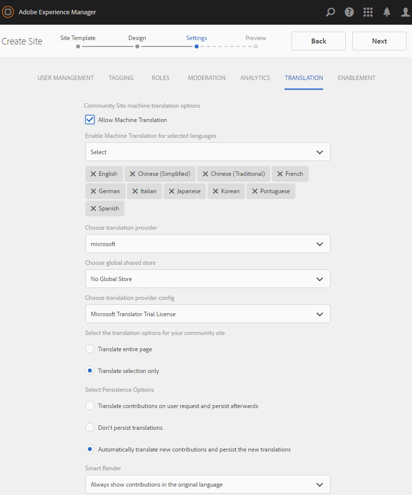

# 社区站点控制台{#communities-sites-console}

通过“社区站点”控制台，可以访问：

* 站点创建
* 站点编辑
* 站点管理
* [创建和编辑嵌套组](groups.md) （子社区）

请参阅[AEM Communities入门](getting-started.md)以体验在作者环境下创建社区站点的速度，以及如何从作者和发布环境创建社区组。

>[!NOTE]
>
>用于创建[社区站点](sites-console.md)、[社区站点模板](sites.md)、[社区组模板](tools-groups.md)和[社区功能](functions.md)的主“社区”菜单仅用于创作环境。

## 前提条件 {#prerequisites}

在创建社区站点之前，*required*&#x200B;必须：

* 确保一个或多个发布实例正在运行
* 启用[隧道服务](deploy-communities.md#tunnel-service-on-author)以管理成员和成员组
* 识别[主发布者](deploy-communities.md#primary-publisher)
* [当主](deploy-communities.md#replication-agents-on-author) 发布者端口不是默认端口时配置复制(4503)

最佳实践是，为确保站点能够支持许多功能，请采取以下步骤：

* 安装[最新功能包](deploy-communities.md#latestfeaturepack)
* 为AEM Communities启用[Adobe Analytics](analytics.md)
* 配置[email](email.md)
* 识别[社区管理员](users.md#creating-community-members)
* [启用OAuth处理](social-login.md#adobe-granite-oauth-authentication-handler) 程序进行社交登录

## 访问社区站点控制台{#accessing-communities-sites-console}

在创作环境中，要访问“社区站点”控制台：

* 从全局导航：**[!UICONTROL 社区>站点]**

“社区站点”控制台显示任何现有社区站点。 在此控制台中，可以创建、编辑、管理和删除社区站点。

要创建新社区站点，请选择&#x200B;**创建**&#x200B;图标。

要访问现有社区站点，为创作、修改、发布、导出或添加嵌套组，请选择站点的文件夹图标。

例如，下图显示了主“社区站点”控制台，其中显示了两个社区站点的文件夹：[enable](getting-started-enablement.md)和[engage](getting-started.md):

## 站点创建{#site-creation}

站点创建控制台提供了根据所选[社区站点模板](sites.md)和设置来组合站点功能的分步方法。

创建的每个站点都包含登录功能，因为站点访客必须先登录才能发布内容、发送消息或加入组。 其他功能包括用户用户档案、消息、通知、站点菜单、搜索、主题和品牌。

通过选择位于“社区站点”控制台顶部的`Create`按钮启动该过程。

创建过程是一系列步骤，这些步骤以面板的形式呈现，其中包含要配置的一组特征（以子面板的形式呈现）。 在最后步骤中提交站点之前，可以前进到&#x200B;**下一步**&#x200B;步骤或&#x200B;**后退**&#x200B;到上一步。

### 第1步：站点模板{#step-site-template}

在“站点模板”面板中，将指定标题、说明、站点根、基本语言、名称和站点模板：

* **[!UICONTROL 社区站点标题]**:站点的显示标题。

   标题将显示在已发布的站点上以及站点管理员UI中。

* **[!UICONTROL 社区站点描述]**:站点的描述。

   该说明不显示在已发布的站点上。

* **[!UICONTROL 社区站点根目录]**:站点的根路径。

   默认根目录为`/content/sites`，但根目录可以移动到网站中的任何位置。

* **[!UICONTROL 社区站点基础语言]**:(对于单种语言，请保持不变：英语)使用下拉菜单从可用 *语* 言(德语、意大利语、法语、日语、西班牙语、葡萄牙语（巴西）、繁体中文和简体中文)中选择一种或多种基本语言。将根据[多语言站点翻译内容](../../help/sites-administering/translation.md)中介绍的最佳实践，为添加的每种语言创建一个社区站点，并且该站点将位于同一站点文件夹中。 每个站点的根页面将包含一个由所选语言之一的语言代码命名的子页面，如英语为“en”或法语为“fr”。

* **[!UICONTROL 社区站点名称]**:站点的根页面的名称，显示在URL中

   * 多次-检查名称，因为创建站点后该名称不易更改
   * 基本URL(`https://*server:port/site root/site name*)`)将显示在`Community Site Name`的下方
   * 对于有效的URL，请附加基本语言代码+ &quot;。html&quot;

      *例如*,  `http://localhost:4502/content/sites/mysight/en.html`

* **[!UICONTROL 社区站点]** 模板菜单：使用下拉菜单选择可用的社 [区站点模板](tools.md)。

选择&#x200B;**[!UICONTROL 下一步]**

### 第2步：设计{#step-design}

“设计”面板包含两个用于选择主题和品牌横幅的子面板：

#### 社区站点主题{#community-site-theme}

该框架使用[TwitterBootstrap](https://twitterbootstrap.org/)为站点引入响应式、灵活的设计。 可以选择多个预先加载的Bootstrap主题之一来设置所选社区站点模板的样式，或者可以上传Bootstrap主题。

选中后，主题将用不透明的蓝色复选标记覆盖。

发布社区站点后，可以[编辑属性](#modifying-site-properties)并选择其他主题。

#### 社区站点品牌{#community-site-branding}

社区站点品牌是显示为每个页面顶部标题的图像。

图像的大小应与浏览器中页面的预期显示大小相同，高度应为120像素。

创建或选择图像时，请牢记：

* 图像高度将从图像的上边缘裁剪为120像素
* 图像已固定到浏览器窗口的左边缘
* 图像不会调整大小，因此当图像宽度为……

   * 小于浏览器的宽度，图像将水平重复
   * 图像宽度大于浏览器的宽度后，图像会被裁切

选择&#x200B;**[!UICONTROL 下一步]**。

### 第3步：设置{#step-settings}

“设置”面板包含几个子面板，这些子面板显示要配置的功能，然后转到创建站点的最后一步。

* [用户管理](#user-management)
* [标记](#tagging)
* [角色](#roles)
* [协调](#moderation)
* [分析](#analytics)
* [翻译](#translation)
* [支持](#enablement)

>[!NOTE]
>
>**启用隧道服务**
>
>几个“设置”子面板允许指定受信任成员以审核UGC、管理组或成为发布环境中的启用资源联系人。
>
>约定发布端[用户和用户组](users.md)（成员和成员组）在创作环境中不重复。
>
>因此，在创作环境中创建社区站点并将受信任成员分配给各种角色时，必须从发布环境检索成员数据。
>
>这是通过为作者环境启用` [AEM Communities Publish Tunnel Service](deploy-communities.md#tunnel-service-on-author)`来实现的。

#### 用户管理{#user-management}

>[!NOTE]
>
>建议将[启用社区站点](overview.md#enablement-community)设为私有（有关详细信息，请与您的帐户代表联系）。
>
>当拒绝匿名站点访客访问、不能自行注册或不能使用社交登录时，社区站点是私有的。

* **[!UICONTROL 允许用户注册]**

   如果选中此项，站点访客可以通过自助注册成为社区成员。

   如果未选中，则社区站点为&#x200B;*受限*，必须将站点访客分配给社区站点的成员组、发出请求或通过电子邮件发送邀请。 如果未选中，则不允许匿名访问。

   取消选中&#x200B;*private*&#x200B;社区站点。 选中默认值。

* **[!UICONTROL 允许匿名访问]**

   如果选中，则社区站点&#x200B;*open*，任何站点访客都可以访问该站点。

   如果未选中，则只有登录成员才能访问该站点。

   取消选中&#x200B;*private*&#x200B;社区站点。 选中默认值。

* **[!UICONTROL 允许发送消息]**

   如果选中，成员可以向彼此发送消息，并向社区站点内的组发送消息。

   如果未选中，则不会为社区设置消息。

   默认为未选中。

* **[!UICONTROL 允许社交登录: Facebook]**

   如果选中，则允许网站访客使用其Facebook帐户凭据登录。 应将所选[Facebook云配置](social-login.md#create-a-facebook-connect-cloud-service)配置为在创建社区站点后将用户添加到社区站点的成员组。

   如果不选中，则不显示Facebook登录名。

   对于&#x200B;*private*&#x200B;社区站点，不选中。 默认为未选中。

* **[!UICONTROL 允许社交登录: Twitter]**

   如果选中，允许站点访客使用其Twitter帐户凭据登录。 应将所选[Twitter云配置](social-login.md#create-a-twitter-connect-cloud-service)配置为在创建社区站点后将用户添加到社区站点的成员组。

   如果不选中，则不显示Twitter登录名。

   对于&#x200B;*private*&#x200B;社区站点，不选中。 默认为未选中。

>[!NOTE]
>
>**[!UICONTROL 允许社交登录]**
>
>尽管示例Facebook和Twitter配置可能存在并可供选择，但对于[生产环境](../../help/sites-administering/production-ready.md)，必须创建自定义Facebook和Twitter应用程序。 请参阅[使用Facebook和Twitter进行社交登录](social-login.md)。

#### 标记{#tagging}

可应用于社区内容的标记通过选择之前通过[标记控制台](../../help/sites-administering/tags.md#tagging-console)定义的标记命名空间来控制。

此外，为社区站点选择标记命名空间会限制在定义目录和资源时显示的选择。 有关重要信息，请参阅[标记Enablement Resources](tag-resources.md)。

* 文本搜索框：开始键入以标识允许在站点上使用的标记

#### 角色{#roles}

社区成员的[角色分配有这些设置。](users.md)

使用预先键入搜索，可轻松查找社区成员。

* **[!UICONTROL 社区管理员]**

   开始键入以选择一个或多个社区成员或成员组，这些成员组可以管理社区成员和成员组。

* **[!UICONTROL 社区审查方]**

   开始键入以选择一个或多个社区成员或成员组，这些成员组将作为用户生成内容的版主者受信任。

* **[!UICONTROL 拥有权限的社区成员]**

   开始类型选择一个或多个社区成员或成员组，以便在为[社区函数](functions.md)选择了`Allow Privileged Member`时，能够创建新内容。

#### 协调{#moderation}

用于调节用户生成的内容(UGC)的全局设置由这些设置控制。 单个组件具有其他设置来控制仲裁。

* **[!UICONTROL 内容已通过预审]**

   如果选中此项，则发布的社区内容只有在审查方批准后才会显示。 默认为未选中。 有关详细信息，请参阅[协调社区内容](moderate-ugc.md#premoderation)。

* **[!UICONTROL 标记阈值，达到此值后隐藏内容]**

   如果大于0，则主题或帖子在隐藏到公共视图之前必须标出的次数。 如果设置为-1，则标记的主题或帖子从不隐藏于公开视图。 默认值为5。

#### 分析{#analytics}

* **[!UICONTROL 启用 Analytics]**

   只有在Adobe Analytics已[配置](analytics.md)用于社区功能时才可用。

   默认为未选中。 选中后，将显示其他选择菜单：

* **[!UICONTROL 云配置框架引用]**

   从下拉菜单中，选择为此社区站点配置的Analytics云服务框架。

   `Communities`是Analytics Configuration for Communities Features文 [档中的框架](analytics.md#aem-analytics-framework-configuration) 示例。

#### TRANSLATION {#translation}

* **[!UICONTROL 允许机]**
器翻译选中（默认为未选中）后，站点内的UGC将启用机器翻译。这不会影响任何其他内容，如页面内容，即使该站点设置为多语言站点也是如此。 有关为AEM Communities配置授权翻译服务的信息，请参阅[转换用户生成的内容](translate-ugc.md)。 有关完整概述，请参阅[多语言站点的翻译内容](../../help/sites-administering/translation.md)。

* **[!UICONTROL 为选定的语言启用机器翻译]**

   启用机器翻译的语言默认为由[翻译集成配置](translate-ugc.md#translation-integration-configuration)指定的系统设置。 通过删除默认值和／或从下拉菜单中选择其他语言，可能会覆盖此站点的这些默认设置。

* **[!UICONTROL 选择翻译提供商]**

   默认情况下，服务提供商是仅用于演示的试用服务。 `microsoft`如果未授权任何翻译服务提供商，应取消选中&#x200B;**允许机器翻译**。

* **[!UICONTROL 选择全球共享商店]**

   对于包含多个语言副本的网站，全局共享商店提供单一的对话线程，每个语言副本中均可见。 这是通过选择作为语言副本包含的语言之一来实现的。 默认值为&#x200B;*没有全局共享存储*。

* **[!UICONTROL 选择翻译提供商配置]**

   选择为授权翻译提供者创建的[翻译集成框架](../../help/sites-administering/tc-tic.md)。

* **为您的社区站点选择翻译选项**

   * **[!UICONTROL 翻译整个页面]**

      如果选中此选项，则页面上的所有UGC都将转换为页面的基本语言。

      默认值为&#x200B;*未选择*。

   * **[!UICONTROL 仅翻译选定内容]**

      如果选中此项，则每个帖子旁边会显示一个翻译选项，允许将各个帖子翻译为页面的基本语言。

      默认值为&#x200B;*selected*。

* **选择持久性选项**

   * **[!UICONTROL 依据用户的请求翻译贡献的文稿，并在此后持续]**

      如果选中此选项，则直到发出请求后，内容才会进行翻译。 翻译完成后，翻译会存储在存储库中。

      默认值为&#x200B;*未选择*。

   * **[!UICONTROL 不保留翻译]**

      如果选择此项，则转换不会存储在存储库中。

      如果未选择，则保留翻译。

      默认值为&#x200B;*未选择*。

* **[!UICONTROL 智能]**
渲染选择其中一个

   * `Always show contributions in the original language` (默认)
   * `Always show contributions in user preferred language`
   * `Show contributions in user preferred language for only logged-in users`

#### ENABLEMENT {#enablement}

当所选社区站点模板包括[分配函数](functions.md#assignments-function)时，`ENABLEMENT`设置适用，当启用功能获得许可和[已配置](enablement.md)时，此功能可用。 包含赋值函数的引用站点模板为`Reference Structured Learning Site Template.`

* **[!UICONTROL 启用管理者]**

   （必需）只有`Community Enablementmanagers`组的成员可以选择来管理此启用社区。 Enablement Manager负责将成员分配给资源。 另请参阅[管理用户和用户组](users.md)。

* **[!UICONTROL Marketing Cloud 组织 ID]**

   （可选）[视频心跳分析](analytics.md#video-heartbeat-analytics)许可证的ID。

选择&#x200B;**[!UICONTROL 下一步]**。

### 第4步：创建社区站点{#step-create-communities-site}

如果需要调整，请使用&#x200B;**返回**&#x200B;按钮进行调整。

选择并启动&#x200B;**创建**&#x200B;后，创建站点的过程将无法中断。

创建站点后：

* 不支持更改url（节点名称）
* 将来更改社区站点模板不会影响创建的社区站点
* 禁用社区站点模板不会影响创建的社区站点
* 通过修改社区站点的属性，可以编辑社区站点的[STRUCTURE](#modify-structure)

完成该过程后，新站点的文件夹会显示在“社区站点”控制台中，作者可以从该控制台添加页面内容，或管理员可以修改站点的属性。

要修改社区站点，请选择其项目文件夹以将其打开：

当用鼠标悬停在站点上或触摸站点卡时，显示允许以创作模式[、](#authoring-site-content)打开站点属性进行修改的图标[、](#modifying-site-properties)发布站点[、](#publishing-the-site)导出站点[和](#exporting-the-site)删除站点[。](#deleting-the-site)

## 创作站点内容{#authoring-site-content}

站点的内容可以与任何其他AEM网站使用相同的工具进行创作。 要打开站点进行创作，请选择鼠标悬停站点时显示的`Open Site`图标。 站点将在新选项卡中打开，以便“社区站点”控制台仍可访问。

>[!NOTE]
>
>如果不熟悉AEM，请视图有关[基本操作](../../help/sites-authoring/basic-handling.md)和[页面创作快速指南的文档。](../../help/sites-authoring/qg-page-authoring.md)

## 修改站点属性{#modifying-site-properties}

通过选择鼠标悬停站点时显示的`Edit Site`图标，可以修改在站点创建过程中指定的现有站点的属性。

`Details of the following properties match the descriptions provided in the` [站点](#site-creation) 创建部分。

### 修改基本{#modify-basic}

BASIC面板允许修改

* 社区站点标题
* 社区站点描述

不能修改社区站点名称。

选择其他社区站点模板不会影响现有社区站点，因为模板和站点之间没有任何连接。

相反，可以修改社区站点的[STRUCTURE](#modify-structure)。

### 修改结构{#modify-structure}

STRUCTURE面板允许修改最初从所选社区站点模板创建的结构。 从面板中，

* 将附加的[社区函数](functions.md)拖放到站点结构中
* 在站点结构中社区功能的实例上：

   * **`gear icon`**

      编辑设置，包括显示标题和URL name&amp;ast;

      以及[特权成员组](users.md#privilegedmembersgroups)

   * **`trashcan icon`**

      从站点结构中删除（删除）函数

   * **`grid icon`**

      修改站点顶级导航栏中显示的功能顺序

>[!NOTE]
>
>除了顶部的函数外，您可以更改“站点结构”中所有函数的顺序。 因此，不能更改社区站点的主页。

>[!CAUTION]
>
>虽然显示标题可以在不产生副作用的情况下进行更改，但不建议编辑属于社区站点的社区功能的URL名称。
>
>例如，重命名URL不会移动现有UGC，因此具有“丢失”UGC的效果。

>[!CAUTION]
>
>组函数必须&#x200B;*不是*&#x200B;是&#x200B;*的第一个函数，也不是站点结构中唯一的*&#x200B;函数。
>
>必须首先包含并列出任何其他函数，如[页函数](functions.md#page-function)。

#### 示例：将目录函数添加到社区站点结构{#example-adding-a-catalog-function-to-a-community-site-structure}

### 修改设计{#modify-design}

DESIGN面板允许应用新主题：

* [社区站点主题](#community-site-theme)
* [社区站点品牌化](#community-site-branding)
   * 滚动到面板底部以更改品牌图像

### 修改设置{#modify-settings}

“设置”面板允许访问社区站点创建步骤3的子面板下的大多数设置：

* [用户管理](#user-management)
* [标记](#tagging)
* [审核](#moderation)
* [成员角色](#roles)
* [分析](#analytics)
* [翻译](#translation)

### 修改缩略图{#modify-thumbnail}

通过THUMBNAIL面板，可以上传图像以在“社区站点”控制台中代表站点。

### 修改启用{#modify-enablement}

ENABLEMENT面板允许访问在社区站点创建过程中提供的设置。

请参阅[ENABLEMENT](#enablement)说明。

## 发布站点{#publishing-the-site}

新建或修改社区站点后，可以选择`Publish Site`图标来发布（激活）该站点，该图标显示在鼠标悬停在该站点上。

网站成功发布后将显示一个指示。

### 使用嵌套组{#publishing-with-nested-groups}发布

发布社区站点后，必须单独发布使用[组控制台](groups.md)创建的每个子社区（嵌套组）。

## 导出站点{#exporting-the-site}

选择导出图标（鼠标悬停在站点上）以创建同时存储在[包管理器](../../help/sites-administering/package-manager.md)中并已下载的社区站点的包。\
请注意，UGC未包含在站点包中。

## 删除站点{#deleting-the-site}

要删除社区站点，请选择将鼠标悬停在“社区站点”控制台中该站点上时显示的“删除站点”图标。 此操作将删除与站点关联的所有项目，如UGC、用户组、资产和数据库记录。

## 已创建社区用户组{#created-community-user-groups}

发布新社区站点后，新成员组(在发布环境创建用户组)将具有为各种管理和成员角色设置的相应权限。

为成员组创建的名称包括&#x200B;*站点名称*&#x200B;在[步骤1](#step13asitetemplate)中为站点指定的&lt;a0/>站点名称&lt;a1/>（显示在URL中的名称）以及唯一ID，以避免与社区站点和组冲突，这些站点和组具有不同的社区站点根的站点名称。

例如，如果标题为“入门教程”的站点的名称为“参与”，则版主的用户组将为：

* 标题：社区参与版主
* 名称：community-*engage-uid*-moderator

请注意，在创建站点时，任何分配了主持人角色或组管理员角色的成员都将分配到相应的组，并分配到成员组。 发布新站点时，将在发布时创建这些组和成员分配。

有关详细信息，请参阅[管理用户和用户组](users.md)。

>[!NOTE]
>
>如果[允许社交登录：在用户组启用Facebook](#user-management)后
>
>* community-*&lt;site-name>*-*&lt;uid>*&#x200B;成员

创建后，应将应用的[Facebook云服务](social-login.md#createafacebookcloudservice)配置为将用户添加到此组。

## 配置身份验证错误{#configure-for-authentication-error}

默认情况下，当用户输入错误凭据且无法登录时，社区站点将重定向到示例登录页。 [生产服务器](../../help/sites-administering/production-ready.md)上不存在此示例登录。

要正确重定向，在将站点配置并推送到发布后，请完成以下步骤，以获取身份验证失败，将其重定向到社区站点：

* 在每个AEM发布实例上
* 首次以管理员权限登录
* 访问[Web控制台](../../help/sites-deploying/configuring-osgi.md)
   * 例如，[http://localhost:4503/system/console/configMgr](http://localhost:4503/system/console/configMgr)

* 找到`Adobe Granite Login Selector Authentication Handler`
* 选择`pencil`图标以打开要编辑的配置
* 按如下方式输入&#x200B;**[!UICONTROL 登录页面映射]**:

   `/content/sites/<site-name>/path/to/login/page:/content/sites/<site-name>`

   例如：

   `/content/sites/engage/en/signin:/content/sites/engage/en`

* 选择&#x200B;**[!UICONTROL 保存]**

### 测试身份验证重定向{#test-authentication-redirection}

在为社区站点配置登录页面映射的同一AEM发布实例上：

* 浏览社区站点主页
   * 例如，[http://localhost:4503/content/sites/engage/en.html](http://localhost:4503/content/sites/engage/en.html)

* 选择注销
* 选择登录
* 输入明显不正确的凭据，如用户名“x”和密码“x”
* 登录页面应显示“登录无效”错误

## 从主站点控制台{#accessing-community-sites-from-main-sites-console}访问社区站点

在全局导航站点控制台中，社区站点位于`Community Sites`文件夹中。

虽然可以通过这种方式访问社区站点，但对于管理任务，应从“社区站点”控制台访问社区站点。

