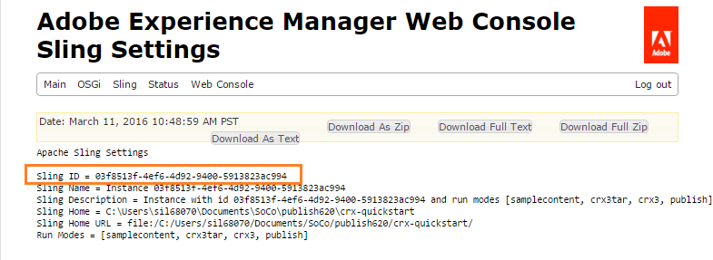

# 社区用户同步 {#communities-user-synchronization}

## 简介 {#introduction}

在AEM Communities，从发布环境（取决于配置的权限） *中，站点**访客可以成*&#x200B;为 *成员*，创 *建用户组*，并编辑其成员用户档案。

*用户* 用户档案是指用户、 *用户**和用* 户组 *。*

*成员* 是指在发布环境 *中注册的用* 户，而不是指在创作环境中注册的用户。

有关用户数据的详细信息，请 [访问管理用户和用户组](users.md)。

## 跨发布场同步用户 {#synchronizing-users-across-a-publish-farm}

根据设计，在发布环境中创建的用户数据不会显示在创作环境中。

在创作环境中创建的大多数用户数据都打算保留在创作环境中，并且不会同步或复制到发布实例。

当拓 [扑是发](topologies.md) 布场 [](../../help/sites-deploying/recommended-deploys.md#tarmk-farm)，在一个发布实例上进行的注册和修改需要与其他发布实例同步。 成员需要能够登录并查看其任何发布节点上的数据。

启用用户同步后，用户数据将自动在场中的发布实例之间同步。

### 用户同步设置说明 {#user-sync-setup-instructions}

有关如何在发布场中启用同步的详细分步说明，请参见

* [用户同步](../../help/sites-administering/sync.md)

## 后台用户同步  {#user-sync-in-the-background}


* **VLT包**: 是发布者上完成的所有更改的zip文件，需要在发布者之间分发。 发布者上的更改会生成由更改事件监听器选取的事件。 这将创建一个包含所有更改的vlt包。

* **分发包**: 包含Sling的分发信息。 这是有关内容需要分发的位置以及最后分发时间的信息。

## 当…… {#what-happens-when}

### 从“社区站点”控制台发布站点 {#publish-site-from-communities-sites-console}

在创作时，从“社区站点”控制台发 [布社区站点](sites-console.md)，其效果是复 [制相关页面](../../help/sites-deploying/configuring.md#replication-reverse-replication-and-replication-agents) ,Sling分发动态创建的社区用户组，包括其成员资格。

### 用户已在发布时创建或编辑用户档案 {#user-is-created-or-edits-profile-on-publish}

根据设计，在发布环境（如通过自注册、社交登录、LDAP身份验证）中创建的用户和用户档案不会显示在创作环境中。

当拓扑是发布场 [且用户同步](topologies.md) 已正确配置时，用户和用户 *用户档案**，将* 使用Sling分发在发布场内同步。

### 在发布时创建新社区组 {#new-community-group-is-created-on-publish}

虽然是从发布实例启动的，但实际上在创作实例上会创建社区组（这会导致新站点页面和新用户组）。

在该过程中，新站点页面将复制到所有发布实例。 动态创建的社区用户组及其成员身份是Sling分发到所有发布实例。

### 用户或用户组是使用安全控制台创建的 {#users-or-user-groups-are-created-using-security-console}

根据设计，在发布环境中创建的用户数据不会显示在创作环境中，反之亦然。

当使用 [用户管理和安全控制台](../../help/sites-administering/security.md) (User Administration and Security Console)在发布环境中添加新用户时，用户同步会将新用户及其组成员关系同步到其他发布实例（如果需要）。 用户同步还将同步通过安全控制台创建的用户组。

### 用户在发布时发布内容 {#user-posts-content-on-publish}

对于用户生成的内容(UGC)，在发布实例上输入的数据通过配置的SRP [进行访问](srp-config.md)。

## Best practices {#bestpractices}

默认情况下，用户同步处 **于禁用**。 启用用户同步涉及修 *改现有* OSGi配置。 不应因启用用户同步而添加新配置。

用户同步依赖于作者环境来管理用户数据分发，即使用户数据不是在作者身上创建的。

**前提条件**

1. 如果用户和用户组已在一个发布者上创建，则建议在配置和启 [用用户同步](../../help/sites-administering/sync.md#manually-syncing-users-and-user-groups) 之前，将用户数据手动同步到所有发布者。

   启用用户同步后，仅新创建的用户和用户组会同步。

1. 确保已安装最新代码：

   * [AEM平台更新](https://helpx.adobe.com/cn/experience-manager/kb/aem62-available-hotfixes.html)
   * [AEM Communities更新](deploy-communities.md#latestfeaturepack)

必须进行以下配置才能在AEM Communities启用用户同步。 确保这些配置正确，以防止sling内容分发失败。

### Apache Sling Distribution Agent —— 同步代理工厂 {#apache-sling-distribution-agent-sync-agents-factory}

此配置将获取要在发布者之间同步的内容。 配置位于作者实例上。 作者必须跟踪所有存在的发布者以及同步所有信息的位置。

配置中的默认值针对单个发布实例。 由于用户同步对于同步多个发布实例（如发布场）很有用，因此需要向配置添加其他发布实例。

**内容如何同步？**

作者实例ping发布器的导出器端点。 每当在特定发布者(n)上创建或更新用户时，作者将从其导出者端点获取内容 [，并将内容推送](sync.md#main-pars-image-1413756164) 给其他发布者（n-1，即从中获取内容的发布者除外）。

<!--This section used to be an accordion until converted to straight Markdown. When accordions are enabled, revert-->

### 配置Apache Sling Sync代理配置

在AEM作者实例上：

1. 以管理员权限登录。
1. 访问 [Web控制台](https://helpx.adobe.com/experience-manager/6-4/sites/deploying/using/configuring-osgi.html)。

   例如， [http://localhost:4502/system/console/configMgr](http://localhost:4502/system/console/configMgr)。
1. 找到 **[!UICONTROL Apache Sling Distribution Agent - Sync Agent Factory]**。

   * 选择要打开进行编辑的现有配置（铅笔图标）。
   * 验证名称： **`socialpubsync`.**
   * 选中“启 **[!UICONTROL 用]** ”复选框。
   * 选择 **[!UICONTROL 使用多个队列]**。
   * 指定导 **[!UICONTROL 出器端]** 点和导 **[!UICONTROL 入器端点]** （您可以添加更多导出器和导入器端点）。

      这些端点定义您要从何处获取内容以及要推送内容的位置。 作者从指定的导出器端点获取内容并将内容推送到发布者（而不是从中获取内容的发布者）。
   

### AdobeGranite分发——加密密码传输机密提供程序 {#adobe-granite-distribution-encrypted-password-transport-secret-provider}

它使作者能够识别授权用户，即拥有从作者同步用户数据到发布的权限。

在所 [有发布实例上](../../help/sites-administering/sync.md#createauthuser) ，创建的授权用户可帮助发布者与作者建立连接并在作者上配置Sling分发。 此授权用户拥有所有必 [需的ACL](../../help/sites-administering/sync.md#howtoaddacl)。

每当要在发布者上安装数据或从发布者获取数据时，作者都会使用此配置中设置的凭据（用户名和密码）与发布者连接。

<!--This section used to be an accordion until converted to straight Markdown. When accordions are enabled, revert-->

### 使用授权用户将作者与发布者连接

在AEM作者实例上：

1. 以管理员权限登录。
1. 访问 [Web控制台](../../help/sites-deploying/configuring-osgi.md)。

   例如， [http://localhost:4502/system/console/configMgr](http://localhost:4502/system/console/configMgr)。
1. 找到 **[!UICONTROL AdobeGranite分发——加密密码传输机密提供程序]**。
1. 选择要打开进行编辑的现有配置（铅笔图标）。

   Verify property `name:` \- **`socialpubsync`\`publishUser`。**
1. 为授权用户设置用户 [名和口令](../../help/sites-administering/sync.md#createauthorizeduser)。

   例如， **`usersync`\-admin **

   

### Apache Sling Distribution Agent —— 队列代理工厂 {#apache-sling-distribution-agent-queue-agents-factory}

此配置用于配置要在发布者之间同步的数据。 在允许的根中指定的路径中创建/ **[!UICONTROL 更新数据]**，将激活“var/community/distribution/diff”，创建的复制程序将从发布者中获取数据并将其安装在其他发布者上。

<!--This section used to be an accordion until converted to straight Markdown. When accordions are enabled, revert-->

### 配置要同步的数据（节点路径）

在AEM发布实例上：

1. 以管理员权限登录。
1. 访问 [Web控制台](https://helpx.adobe.com/experience-manager/6-4/sites/deploying/using/configuring-osgi.html)。

   例如， [http://localhost:4503/system/console/configMgr](http://localhost:4503/system/console/configMgr)。
1. 找 **[!UICONTROL 到Apache Sling Distribution Agent - Queue Agent Factory]**。
1. 选择要打开进行编辑的现有配置（铅笔图标）。

   验证名称： `socialpubsync` \-reverse.
1. 选中“启 **[!UICONTROL 用]** ”复选框并保存。
1. 指定要在允许的根中复制的节 **[!UICONTROL 点路径]**。
1. 对每个实例重 `publish` 复上述步骤。

   

### Adobe花岗岩分布——差异观察工厂 {#adobe-granite-distribution-diff-observer-factory}

此配置同步各发行商的组成员关系。\
如果更改某个发布者中某个组的成员身份不更新其他发布者的成员资格，则确保 **将ref:members** 添加到已查 **看的属性名称**。

<!--This section used to be an accordion until converted to straight Markdown. When accordions are enabled, revert-->

### 确保成员同步

在每个AEM发布实例上：

1. 以管理员权限登录。
1. 访问 [Web控制台](https://helpx.adobe.com/experience-manager/6-4/sites/deploying/using/configuring-osgi.html)。

   例如， [http://localhost:4503/system/console/configMgr](http://localhost:4503/system/console/configMgr)。
1. 找到 **[!UICONTROL Adobe花岗岩分布——差异观察器工厂]**。
1. 选择要打开进行编辑的现有配置（铅笔图标）。

   验证 **[!UICONTROL 代理名称]**: `socialpubsync` \-reverse&amp;ast;&amp;ast;。
1. 选中“启 **[!UICONTROL 用]** ”复选框。
1. 在查 **找的属`:members`**性名称中`description`，将rep指&#x200B;**[!UICONTROL 定为propertyName]**，然后指定Save。

   

### Apache Sling分发触发器——计划触发器工厂 {#apache-sling-distribution-trigger-scheduled-triggers-factory}

此配置允许您配置轮询间隔（在轮询间隔后，发布者将被ping通，作者将提取更改），以在发布者之间同步更改。

作者每30秒对发布者进行投票（默认）。 如果文件夹/var/sling/distribution/ *packages/ socialpubsync - vlt /shared*，则它将获取这些包并将其安装在其他发布者上。

<!--This section used to be an accordion until converted to straight Markdown. When accordions are enabled, revert-->

### 更改轮询间隔

在AEM作者实例上：

1. 以管理员权限登录。
1. 访问 [Web控制台](../../help/sites-deploying/configuring-osgi.md)，例如 [http://localhost:4502/system/console/configMgr](http://localhost:4502/system/console/configMgr)
1. 找到 **[!UICONTROL Apache Sling Distribution触发器——计划触发器工厂]**

   * 选择要打开进行编辑的现有配置（铅笔图标）
   * 验 `Name:` 证 **`socialpubsync`\-scheduled-trigger **
   * 将时间间隔（以秒为单位）设置为所需的时间间隔并保存。

   

### AEM Communities用户同步监听器 {#aem-communities-user-sync-listener}

对于Sling分发中订阅和后续内容不一致的问题，请检查是否设置了 **[!UICONTROL AEM Communities用户同步监听器配]** 置中的以下属性：

* 节点类型
* 可忽略属性
* 可忽略节点
* 分发文件夹

<!--This section used to be an accordion until converted to straight Markdown. When accordions are enabled, revert-->

### 同步订阅、跟踪和通知

在每个AEM发布实例上：

1. 以管理员权限登录。
1. 访问 [Web控制台](../../help/sites-deploying/configuring-osgi.md)。 例如， [http://localhost:4503/system/console/configMgr](http://localhost:4503/system/console/configMgr)。
1. 找到 **[!UICONTROL AEM Communities用户同步监听器]**。
1. 选择要打开进行编辑的现有配置（铅笔图标）。

   验证名称： **`socialpubsync`\-scheduled-trigger **
1. 设置以下内容 **`NodeTypes`** :

   rep：用户

   `nt` ：非结构化

   `nt` :资源

   rep:ACL

   sling:Folder

   sling:OrderedFolder

   此属性中指定的节点类型将同步，并且通知信息（后面跟有博客和配置）会在不同发布者之间同步。
1. 添加要在DistributedFolders中同步的所 **[!UICONTROL 有文件夹]**。 例如，

   细分／评分

   社交／关系

   活动

1. 将设置 **`ignorablenodes`** 为：

   .tokens

   系统

   rep( `:cache` 由于我们使用粘性会话，因此不需要将此节点同步到其他发布者)

   

### 唯一Sling ID {#unique-sling-id}

AEM作者实例使用Sling ID来标识数据的来源以及它需要（或不需要）将包发送回的发布者。

确保发布场中的所有发布者都具有唯一的Sling ID。 如果发布场中多个发布实例的Sling ID相同，则用户同步将失败。 由于作者不知道从何处获取包以及从何处安装包。

<!--This section used to be an accordion until converted to straight Markdown. When accordions are enabled, revert-->

### 确保发布场中发布者的唯一Sling ID

在每个发布实例上：

1. 浏览 [到&#x200B;_https://主机_:port/system/console/status-slingsettings](http://localhost:4503/system/console/status-slingsettings)。
1. 检查Sling ID **[!UICONTROL 的值]**。

   

   如果发布实例的Sling ID与任何其他发布实例的Sling ID匹配，则：

1. 停止具有匹配Sling ID的发布实例之一。
1. 在目 `crx-quickstart/launchpad/felix` 录中，搜索并删除名为_sling.id.file的文件。

   *例如，在Linux系统上：*

   `rm -i $(find . -type f -name sling.id.file)`

   *例如，在Windows系统上：*

   `use windows explorer and search for _sling.id.file_`

1. 开始发布实例。 启动时，将为其分配一个新的Sling ID。
1. 验证Sling ID **[!UICONTROL 现在是]** 否唯一。

重复这些步骤，直到所有发布实例都具有唯一的Sling ID。

### 保管库包生成器工厂 {#vault-package-builder-factory}

要使更新正确同步，必须修改保险库包生成器以进行用户同步。\
在 `/home/users`中， `/rep:cache` 将创建节点。 它是一个缓存，用于查找如果我们查询节点的主体名称，则可以直接使用此缓存。

如果节点在发布者之 `rep:cache `间同步，则用户同步可停止。

<!--This section used to be an accordion until converted to straight Markdown. When accordions are enabled, revert-->

### 确保更新在发布者之间正确同步

在每个AEM发布实例上：

1. 访问 [Web控制台](../../help/sites-deploying/configuring-osgi.md)，例如 [http://localhost:4503/system/console/configMgr](http://localhost:4503/system/console/configMgr)。
1. 找到 **[!UICONTROL Apache Sling Distribution Packaging - Vault Package Builder Factory Builder名称]**: socialpubsync-vlt
1. 选择编辑图标。
1. 添加两个包过滤器:

   * `/home/users|-.\*/.tokens`
   * `/home/users|**+**.\*/rep:cache`
1. 策略处理
   * 要用新的rep节 `:policy` 点覆盖现有的rep节点，请添加第三个包过滤器：

      `/home/users|**+**.\*/rep:policy`
   * 要防止策略被分发，请设置

      Acl处理： 忽略


## 对AEM CommunitiesSling分发进行疑难解答 {#troubleshoot-sling-distribution-in-aem-communities}

如果Sling分发失败，请尝试以下调试步骤：

1. **检查添加[不正确的配置](../../help/sites-administering/sync.md#improperconfig)。** 请确保不添加或编辑多个配置，而应编辑现有默认配置。
1. **检查配置**。 确保在AEM作 [者实例](sync.md#bestpractices) 中正确设置所有配置，如最佳实践 [中所述](sync.md#main-pars-header-863110628)。
1. **检查授权用户权限**。 如果包安装不正确，请检查在第一个发布实 [例中创建](../../help/sites-administering/sync.md#createauthuser) 的授权用户是否具有正确的ACL。

   要验证此设置，请改 [为创建的授权用户](../../help/sites-administering/sync.md#createauthuser) ，更改创 [](../../help/sites-administering/sync.md#adobegraniteencpasswrd) 作实例上的AdobeGranite分发——加密密码传输机密提供程序配置以使用管理员用户凭据。 现在，请再次尝试安装包。 如果用户同步与管理员凭据配合良好，则表示创建的发布用户没有适当的ACL。

1. **检查比较观察器工厂配置**。 如果仅特定节点未在发布场之间同步（例如，组成员未同步），则确保启用 [AdobeGranite Distribution - Diff Observer Factory](../../help/sites-administering/sync.md#diffobserver) （差异观察器工厂）配置， **并在查看的属性名称中** 设 **置rep:members**。
1. **检查AEM Communities用户同步监听器配置。** 如果创建的用户已同步，但订阅和后续操作无法运行，则确保AEM Communities用户同步监听器配置具有：

   * 节点类型——设置为 **rep：用户nt:unstructured****, nt:resource**, **rep:ACL**, sling: ******FolderFolder，和Sling:OrderedFolder**
   * 可忽略节点——设置为 **.tokens****、** system **和rep:cache**
   * 已分发文件夹——设置为要分发的文件夹

1. **检查在发布实例上创建用户时生成的日志**。 如果上述配置设置得当，但用户同步不工作，请检查在用户创建时生成的日志。

   检查日志的顺序是否相同，如下所示：

   ```shell
   15.05.2016 18:33:01.523 *INFO* [sling-oak-observation-7422] com.adobe.cq.social.sync.impl.PublisherSyncServiceImpl Handing these paths to the distribution subsystem: [/home/users/C, /home/users/C/Cw-5avWqilmqsNn5hCvK]
   15.05.2016 18:33:01.523 *INFO* [sling-oak-observation-7422] org.apache.sling.distribution.agent.impl.SimpleDistributionAgent [agent][socialpubsync-reverse] REQUEST-START DSTRQ2: ADD paths=[/home/users/C, /home/users/C/Cw-5avWqilmqsNn5hCvK], user=communities-user-admin
   15.05.2016 18:33:01.523 *INFO* [sling-oak-observation-7431] com.adobe.cq.social.sync.impl.PublisherSyncServiceImpl Handing these paths to the distribution subsystem: [/home/users/C/Cw-5avWqilmqsNn5hCvK, /home/users/C/Cw-5avWqilmqsNn5hCvK/profile, /home/users/C/Cw-5avWqilmqsNn5hCvK/rep:policy]
   15.05.2016 18:33:01.523 *INFO* [sling-oak-observation-7431] org.apache.sling.distribution.agent.impl.SimpleDistributionAgent [agent][socialpubsync-reverse] REQUEST-START DSTRQ3: ADD paths=[/home/users/C/Cw-5avWqilmqsNn5hCvK, /home/users/C/Cw-5avWqilmqsNn5hCvK/profile, /home/users/C/Cw-5avWqilmqsNn5hCvK/rep:policy], user=communities-user-admin
   15.05.2016 18:33:01.757 *INFO* [sling-oak-observation-7431] org.apache.jackrabbit.vault.packaging.impl.JcrPackageDefinitionImpl unwrapping package sling/distribution:socialpubsync-vlt_1463337181554_ebb27ad9-a861-4405-9342-d64c916654e2:0.0.1
   15.05.2016 18:33:01.820 *INFO* [sling-oak-observation-7422] org.apache.jackrabbit.vault.packaging.impl.JcrPackageDefinitionImpl unwrapping package sling/distribution:socialpubsync-vlt_1463337181554_58811273-5861-48fe-95d2-4aff367b99c3:0.0.1
   15.05.2016 18:33:02.023 *INFO* [sling-oak-observation-7430] com.adobe.cq.social.sync.impl.PublisherSyncServiceImpl Handing these paths to the distribution subsystem: [/home/users/C/Cw-5avWqilmqsNn5hCvK/profile]
   15.05.2016 18:33:02.023 *INFO* [sling-oak-observation-7430] org.apache.sling.distribution.agent.impl.SimpleDistributionAgent [agent][socialpubsync-reverse] REQUEST-START DSTRQ4: ADD paths=[/home/users/C/Cw-5avWqilmqsNn5hCvK/profile], user=communities-user-admin
   15.05.2016 18:33:02.273 *INFO* [sling-oak-observation-7430] org.apache.jackrabbit.vault.packaging.impl.JcrPackageDefinitionImpl unwrapping package sling/distribution:socialpubsync-vlt_1463337182039_f34f4fa6-10b9-42eb-8740-4da9d4d38f99:0.0.1
   ```

   调试：

   1. 禁用用户同步：
   1. 在AEM作者实例上，以管理员权限登录。

      1. 访问 [Web控制台](../../help/sites-deploying/configuring-osgi.md)。 例如， [http://localhost:4502/system/console/configMgr](http://localhost:4502/system/console/configMgr)。
      1. 找到配置 **[!UICONTROL Apache Sling Distribution Agent - Sync Agent Factory]**。

      1. 取消选中“ **[!UICONTROL 已启用]** ”复选框。
      在创作实例上禁用用户同步时，会禁用（导出器和导入器）端点，并且创作实例是静态的。 作 **[!UICONTROL 者]** 不会ping或获取vlt包。

      现在，如果用户是在发布实例上创 **[!UICONTROL 建的]** ，则vlt包是在 */var/sling/distribution/packages/ socialpubsync - vlt /data节点中创建的* 。 如果作者将这些包推送到其他服务。 您可以下载并提取此数据以检查将哪些属性推送到其他服务。

   1. 转到发布者，然后在发布者上创建用户。 因此，创建事件。
   1. 检查日 [志的顺序](sync.md#troubleshoot-sling-distribution-in-aem-communities)，在用户创建时创建。
   1. 检查是否 **[!UICONTROL 在上]** 创建了vlt包 `/var/sling/distribution/packages/socialpubsync-vlt/data`。
   1. 现在，在AEM作者实例上启用用户同步。
   1. 在发布者上，在Apache Sling Distribution Agent - Sync Agent Factory **[!UICONTROL 中更改导出器或导入程序端点]**。

      我们可以下载并提取包数据以检查将哪些属性推送给其他发布者以及哪些数据丢失。


