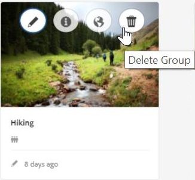
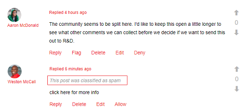
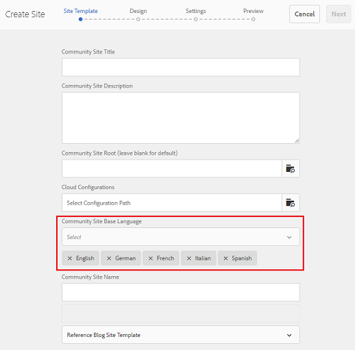

# What&#39;s New in AEM 6.4 Communities {#what-s-new-in-aem-communities}

AEM Communities优惠了一个框架，供企业在合作伙伴、客户和员工之间开展协作。 它将社交功能引入网站结构，并帮助企业吸引其利益相关方并向其传授知识，以按自己的方式提升其品牌价值。

AEM 6.4 Communities引入了增强社区用户体验的功能，并简化了社区管理员、版主和管理者的日常任务。

进一步阅读，快速了解新增功能和增强功能。 另请参阅AEM 6.4 Communities发 [行说明](../release-notes/communities-release-notes.md)。 有关AEM 6.4社区文档，请 [访问AEM 6.4社区用户指南](home.md)。

## 管理子社区或社区组 {#managing-sub-communities-or-community-groups}

AEM Communities使社区管理员能够在创作环境中使用预定义的模板在社区站点内创建组和子组。 这些组用作子社区，可继承许多配置，如父站点的主题和样式。 但是，这些组可能与父站点不同，例如具有不同的组管理者集，或者在安全级别上可能有所不同。 这些群体作为独立、成熟的小型社区发挥作用，通过以下加强进一步增强其能力。

### 单步创建多区域设置组 {#create-multi-locale-groups-in-single-step}

作为社区站点的一部分，可以通过单个操作创建多语言组。 **[!UICONTROL “社区组模板”页中的]** “其他可 **[!UICONTROL 用的社区组语言”字段]** (在社区站点内创建新 [的社区组时可](groups.md) 用)使此选项可行。

要创建此类组，用户只需从“站点”控制台导航到所需社区站点的组集合。 在“社区组模板”页的“其他可 **[!UICONTROL 用社区组语言”字段中创建组]** ，并 **[!UICONTROL 指定所需的语言]** 。

### 从组控制台中删除社区组 {#delete-community-groups-from-groups-console}

AEM 6.4社区在社区站点控制台的社区组集合中，为现有社区组提供“删除组”图标。 这可 [以一键](groups.md#deleting-the-group) 删除组，同时删除与组关联的所有项目（如内容和用户成员关系）。

### 在组中创建和分配支持资源 {#create-and-assign-enablement-resources-within-groups}

现在可以为特定的目标社区成员创建、管理和发布学习内容。 由于社区组（不仅包括整个社区站点）具有目录和分配功能，因此，Enablement Manager [还可以将Enablement Resources](resource.md) and learning path分配给一小组人员。

## 审核用户生成的内容 {#moderating-user-generated-content}

AEM 6.4社区优惠对协调的改进很少，这有助于简化社区管理者的日常生活。

### 自动检测垃圾邮件  {#automatic-spam-detection}

新的垃圾邮件检测引擎有助于过滤掉社区站点或组中不需要的和未经请求的用户生成的内容。 启用此功能后，该功能可以根据预定义的垃圾文字集将用户生成的内容标记为垃圾信息或非垃圾信息。 版主可以进一步对内容采取行动以拒绝或允许内容显示在发布实例中。 这些审核操作可以内联或通过批量审核控制台执行。

[垃圾邮件检测](moderate-ugc.md#spam-detection) 器可以90%准确地查找和标记给定的用户生成的内容。 但是，默认情况下不启用此功能。 要启用此功能，社区管理员需要导航到系统／控制台上的configMgr并添加垃圾邮件进程。

### QnA的新（已回答／未回答）过滤器 {#new-answered-unanswered-filters-for-qna}

AEM 6.4为批量协调控 [制台添加了](moderation.md#filter-rail)“问题解答”和“未回答”两个新过滤器。 这些过滤器位于筛选器边栏的状态下。

在选择“已回答”状态时，内容区域中的主持人可以看到所有已回答的问题。 但是，如果仅选择“未回答”状态，则主持人将看到除已回答问题外的所有内容（适用于所有内容类型），因为对于未回答问题以及论坛主题、博客文章或评论等其他内容，不存在对已回答问题负责的属性。

### 将审核过滤器加入书签 {#bookmark-moderation-filters}

AEM Communities提供了在 [仲裁控制台上为预定义的仲裁过滤器](moderation.md#filter-rail) 创建书签的功能。 这些保存的书签稍后可重新访问并与其他用户共享。

用户只需从审核控制台的筛选边栏中选择所需的过滤器，即可视图已过滤的UGC并在其浏览器上为过滤器加书签。 这些过滤器会附加到URL字符串的末尾，因此可以共享、重用并在以后重新访问。

## 管理社区站点 {#managing-community-sites}

AEM 6.4 Communities提供了站点管理增强功能，可确保站点管理员轻松创建、管理和删除使用不同语言的多个社区站点。

### 一步创建多区域设置社区站点 {#create-multi-locale-community-sites-in-one-step}

AEM Communities允许 [通过单次操作创建多语](create-site.md) 言社区站点。 这是由于在站点控制台中创建新的社区站点时，可 **[!UICONTROL 以在“站点模板]** ”页面的 **[!UICONTROL 社区站点基础语言字]** 段中选择多种语言，因此可能会出现这种情况。

用户可以同时为所有这些站点选择配置文件夹、品牌和许多其他配置。

### 从站点控制台中删除社区站点 {#delete-community-sites-from-sites-console}

AEM 6.4 Communities在“社区站点”控制台中的现有社区站点上提供“删除站点”图标。 这样，只需 [单击一下](create-site.md) ，即可删除站点和相关项目。

## 管理UGC和用户用户档案 {#managing-ugc-and-user-profiles}

AEM Communities将用户数据保护置于社区体验的核心， [它提供开箱即用的API](user-ugc-management-service.md)[和示例servlet](https://github.com/Adobe-Marketing-Cloud/aem-communities-ugc-migration/tree/main/bundles/communities-ugc-management-servlet)。 这些API有助于批量管理（批量删除和批量导出）用户生成的内容和删除用户用户档案，并有助于处理欧盟GDPR合规请求。

## 更改内容 {#what-s-changed}

* 在创建新的社区站点时，AEM 6.4 Communities中不再现成验证功能。 但是，可以自定义Communities站点以包含Google [组件reCAPTCHA](https://helpx.adobe.com/experience-manager/using/aem_recaptcha.html) ，以提高安全性。
* 从社区站点和组主题中删除了上传自定义CSS的选项。
* 已在批量协调UI的筛选器边栏中添加“仅内容”和“搜索”图标。
* 内容路径筛选器已添加到批量协调UI的筛选器边栏中。
* 已从批量协调UI中删除切换到批量模式和退出批量模式。 要进入多选模式，请单击帖 “选择”（选择）图标，当用鼠标（桌面）将指针悬停在帖子上时，该图标会显示在帖子上（移动），或者按住手指。
