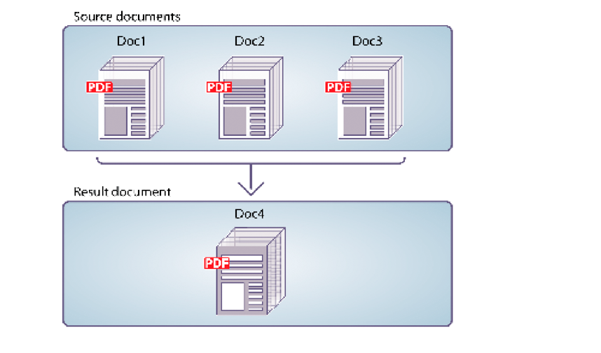

# 以编程方式组合PDF文档 {#programmatically-assembling-pdf-documents}

>[!CAUTION]
>
>AEM 6.4已结束扩展支持，本文档将不再更新。 有关更多详细信息，请参阅 [技术支助期](https://helpx.adobe.com/cn/support/programs/eol-matrix.html). 查找支持的版本 [此处](https://experienceleague.adobe.com/docs/).

您可以使用汇编程序服务API将多个PDF文档组合到单个PDF文档中。 下图显示了三个PDF文档被合并到单个PDF文档中。



要将两个或多个PDF文档组合到单个PDF文档中，您需要DDX文档。 DDX文档描述汇编程序服务生成的PDF文档。 即，DDX文档指示汇编程序服务执行哪些操作。

在本讨论中，假定使用了以下DDX文档。

```as3
 <?xml version="1.0" encoding="UTF-8"?> 
 <DDX xmlns="https://ns.adobe.com/DDX/1.0/"> 
     <PDF result="out.pdf"> 
         <PDF source="map.pdf" /> 
         <PDF source="directions.pdf" /> 
     </PDF> 
 </DDX>
```

此DDX文档可合并两个名为 *map.pdf* 和 *directions.pdf* 到单个PDF文档中。

>[!NOTE]
>
>要查看分解PDF文档的DDX文档，请参阅 [以编程方式拆分PDF文档](/help/forms/developing/programmatically-disassembling-pdf-documents.md#programmatically-disassembling-pdf-documents).

>[!NOTE]
>
>有关汇编程序服务的详细信息，请参阅 [AEM Forms服务参考](https://www.adobe.com/go/learn_aemforms_services_63).

>[!NOTE]
>
>有关DDX文档的更多信息，请参阅 [汇编程序服务和DDX参考](https://www.adobe.com/go/learn_aemforms_ddx_63).

## 使用Web服务调用汇编程序服务时的注意事项 {#considerations-when-invoking-assembler-service-using-web-services}

在组装大型文档期间添加页眉和页脚时，可能会遇到 `OutOfMemory` 错误，且文件将不会进行组装。 要减少出现此问题的可能性，请添加 `DDXProcessorSetting` 元素，如以下示例中所示。

`<DDXProcessorSetting name="checkpoint" value="2000" />`

您可以将此元素添加为 `DDX` 元素或作为 `PDF result` 元素。 此设置的默认值为0（零），这会关闭检查点，DDX的行为与 `DDXProcessorSetting` 元素不存在。 如果您遇到 `OutOfMemory` 错误，您可能需要将值设置为整数，通常介于500到5000之间。 小的检查点值会导致检查点更频繁。

## 步骤摘要 {#summary-of-steps}

要从多个PDF文档组合单个PDF文档，请执行以下任务：

1. 包括项目文件。
1. 创建PDF汇编程序客户端。
1. 引用现有DDX文档。
1. 引用输入PDF文档。
1. 设置运行时选项。
1. 组合输入PDF文档。
1. 提取结果。

**包含项目文件**

在开发项目中包含必需的文件。 如果您使用Java创建客户端应用程序，请包含必需的JAR文件。 如果您使用的是Web服务，请确保包含代理文件。

必须将以下JAR文件添加到项目的类路径中：

* adobe-livecycle-client.jar
* adobe-usermanager-client.jar
* adobe-assembler-client.jar
* adobe-utilities.jar(在JBoss上部署AEM Forms时必需)
* jbossall-client.jar(如果在JBoss上部署了AEM Forms，则此变量为必需变量)

如果AEM Forms部署在JBoss以外的受支持J2EE应用程序服务器上，则必须将adobe-utilities.jar和jbossall-client.jar文件替换为特定于部署了AEM Forms的J2EE应用程序服务器的JAR文件。

**创建PDF汇编程序客户端**

在以编程方式执行汇编程序操作之前，必须创建汇编程序客户端。

**引用现有DDX文档**

必须引用DDX文档来组合PDF文档。 例如，以本节中引入的DDX文档为例。 此DDX文档指示汇编程序服务将两个PDF文档合并到单个PDF文档中。

**引用输入PDF文档**

引用要传递给汇编程序服务的输入PDF文档。 例如，如果要传递名为“映射”和“方向”的两个输入PDF文档，则必须传递相应的PDF文件。

map.pdf文件和directions.pdf文件都必须放置在收藏对象中。 键的名称必须与DDX文档中PDF源属性的值匹配。 如果DDX文档中的键和源属性匹配，则PDF文件的名称无关紧要。

>[!NOTE]
>
>安 `*AssemblerResult*` 如果调用 `*invokeDDX*` 操作。 将两个或多个输入PDF文档传递到汇编程序服务时，将使用此操作。 但是，如果只将一个输入PDF传递到汇编程序服务，而只希望返回一个文档，则调用 `*invokeOneDocument*` 操作。 调用此操作时，将返回一个文档。 有关使用此操作的信息，请参阅 [汇编加密PDF文档](/help/forms/developing/assembling-encrypted-pdf-documents.md#assembling-encrypted-pdf-documents).

**设置运行时选项**

您可以设置运行时选项，以在汇编程序服务执行作业时控制其行为。 例如，您可以设置一个选项，指示汇编程序服务在遇到错误时继续处理作业。 有关可设置的运行时选项的信息，请参阅 `AssemblerOptionSpec` 类引用 [AEM Forms API参考](https://www.adobe.com/go/learn_aemforms_javadocs_63_en).

**组合输入PDF文档**

在创建服务客户端、引用DDX文件、创建用于存储输入PDF文档的集合对象并设置运行时选项后，可以调用DDX操作。 使用本节中指定的DDX文档时，map.pdf和direction.pdf文件将合并到一个PDF文档中。

**提取结果**

汇编程序服务返回 `java.util.Map` 对象，可从 `AssemblerResult` 对象，以及包含操作结果的。 返回的 `java.util.Map` 对象包含生成文档和任何例外。

下表汇总了返回的中可以找到的一些键值和对象类型 `java.util.Map` 对象。

<table> 
 <thead> 
  <tr> 
   <th><p>键值</p></th> 
   <th><p>对象类型</p></th> 
   <th><p>描述</p></th> 
  </tr> 
 </thead> 
 <tbody>
  <tr> 
   <td><p><code><i>documentName</i></code></p></td> 
   <td><p><code>com.adobe.idp.Document</code></p></td> 
   <td><p>包含在DDX生成元素中指定的生成文档</p></td> 
  </tr> 
  <tr> 
   <td><p><code><i>documentName</i></code></p></td> 
   <td><p><code>Exception</code></p></td> 
   <td><p>包含文档的任何例外</p></td> 
  </tr> 
  <tr> 
   <td><p><code>OutputMapConstants.LOG_NAME</code></p></td> 
   <td><p><code>com.adobe.idp.Documen</code></p></td> 
   <td><p>包含作业日志</p></td> 
  </tr> 
 </tbody> 
</table>

**另请参阅**

[包括AEM Forms Java库文件](/help/forms/developing/invoking-aem-forms-using-java.md#including-aem-forms-java-library-files)

[设置连接属性](/help/forms/developing/invoking-aem-forms-using-java.md#setting-connection-properties)

[以编程方式拆分PDF文档](/help/forms/developing/programmatically-disassembling-pdf-documents.md#programmatically-disassembling-pdf-documents)

## 使用Java API组合PDF文档 {#assemble-pdf-documents-using-the-java-api}

使用汇编程序服务API(Java)汇编PDF文档：

1. 包括项目文件。

   在Java项目的类路径中包含客户端JAR文件，如adobe-assembler-client.jar。

1. 创建PDF汇编程序客户端。

   * 创建 `ServiceClientFactory` 包含连接属性的对象。
   * 创建 `AssemblerServiceClient` 对象，并使用其构造函数进行传递 `ServiceClientFactory` 对象。

1. 引用现有DDX文档。

   * 创建 `java.io.FileInputStream` 使用其构造函数并传递指定DDX文件位置的字符串值来表示DDX文档的对象。
   * 创建 `com.adobe.idp.Document` 对象，并使用其构造函数进行传递 `java.io.FileInputStream` 对象。

1. 引用输入PDF文档。

   * 创建 `java.util.Map` 用于通过使用 `HashMap` 构造函数。
   * 对于每个输入PDF文档，请创建 `java.io.FileInputStream` 对象，并传递输入PDF文档的位置。
   * 对于每个输入PDF文档，请创建 `com.adobe.idp.Document` 对象并传递 `java.io.FileInputStream` 包含PDF文档的对象。
   * 对于每个输入文档，在 `java.util.Map` 通过调用对象 `put` 方法和传递以下参数：

      * 表示键名称的字符串值。 此值必须匹配DDX文档中指定的PDF源元素的值。
      * A `com.adobe.idp.Document` 对象(或 `java.util.List` 指定多个文档的对象)。

1. 设置运行时选项。

   * 创建 `AssemblerOptionSpec` 使用其构造函数存储运行时选项的对象。
   * 通过调用属于 `AssemblerOptionSpec` 对象。 例如，要指示汇编程序服务在发生错误时继续处理作业，请调用 `AssemblerOptionSpec` 对象 `setFailOnError` 方法和传递 `false`.

1. 组合输入PDF文档。

   调用 `AssemblerServiceClient` 对象 `invokeDDX` 方法，并传递以下必需值：

   * A `com.adobe.idp.Document` 表示要使用的DDX文档的对象
   * A `java.util.Map` 包含要装配的输入PDF文件的对象
   * A `com.adobe.livecycle.assembler.client.AssemblerOptionSpec` 指定运行时选项（包括默认字体和作业日志级别）的对象

   的 `invokeDDX` 方法返回 `com.adobe.livecycle.assembler.client.AssemblerResult` 包含作业结果和发生的任何例外的对象。

1. 提取结果。

   要获取新创建的PDF文档，请执行以下操作：

   * 调用 `AssemblerResult` 对象 `getDocuments` 方法。 这会返回 `java.util.Map` 对象。
   * 循环访问 `java.util.Map` 对象，直到找到结果 `com.adobe.idp.Document` 对象。 (可以使用DDX文档中指定的PDF结果元素来获取文档。)
   * 调用 `com.adobe.idp.Document` 对象 `copyToFile` 方法提取PDF文档。

   >[!NOTE]
   >
   >如果 `*LOG_LEVEL*` 设置为生成日志，您可以使用 `*AssemblerResult*` 对象 `*getJobLog*` 方法。

**另请参阅**

[快速入门（SOAP模式）：使用Java API组装PDF文档](/help/forms/developing/assembler-service-java-api-quick.md#quick-start-soap-mode-assembling-a-pdf-document-using-the-java-api)

[包括AEM Forms Java库文件](/help/forms/developing/invoking-aem-forms-using-java.md#including-aem-forms-java-library-files)

[设置连接属性](/help/forms/developing/invoking-aem-forms-using-java.md#setting-connection-properties)

## 使用Web服务API组合PDF文档 {#assemble-pdf-documents-using-the-web-service-api}

使用汇编程序服务API（Web服务）汇编PDF文档：

1. 包括项目文件。

   创建使用MTOM的Microsoft .NET项目。 确保使用以下WSDL定义： `http://localhost:8080/soap/services/AssemblerService?WSDL&lc_version=9.0.1`.

   >[!NOTE]
   >
   >替换 `localhost` 具有托管AEM Forms的服务器的IP地址。

1. 创建PDF汇编程序客户端。

   * 创建 `AssemblerServiceClient` 对象。
   * 创建 `AssemblerServiceClient.Endpoint.Address` 对象 `System.ServiceModel.EndpointAddress` 构造函数。 将指定WSDL的字符串值传递到AEM Forms服务(例如， `http://localhost:8080/soap/services/AssemblerService?blob=mtom`)。 您无需使用 `lc_version` 属性。 在创建服务引用时，会使用此属性。
   * 创建 `System.ServiceModel.BasicHttpBinding` 对象，方法是获取 `AssemblerServiceClient.Endpoint.Binding` 字段。 将返回值转换为 `BasicHttpBinding`.
   * 设置 `System.ServiceModel.BasicHttpBinding` 对象 `MessageEncoding` 字段 `WSMessageEncoding.Mtom`. 此值可确保使用MTOM。
   * 通过执行以下任务，启用基本HTTP身份验证：

      * 将AEM表单用户名分配给字段 `AssemblerServiceClient.ClientCredentials.UserName.UserName`.
      * 为字段分配相应的密码值 `AssemblerServiceClient.ClientCredentials.UserName.Password`.
      * 指定常量值 `HttpClientCredentialType.Basic` 到字段 `BasicHttpBindingSecurity.Transport.ClientCredentialType`.
      * 指定常量值 `BasicHttpSecurityMode.TransportCredentialOnly` 到字段 `BasicHttpBindingSecurity.Security.Mode`.

1. 引用现有DDX文档。

   * 创建 `BLOB` 对象。 的 `BLOB` 对象用于存储DDX文档。
   * 创建 `System.IO.FileStream` 对象，方法是调用其构造函数并传递一个字符串值，该字符串值表示DDX文档的文件位置以及打开文件的模式。
   * 创建用于存储 `System.IO.FileStream` 对象。 您可以通过获取 `System.IO.FileStream` 对象 `Length` 属性。
   * 通过调用 `System.IO.FileStream` 对象 `Read` 方法及传递要读取的字节数组、起始位置及流长度。
   * 填充 `BLOB` 通过指定对象 `MTOM` 属性。

1. 引用输入PDF文档。

   * 对于每个输入PDF文档，请创建 `BLOB` 对象。 的 `BLOB` 对象用于存储输入PDF文档。
   * 创建 `System.IO.FileStream` 对象，方法是调用其构造函数并传递一个字符串值，该字符串值表示输入PDF文档的文件位置和打开文件的模式。
   * 创建用于存储 `System.IO.FileStream` 对象。 您可以通过获取 `System.IO.FileStream` 对象 `Length` 属性。
   * 通过调用 `System.IO.FileStream` 对象 `Read` 方法。 传递字节数组、开始位置和流长度以读取。
   * 填充 `BLOB` 通过指定对象 `MTOM` 字段中，显示字节数组的内容。
   * 创建 `MyMapOf_xsd_string_To_xsd_anyType` 对象。 此集合对象用于存储输入PDF文档。
   * 对于每个输入PDF文档，请创建 `MyMapOf_xsd_string_To_xsd_anyType_Item` 对象。 例如，如果使用两个输入PDF文档，请创建两个 `MyMapOf_xsd_string_To_xsd_anyType_Item` 对象。
   * 为分配表示键名称的字符串值 `MyMapOf_xsd_string_To_xsd_anyType_Item` 对象 `key` 字段。 此值必须匹配DDX文档中指定的PDF源元素的值。 (对每个输入PDF文档执行此任务。)
   * 分配 `BLOB` 将PDF文档存储到 `MyMapOf_xsd_string_To_xsd_anyType_Item` 对象 `value` 字段。 (对每个输入PDF文档执行此任务。)
   * 添加 `MyMapOf_xsd_string_To_xsd_anyType_Item` 对象 `MyMapOf_xsd_string_To_xsd_anyType` 对象。 调用 `MyMapOf_xsd_string_To_xsd_anyType` 对象 `Add` 方法和通过 `MyMapOf_xsd_string_To_xsd_anyType` 对象。 (对每个输入PDF文档执行此任务。)

1. 设置运行时选项。

   * 创建 `AssemblerOptionSpec` 使用其构造函数存储运行时选项的对象。
   * 通过为属于 `AssemblerOptionSpec` 对象。 例如，要指示汇编程序服务在发生错误时继续处理作业，请指定 `false` 到 `AssemblerOptionSpec` 对象 `failOnError` 数据成员。

1. 组合输入PDF文档。

   调用 `AssemblerServiceClient` 对象 `invoke` 方法并传递以下值：

   * A `BLOB` 表示DDX文档的对象。
   * 的 `mapItem` 包含输入PDF文档的数组。 其键必须匹配PDF源文件的名称，并且其值必须为 `BLOB` 与这些文件对应的对象。
   * 安 `AssemblerOptionSpec` 指定运行时选项的对象。

   的 `invoke` 方法返回 `AssemblerResult` 包含作业结果和可能发生的任何例外的对象。

1. 提取结果。

   要获取新创建的PDF文档，请执行以下操作：

   * 访问 `AssemblerResult` 对象 `documents` 字段， `Map` 包含结果PDF文档的对象。
   * 循环访问 `Map` 对象，直到您找到与生成文档的名称匹配的键。 然后，将该阵列成员的 `value` 至 `BLOB`.
   * 通过访问表示PDF文档的二进制数据 `BLOB` 对象 `MTOM` 属性。 这会返回一个字节数组，您可以将其写出到PDF文件。

   >[!NOTE]
   >
   >如果 `LOG_LEVEL` 设置为生成日志，则可以通过获取 `AssemblerResult` 对象 `jobLog` 数据成员。

**另请参阅**

[使用MTOM调用AEM Forms](/help/forms/developing/invoking-aem-forms-using-web.md#invoking-aem-forms-using-mtom)
