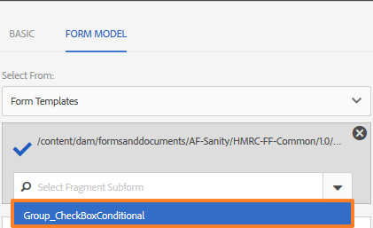
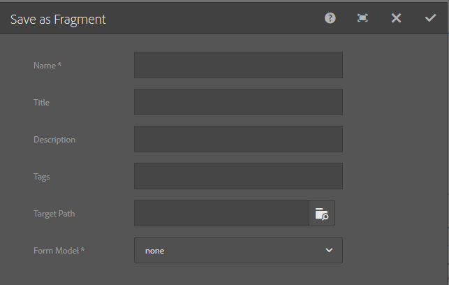

# 自适应表单片段{#adaptive-form-fragments}

虽然每个表单都是为特定目的而设计的，但大多数表单中都有一些常见的细分，例如提供个人详细信息，如姓名和地址、家庭详细信息、收入详细信息等。 每次创建新表单时，表单开发人员都需要创建这些常用细分。

自适应表单提供了一种便捷的机制，只需创建一个面板或一组字段即可创建表单段，并在自适应表单之间重复使用它们。 这些可重复使用和独立的细分称为自适应表单片段。

## 创建片段{#create-a-fragment}

您可以从头开始创建自适应表单片段，或将现有自适应表单中的面板另存为片段。

### 从头开始创建{#create-fragment-from-scratch}片段

1. 登录AEM Forms作者实例，网址为https://[*hostname*]:[*port*]/aem/forms.html。
1. 单击&#x200B;**[!UICONTROL 创建>自适应表单片段]**。
1. 指定片段的标题、名称、说明和标记。

   >[!NOTE]
   >
   >确保为片段指定唯一的名称。 如果已存在同名的另一个片段，则无法创建该片段。

1. 单击以打开&#x200B;**[!UICONTROL 表单模型]**&#x200B;选项卡，然后从&#x200B;**[!UICONTROL 选择自]**&#x200B;下拉菜单中，为片段选择以下模型之一：

   * **[!UICONTROL 无]**:指定从头开始创建片段，而不使用任何表单模型。
   * **[!UICONTROL 表单模板]**:指定使用上传到AEM Forms的XDP模板创建片段。选择适当的XDP模板作为片段的表单模型。

   

   还会显示选定表单模板中标记为片段的子表单。 您可以从下拉列表中为自适应表单片段选择子表单。

   

   此外，您还可以通过在下拉框中为子表单指定SOM表达式，使用未在表单模板中标记为片段的子表单创建自适应表单片段。

   * **[!UICONTROL XML模式]**:指定使用上传到AEM Forms的XML模式创建片段。您可以上传或从可用的XML模式中进行选择，作为片段的表单模型。

   

   您还可以通过从下拉框中选择所选模式中存在的complexType来创建自适应表单片段。

   

1. 单击&#x200B;**[!UICONTROL 创建]**，然后单击&#x200B;**[!UICONTROL 打开]**&#x200B;以在编辑模式下使用默认模板打开片段。

在编辑模式下，您可以将任何自适应表单组件从AEM Sidekick拖放到片段上。 有关自适应表单组件的信息，请参阅[创作自适应表单的简介](/help/forms/using/introduction-forms-authoring.md)。

此外，如果您选择XML模式或XDP表单模板作为片段的表单模型，则内容查找器中将显示一个显示表单模型层次结构的新选项卡。 它允许您将表单模型元素拖放到片段上。 添加的表单模型元素将转换为表单组件，同时保留关联XDP或XSD的原始属性。

### 将面板另存为片段{#save-panel-as-a-fragment}

1. 打开一个自适应表单，其中包含要另存为自适应表单片段的面板。
1. 在面板工具栏中，单击&#x200B;**[!UICONTROL 另存为片段]**。 将打开另存为片段对话框。

   >[!NOTE]
   >
   >如果您另存为片段的面板包含子面板，则生成的片段将包含这些子面板。

1. 在片段创建对话框中，指定以下信息：

   * **[!UICONTROL 名称]**:片段的名称。默认值是面板的元素名称。 这是必填字段。

      >[!NOTE]
      >
      >确保为片段指定唯一的名称。 如果已存在同名的另一个片段，则无法创建该片段。

   * **[!UICONTROL 标题]**:片段的标题。默认值是面板的标题。
   * **[!UICONTROL 描述]**:片段的描述。
   * **[!UICONTROL 标记]**:标记片段的元数据。
   * **[!UICONTROL 目标路径]**:保存片段的存储库路径。如果未指定路径，则会在包含自适应表单的节点旁边创建与片段名称相同的节点。 片段将保存在此节点中。
   * **[!UICONTROL 表单模型]**:根据自适应表单的表单模型，此字段显示XML **[!UICONTROL 模式]**、 **[!UICONTROL 表单模板]**&#x200B;或 **[!UICONTROL 无]**。它是不可编辑的字段。
   * **[!UICONTROL 片段模型根]**:仅在基于XSD的自适应表单中显示。它指定片段模型的根。 您可以从下拉列表中选择&#x200B;**/**&#x200B;或XSD复杂类型。 请注意，只有在选择复杂类型作为片段模型根时，才能在另一个自适应表单中重复使用片段。

      如果选择&#x200B;**/**&#x200B;作为片段模型根，则根中的完整XSD树在自适应表单数据模型选项卡中可见。 对于复杂类型片段模型根，在自适应表单数据模型选项卡中只显示所选复杂类型的后代。

   * **[!UICONTROL XSD参考]**:仅在基于XSD的自适应表单中显示。它显示XML模式的位置。
   * **[!UICONTROL XDP参考]**:仅在基于XDP的自适应表单中显示。它显示XDP表单模板的位置。

   
   **图：“另存为** *片段”对话框*

1. 单击&#x200B;**[!UICONTROL 确定]**。

   面板将保存在存储库中的指定或默认位置。 在自适应表单中，面板由片段的快照替换。 如下所示，“常规信息”面板及其子面板“个人信息和地址”将保存为片段。

   要编辑片段，请单击面板工具栏中的&#x200B;**[!UICONTROL 编辑资产]**。 片段在编辑模式下的新选项卡或窗口中打开。

   

## 使用片段{#working-with-fragments}

### 配置片段外观{#configure-fragment-appearance}

您插入自适应表单的任何片段都显示为占位符图像。 占位符在片段中最多显示十个子面板的标题。 您可以配置AEM Forms以显示完整片段而非占位符图像。

请执行以下步骤以在表单中显示完整片段：

1. 转到AEM Web控制台配置页，网址为https:[*host*]:[*port*]/system/console/configMgr。
1. 搜索并单击&#x200B;**[!UICONTROL 自适应表单和交互式通信Web渠道配置]**&#x200B;以在编辑模式下打开它。
1. 禁用&#x200B;**[!UICONTROL 启用占位符以代替片段]**&#x200B;复选框以显示完整片段，而非占位符图像。

### 在自适应表单{#insert-a-fragment-in-an-adaptive-form}中插入片段

您创建的自适应表单片段将显示在AEM内容查找器的自适应表单片段选项卡中。 要在自适应表单中插入自适应表单片段，请执行以下操作：

1. 在编辑模式下打开要插入自适应表单片段的自适应表单。
1. 单击侧栏中的&#x200B;**[!UICONTROL 资产]** 。 在资产浏览器中，从下拉菜单中选择&#x200B;**[!UICONTROL 自适应表单片段]**。

   您还可以选择根据表单模型(表单模板、XML模式或基本)显示所有自适应表单片段或过滤器。

1. 将自适应表单片段拖放到自适应表单上。

   >[!NOTE]
   >
   >未从自适应表单中启用自适应表单片段进行创作。 此外，您不能在基于JSON的自适应表单中使用基于XSD的片段，而使用方式相反。

自适应表单片段通过引用插入自适应表单中，并与独立的自适应表单片段同步。 这意味着，当您更新自适应表单片段时，更改将反映在使用该片段的所有自适应表单中。

### 在自适应表单{#embed-a-fragment-in-adaptive-form}中嵌入片段

您可以通过单击&#x200B;**[!UICONTROL 嵌入资产：*fragmentName *]**按钮，位于添加的片段的面板工具栏上，如以下示例图像所示。

>[!NOTE]
>
>嵌入的片段不再与独立的片段链接。 您可以从自适应表单中编辑嵌入片段中的组件。

### 在片段{#using-fragments-within-fragments}中使用片段

您可以创建嵌套的自适应表单片段，这意味着您可以将一个片段拖放到另一个片段中，并且可以具有嵌套的片段结构。

### 更改片段{#change-fragments}

您可以使用自适应表单片段面板的编辑组件对话框中的&#x200B;**[!UICONTROL 选择片段资产]**&#x200B;属性，将自适应表单片段替换或更改为另一个片段。

## 数据绑定{#auto-mapping-of-fragments-for-data-binding}的片段自动映射

当您使用XFA表单模板或XSD复杂类型创建自适应表单片段并将片段拖放到自适应表单时，XFA片段或XSD复杂类型将自动替换为相应的自适应表单片段，其片段模型根映射到XFA片段或XSD复杂类型。

您可以从编辑组件对话框中更改片段资产及其绑定。

>[!NOTE]
>
>您还可以在AEM内容查找器中从自适应表单片段库拖放绑定的自适应表单片段，并从自适应表单片段面板的编辑组件对话框中提供正确的绑定引用。

## 管理片段{#manage-fragments}

您可以使用AEM Forms UI对自适应表单片段执行多个操作。

1. 转到 `https://[hostname]:[port]/aem/forms.html`.

1. 单击AEM Forms UI工具栏中的&#x200B;**[!UICONTROL 选择]**，然后选择自适应表单片段。 工具栏会显示您可以对所选自适应表单片段执行的下列操作。

<table> 
 <tbody> 
  <tr> 
   <td>
<strong>操作</strong>
 </td> 
   <td>
<strong>描述</strong>
 </td> 
  </tr> 
  <tr> 
   <td>
打开
 </td> 
   <td>
在编辑模式下打开所选的自适应表单片段。    
 </td> 
  </tr> 
  <tr> 
   <td>
查看属性
 </td> 
   <td>
打开“属性”面板。 从“属性”面板中，您可以视图和编辑属性、生成预览，以及为所选片段上传缩略图。 有关详细信息，请参阅<a href="/help/forms/using/manage-form-metadata.md" target="_blank">管理元数据</a>。    
 </td> 
  </tr> 
  <tr> 
   <td>
复制
 </td> 
   <td>
复制所选片段。 工具栏中将显示“粘贴”按钮。    
 </td> 
  </tr> 
  <tr> 
   <td>
下载
 </td> 
   <td>
下载所选片段。    
 </td> 
  </tr> 
  <tr> 
   <td>
预览
 </td> 
   <td>
提供选项，通过将来自XML文件的数据与片段合并，将片段预览为HTML或自定义预览。 有关详细信息，请参阅<a href="/help/forms/using/previewing-forms.md" target="_blank">预览表单</a>。    
 </td> 
  </tr> 
  <tr> 
   <td>
开始审阅/管理审阅
 </td> 
   <td>
允许启动和管理选定片段的审阅。 有关详细信息，请参阅<a href="/help/forms/using/create-reviews-forms.md" target="_blank">创建和管理审阅</a>。    
 </td> 
  </tr> 
  <tr> 
   <td>
创建词典
 </td> 
   <td>
生成用于本地化所选片段的词典。 有关详细信息，请参阅<a href="/help/forms/using/lazy-loading-adaptive-forms.md" target="_blank">本地化自适应表单</a>。    
 </td> 
  </tr> 
  <tr> 
   <td>
发布/取消发布
 </td> 
   <td>
发布/取消发布所选片段。    
 </td> 
  </tr> 
  <tr> 
   <td>
删除
 </td> 
   <td>
删除所选片段。    
 </td> 
  </tr> 
 </tbody> 
</table>

## 对包含片段{#localizing-adaptive-form-containing-fragments}的自适应表单进行本地化

要本地化包含自适应表单片段的自适应表单，您需要将片段和表单分别本地化。 其想法是将片段本地化一次，然后以多种自适应形式重复使用。

>[!NOTE]
>
>片段中的本地化键不会显示在自适应表单的XLIFF文件中。

## 处理片段{#key-points-to-remember-when-working-with-fragments}时要记住的要点

* 确保片段名称是唯一的。 如果存在具有相同名称的现有片段，则无法创建该片段。
* 在基于XDP的自适应表单中，如果将面板另存为包含另一个XDP片段的片段，则生成的片段将自动绑定到子XDP片段。 如果是基于XSD的自适应表单，则生成的片段将绑定到模式根。
* 在创建自适应表单片段时，将创建一个片段节点，该节点类似于CRXDe Lite中自适应表单的guideContainer节点。
* 不支持使用不同表单数据模型的自适应表单中的片段。 例如，基于XSD的自适应表单中不支持基于XDP的片段，反之亦然。
* 自适应表单片段可通过AEM内容查找器中的自适应表单片段选项卡使用。
* 当通过引用插入或嵌入自适应表单时，独立自适应表单片段中的任何表达式、脚本或样式都将保留。
* 您无法从自适应表单中编辑通过引用插入的自适应表单片段。 要进行编辑，您可以编辑独立的自适应表单片段，或将片段嵌入自适应表单。
* 在发布自适应表单时，您需要发布通过引用在自适应表单中插入的独立自适应表单片段。
* 当您重新发布更新的自适应表单片段时，更改会反映在使用片段的自适应表单的已发布实例中。
* 包含验证组件的自适应表单不支持匿名用户。 此外，不建议在自适应表单片段中使用验证组件。
* （**仅限Mac**）要确保表单片段功能在所有情况下均能完美运行，请在/private/etc/hosts文件中添加以下条目：

   `127.0.0.1 <Host machine>`

   **主机**:部署了AEM Forms的Apple Mac计算机。

## 引用片段{#reference-fragments}

可以使用引用可用于创建表单的自适应表单片段。 有关详细信息，请参阅[引用片段](/help/forms/using/reference-adaptive-form-fragments.md)。
