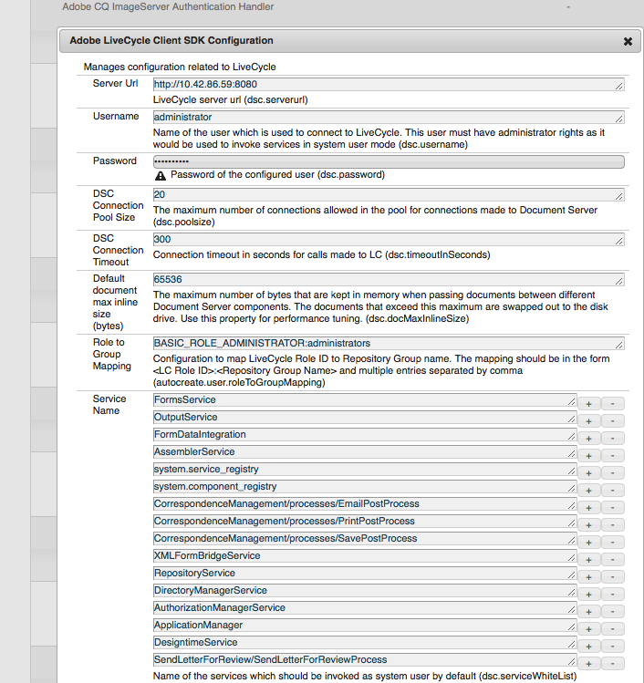

# 在“创建对应UI”中添加自定义操作／按钮 {#add-custom-action-button-in-create-correspondence-ui}

## 概述 {#overview}

Corrensementing Management解决方案允许您向Create Correndections用户界面添加自定义操作。

本文档中的情景说明了如何在“创建对应用户界面”中创建按钮，将信件共享为附加到电子邮件的审阅PDF。

### 前提条件 {#prerequisites}

要完成此方案，您需要：

* CRX和JavaScript知识
* LiveCycle服务器

## 方案： 在“创建对应用户界面”中创建按钮，以发送信件以供审阅 {#scenario-create-the-button-in-the-create-correspondence-user-interface-to-send-a-letter-for-review}

在“创建对应用户界面”中添加包含操作的按钮（此处发送信函以供审阅）包括：

1. 将按钮添加到“创建对应的用户界面”
1. 向按钮添加操作处理
1. 添加LiveCycle流程以启用操作“处理”

### 将按钮添加到“创建对应”用户界面 {#add-the-button-to-the-create-correspondence-user-interface}

1. 转到并 `https://[server]:[port]/[ContextPath]/crx/de` 以管理员身份登录。
1. 在apps文件夹中，创建一个名为的 `defaultApp` 文件夹，其路径／结构与defaultApp文件夹（位于config文件夹中）类似。 使用以下步骤创建文件夹：

   * 右键单击以下 **[!UICONTROL 路径的]** defaultApp文件夹，然后选择 **[!UICONTROL “叠加节点”]**:

      /libs/fd/cm/config/defaultApp/

      

   * 确保“叠加节点”对话框具有以下值：

      **[!UICONTROL 路径：]** /libs/fd/cm/config/defaultApp/

      **[!UICONTROL 叠加位置：]** /apps/

      **[!UICONTROL 匹配节点类型：]** 已检查

      

   * 单击&#x200B;**[!UICONTROL 确定]**。
   * 单击“ **[!UICONTROL 全部保存]**”。

1. 复制/apps分支下的acmExtensionsConfig.xml文件（存在于/libs分支下）。

   * 转到“/libs/fd/cm/config/defaultApp/acmExtensionsConfig.xml”

   * 右键单击acmExtensionsConfig.xml文件，然后选择“ **[!UICONTROL 复制]**”。

      

   * 右键单击“ **[!UICONTROL /apps/fd/cm/config/defaultApp/”处的defaultApp文件夹，然后选择“粘]** 贴” ****。
   * 单击“ **[!UICONTROL 全部保存]**”。

1. 多次，单击您在apps文件夹中新创建的acmExtentionsConfig.xml的副本。 此时将打开文件进行编辑。
1. 找到以下代码：

   ```xml
   <?xml version="1.0" encoding="utf-8"?>
   <extensionsConfig>
       <modelExtensions>
           <modelExtension type="LetterInstance">
     <customAction name="Preview" label="loc.letterInstance.preview.label" tooltip="loc.letterInstance.preview.tooltip" styleName="previewButton"/>
               <customAction name="Submit" label="loc.letterInstance.submit.label" tooltip="loc.letterInstance.submit.tooltip" styleName="submitButton" permissionName="forms-users"/>
               <customAction name="SaveAsDraft" label="loc.letterInstance.saveAsDraft.label" tooltip="loc.letterInstance.saveAsDraft.tooltip" styleName="submitButton" permissionName="forms-users"/>
               <customAction name="Close" label="loc.letterInstance.close.label" tooltip="loc.letterInstance.close.tooltip" styleName="closeButton"/>
           </modelExtension>
       </modelExtensions>
   </extensionsConfig> 
   ```

1. 要发送电子邮件，您可以使用LiveCycleForms Workflow。 在acmExtensionsConfig.xml中的modelExtension标签下添加customAction标签，如下所示：

   ```xml
    <customAction name="Letter Review" label="Letter Review" tooltip="Letter Review" styleName="" permissionName="forms-users" actionHandler="CM.domain.CCRCustomActionHandler">
         <serviceName>Forms Workflow -> SendLetterForReview/SendLetterForReviewProcess</serviceName>
       </customAction>
   ```

   

   modelExtension标签有一组customAction子标签，用于配置操作按钮的操作、权限和外观。 以下是customAction配置标记的列表:

   | **名称** | **描述** |
   |---|---|
   | 名称 | 要执行操作的字母数字名称。 此标签的值是必需的，必须是唯一的（在modelExtension标签中），并且必须用字母表开始。 |
   | 标签 | 要在操作按钮上显示的标签 |
   | 工具 | 按钮的工具提示文本，当用户悬停在按钮上时显示该文本。 |
   | styleName | 应用于操作按钮的自定义样式的名称。 |
   | permissionName | 仅当用户具有permissionName指定的权限时，才会显示相应的操作。 将permissionName指定为 `forms-users`时，所有用户都可以访问此选项。 |
   | actionHandler | 当用户单击按钮时调用的ActionHandler类的完全限定名称。 |

   除了上述参数之外，还可能有与customAction关联的其他配置。 处理程序可通过CustomAction对象使用这些附加配置。

   | **名称** | **描述** |
   |---|---|
   | serviceName | 如果customAction包含名为serviceName的子标记，则单击相关按钮／链接后，将调用由serviceName标记表示的名称的进程。 确保此过程具有与Letter PostProcess相同的签名。 在服务名称中添加“Forms Workflow->”前缀。 |
   | 标记名称中包含cm_前缀的参数 | 如果customAction包含以cm_开头的子标签，则在后期处理（无论是字母后期处理还是serviceName标签所表示的特殊进程）中，这些参数在删除cm_前缀的相关标签下的输入XML代码中可用。 |
   | actionName | 只要发布过程需要单击，提交的XML就会在标记下包含一个带有用户操作名称的特殊标记。 |

1. 单击“ **[!UICONTROL 全部保存]**”。

#### 在/apps分支中创建包含属性文件的区域设置文件夹 {#create-a-locale-folder-with-properties-file-in-the-apps-branch}

ACMExtensionsMessages.properties文件包含“创建对应”用户界面中各个字段的标签和工具提示消息。 要使自定义操作／按钮正常工作，请在/apps分支中复制此文件。

1. 右键单击以下路 **[!UICONTROL 径的]** locale文件夹，然后选择“ **[!UICONTROL 叠加节点”]**:

   /libs/fd/cm/config/defaultApp/locale

1. 确保“叠加节点”对话框具有以下值：

   **[!UICONTROL 路径：]** /libs/fd/cm/config/defaultApp/locale

   **[!UICONTROL 叠加位置：]** /apps/

   **[!UICONTROL 匹配节点类型：]** 已检查

1. 单击&#x200B;**[!UICONTROL 确定]**。
1. 单击“ **[!UICONTROL 全部保存]**”。
1. 右键单击以下文件，然后选择“复 **[!UICONTROL 制”]**:

   `/libs/fd/cm/config/defaultApp/locale/ACMExtensionsMessages.properties`

1. 右键单击以下路 **[!UICONTROL 径的]** locale文件夹，然后选择 **[!UICONTROL 粘贴]**:

   `/apps/fd/cm/config/defaultApp/locale/`

   ACMExtensionsMessages.properties文件复制在区域设置文件夹中。

1. 要本地化新添加的自定义操作／按钮的标签，请为中的相关区域设置创建ACMExtensionsMessages.properties文件 `/apps/fd/cm/config/defaultApp/locale/`。

   例如，要本地化本文中创建的自定义操作／按钮，请使用以下条目创建一个名为ACMExtensionsMessages_fr.properties的文件：

   `loc.letterInstance.letterreview.label=Revue De Lettre`

   同样，您也可以在此文件中添加更多属性，如工具提示和样式。

1. 单击“ **[!UICONTROL 全部保存]**”。

#### 重新启动Adobe资产书写器构建块捆绑 {#restart-the-adobe-asset-composer-building-block-bundle}

在进行每个服务器端更改后，重新启动Adobe资产书写器构建块捆绑。 在此方案中，服务器端的acmExtensionsConfig.xml和ACMExtensionsMessages.properties文件将进行编辑，因此Adobe资产书写器构建块捆绑需要重新启动。

>[!NOTE]
>
>您可能需要清除浏览器缓存。

1. 转到 `https://[host]:[port]/system/console/bundles`. 如有必要，请以管理员身份登录。

1. 找到Adobe资产书写器构建块捆绑。 重新启动捆绑包： 单击“停止”，然后单击“开始”。

   

重新启动Adobe资产书写器构建块捆绑后，自定义按钮将显示在创建对应用户界面中。 您可以在“创建对应用户界面”中打开一个字母以预览自定义按钮。

### 向按钮添加操作处理 {#add-action-handling-to-the-button}

默认情况下，“创建对应”用户界面在cm.domain.js文件中的以下位置实现了ActionHandler:

/libs/fd/cm/ccr/gui/components/admin/clientlibs/ccr/js/cm.domain.js

要进行自定义操作处理，请在CRX的/apps分支中创建cm.domain.js文件的叠加。

在单击操作／按钮时处理操作／按钮包括以下逻辑：

* 使新添加的操作变为可见／不可见： 通过覆盖actionVisible()函数完成。
* 启用／禁用新添加的操作： 通过覆盖actionEnabled()函数完成。
* 用户单击按钮时实际操作： 通过覆盖handleAction()函数的实现来完成。

1. 转到 `https://[server]:[port]/[ContextPath]/crx/de`. 如有必要，请以管理员身份登录。

1. 在apps文件夹中，在CRX的/apps `js` 分支中创建一个名为的文件夹，其结构类似于以下文件夹：

   `/libs/fd/cm/ccr/gui/components/admin/clientlibs/ccrui/js`

   使用以下步骤创建文件夹：

   1. 右键单击以 **[!UICONTROL 下路径]** 的js文件夹，然后选择 **[!UICONTROL 叠加节点]**:

      `/libs/fd/cm/ccr/gui/components/admin/clientlibs/ccrui/js`

   1. 确保“叠加节点”对话框具有以下值：

      **[!UICONTROL 路径：]** /libs/fd/cm/ccr/gui/components/admin/clientlibs/ccrui/js

      **[!UICONTROL 叠加位置：]** /apps/

      **[!UICONTROL 匹配节点类型：]** 已检查

   1. 单击&#x200B;**[!UICONTROL 确定]**。
   1. 单击“ **[!UICONTROL 全部保存]**”。

1. 在js文件夹中，使用用于按钮操作处理的代码创建名为ccrcustomization.js的文件，步骤如下：

   1. 右键单击以下路 **[!UICONTROL 径的]** js文件夹，然后选择 **[!UICONTROL 创建>创建文件]**:

      `/apps/fd/cm/ccr/gui/components/admin/clientlibs/ccrui/js`

      将文件命名为ccrcustomization.js。

   1. 多次-单击crcustomization.js文件以在CRX中打开它。
   1. 在文件中，粘贴以下代码并单击“全 **[!UICONTROL 部保存]**:

      ```
      /* for adding and handling custom actions in Extensible Toolbar.
        * One instance of handler will be created for each action.
        * CM.domain.CCRCustomActionHandler is actionHandler class.
        */
      var CCRCustomActionHandler;
          CCRCustomActionHandler = CM.domain.CCRCustomActionHandler = new Class({
              className: 'CCRCustomActionHandler',
              extend: CCRDefaultActionHandler,
              construct : function(action,model){
              }
          });
          /**
           * Called when user user click an action
           * @param extraParams additional arguments that may be passed to handler (For future use)
           */
          CCRCustomActionHandler.prototype.handleAction = function(extraParams){
              if (this.action.name == CCRCustomActionHandler.SEND_FOR_REVIEW) {
                  var sendForReview = function(){
                      var serviceName = this.action.actionConfig["serviceName"];
                      var inputParams = {};
                      inputParams["dataXML"] = this.model.iccData.data;
                      inputParams["letterId"] = this.letterVO.id;
                      inputParams["letterName"] = this.letterVO.name;
                      inputParams["mailId"] = $('#email').val();
                      /*function to invoke the LivecyleService */
                      ServiceDelegate.callJSONService(this,"lc.icc.renderlib.serviceInvoker.json","invokeProcess",[serviceName,inputParams],this.onProcessInvokeComplete,this.onProcessInvokeFail);
                      $('#ccraction').modal("hide");
                  }
                  if($('#ccraction').length == 0){
                      /*For first click adding popup & setting letterName.*/
                      $("body").append(popUp);
                      $("input[id*='letterName']").val(this.letterVO.name);   
                      $(document).on('click',"#submitLetter",$.proxy( sendForReview, this ));
                  }
                  $('#ccraction').modal("show");
              }
          };
          /**
           * Should the action be enabled in toolbar
           * @param extraParams additional arguements that may be passed to handler (For future use)
           * @return flag indicating whether the action should be enabled
           */
         CCRCustomActionHandler.prototype.actionEnabled = function(extraParams){
                  /*can be customized as per user requirement*/
                  return true;
          };
          /**
           * Should the action be visible in toolbar
           * @param extraParams additional arguments that may be passed to handler (For future use)
           * @return flag indicating whether the action should be enabled
           */
          CCRCustomActionHandler.prototype.actionVisible = function(extraParams){
              /*Check can be enabled for Non-Preview Mode.*/
              return true;
          };
          /*SuccessHandler*/
          CCRCustomActionHandler.prototype.onProcessInvokeComplete = function(response) {
              ErrorHandler.showSuccess("Letter Sent for Review");
          };
          /*FaultHandler*/
          CCRCustomActionHandler.prototype.onProcessInvokeFail = function(event) {
              ErrorHandler.showError(event.message);
          };
          CCRCustomActionHandler.SEND_FOR_REVIEW  = "Letter Review";
      /*For PopUp*/
          var popUp = '<div class="modal fade" id="ccraction" tabindex="-1" role="dialog" aria-hidden="true">'+
          '<div class="modal-dialog modal-sm">'+
              '<div class="modal-content">' +
                  '<div class="modal-header">'+
                      '<button type="button" class="close" data-dismiss="modal" aria-label="Close"><span aria-hidden="true">&times;</span></button>'+
                      '<h4 class="modal-title"> Send Review </h4>'+
                  '</div>'+
                  '<div class="modal-body">'+
                      '<form>'+
                          '<div class="form-group">'+
                              '<label class="control-label">Email Id</label>'+
                              '<input type="text" class="form-control" id="email">'+
                          '</div>'+
                          '<div class="form-group">'+
                              '<label  class="control-label">Letter Name</label>'+
                              '<input id="letterName" type="text" class="form-control" readonly>'+
                          '</div>'+
                          '<div class="form-group">'+
                              '<input id="letterData" type="text" class="form-control hide" readonly>'+
                          '</div>'+
                      '</form>'+
                  '</div>'+
                  '<div class="modal-footer">'+
                     '<button type="button" class="btn btn-default" data-dismiss="modal"> Cancel </button>'+
                     '<button type="button" class="btn btn-primary" id="submitLetter"> Submit </button>'+
                  '</div>'+
              '</div>'+
          '</div>'+
      '</div>';
      ```

### 添加LiveCycle流程以启用操作处 <span class="acrolinxCursorMarker"></span>理 {#add-the-livecycle-process-to-enable-action-span-class-acrolinxcursormarker-span-handling}

在此方案中，启用以下组件，它们是附加的components.zip文件的一部分：

* DSC组件罐(`DSCSample.jar`)
* 发送信函以供审阅流程LCA(`SendLetterForReview.lca`)

下载并解压 `components.zip` 文件以获取 `DSCSample.jar` 和 `SendLetterForReview.lca` 文件。 按照以下过程中的指定使用这些文件。

[获取文件](assets/components.zip)

#### 配置LiveCycle服务器以运行LCA进程 {#configure-the-livecycle-server-to-run-the-lca-process}

>[!NOTE]
>
>仅当您处于“OSGI设置，并且要实现的自定义类型需要LC集成时，才需要此步骤。

LCA进程在LiveCycle服务器上运行，需要服务器地址和登录凭据。

1. 转到并 `https://[server]:[port]/system/console/configMgr` 以管理员身份登录。
1. 找到AdobeLiveCycle客户端SDK配置，然后单 **[!UICONTROL 击编辑]** （编辑图标）。 此时将打开“配置”面板。

1. 输入以下详细信息，然后单击 **[!UICONTROL 保存]**:

   * **[!UICONTROL 服务器Url]**: 操作处理程序代码使用其“发送以供审阅”服务的LC服务器的URL。
   * **[!UICONTROL 用户名]**: LC服务器的管理员用户名
   * **[!UICONTROL 密码]**: 管理员用户名的口令

   

#### 安装LiveCycle存档(LCA) {#install-livecycle-archive-lca}

启用电子邮件服务流程所需的LiveCycle流程。

>[!NOTE]
>
>要视图此流程的功能或创建您自己的类似流程，您需要Workbench。

1. 以管理员身份登录到Livecycle Server adminui `https:/[lc server]/:[lc port]/adminui`。

1. 导航到“ **[!UICONTROL 主页”>“服务”>“应用程序和服务”>“应用程序管理]**”。

1. 如果SendLetterForReview应用程序已存在，请跳过此过程中的其余步骤，否则继续执行后续步骤。

   

1. 单击&#x200B;**[!UICONTROL 导入]**。

1. 单击 **[!UICONTROL “选择文件]** ”，然 **[!UICONTROL 后选择SendLetterForReview.lca]**。

   

1. 单击 **[!UICONTROL 预览]**。

1. 选择 **[!UICONTROL 在导入完成时将资产部署到运行时]**。

1. 单击&#x200B;**[!UICONTROL 导入]**。

#### 将ServiceName添加到已列入允许列表服务列表 {#adding-servicename-to-the-allowlisted-service-list}

在AEM服务器中提到要访问AEM服务器的LiveCycle服务。

1. 以管理员身份登录 `https:/[host]/:[port]/system/console/configMgr`。

1. 找到并单击 **[!UICONTROL AdobeLiveCycle客户端SDK配置]**。 出现“AdobeLiveCycle客户端SDK配置”面板。
1. 在“服务名称”列表中，单击+图标，并添加一 **[!UICONTROL 个serviceName SendLetterForReview/SendLetterForReviewProcess]**。

1. 单击&#x200B;**[!UICONTROL 保存]**。

#### 配置电子邮件服务 {#configure-the-email-service}

在此方案中，要使通信管理能够发送电子邮件，请在LiveCycle服务器中配置电子邮件服务。

1. 使用管理员凭据登录到Livecycle Server adminui `https:/[lc server]:[lc port]/adminui`。

1. 导航到“ **[!UICONTROL 主页”>“服务”>“应用程序和服务”>“服务管理]**”。

1. 找到并单击“电 **[!UICONTROL 子邮件服务]**”。

1. 在“ **[!UICONTROL SMTP主机]**”中，配置电子邮件服务。

1. 单击&#x200B;**[!UICONTROL 保存]**。

#### 配置DSC服务 {#configure-the-dsc-service}

要使用Corressing Management API，请下载( `DSCSample.jar` 作为其一部分附加在此文档中)并 `components.zip`将其上传到LiveCycle服务器。 将文 `DSCSample.jar` 件上传到LiveCycle服务器后，AEM服务器 `DSCSample.jar` 使用该文件访问renderLetter API。

有关详细信息，请参 [阅将AEM Forms与AdobeLiveCycle连接](/help/forms/using/aem-livecycle-connector.md)。

1. 更新cmsa.properties中的AEM服务器 `DSCSample.jar`URL，它位于以下位置：

   DSCSample.jar\com\adobe\livecycle\cmsa.properties

1. 在配置文件中提供以下参数：

   * **crx.serverUrl**=https:/[host]/:[port]/context path[][/AEM URL]
   * **crx.username**= AEM用户名
   * **crx.password**= AEM密码
   * **crx.appRoot**=/content/apps/cm

   >[!NOTE]
   >
   >每次在服务器端进行任何更改时，请重新启动LiveCycle服务器。 有关创建您自己的LiveCycle组件的信息，请参 [阅通过自定义DSC开发扩展LiveCycleES软件](https://www.adobe.com/devnet/livecycle/articles/dsc_development.html)。

   文 `DSCSample.jar` 件使用 `renderLetter` API。 有关renderLetter API的详细信息，请参 [阅接口LetterRenderService](https://helpx.adobe.com/aem-forms/6-2/javadocs/com/adobe/icc/ddg/api/LetterRenderService.html)。

#### 将DSC导入LiveCyle {#import-dsc-to-livecyle}

`DSCSample.jar` 文件使用 `renderLetter` API从C作为输入的XML数据中将字母表示为PDF字节。 有关renderLetter和其他API的详细信息，请参 [阅Letter Render Service](https://helpx.adobe.com/aem-forms/6-2/javadocs/com/adobe/icc/ddg/api/LetterRenderService.html)。

1. 开始工作台和登录。
1. 选择 **[!UICONTROL 窗口>显示视图>组件]**。 组件视图将添加到Workbench ES2。

1. 右键单击“组 **[!UICONTROL 件]** ”，然后选择 **[!UICONTROL “安装组件”]**。

1. 通过文 `DSCSample.jar` 件浏览器选择文件，然后单击“ **[!UICONTROL 打开]**”。
1. 右键单击 **[!UICONTROL RenderWrapper]** ，然后选择 **[!UICONTROL 开始组件]**。 如果组件开始，则组件名称旁边将显示一个绿色箭头。

## 发送信函供审阅 {#send-letter-for-review}

在配置了用于发送信件以供审阅的操作和按钮之后：

1. 清除浏览器缓存。

1. 在“创建对应UI”中，单 **[!UICONTROL 击“信函审]** 阅”并指定审阅人的电子邮件ID。

1. 单击 **[!UICONTROL 提交]**。


审阅者从系统收到一封电子邮件，信件作为PDF附件。
