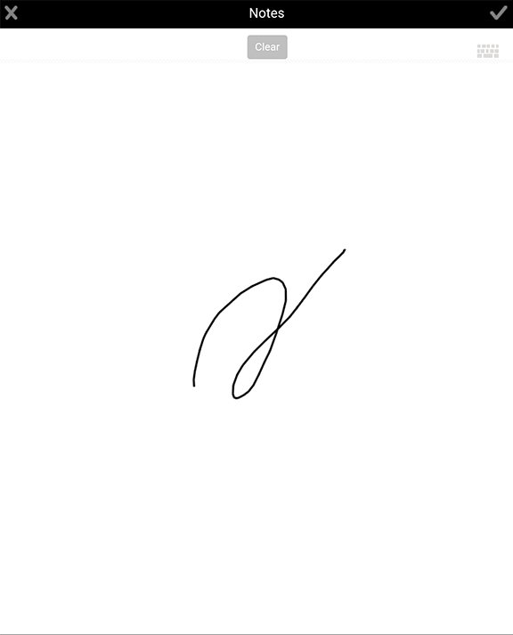

# 添加附件 {#adding-attachments}

## 在与AEM Forms工作流服务器同步的表单中添加附件(JEE上的AEM Forms) {#adding-annotations}

AEM Forms应用程序允许您将图像、草图注释和文本注释附加到与AEM FormsJEE服务器同步的表单。 如果您的表单是从AEM Forms工作流服务器加载的，则您的附件将添加到表单。 您可以点按附件按  ，以一起查看表单中的所有附件。 红色通知指定表单中的附件数。 如果表单中没有附件，您将看不到红色通知按钮。 如果表单中没有附件，则点按“附件”按钮 ，可选择附加照片或涂写。

您的选择包括：

* **[!UICONTROL 画廊]**: 允许您根据保存在设备上的图片添加图片。

* **[!UICONTROL 相机]**: 允许您拍摄照片并将其添加到表单。

* **[!UICONTROL 附注]**: 允许您添加涂鸦或文本注释。 使  “涂鸦”添加涂鸦  盘添加文本注释。

>[!NOTE]
>
>一个用户添加的附件对其他AEM Forms应用程序用户可见。 其他用户无法删除由用户添加的附件。

### “附件”屏幕 {#the-attachments-screen}

要查看某个位置中的所有附件，请点 。 您可以在此处添加、重命名和删除附件。

可以使用“附 **件”** 屏幕中的+按钮附加另一张图片、涂写或文本。

### 添加照片 {#adding-a-photograph}

您可以使用移动设备的相机或设备中保存的图片附加表单中的图片。

1. 点按窗口  的附件按钮。
1. 点 **[!UICONTROL 按显]** 示的 **[!UICONTROL 弹出窗]** 口中的“画廊”或“相机”。
1. 根据您选择的选项，执行以下操作：

   1. 选择“摄 **[!UICONTROL 像机]**”。

      拍照。 然后点按 **[!UICONTROL Use]** 。

      或点按“重 **[!UICONTROL 拍]** ”按钮以重拍照片。

   1. 选择“ **[!UICONTROL 库]**”。

      设备的图像浏览器弹出。 在设备的图片浏览器中，点击要附加的图片。

### 添加备注 {#adding-a-note}

“注 **释** ”选项允许您在表单中添加手绘脚本和文本附件。

1. 点按窗口  的附件按钮。
1. 点 **[!UICONTROL 按显]** 示的弹出窗口中的“附注”。
1. 在启动的“备注”用户界面中，捕捉徒手涂鸦。

   
   **图：** *涂写*

   您可以在“涂抹”界面中使用以下选项：

   * **[!UICONTROL 清除]**: 清除屏幕。
   * **[!UICONTROL 完成]**: 连接当前涂鸦。
   * **[!UICONTROL 取消]**: 放弃当前涂抹并退出涂抹用户界面。
   * : 清除涂写，并添加文本注释。

   

## 表单中的附件与AEM Forms服务器同步，无AEM Forms工作流(OSGi上的AEM Forms) {#attachments-in-forms-synced-with-the-aem-forms-servers-without-aem-forms-workflow-aem-forms-on-osgi}

与AEM FormsOSGi服务器同步的移动表单附件的工作方式与AEM FormsJEE服务器类似。

从AEM FormsOSGi服务器加载到应用程序中的自适应表单不支持表单级附件。 要附加图像或文本注释，请在创作表单时启用表单中的字段级附件。 将文件附件组件从组件浏览器拖放到字段上。

对于自适应表单，您可以在记录文档(DoR)中视图附加的文件。 请参 [阅为非XFA自适应表单生成记录文档](/help/forms/using/generate-document-of-record-for-non-xfa-based-adaptive-forms.md)。
