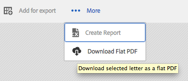

# 向资产列表视图添加自定义操作 {#add-custom-action-to-the-asset-listing-view}

>[!CAUTION]
>
>AEM 6.4已结束扩展支持，本文档将不再更新。 有关更多详细信息，请参阅 [技术支助期](https://helpx.adobe.com/cn/support/programs/eol-matrix.html). 查找支持的版本 [此处](https://experienceleague.adobe.com/docs/).

## 概述 {#overview}

通信管理解决方案允许您向管理资产用户界面添加自定义操作。

您可以向资产列表视图添加自定义操作，以便：

* 一个或多个资产类型或字母
* 在选择单个、多个资产/字母时执行（操作/命令变为活动状态），或者不选择

此自定义通过向信件的资产列表视图添加“下载平面PDF”命令的情景进行演示。 此自定义方案允许用户下载单个选定信件的平面PDF。

### 前提条件 {#prerequisites}

要完成以下或类似方案，您需要了解：

* CRX
* JavaScript
* Java

## 方案：向信件列表用户界面添加命令以下载信件的平面PDF版本 {#addcommandtoletters}

以下步骤将命令“下载平面PDF”添加到信件的资产列表视图，并允许用户下载所选信件的平面PDF。 通过将这些步骤与相应的代码和参数结合使用，您可以为其他资产添加一些其他功能，如数据字典或文本。

要自定义通信管理以允许用户下载扁平的信件PDF，请完成以下步骤：

1. 转到 `https://[server]:[port]/[ContextPath]/crx/de` 和以管理员身份登录。

1. 在apps文件夹中，使用以下步骤创建一个名为items的文件夹，其路径/结构与位于选择文件夹中的items文件夹类似：

   1. 右键单击 **[!UICONTROL 项目]** 文件夹，然后选择 **[!UICONTROL 覆盖节点]**:

      `/libs/fd/cm/ma/gui/content/cmassets/jcr:content/body/content/header/items/selection/items`

      >[!NOTE]
      >
      >此路径专门用于创建可与选择多个资产/信件之一配合使用的操作。 如果要创建无需选择即可工作的操作，则需要为以下路径创建一个覆盖节点，并相应地完成其余步骤：
      >
      >
      >`/libs/fd/cm/ma/gui/content/cmassets/jcr:content/body/content/header/items/default/items`

      

   1. 确保“覆盖节点”对话框具有以下值：

      **[!UICONTROL 路径：]** /libs/fd/cm/ma/gui/content/cmassets/jcr:content/body/content/header/items/selection/items

      **[!UICONTROL 位置：]** /apps/

      **[!UICONTROL 匹配节点类型：]** 已选择

      

   1. 单击&#x200B;**[!UICONTROL 确定]**。文件夹结构将在应用程序文件夹中创建。

      单击 **[!UICONTROL 全部保存]**.

1. 在新创建的项目文件夹下，为特定资产中的自定义按钮/操作添加一个节点(示例：downloadFlatPDF)，请执行以下步骤：

   1. 右键单击 **[!UICONTROL 项目]** 文件夹，选择 **[!UICONTROL 创建]** > **[!UICONTROL 创建节点]**.

   1. 确保“创建节点”对话框具有以下值，然后单击 **[!UICONTROL 确定]**:

      **[!UICONTROL 名称：]** downloadFlatPDF（或要为此属性提供的名称）

      **[!UICONTROL 类型：]** nt：非结构化

   1. 单击您创建的新节点（此处为downloadFlatPDF）。 CRX显示节点的属性。
   1. 将以下属性添加到节点（此处为downloadFlatPDF）并单击 **[!UICONTROL 全部保存]**:

   <table> 
    <tbody> 
    <tr> 
    <td><strong>名称</strong></td> 
    <td><strong>类型</strong></td> 
    <td><strong>价值 和描述</strong></td> 
    </tr> 
    <tr> 
    <td>class</td> 
    <td>字符串</td> 
    <td>foundation-collection-action</td> 
    </tr> 
    <tr> 
    <td>foundation-collection-action</td> 
    <td>字符串</td> 
    <td><p>{"target":"。cq-manageasset-admin-childpages", "activeSelectionCount":"single","type":"LETTER"}<br /> <br /> <br /> <strong>activeSelectionCount</strong> 可以是单个或多个，以允许选择一个或多个要执行自定义操作的资产。</p> <p><strong>type</strong> 可以是以下一个或多个（用逗号分隔多个条目）：字母、文本、列表、条件、数据字典</p> </td> 
    </tr> 
    <tr> 
    <td>图标</td> 
    <td>字符串</td> 
    <td>图标下载<br /> <br /> 通信管理在命令/菜单的左侧显示的图标。 有关可用的不同图标和设置，请参阅 <a href="https://docs.adobe.com/docs/en/aem/6-3/develop/ref/coral-ui/coralui3/Coral.Icon.html" target="_blank">CoralUI图标文档</a>.<br /> </td> 
    </tr> 
    <tr> 
    <td>jcr:primaryType</td> 
    <td>名称</td> 
    <td>nt:unstructured</td> 
    </tr> 
    <tr> 
    <td>rel</td> 
    <td>字符串</td> 
    <td>download-flat-pdf-button</td> 
    </tr> 
    <tr> 
    <td>sling:resourceType</td> 
    <td>字符串</td> 
    <td>granite/ui/components/endor/actionbar/button</td> 
    </tr> 
    <tr> 
    <td>text</td> 
    <td>字符串</td> 
    <td>下载平面PDF（或任何其他标签）<br /> <br /> 在“资产列表”界面中显示的命令</td> 
    </tr> 
    <tr> 
    <td>标题</td> 
    <td>字符串</td> 
    <td>下载所选信件的平面PDF（或任何其他标签/替换文本）<br /> <br /> 标题是用户将鼠标悬停在自定义命令上时通信管理显示的替换文本。</td> 
    </tr> 
    </tbody> 
    </table>

1. 在apps文件夹中，使用以下步骤创建一个名为js的文件夹，其路径/结构与管理文件夹中的项目文件夹类似：

   1. 右键单击 **[!UICONTROL js]** 文件夹，然后选择 **[!UICONTROL 覆盖节点]**:&quot;

      `/libs/fd/cm/ma/gui/components/admin/clientlibs/admin/js`

   1. 确保“覆盖节点”对话框具有以下值：

      **[!UICONTROL 路径：]** /libs/fd/cm/ma/gui/components/admin/clientlibs/admin/js

      **[!UICONTROL 位置：]** /apps/

      **[!UICONTROL 匹配节点类型：]** 已选择

   1. 单击&#x200B;**[!UICONTROL 确定]**。文件夹结构将在应用程序文件夹中创建。 单击 **[!UICONTROL 全部保存]**.

1. 在js文件夹中，使用用于按钮操作处理的代码，创建一个名为formaction.js的文件：

   1. 右键单击 **[!UICONTROL js]** 文件夹，然后选择 **[!UICONTROL 创建>创建文件]**:

      `/apps/fd/cm/ma/gui/components/admin/clientlibs/admin/js`

      将文件命名为formaction.js。

   1. 双击文件以在CRX中将其打开。
   1. 在formaction.js文件（位于/apps分支下）中，将formaction.js文件中的代码复制到以下位置：

      `/libs/fd/cm/ma/gui/components/admin/clientlibs/admin/js/formaction.js`

      然后，将以下代码附加到formaction.js文件（位于/apps分支下）的末尾，然后单击 **[!UICONTROL 全部保存]**:

      ```
      /* Action url for xml file to be added.*/
      var ACTION_URL = "/apps/fd/cm/ma/gui/content/commons/actionhandlers/items/letterpdfdownloader.html";
      
      /* File upload handling*/
      var fileSelectedHandler = function(e){
          if(e && e.target && e.target.value)
              $(".downloadLetterPDFBtn").removeAttr('disabled');
          else
              $(".downloadLetterPDFBtn").attr('disabled','disabled');
      }
      
      /*Handing of Download button in pop up.*/
      var downloadClickHandler = function(){
          $('#downloadLetterPDFDilaog').modal("hide");
          var element = $('.foundation-selections-item');
          var path = $(element).data("path");
          $("#fileUploadForm").attr('action', ACTION_URL + "?letterId="+path).submit();
      }
      
      /*Click handling on action button.*/
      $(document).on("click",'.download-flat-pdf-button',function(e){
          $("#uploadSamepledata").val("");
           if($('#downloadLetterPDFDilaog').length == 0){
              $(document).on("click",".downloadLetterPDFBtn",downloadClickHandler);
              $(document).on("change","#uploadSamepledata",fileSelectedHandler);
              $("body").append(downloadLetterPDFDilaog);
          }
            $('#downloadLetterPDFDilaog').modal("show");
      });
      
      /*Download popup.*/
      var downloadLetterPDFDilaog = '<div id="downloadLetterPDFDilaog" class="coral-Modal notice " role="dialog"  aria-hidden="true">'+
          '<form id="fileUploadForm" method="POST" enctype="multipart/form-data">'+
              '<div class="coral-Modal-header">'+
                  '<h2 class="coral-Modal-title coral-Heading coral-Heading--2" id="modal-header1443020790107-label" tabindex="0">Download Letter as PDF.</h2>'+
                  '<button type="button" class="coral-MinimalButton coral-Modal-closeButton" data-dismiss="modal">×</button>'+
              '</div>'+
              '<div class="coral-Modal-body" id="modal-header1443020790107-message" role="document" tabindex="0">'+
                  '<div class="coral-Modal-message">'+
                      '<p></p>'+
                  '</div>'+
                  '<div class="coral-Modal-uploader">'+
                      '<p>Select sample data for letter.</p>'+
                      '<input type="file" id="uploadSamepledata" name="file" accept=".xml" size="70px">'+
                  '</div>'+
              '</div>'+
           '</form>'+
              '<div class="coral-Modal-footer">'+
                  '<button type="button" class="coral-Button" data-dismiss="modal">Cancel</button>'+
                  '<button type="button" class="coral-Button coral-Button--primary downloadLetterPDFBtn" disabled="disabled">Download</button>'+
              '</div>'+
      '</div>';
      ```

      此步骤中添加的代码将覆盖libs文件夹下的代码，因此请将之前的代码复制到/apps分支中的formaction.js文件。 将代码从/libs分支复制到/apps分支可确保之前的功能也能正常工作。

      上述代码用于处理在此过程中创建的命令的字母特定操作。 要对其他资产执行操作处理，请修改JavaScript代码。

1. 在apps文件夹中，使用以下步骤创建一个名为items的文件夹，其路径/结构与位于actionhandlers文件夹中的items文件夹类似：

   1. 右键单击 **[!UICONTROL 项目]** 文件夹，然后选择 **[!UICONTROL 覆盖节点]**:

      `/libs/fd/cm/ma/gui/content/commons/actionhandlers/items/`

   1. 确保“覆盖节点”对话框具有以下值：

      **[!UICONTROL 路径：]** /libs/fd/cm/ma/gui/content/commons/actionhandlers/items/

      **[!UICONTROL 位置：]** /apps/

      **[!UICONTROL 匹配节点类型：]** 已选择

   1. 单击&#x200B;**[!UICONTROL 确定]**。文件夹结构将在应用程序文件夹中创建。

   1. 单击 **[!UICONTROL 全部保存]**.

1. 在新创建的项目节点下，为特定资产中的自定义按钮/操作添加一个节点(示例：letterpdfdownloader)来执行以下步骤：

   1. 右键单击项目文件夹并选择 **[!UICONTROL 创建>创建节点]**.

   1. 确保“创建节点”对话框具有以下值，然后单击 **[!UICONTROL 确定]**:

      **[!UICONTROL 名称：]** letterpdfdownloader（或要为此属性提供的名称）必须唯一。 如果您在此处使用其他名称，请在formaction.js文件的ACTION_URL变量中指定相同的名称。)

      **[!UICONTROL 类型：]** nt：非结构化

   1. 单击您创建的新节点（此处为downloadFlatPDF）。 CRX显示节点的属性。

   1. 将以下属性添加到节点（此处为letterpdfdownloader），然后单击 **[!UICONTROL 全部保存]**:

      | **名称** | **类型** | **值** |
      |---|---|---|
      | sling:resourceType | 字符串 | fd/cm/ma/gui/components/admin/clientlibs/admin |

1. 在以下位置创建一个名为POST.jsp的文件，其中包含用于命令操作处理的代码：

   /apps/fd/cm/ma/gui/components/admin/clientlibs/admin

   1. 右键单击 **[!UICONTROL 管理员]** 文件夹，然后选择 **[!UICONTROL 创建>创建文件]**:

      /apps/fd/cm/ma/gui/components/admin/clientlibs/admin

      将文件命名为POST.jsp。 (文件名只需为POST.jsp。)

   1. 双击 **[!UICONTROL POST.jsp]** 文件以在CRX中将其打开。
   1. 将以下代码添加到POST.jsp文件中，然后单击 **[!UICONTROL 全部保存]**:

      此代码专用于信件呈现服务。 对于任何其他资产，将该资产的Java库添加到此代码中。 有关AEM Forms API的更多信息，请参阅 [AEM Forms API](https://adobe.com/go/learn_aemforms_javadocs_63_en).

      有关AEM库的更多信息，请参阅AEM [组件](/help/sites-developing/components.md).

      ```xml
      /*Import libraries. Here we are downloading letter flat pdf with input xml data so we require letterRender Api. For any other Module functionality we need to first import that library. */            
      <%@include file="/libs/foundation/global.jsp"%>
      <!DOCTYPE html lang="en" PUBLIC "-//W3C//DTD XHTML 1.1//EN" "https://www.w3.org/TR/xhtml11/DTD/xhtml11.dtd">
      <%@page import="com.adobe.icc.ddg.api.*"%>
      <%@page import="com.adobe.icc.dbforms.obj.*"%>
      <%@page import="com.adobe.icc.render.obj.*" %>
      <%@page import="com.adobe.icc.services.api.*" %>
      <%@page import="org.apache.sling.api.resource.*" %>
      <%@page import="java.io.File" %>
      <%@page import="java.util.*" %>
      <%@page import="com.adobe.livecycle.content.appcontext.AppContextManager"%>
      <%@page import=" com.adobe.icc.dbforms.exceptions.ICCException"%>
      <%@page import="java.io.InputStream" %>
      <%@page import="java.io.FileInputStream" %>
      <%@page import="org.apache.commons.io.IOUtils" %>
      <%@page session="false" contentType="text/html; charset=utf-8"%>
      <%@taglib prefix="sling" uri="https://sling.apache.org/taglibs/sling/1.0"%>
      <%@taglib prefix="cq" uri="https://www.day.com/taglibs/cq/1.0" %>
       <%@page session="false" contentType="text/html; charset=utf-8"%>
      <%
         AppContextManager.setCurrentAppContext("/content/apps/cm");
         /*Get letter id sent in js file.*/
          String letterId = request.getParameter("letterId");
          if(letterId.lastIndexOf("?") != -1)
              letterId = letterId.substring(0, letterId.indexOf("?"));
          String fileName = null;
          String letterName = null;
          InputStream inputStream = null;
          /*Get xml file data*/
          if (slingRequest.getRequestParameter("file") != null)
              inputStream = slingRequest.getRequestParameter("file").getInputStream();
          if(letterId != null){
              String xmlData = null;
              try{
                  xmlData = IOUtils.toString(inputStream, "UTF-8");
              }
              catch (Exception e) {
                  log.error("Xml data does not exists.");
              }
              /*letter Name from letter letter id.*/
              letterName = letterId.substring(letterId.lastIndexOf("/")+1);
              /*Invoking letter render services API.*/
              LetterRenderService letterRenderService = sling.getService(LetterRenderService.class);
              /*using CM renderLetter api to get pdfbytes.*/
              PDFResponseType  pdfResponseType= letterRenderService.renderLetter(letterId,xmlData,true,false,false,false);
              byte[] bytes = null;
              /*Downloading pdf bytes as pdf.*/
              if(pdfResponseType != null && pdfResponseType.getFile() != null){
                  bytes = pdfResponseType.getFile().getDocument();
                  /*set the response header to enable download*/
                  response.setContentType("application/OCTET-STREAM");
                  response.setHeader("Content-Disposition", "attachment;filename=\"" + letterName + ".pdf\"");
                  response.setHeader("Pragma", "cache");
                  response.setHeader("Cache-Control", "private");
                  out.clear();
                  response.getOutputStream().write(bytes);
              }
          }
          else{
              log.error("Letter id does not exists.");
          }
      %>
      ```

## 使用自定义功能下载信件的平面PDF {#download-flat-pdf-of-a-letter-using-the-custom-functionality}

添加自定义功能下载信件的平面PDF后，您可以使用以下步骤下载所选信件的平面PDF版本：

1. 转到 `https://[server]:[port]/[ContextPath]/projects.html` 并登录。

1. 选择 **[!UICONTROL Forms >字母]**. 通信管理列出了系统中可用的信件。
1. 单击 **[!UICONTROL 选择]** 然后单击信件以将其选中。
1. 选择 **[!UICONTROL 更多]** > &lt;download flat=&quot;&quot; pdf=&quot;&quot;> （使用本文中的说明创建的自定义功能）。 将显示“以PDF形式下载信件”对话框。

   菜单项名称、功能和替换文本是根据 [方案：向信件列表用户界面添加命令以下载信件的平面PDF版本。](#addcommandtoletters)

   

1. 在以PDF形式下载信件对话框中，选择要从中填充PDF数据的相关XML。

   >[!NOTE]
   >
   >在将信件下载为平面PDF之前，您可以使用 **[!UICONTROL 创建报表]** 选项。

   

   这封信以平面PDF下载到你的电脑。
