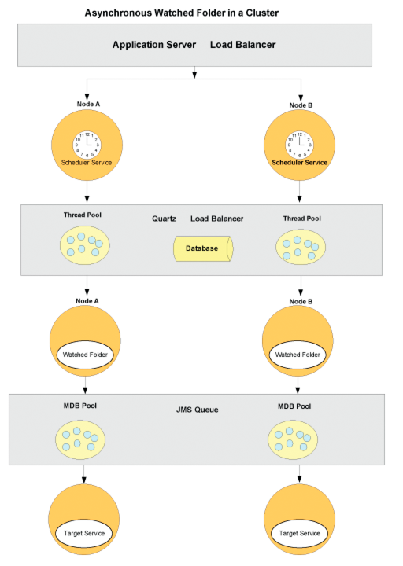

# 配置监视文件夹端点 {#configuring-watched-folder-endpoints}

管理员可以配置网络文件夹(称为监 *视文件夹*)，这样，当用户将文件（如PDF文件）放置在监视文件夹中时，将调用已配置的服务操作并处理该文件。 服务执行指定操作后，会将修改后的文件保存到指定的输出文件夹中。

## 配置监视文件夹服务 {#configuring-the-watched-folder-service}

在配置监视文件夹端点之前，请配置监视文件夹服务。 监视文件夹服务的配置参数有两个用途：

* 配置所有监视文件夹端点的通用属性
* 为所有监视的文件夹端点提供默认值

配置“监视文件夹”服务后，您将为目标服务添加“监视文件夹”端点。 添加端点时，您会设置值，如将文件或文件夹放置到所配置的“监视文件夹”服务的输入文件夹中时要调用的服务名称和操作名称。 有关配置“监视文件夹”服务的详细信息，请参阅“ [监视文件夹”服务设置](/help/forms/using/admin-help/configure-service-settings.md#watched-folder-service-settings)。

## 创建监视文件夹 {#creating-a-watched-folder}

可通过以下两种方式创建监视文件夹：

* 为监视文件夹端点配置设置时，在“路径”框中键入父目录的完整路径，并附加要创建的监视文件夹的名称，如下例所示：
   `  C:\MyPDFs\MyWatchedFolder`由于MyWatchedFolder文件夹尚不存在，因此AEM表单会尝试在该位置创建它。

* 在配置监视文件夹端点之前在文件系统上创建一个文件夹，然后在“路径”框中键入完整路径。

在群集环境中，将用作监视文件夹的文件夹必须在文件系统或网络上可访问、可写入和共享。 在这种情况下，群集的每个应用程序服务器实例都必须具有对同一共享文件夹的访问权限。

在Windows中，如果应用程序服务器作为服务运行，则必须通过以下方式之一以对共享文件夹的适当访问权限启动它：

* 将应用程序服务器服务“登录为 **”参数配置为** ，以特定用户的身份启动，并具有对共享监视文件夹的适当访问权限。
* 将应用程序服务器服务“启动为本地系统”选项配置为“允许服务与桌面交互”。 此选项要求共享的监视文件夹可供所有人访问和写入。

## 将监视的文件夹链接在一起 {#chaining-together-watched-folders}

监视文件夹可以链接在一起，这样一个监视文件夹的结果文档就是下一个监视文件夹的输入文档。 每个被监视的文件夹都可以调用不同的服务。 通过这种方式配置监视的文件夹，可以调用多个服务。 例如，一个监视文件夹可将PDF文件转换为Adobe PostScript®，另一个监视文件夹可将PostScript文件转换为PDF/A格式。 为此，只需将第一个端点定义的监 *视文件夹的result* 文件夹设置为指向第二个端点定义的监视文件夹的 *input* folder。

第一次转换后的输出将转到\path\result。 第二个转换的输入为\path\result，第二个转换的输出将转到\path\result\result （或在“结果文件夹”框中为第二个转换定义的目录）。

## 用户如何与监视文件夹交互 {#how-users-interact-with-watched-folders}

对于监视文件夹端点，用户可以通过将输入文件或文件夹从桌面复制或拖动到监视文件夹来调用。 文件将按文件到达的顺序进行处理。

对于监视的文件夹端点，如果作业只需要一个输入文件，则用户可以将该文件复制到监视的文件夹的根目录中。

如果作业包含多个输入文件，则用户必须在监视的文件夹层次结构之外创建一个包含所有必需文件的文件夹。 此新文件夹应包括输入文件（如果过程需要，还可选择包含DDX文件）。 构建作业文件夹后，用户将其复制到监视文件夹的输入文件夹中。

>[!NOTE]
>
>确保应用程序服务器已删除对监视文件夹中文件的访问权限。 如果AEM表单在扫描后无法从输入文件夹删除文件，则将无限次调用关联的进程。

## 监视文件夹输出 {#watched-folder-output}

当输入是一个文件夹并且输出由多个文件组成时，AEM表单会创建一个与输入文件夹同名的输出文件夹，并将输出文件复制到该文件夹中。 当输出包含一个包含键值对的文档映射（如“输出”进程的输出）时，该键将用作输出文件名。

端点进程产生的输出文件名不能包含字母、数字和句点(.)以外的字符文件扩展名之前。 AEM表单会将其他字符转换为其十六进制值。

客户端应用程序从监视的文件夹结果文件夹中选取结果文档。 进程错误记录在监视的文件夹失败文件夹中。

## 监视文件夹的工作方式 {#how-watched-folder-works}

“监视文件夹”模块包含以下服务：

* 监视文件夹服务
* provider.file_scan_service
* provider.file_write_results_service

除了上面列出的服务，“监视文件夹”还依赖于其他服务，包括调度程序服务以调度作业，以及作业管理器服务以支持目标服务的异步调用。

### 监视文件夹处理调用请求的方式 {#how-watched-folder-processes-an-invocation-request}

监视文件夹服务负责创建、更新和删除端点。 管理员创建端点后，将根据指定的重复间隔或cron表达式调度这些端点由调度程序服务触发。

此图说明了“监视文件夹”如何处理调用请求。

使用监视文件夹调用服务的过程如下：

1. 客户端应用程序将文件或文件夹放置在监视的文件夹输入文件夹中。
1. 当作业扫描间隔发生时，调度程序服务将调用provider.file_scan_service来处理输入文件夹中的文件或文件夹。
1. provider.file_scan_service执行以下任务：

   * 扫描输入文件夹中是否有与包含文件模式匹配的文件或文件夹，并排除指定排除文件模式的文件或文件夹。 首先选取最旧的文件或文件夹。 还会选取比等待时间更早的文件和文件夹。 在一次扫描中，所处理的文件或文件夹的数量基于批处理大小。 有关文件模式的信息，请参 [阅关于文件模式](configuring-watched-folder-endpoints.md#about-file-patterns)。 有关设置批量大小的信息，请参阅“监 [视文件夹”服务设置](/help/forms/using/admin-help/configure-service-settings.md#watched-folder-service-settings)。
   * 选取要处理的文件或文件夹。 如果文件或文件夹未完全下载，则会在下次扫描中选取它们。 为确保文件夹已下载完毕，管理员应使用排除文件模式创建一个具有名称的文件夹。 文件夹包含所有文件后，必须将其重命名为包含文件模式中指定的模式。 此步骤确保文件夹具有调用服务所需的所有必要文件。 有关确保文件夹已完全下载的详细信息，请参 [阅监视文件夹的提示和技巧](configuring-watched-folder-endpoints.md#tips-and-tricks-for-watched-folders)。
   * 在选择文件或文件夹进行处理后，将它们移到舞台文件夹。
   * 根据端点输入参数映射，将舞台文件夹中的文件或文件夹转换为相应的输入。 有关输入参数映射的示例，请参阅 [监视文件夹的提示和技巧](configuring-watched-folder-endpoints.md#tips-and-tricks-for-watched-folders)。

1. 为端点配置的目标服务将同步或异步调用。 使用为端点配置的用户名和密码调用目标服务。

   * 同步调用直接调用目标服务并立即处理响应。
   * 对于异步调用，目标服务通过作业管理器服务调用，该服务将请求放在队列中。 而作业管理器服务则调用provider.file_write_results_service来处理结果。

1. provider.file_write_results_service处理目标服务调用的响应或失败。 成功后，输出将根据端点配置保存到结果文件夹。 如果将端点配置为在成功完成后保留结果，则provider.file_write_results_service也保留源。

   当目标服务的调用导致失败时，provider.file_write_results_service将失败原因记录在failure.log文件中，并将该文件放在failure文件夹中。 根据为端点指定的配置参数创建失败文件夹。 当管理员为端点配置设置“在失败时保留”选项时，provider.file_write_results_service也会将源文件复制到失败文件夹中。 有关从故障文件夹恢复文件的信息，请参 [阅故障点和恢复](configuring-watched-folder-endpoints.md#failure-points-and-recovery)。

## 监视文件夹端点设置 {#watched-folder-endpoint-settings}

使用以下设置配置监视的文件夹端点。

**** 名称：（必需）标识端点。 请勿包含&lt;字符，因为它将截断Workspace中显示的名称。 如果输入URL作为端点的名称，请确保它符合RFC1738中指定的语法规则。

**** 说明：端点的描述。 请勿包含&lt;字符，因为它将截断Workspace中显示的描述。

**** 路径：（必需）指定监视的文件夹位置。 在群集环境中，此设置必须指向可从群集中的每台计算机访问的共享网络文件夹。

**** 异步：将调用类型标识为异步或同步。 默认值为异步。 建议对于长寿命进程使用异步，而对于瞬态或短寿命进程，建议使用同步。

**** Cron表达式：如果必须使用cron表达式来计划监视的文件夹，请输入cron表达式。 配置此设置后，将忽略重复间隔。

**** 重复间隔：扫描已监视文件夹以进行输入的时间间隔（以秒为单位）。 除非启用“节流”设置，否则“重复间隔”应长于处理平均作业的时间；否则，系统可能会过载。 默认值为 5。有关其他信息，请参阅批量大小说明。

**** 重复计数：监视的文件夹扫描文件夹或目录的次数。 值为-1表示扫描不确定。 默认值是-1。

**** 节流：选择此选项后，将限制AEM表单在任何给定时间处理的已监视文件夹作业的数量。 最大任务数由“批量大小”值确定。 （请参阅关于限制。）

**** 用户名：（必需）从监视的文件夹调用目标服务时使用的用户名。 默认值为SuperAdmin。

**** 域名：（必需）用户的域。 默认值为DefaultDom。

**** 批大小：每次扫描要选取的文件或文件夹数。 用于防止系统过载；一次扫描过多文件可能会导致崩溃。 默认值为 2。

“重复间隔”和“批量大小”设置决定“监视文件夹”在每次扫描中选取的文件数。 监视文件夹使用Quartz线程池扫描输入文件夹。 线程池与其他服务共享。 如果扫描间隔较小，则线程会经常扫描输入文件夹。 如果文件经常被放入监视的文件夹中，那么您应该保持较小的扫描间隔。 如果文件不常被删除，请使用更大的扫描间隔，以便其他服务可以使用线程。

如果丢弃的文件量很大，请使批量变大。 例如，如果监视文件夹端点调用的服务每分钟可处理700个文件，并且用户以相同的速率将文件放入输入文件夹，则将“批量大小”设置为350，将“重复间隔”设置为30秒将帮助监视文件夹性能，而不会太频繁地扫描监视文件夹。

将文件放入监视的文件夹后，会在输入中列出文件，这样在每秒都进行扫描时，会降低性能。 增加扫描间隔可以提高性能。 如果被丢弃的文件的体积较小，请相应地调整“批量大小”和“重复间隔”。 例如，如果每秒丢弃10个文件，请尝试将“重复间隔”设置为1秒，将“批量大小”设置为10。

**** 等待时间：在创建文件夹或文件后扫描文件之前等待的时间（以毫秒为单位）。 例如，如果等待时间为3,600,000毫秒（1小时），且文件是在一分钟前创建的，则此文件将在59分钟或更长时间后被选取。 默认值为 0。

此设置有助于确保将文件或文件夹完全复制到输入文件夹。 例如，如果要处理一个大文件，而该文件需要10分钟才能下载，请将等待时间设置为10&amp;ast;60 &amp;ast;1000毫秒。 如果文件未保存10分钟，则阻止监视的文件夹扫描文件。

******排除文件模式：分号**;已监视文件夹用于确定扫描和选取哪些文件和文件夹的模式的分隔列表。 不会扫描任何具有此模式的文件或文件夹以进行处理。

当输入是包含多个文件的文件夹时，此设置很有用。 文件夹的内容可以复制到一个名称由监视文件夹选取的文件夹中。 这样，监视的文件夹在将文件夹完全复制到输入文件夹之前，就无法选取要处理的文件夹。

您可以使用文件模式排除：

* 具有特定文件扩展名的文件；例如，&amp;ast;.dat,&amp;ast;.xml,&amp;ast;.pdf。
* 具有特定名称的文件；例如，数据。&amp;ast;将排除名为 *data1*、 *data2*&#x200B;等的文件和文件夹。
* 名称和扩展名中具有复合表达式的文件，如下例所示：

   * Data[0-9][0-9][0-9]。[dD][aA][tT]
   * &amp;ast;.[dD][Aa][Tt]
   * &amp;ast;.[Xx]毫[米][Ll]

有关文件模式的详细信息，请参 [阅关于文件模式](configuring-watched-folder-endpoints.md#about-file-patterns)。

******包括文件模式：（必填）分号**;已监视文件夹用于确定要扫描和选取的文件夹和文件的模式的分隔列表。 例如，如果“包括文件模式”为input&amp;ast;，则所有与input&amp;ast匹配的文件和文件夹；都被抓了。 这包括名为input1、input2等的文件和文件夹。

默认值为&amp;ast;并指示所有文件和文件夹。

您可以使用文件模式包括：

* 具有特定文件扩展名的文件；例如，&amp;ast;.dat,&amp;ast;.xml,&amp;ast;.pdf。
* 具有特定名称的文件；例如，数据。&amp;ast;将包括名为 *data1*、 *data2*&#x200B;等的文件和文件夹。
* 名称和扩展名中具有复合表达式的文件，如下例所示：

   * Data[0-9][0-9][0-9]。[dD][aA][tT]
   * &amp;ast;.[dD][Aa][Tt]
   * &amp;ast;.[Xx]毫[米][Ll]

有关文件模式的详细信息，请参 [阅关于文件模式](configuring-watched-folder-endpoints.md#about-file-patterns)。

**** 结果文件夹：保存的结果的存储位置。 如果结果未显示在此文件夹中，请检查失败文件夹。 只读文件不会被处理，并将保存在失败文件夹中。 此值可以是具有以下文件模式的绝对路径或相对路径：

* %F =文件名前缀
* %E =文件扩展名
* %Y =年（已满）
* %y =年（最后两位）
* %M =月
* %D =月日
* %d =年
* %H =小时（24小时制）
* %h =小时（12小时制）
* %m =分钟
* %s =秒
* %l =毫秒
* %R =随机数（0到9之间）
* %P =进程或作业ID

例如，如果2009年7月17日晚8点，并且您指定了， `C:/Test/WF0/failure/%Y/%M/%D/%H/`则结果文件夹为 `C:/Test/WF0/failure/2009/07/17/20`。

如果路径不是绝对的，而是相对的，则将在监视的文件夹中创建该文件夹。 默认值是result/%Y/%M/%D/，它是监视文件夹内的Result文件夹。 有关文件模式的详细信息，请参 [阅关于文件模式](configuring-watched-folder-endpoints.md#about-file-patterns)。

***注意&#x200B;**:结果文件夹的大小越小，“监视的文件夹”的性能就越好。 例如，如果监视文件夹的估计负载是每小时1000个文件，请尝试类似的模式，以`result/%Y%M%D%H`便每小时创建一个新的子文件夹。 如果负载较小（例如，每天1000个文件），您可以使用类似的模式`result/%Y%M%D`。*

**** 保留文件夹：成功扫描和拾取文件后存储文件的位置。 路径可以是绝对路径、相对路径或空目录路径。 您可以使用文件模式，如“结果文件夹”中所述。 默认值为preserve/%Y/%M/%D/。

**** 失败文件夹：保存失败文件的文件夹。 此位置始终与监视的文件夹相关。 您可以使用文件模式，如“结果文件夹”中所述。

只读文件不会被处理，并将保存在失败文件夹中。

默认值为failure/%Y/%M/%D/。

**** 失败时保留：在服务上执行操作失败时保留输入文件。 默认值为true。

**** 覆盖重复的文件名：设置为“True”时，结果文件夹和保留文件夹中的文件将被覆盖。 设置为“False”时，名称将使用带有数字索引后缀的文件和文件夹。 默认值为False。

**** 清除持续时间：（必需）当结果文件夹中的文件和文件夹比此值大时，将清除这些文件和文件夹。 此值以天数计量。 此设置有助于确保结果文件夹未变为完整。

值为-1天表示从不删除结果文件夹。 默认值是-1。

**** 操作名称：（必需）可分配给监视文件夹端点的操作列表。

**** 输入参数映射：用于配置处理服务和操作所需的输入。 可用的设置取决于使用监视文件夹端点的服务。 下面是两种输入：

**** 文本：监视的文件夹在显示时使用在字段中输入的值。 支持所有基本的Java类型。 例如，如果API使用String、long、int和Boolean等输入，则字符串将转换为正确的类型并调用服务。

**** 变量：输入的值是被监视的文件夹用来选择输入的文件模式。 例如，对于加密口令服务（其中输入文档必须是PDF文件），用户可以使用&amp;ast;.pdf作为文件模式。 监视文件夹将选取监视文件夹中与此模式匹配的所有文件，并调用每个文件的服务。 使用变量时，所有输入文件都将转换为文档。 仅支持使用文档作为输入类型的API。

**** 输出参数映射：用于配置服务和操作的输出。 可用的设置取决于使用监视文件夹端点的服务。

“监视的文件夹”输出可以是单个文档、文档列表或文档地图。 然后，这些输出文档会使用在“输出参数映射”中指定的模式保存在结果文件夹中。

**注意**:指 *定产生唯一输出文件名的名称可提高性能。 例如，考虑服务返回一个输出文档，而“输出参数映射”将其映射到的情况(输`%F.%E`入文件的文件名和扩展名)。 在这种情况下，如果用户每分钟都会删除同名的文件，并将结果文件夹配置为“覆盖重复文件名”设置为关闭，则“监视文件夹”将尝试解析重复的文件名。`result/%Y/%M/%D`解析重复文件名的过程可能会影响性能。 在这种情况下，将“输出参数映射”更改为`%F_%h_%m_%s_%l`向名称中添加小时、分钟、秒和毫秒，或者确保丢弃的文件具有唯一的名称可能会提高性能。*

## 关于文件模式 {#about-file-patterns}

管理员可以指定可调用服务的文件类型。 可以为每个监视的文件夹建立多个文件模式。 文件模式可以是以下文件属性之一：

* 具有特定文件扩展名的文件；例如&amp;ast;.dat, &amp;ast;.xml, &amp;ast;.pdf,;
* 具有特定名称的文件；例如，数据。&amp;ast;
* 名称和扩展名中具有复合表达式的文件，如下例所示：

   * Data[0-9][0-9][0-9]。[dD][aA][tT]
   * &amp;ast;.[dD][Aa][Tt]
   * &amp;ast;.[Xx]毫[米][Ll]

管理员可以定义输出文件夹的文件模式，用于存储结果。 对于输出文件夹（结果、保留和失败），管理员可以指定以下任意文件模式：

* %Y =年（已满）
* %y =年（最后两位）
* %M =月，
* %D =月日，
* %d =年，
* %h =小时，
* %m =分钟，
* %s =秒，
* %R = 0-9之间的随机数
* %J =作业名称

例如，结果文件夹的路径可能是 `C:\Adobe\Adobe_Experience_Manager_forms\BarcodedForms\%y\%m\%d`。

输出参数映射还可以指定其他模式，如：

* %F =源文件名
* %E =源文件扩展名

如果输出参数映射模式以“File.separator”（即路径分隔符）结尾，则会创建一个文件夹并将内容复制到该文件夹中。 如果模式不以“File.separator”结尾，则内容（结果文件或文件夹）将使用该名称创建。 有关输出参数映射的详细信息，请参 [阅监视文件夹的提示和技巧](configuring-watched-folder-endpoints.md#tips-and-tricks-for-watched-folders)。

## 关于节流 {#about-throttling}

当为监视文件夹端点启用限制时，它会限制在任何给定时间都可以处理的监视文件夹作业的数量。 最大作业数由“批量大小”值确定，也可在“监视文件夹”端点中进行配置。 达到限制限制后，将不会轮询监视文件夹输入目录中传入的文档。 在其他已监视的文件夹作业完成并再次尝试进行投票之前，这些文档还将保留在输入目录中。 在同步处理的情况下，在单次轮询中处理的所有作业都将计入限制，即使这些作业在单个线程中连续处理也是如此。

>[!NOTE]
>
>限制不随群集进行缩放。 启用限制后，群集作为一个整体处理的作业数量不会超过在给定时间在“批量大小”中指定的作业数。 此限制在群集范围内，并非特定于群集中的每个节点。 例如，如果“批量大小”为2，则只有一个节点处理两个作业时，才能达到限制限制限制，并且直到其中一个作业完成之前，其他节点都不会轮询输入目录。

### 节流的工作原理 {#how-throttling-works}

监视文件夹在每个重复时间间隔内扫描输入文件夹，选取批量大小中指定的文件数，并为每个文件调用目标服务。 例如，如果“批量大小”为4，则在每次扫描时，“监视文件夹”将选取4个文件，创建4个调用请求，并调用目标服务。 在完成这些请求之前，如果调用“监视文件夹”，则无论以前的四个作业是否完成，该文件夹都将再次启动四个作业。

限制功能可防止监视文件夹在以前的作业未完成时调用新作业。 “监视的文件夹”将检测进行中的作业，并根据批处理大小减去进行中的作业处理新作业。 例如，在第二次调用中，如果完成的作业数仅为三个，并且一个作业仍在进行中，则“监视文件夹”仅再调用三个作业。

* “监视文件夹”依赖舞台文件夹中存在的文件数来确定正在进行的作业数。 如果文件在舞台文件夹中仍未处理，则“监视文件夹”将不再调用任何其他作业。 例如，如果批量大小为4，并且停止了3个作业，则“监视文件夹”在后续调用中将仅调用一个作业。 有多种情况可能导致文件在舞台文件夹中保持未处理状态。 当作业停止时，管理员可以终止表单工作流管理页面上的进程，以便“监视文件夹”将文件从舞台文件夹移出。
* 如果在“监视文件夹”调用作业之前表单服务器关闭，则管理员可以将文件移出舞台文件夹。 有关信息，请参 [阅故障点和恢复](configuring-watched-folder-endpoints.md#failure-points-and-recovery)。
* 如果表单服务器正在运行，但当作业管理器服务回调时监视文件夹未运行（在服务未按顺序启动时发生），则管理员可以将文件移出舞台文件夹。 有关信息，请参 [阅故障点和恢复](configuring-watched-folder-endpoints.md#failure-points-and-recovery)。

## 性能和可伸缩性 {#performance-and-scalability}

“监视文件夹”可在单个节点上共提供100个文件夹。 “监视文件夹”的性能取决于表单服务器的性能。 对于异步调用，性能更依赖于系统负载和作业管理器队列中的作业。

可通过向群集中添加节点来改进监视文件夹的性能。 监视的文件夹作业通过Quartz调度程序和作业管理器服务在异步请求情况下分布在群集节点上。 所有作业都会保留在数据库中。

监视的文件夹取决于调度程序服务以调度、取消调度和重新调度作业。 其他服务（如事件管理服务、用户管理器服务和电子邮件提供者服务）可用于共享调度程序服务线程池。 这会影响监视文件夹的性能。 当所有服务开始使用调度程序服务线程池时，都需要调度程序服务线程池。

## 群集中的监视文件夹 {#watched-folders-in-a-cluster}

在群集中，“监视文件夹”取决于Quartz调度程序和Job Manager服务，以实现负载平衡和故障转移。 有关Quartz群集行为的详细信息，请参 [阅Quartz文档](https://www.quartz-scheduler.org/documentation)。

“监视文件夹”在每次投票中执行以下三个主要任务：

* 扫描文件夹
* 调用目标服务
* 处理结果

负载平衡和故障转移行为会根据所监视的文件夹配置为同步还是异步调用而发生更改。

### 群集中的同步监视文件夹 {#synchronous-watched-folder-in-a-cluster}

对于同步调用，Quartz负载平衡器决定哪个节点将获得轮询事件。 获取轮询事件的节点将执行所有任务：扫描文件夹、调用目标服务并处理结果。

对于同步调用，当一个节点发生故障时，Quartz调度器将新的轮询事件发送到其他节点。 在失败节点上启动的调用将丢失。 有关如何恢复与失败作业关联的文件的详细信息，请参 [阅故障点和恢复](configuring-watched-folder-endpoints.md#failure-points-and-recovery)。

### 群集中的异步监视文件夹 {#asynchronous-watched-folder-in-a-cluster}

对于异步调用，Quartz负载平衡器决定哪个节点将获得轮询事件。 获取轮询事件的节点将扫描输入文件夹并通过将请求放入作业管理器服务队列来调用目标服务。 而作业管理器服务负载平衡器则负责决定哪个节点将处理调用请求。 即使节点A创建了调用请求，节点B也有可能最终处理该请求。 或者，启动调用请求的节点也可能最终处理该请求。

对于异步调用，当一个节点发生故障时，Quartz调度程序会向其他节点发送新的轮询事件。 在失败节点上创建的调用请求将位于作业管理器服务队列中，并将发送到其他节点以进行处理。 未创建调用请求的文件将保留在舞台文件夹中。 有关如何恢复与失败作业关联的文件的详细信息，请参 [阅故障点和恢复](configuring-watched-folder-endpoints.md#failure-points-and-recovery)。

## 故障点和恢复 {#failure-points-and-recovery}

在每个投票事件中，“监视文件夹”都会锁定输入文件夹，将与包含文件模式匹配的文件移动到舞台文件夹，然后解锁输入文件夹。 需要锁定，这样两个线程就不会选取同一组文件并处理它们两次。 随着重复间隔的减小和批量的增大，发生这种情况的可能性增加。 将文件移到舞台文件夹后，将解锁输入文件夹，以便其他线程可以扫描该文件夹。 此步骤有助于提供高吞吐量，因为在一个线程处理文件时，其他线程可以扫描。

将文件移到舞台文件夹后，将为每个文件创建调用请求并调用目标服务。 有时监视文件夹无法恢复舞台文件夹中的文件：

* 如果服务器在“监视文件夹”创建调用请求之前关闭，则舞台文件夹中的文件仍保留在舞台文件夹中，并且无法恢复。
* 如果“监视文件夹”已成功为舞台文件夹中的每个文件创建调用请求，且服务器崩溃，则基于调用类型有两种行为：

**** 同步：如果将“监视文件夹”配置为同步调用服务，则舞台文件夹中的所有文件仍未处理。

**** 异步：在这种情况下，“监视文件夹”依赖于“作业管理器”服务。 如果作业管理器服务回调“监视文件夹”，则舞台文件夹中的文件会根据调用的结果移至“保留”或“失败”文件夹。 如果作业管理器服务不回叫“监视的文件夹”，则这些文件在舞台文件夹中将保持未处理状态。 当作业管理器回叫时，监视文件夹未运行时，会发生这种情况。

### 恢复舞台文件夹中未处理的源文件 {#recovering-unprocessed-source-files-in-the-stage-folder}

当“监视文件夹”无法处理舞台文件夹中的源文件时，您可以恢复未处理的文件。

1. 重新启动应用程序服务器或节点。
1. （可选）停止监视文件夹处理新的输入文件。 如果跳过此步骤，则很难确定哪些文件在舞台文件夹中未处理。 要阻止监视文件夹处理新的输入文件，请执行以下任务之一：

   * 在“应用程序和服务”中，将监视的文件夹端点的“包括文件模式”参数更改为与任何新输入文件不匹配的内容(例如，输入 `NOMATCH`)。
   * 暂停创建新输入文件的进程。
   等到AEM表单恢复并处理所有文件。 大部分文件应被恢复，任何新的输入文件都应得到正确处理。 等待监视文件夹恢复和处理文件的时间长短取决于要调用的操作长度和要恢复的文件数。

1. 确定无法处理哪些文件。 如果您等待了适当的时间并完成了上一步，并且舞台文件夹中仍有未处理的文件，请转到下一步。

   >[!NOTE]
   >
   >您可以查看舞台目录中文件的日期和时间戳。 根据文件的数量和正常处理时间，您可以确定哪些文件的版本足够旧，以便被视为卡住。

1. 将未处理的文件从舞台目录复制到输入目录。
1. 如果您阻止监视文件夹在步骤2中处理新的输入文件，请将“包括文件模式”更改为其上一个值，或重新启用您禁用的进程。

## 监视文件夹的安全注意事项 {#security-considerations-for-watched-folders}

每个监视文件夹都配置了用户名和密码。 调用服务时会使用这些凭据。 “监视文件夹”依赖于共享文件夹受基础安全文件系统保护的事实，以便只有受监视文件夹的所有者才能访问共享文件夹。

## 监视文件夹的提示与技巧 {#tips-and-tricks-for-watched-folders}

以下是配置“监视文件夹”端点时的一些提示和技巧：

* 如果在Windows上有一个正在处理图像文件的监视文件夹，请指定“包括文件模式”或“排除文件模式”选项的值，以防止Windows自动生成的Thumbs.db文件被监视文件夹轮询。
* 如果指定了cron表达式，则忽略重复间隔。 cron表达式的使用基于Quartz开源作业调度系统1.4.0版。
* 批量大小是监视文件夹的每次扫描中要选取的文件或文件夹的数量。 如果将批量大小设置为两个，并且监视的文件夹输入文件夹中丢弃了十个文件或文件夹，则每次扫描只会拾取两个。 在下次扫描中（将在重复间隔中指定的时间后进行），接下来的两个文件将被选取。
* 对于文件模式，管理员可以指定正则表达式，并添加对通配符模式的支持以指定文件模式。 “监视的文件夹”修改正则表达式以支持通配符模式，如&amp;ast;。&amp;ast;或&amp;ast;.pdf。 正则表达式不支持这些通配符模式。
* “监视文件夹”会扫描输入文件夹以查找输入内容，并且在开始处理文件或文件夹之前不知道源文件或文件夹是否已完全复制到输入文件夹。 要确保在选取文件或文件夹之前将源文件或文件夹完全复制到监视文件夹的输入文件夹中，请执行以下任务：

   * 使用等待时间，即“监视文件夹”从上次修改时间开始等待的时间（以毫秒为单位）。 如果要处理的文件较大，请使用此功能。 例如，如果文件下载需要10分钟，请将等待时间指定为10&amp;ast;60 &amp;ast;1000毫秒。 如果文件没有10分钟的旧版本，这将阻止“监视文件夹”拾取文件。
   * 使用排除文件模式并包括文件模式。 例如，如果排除文件模式为 `ex*``in*`，而包含文件模式为，则“监视文件夹”将选取以“in”开头的文件，而不会选取以“ex”开头的文件。 要复制大型文件或文件夹，请首先重命名该文件或文件夹，以使名称以“ex”开头。 将名为“ex”的文件或文件夹完全复制到监视的文件夹后，将其重命名为“in&amp;ast;”。

* 使用清除持续时间可保持结果文件夹干净。 “监视的文件夹”将清除所有早于清除持续时间的文件。 持续时间以天为单位。
* 添加“监视文件夹”端点时，在选择操作名称后，将填充输入参数映射。 对于操作的每个输入，生成一个输入参数映射字段。 下面是输入参数映射的示例：

   * 对于输 `com.adobe.idp.Document` 入：如果服务操作的输入类型为 `Document`，则管理员可以将映射类型指定为 `Variable`。 监视文件夹将根据为输入参数指定的文件模式从监视文件夹的输入文件夹中选取输入内容。 如果管理员指 `*.pdf` 定为参数，则将选取扩展名为。pdf的每个文件，并将其转换为 `com.adobe.idp.Document`和调用的服务。
   * 对于输 `java.util.Map` 入：如果服务操作具有类型输入，则管 `Map`理员可以将映射类型指定为， `Variable` 并输入具有类似模式的映射值 `*.pdf`。 例如，服务需要两个对象的映射，这 `com.adobe.idp.Document` 两个对象表示输入文件夹中的两个文件，如1.pdf和2.pdf。 监视文件夹将创建一个以键作为文件名和值作为值的映射 `com.adobe.idp.Document`。
   * 对于输 `java.util.List` 入：如果服务操作的输入类型为“列表”，则管理员可以将映射类型指定为 `Variable` ，并输入具有类似模式的映射值 `*.pdf`。 当PDF文件放入输入文件夹时，“监视文件夹”将创建一个表示这些文件的 `com.adobe.idp.Document` 对象列表并调用目标服务。
   * 对于 `java.lang.String`:管理员有两个选项。 首先，管理员可以将映射类型指定为 `Literal` ，并输入映射值作为字符串，如“监视文件夹”将使用字符串调用服务 `hello.``hello`。 其次，管理员可以将映射类型指定为 `Variable` 一个，并输入具有类似模式的映射值 `*.txt`。 在后一种情况下，扩展名为。txt的文件将被读取为被强制作为字符串的文档以调用服务。
   * Java基元类型：管理员可以将映射类型指定 `Literal` 为并提供值。 监视文件夹将调用具有指定值的服务。

* 监视文件夹用于处理文档。 支持的输 `com.adobe.idp.Document`出有 `org.w3c.Document`、 `org.w3c.Node`、以及这些类型的列表和映射。 任何其他类型都会导致失败文件夹中的失败输出。
* 如果结果不在result文件夹中，请验证failure文件夹以查看是否发生了故障。
* 在异步模式下使用时，“监视文件夹”的工作方式最佳。 在此模式下，“监视文件夹”将调用请求放入队列并回叫。 然后，将异步处理该队列。 未设置“异步”选项时，“监视文件夹”会同步调用目标服务，进程引擎会等待，直到通过请求完成服务并生成结果。 如果目标服务处理请求需要很长时间，则“监视文件夹”可能会出现超时错误。
* 创建用于导入和导出操作的监视文件夹不允许提取文件扩展名。 使用监视文件夹调用表单数据集成服务时，输出文件的文件扩展名类型可能与文档对象类型的预期输出格式不匹配。 例如，如果调用导出操作的监视文件夹的输入文件是包含数据的XFA表单，则输出应为XDP数据文件。 要获取具有正确文件扩展名的输出文件，可以在输出参数映射中指定它。 在此示例中，可以使用%F.xdp进行输出参数映射。
* 监视的文件夹可能会在将输入文件完全复制到该文件夹之前对其进行处理。 在UNIX上，文件锁定不是强制的，因为在Windows上。 因此，当将文件复制到监视文件夹时，“监视文件夹”可能会将文件移到舞台，而不会等待文件复制完成。 此行为仅导致部分输入文件被处理。 目前有两种解决办法：

   * 解决方法1

      1. 为“排除文件模式”指定一个模式，如temp&amp;ast;.ps。
      1. 将以temp（例如temp1.ps）开头的文件复制到监视的文件夹。
      1. 将文件完全复制到监视的文件夹后，重命名该文件，使其与为“包括文件模式”指定的模式相对应。 然后，监视文件夹会将已完成的文件移到舞台。
   * 解决方法2

      如果您知道将文件复制到监视文件夹所花费的最大时间，请以秒为单位指定等待时间。 然后，监视文件夹会等待指定的时间长度，然后将文件移到舞台。

      这对于Windows上的文件不是问题，因为在编写一个线程时，Windows会锁定文件。 但是，这是Windows上的文件夹的问题。 对于文件夹，您必须按照解决方法1中的步骤操作。

* 如果“监视文件夹”的“保留文件夹名称”端点属性设置为空目录路径，则暂存目录不会因应该而清除。 该目录仍包含已处理的文件和临时文件夹。

## 针对已监视文件夹的服务特定建议 {#service-specific-recommendations-for-watched-folders}

对于所有服务，您应调整已监视文件夹的批处理大小和重复间隔，以使“已监视文件夹”选取新文件和文件夹进行处理的速率不超过AEM表单服务器可处理的作业的速率。 实际使用的参数可能因配置的监视文件夹数量、使用监视文件夹的服务以及处理器上作业的密集程度而异。

### 生成PDF服务建议 {#generate-pdf-service-recommendations}

* “生成PDF”服务一次只能为以下文件类型转换一个文件：Microsoft Word、Microsoft Excel、Microsoft powerPoint、Microsoft Project、AutoCAD、Adobe Photoshop®、Adobe FrameMaker®和Adobe pageMaker®。 这些是长期存在的工作；因此，请确保将批量大小保持在较低的设置。 此外，如果群集中有更多节点，还会增加重复间隔。
* 对于PostScript(PS)、封装的PostScript(EPS)和图像文件类型，“生成PDF”服务可以并行处理多个文件。 您应根据服务器容量和群集中的节点数，小心调整会话Bean池大小（它控制将并行完成的转换数）。 然后，将批处理大小增加到一个数字，该数字等于您尝试转换的文件类型的会话Bean池大小。 轮询频率应由群集中的节点数决定；但是，由于“生成PDF”服务处理这类作业的速度相当快，因此您可以将重复间隔配置为低值，如5或10。
* 尽管“生成PDF”服务一次只能转换一个OpenOffice文件，但转换速度相当快。 PS、EPS和图像转换的上述逻辑也适用于OpenOffice转换。
* 为了在簇中实现均匀的负载分配，保持批量小，并增加重复间隔。

### barcoded forms service recommendations {#barcoded-forms-service-recommendations}

* 为了在处理条形码表单（小文件）时获得最佳性能，请输入“批 `10` 量大小”和“重复 `2` 间隔”。
* 当将许多文件放入输入文件夹时，可能会出现名为 *thumbs.db的隐藏文件* 。 因此，建议将包含文件的“包括文件模式”设置为为输入变量指定的相同值(例如， `*.tiff`)。 这会阻止监视文件夹处理数据库文件。
* “批量大小”值和“重 `5` 复间隔”通常足 `2` 够，因为Barcoded Forms服务通常需要大约5秒钟来处理一个条形码。
* “监视的文件夹”不会等到进程引擎完成作业后再选取新文件或文件夹。 它继续扫描监视的文件夹并调用目标服务。 此行为可能会使引擎过载，导致资源问题和超时。 确保使用重复间隔和批量大小来限制“监视的文件夹”输入。 如果存在更多监视的文件夹或在端点上启用限制，则可以增加重复间隔并减小批量大小。 有关限制的信息，请参 [阅关于限制](configuring-watched-folder-endpoints.md#about-throttling)。
* 监视文件夹模拟在用户名和域名中指定的用户。 “监视的文件夹”在直接调用或进程短时调用时以该用户身份调用服务。 对于长期进程，该进程使用系统上下文进行调用。 管理员可以为监视文件夹设置操作系统策略以确定允许或拒绝访问的用户。
* 使用文件模式组织结果、失败和保留文件夹。 (请参阅 [关于文件模式](configuring-watched-folder-endpoints.md#about-file-patterns)。)
* “监视文件夹”依赖Quartz计划程序扫描监视的文件夹。 Quartz调度器具有用于扫描它们的线程池。 如果监视的文件夹的重复时间间隔很低（&lt; 5秒），而批量大小较高(> 2)，则可能会出现竞争情况。 当出现此情况时，两个Quartz线程将拾取一个文件：

   * 其中一个线程成功找到该文件并随该文件调用目标服务。
   * 第二个线程查看文件，但在尝试确定文件是否有效（读或写文件）时失败，这会导致错误失败，指示文件因为是只读文件而无法处理。 这仅在重复间隔低且批量大小高的情况下发生。

