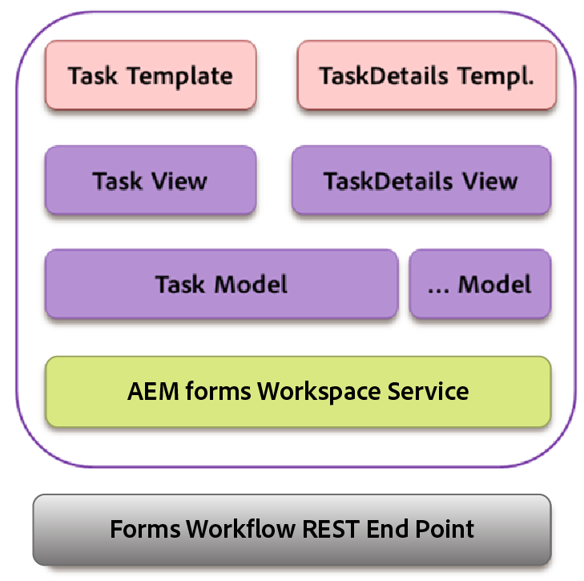

# 骨干交互{#backbone-interaction}

Backbone是一个库，有助于在Web应用程序中创建和遵循MVC架构。 Backbone的基本思想是将您的界面组织成逻辑视图，由模型支持，每个模型在模型发生变化时都可以独立更新，无需重绘页面。 有关Backbone的详细信息，请参阅[https://backbonejs.org](https://backbonejs.org/)。

主要概念如下：

**骨干** 模型包含数据以及与此数据相关的大多数逻辑。

**主干** 视图用于表示相应模型的状态。骨干视图实际上就像控制器一样，监听用户点击等用户界面事件，或者模型事件（如数据更改），并根据需要修改用户界面。

**HTML模** 板包装器模板，其占位符由模型填充。

**AEM Forms** 工作区包含多个单独的组件。每个组件：

* 表示单个逻辑用户界面元素。
* 可以是类似组件的集合。
* 由骨干模型、骨干视图和HTML模板组成。
* 包含对服务的引用。
* 包含对必需实用程序的引用。

初始化组件时，会创建以下对象：

* 将为组件创建新的“骨干”模型实例。 服务被注入模型中。
* 将创建Backbone视图的新实例。
* 相应模型、HTML模板和实用程序的实例将插入视图。

在主干视图中，有一个事件映射，它映射由于用户界面与相应处理程序交互而可能出现的各种事件。 组件初始化后，此映射即启动。

当视图初始化时，视图调用其相应模型从服务器获取数据。 视图所需的所有数据可用后，视图将以HTML模板指定的格式呈现数据。 多个视图可以共享同一模型进行通信。

示例：

1. 用户单击任务列表中的任务模板。
1. 任务视图监听单击，并调用任务模型上的呈现函数。
1. 任务模型随后调用服务，该服务是与AEM Forms服务器进行所有通信的一个公共点。
1. 服务类通过ajax调用呈现方法的AEM FormsREST端点。
1. 此Ajax调用的成功回调在任务模型中定义。
1. 任务模型将骨干事件作为渲染调用完成的通知。
1. 另一个视图,任务详细信息视图从任务模型监听此事件。
1. 任务详细信息视图会更改任务详细信息模板，以向用户显示呈现的任务（表单、详细信息、附件、附注等）。

