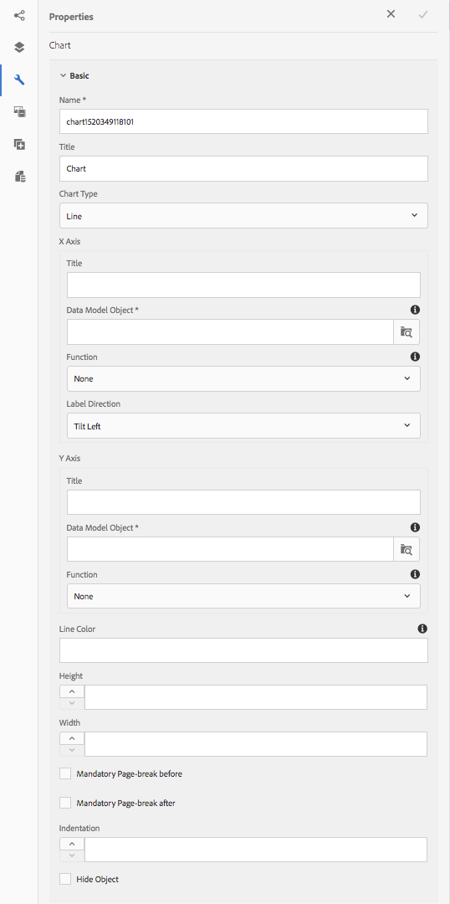

# 在Interactive Communications {#using-charts-in-interactive-communications}中使用图表

在交互式通信中使用图表，您可以将大量信息浓缩为易于分析和理解的可视格式

图表或图表是数据的可视表示。 它将大量信息浓缩为易于理解的可视格式，使交互通信的收件人能够更好地可视化、解释和分析复杂数据。

在创建交互式通信时，您可以添加图表以可视方式表示交互式通信的表单数据模型中的二维数据。 图表组件允许您添加和配置以下类型的图表：

* 饼图
* 列
* 环形
* 栏(仅限Web渠道)
* Line
* 线和点
* 点
* 区域

## 在交互通信{#add-and-configure-chart-in-an-interactive-communication}中添加和配置图表

完成以下步骤，将图表添加到交互式通信：

1. 从AEM提要栏中的组件，将图表组件拖放到交互通信的打印或Web渠道的以下任一位置：

   * 打印渠道:目标区域和图像字段
   * Web渠道:面板和目标区

   拖放的图表组件为图表创建占位符。

1. 点按交互式通信编辑器中的图表组件，并从组件工具栏中选择&#x200B;**[!UICONTROL 配置(]** )。

   属性提要栏将显示，焦点是图表的基本属性。

   
   **图：打** *印渠道中线型图表的基本属性*

   
   **图：** *Web渠道中线型图的基本属性*

1. 配置图表的“基本”属性以进行打印渠道和Web渠道。 除了常用属性外，还有特定于打印和Web渠道以及图表类型的属性。

   * **[!UICONTROL 名称]**:图表对象的名称。在此处指定的图表名称不显示在图表输出中，但在规则中用于引用图表。
   * **[!UICONTROL 图表类型]**:指定图表类型：饼图、列、甜圈、线、线和点、点或区域。
   * **[!UICONTROL 隐藏对象]**:选择此项可在最终输出中隐藏图表。
   * 为&#x200B;**[!UICONTROL x-axis]**&#x200B;和&#x200B;**[!UICONTROL y-axis]**&#x200B;指定以下内容：

      * **[!UICONTROL 标题]**:指定要在交互式通信中显示的X和Y轴的标题。
      * **[!UICONTROL 数据模型对象*]**:从创建交互通信时指定的表单数据模型浏览并选择图表的X和Y轴的数据模型对象。选择同一父数据模型对象的两个集合／数组类型属性，这些属性彼此有意义，可绘制图表的X和Y轴。
      * **[!UICONTROL 函数]**:要使用统计函数计算轴上的值，请为X/Y轴选择函数。有关函数的详细信息，请参阅图表](#usefunction)和[示例2中的[使用函数：求和和和均值函数在折线图](#applicationsumfrequency)中的应用。

   >[!NOTE]
   >
   >对于打印渠道，在X轴上，您绑定的数据模型对象应为“数字”、“字符串”或“日期”类型。 在Y轴上，您绑定的数据模型对象应为Number类型。 建议您在打印渠道中使用右侧图例。

   有关图表属性的详细信息，请参阅图表](#basicpropertiescharts)中的[基本属性。

1. (仅打印渠道)在“代理设置”中，指定代理是否必须使用此图表。 如果未选择此图表&#x200B;**[!UICONTROL 选项，则代理可点击代理UI的“内容”选项卡中图表的眼睛图标以显示／隐藏图表。]**

   

1. 在“属性”提要栏中，点按。

   预览以查看图表的外观和数据。 如果需要，返回以重新配置图表的属性。

1. 返回到在交互式通信中进行其他更改。

## 示例1:打印和Web中的图表输出{#chartoutputprintweb}

在“基本”选项卡中，您定义图表类型、包含数据的源表单数据模型属性、要在图表的x轴和y轴上绘制的标签，以及（可选）用于计算在图表上绘制的值的统计函数。

让我们借助使用交互式通信生成的信用卡对帐单，详细了解基本属性中的最低要求信息。 请考虑您要生成一个图表来描述报表中不同费用的金额。 您希望使用不同类型的图表来打印和Web输出交互通信。

要完成此操作，您需要指定：

* **[!UICONTROL 图表类]** 型——在此示例中，为打印渠道设置列，为Web渠道设置甜圈
* **[!UICONTROL 数据模]** 型对象作为图表X和Y轴的源——在此示例中，X轴的事务处理金额和Y轴的费用名称
* **[!UICONTROL X]** 和Y轴的标题(仅在此示例中，适用于打印渠道中的列类型图表)-在此示例中，X轴的金额($)和Y轴的费用。
* **[!UICONTROL 标签方向]** (仅在此示例中针对打印渠道中的列类型图表)-在此示例中  `Tilt Left`

* **[!UICONTROL 工]** 具渠道显示在费用的上方（仅限Web）-在本例 `${x}: $ ${y}`中，显示 `[Expense Label: $ Amount]` 为(示例：主题公园参观：315美元)


**柱状图** *图图：交互通信打印输出中的柱状图*

**A.** Y轴——从表单数据模型属性获取的金额，将标题属性设置为金额($) **B.** Label Direction of X-Axis设置为倾斜左 **侧C.** X轴——从表单数据模型属性获取的费用描述，将标题属性设置为“费用”


**圈图** *图：交互式通信Web输出中的圆圈图*

**A.** 甜圈的“内半径”属 **性设置为B.** 选择“显示图例”属性，将“图例位置”属性设置为“右 **C”。** 工具提示在鼠标悬停时显示项目的详细信息——工具提示设置为${x}:$${y}

## 示例2:求和与频率函数在线图{#applicationsumfrequency}中的应用

通过在图表中应用函数，可以绘制表单数据模型不直接提供的数据。 在此示例中，我们使用信用卡对帐单示例来了解如何将“和”和“频率”函数应用于图表。


**务)图：** *无函数的折线图（含三个“Bed and Breakfast”事务）*

### 和函数{#sum-function}

您可以应用sum函数来添加同一数据属性的多个实例的值，并且只显示一次。 例如，在下图中，Y轴上应用“总计”函数，以累计三个“住宿加早餐”事务处理（$99.45、$78和$12）的金额，并且只显示一个事务处理($189.45)。

当您要对同一数据属性的多个实例进行拼合和显示和时，Sum函数可以使图形更有用。


### 频率函数{#frequency-function}

Frequency函数返回X或Y轴上另一个轴上给定值的值数。 在Y轴上应用“频率”函数(Amount/TransAmount)后，该图表显示，已发生三次“住宿加早餐”事务处理，其余类型的事务处理已发生一次。


## 图表{#basicpropertiescharts}中的基本属性

在“基本”选项卡中，可以配置以下属性：

**名** 称图表元素的标识符。名称在图表上不可见，但在引用其他组件、脚本和SOM表达式中的元素时，该名称会有所帮助。

**标题(仅限打印渠道)** 指定图表的标题。

**图** 表类型指定要生成的图表类型。可用选项有饼图、列、甜圈、条形(仅限Web渠道)、线条、线条和点、点和区域。 有关详细信息，请参阅示例1:打印和Web中的图表输出。

**X轴>标** 题指定X轴的标题。

**X轴>数据模型对象(&amp;** A)；指定要在X轴上绘制的表单数据模型集合项的名称。

**X轴>函** 数指定用于计算X轴上值的统计／自定义函数。有关函数的详细信息，请参阅图表和示例2中的使用函数：求和和和均值函数在折线图中的应用。

**X轴>标签方** 向打印渠道中图表上标签的方向。如果选择“自定义旋转”(Custom Rotation)作为标签的方向，将显示“自定义旋转角度（度）”(Custom Rotation Angle(degres))字段。 在“自定义旋转角度（度）”(Custom Rotation Angle(degrees))字段中，可以按15度的步骤选择旋转角度。

**Y轴>标** 题指定Y轴的标题。

**Y轴>数据模型对象(&amp;A);** 指定要在Y轴上绘制的表单数据模型集合项。在“打印”渠道中，Y轴的数据模型对象的类型应为“编号”。

**Y轴>函** 数指定用于计算Y轴上值的统计／自定义函数。有关函数的详细信息，请参阅图表和示例2中的使用函数：求和和和均值函数在折线图中的应用。

**显示** 图例启用时显示饼图或甜圈图的图例。

**图** 例位置指定图例相对于图表的位置。可用选项有“右”、“左”、“上”和“下”。

**高度(仅限打印渠道)** 图表的高度（以像素为单位）。

**宽度(仅限打印渠道)** 图表的宽度（以像素为单位）。

>[!NOTE]
>
>您可以使用样式图层或通过应用主题在Web渠道中控制图表的宽度。

**工具提示(仅限Web渠道** )指定工具提示在鼠标悬停在Web渠道中图表中的数据点上时显示的格式。默认值为\${x}(\${y})。 根据图表类型，当您将鼠标指向图表中的点、条或切片时，变量\${x}和\${y}将动态替换为x轴和y轴上的相应值，并显示在工具提示中。

要禁用工具提示，请将“工具提示”字段留空。 此选项不适用于线图和面积图。 例如，请参见[示例1:打印和Web中的图表输出](#chartoutputprintweb)。

**CSS类(仅限Web渠道)** 在CSS类字段中指定CSS类的名称，以将自定义样式应用于图表。

**必备分页符修改前** (仅限打印渠道)选择此项可在图表前添加必需分页符，并将图表放在新页面的顶部。

**强制分页后(仅限打印渠道** )选择此项可在图表后添加强制分页，并将图表后的内容放在新页面的顶部。

**缩进(仅限打印渠道** )指定图表从页面左侧的缩进。

**图表特定** 配置除了常见配置外，还提供以下图表特定配置：

* **内半径**:可用于多瑙图表以指定图表中内圆的半径（以像素为单位）。
* **线条颜色**:可用于线图、线图和点图以及面积图以指定图表中线的颜色的十六进制值。
* **点颜色**:点图、线图和点图表均可用，指定图表中点的颜色的十六进制值。

* **区域颜色**:面积图可用于指定图表线下区域颜色的十六进制值。

## 在图表{#usefunction}中使用函数

您可以将图表配置为使用统计函数从源数据计算值以在图表上绘制。 通过在图表中应用函数，可以绘制表单数据模型不直接提供的数据。

虽然“图表”组件包含一些内置函数，您可以编写自己的函数，并使它们可用于Web渠道的图表配置。


>[!NOTE]
>
>您可以使用函数计算图表中X轴或Y轴的值。

### 默认函数{#default-functions}

图表组件默认提供以下功能：

**平均值(平** 均值)返回X轴或Y轴上另一个轴上给定值的平均值。

**Sum** 返回X或Y轴上另一个轴上给定值的所有值的和。

**最** 大值返回X轴或Y轴上另一个轴上给定值的最大值。

**频** 率返回X轴或Y轴上另一个轴上给定值的值数。

**范** 围返回X轴或Y轴上给定值在其它轴上的最大值和最小值之间的差值。

**中** 值返回在X或Y轴上分隔较高值和较低值的值，在另一个轴上分隔给定值。

**最** 小值返回X或Y轴上另一个轴上给定值的最小值。

**模** 式在X或Y轴上为另一个轴上的给定值返回出现次数最多的值

### Web渠道{#custom-functions-in-web-channel}中的自定义函数

除了使用图表中的默认函数外，您还可以在JavaScript™中编写自定义函数，并在图表组件中的函数列表中使用这些函数进行Web渠道。

函数将数组或值以及类别名称作为输入并返回值。 例如：

```
Multiply(valueArray, category) {
 var val = 1;
 _.each(valueArray, function(value) {
 val = val * value;
 });
 return val;
}
```

编写自定义函数后，请执行以下操作，使其可用于图表配置：

1. 在与相关交互通信关联的客户端库中添加自定义函数。 有关详细信息，请参阅[配置提交操作](/help/forms/using/configuring-submit-actions.md)和[使用客户端库](/help/sites-developing/clientlibs.md)。

1. 要在“函数”下拉框中显示自定义函数，请在CRXDe Lite中，使用以下属性在apps文件夹中创建一个`nt:unstructured`节点：

   * 添加值为`fd/af/reducer`的属性`guideComponentType`。 (mandatory)
   * 将属性`value`添加到自定义JavaScript™函数的完全限定名称。 （必填），将其值设置为自定义函数的名称，如Multiply。
   * 添加属性`jcr:description`，其值要显示为“函数”下拉列表中显示的自定义函数的名称。 例如，**Multiply**。
   * 添加属性`qtip`，其值将是自定义函数的简短描述。 将指针悬停在&#x200B;**Function**&#x200B;下拉列表中的函数名称上时，它将显示为工具提示。

1. 单击&#x200B;**保存全部**&#x200B;以保存配置。

该函数现在可在图表中使用。