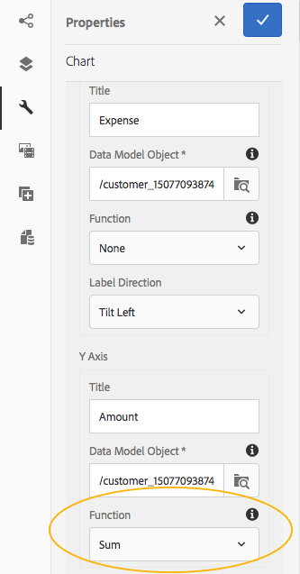

# 在交互式通信中使用图表 {#using-charts-in-interactive-communications}

>[!CAUTION]
>
>AEM 6.4已结束扩展支持，本文档将不再更新。 有关更多详细信息，请参阅 [技术支助期](https://helpx.adobe.com/cn/support/programs/eol-matrix.html). 查找支持的版本 [此处](https://experienceleague.adobe.com/docs/).

使用交互式通信中的图表，您可以将大量信息压缩为易于分析和理解的可视化格式

图表或图表是数据的可视表示形式。 它将大量信息浓缩为易于理解的可视格式，使交互式通信的收件人能够更好地可视化、解释和分析复杂数据。

在创建交互式通信时，可以添加图表以直观地表示来自交互式通信表单数据模型的二维数据。 图表组件允许您添加和配置以下类型的图表：

* 饼图
* 列
* 环形
* 条形图（仅限Web渠道）
* Line
* 线和点
* 点
* 区域

## 在交互式通信中添加和配置图表 {#add-and-configure-chart-in-an-interactive-communication}

完成以下步骤以向交互式通信添加图表：

1. 从AEM侧栏的“组件”中，将图表组件拖放到交互式通信的打印渠道或Web渠道的以下任一渠道中：

   * 打印渠道：目标区域和图像字段
   * Web渠道：面板和目标区域

   拖放的图表组件会为图表创建占位符。

1. 在交互式通信编辑器中点按图表组件，然后从组件工具栏中选择 **[!UICONTROL 配置(]** )。

   此时会显示属性侧栏，其中包含焦点图表的基本属性。

   
   **图：** *打印渠道中线型图表的基本属性*

   
   **图：** *Web渠道中折线图的基本属性*

1. 为打印渠道和Web渠道配置图表的基本属性。 除了常用属性外，还有特定于打印和Web渠道以及图表类型的属性。

   * **[!UICONTROL 名称]**:图表对象的名称。 您在此处指定的图表名称不会显示在图表输出中，但会在规则中用于引用图表。
   * **[!UICONTROL 图表类型]**:指定图表类型：饼图、列、圆环图、折线图、折线图和点、点或区域图。
   * **[!UICONTROL 隐藏对象]**:选择以在最终输出中隐藏图表。
   * 为指定以下内容 **[!UICONTROL x轴]** 和 **[!UICONTROL y轴]**:

      * **[!UICONTROL 标题]**:指定要在交互式通信中显示的X轴和Y轴的标题。
      * **[!UICONTROL 数据模型对象*]**:从创建交互式通信时指定的表单数据模型中浏览并选择图表X和Y轴的数据模型对象。 选择相同父数据模型对象的两个集合/数组类型属性，这些属性彼此有意义，以在图表的X和Y轴上绘制。
      * **[!UICONTROL 函数]**:要使用统计函数计算轴上的值，请为X/Y轴选择函数。 有关函数的更多信息，请参阅 [在图表中使用函数](#usefunction) 和 [示例2:求和与均值函数在折线图中的应用](#applicationsumfrequency).

   >[!NOTE]
   >
   >对于打印渠道，在X轴上，您绑定的数据模型对象应为“数字”、“字符串”或“日期”类型。 在Y轴上，绑定的数据模型对象应为Number类型。 建议您在打印渠道中使用右侧图例。

   有关图表属性的更多信息，请参阅 [图表中的基本属性](#basicpropertiescharts).

1. （仅打印渠道）在“代理设置”中，指定代理是否必须使用此图表。 如果 **[!UICONTROL 工程师必须使用此图表]** 选项时，代理可以点按代理UI“内容”选项卡中图表的眼睛图标来显示/隐藏图表。

   

1. 在属性侧栏中，点按 .

   预览以查看图表的外观和数据。 如有必要，请返回以重新配置图表的属性。

1. 返回到在交互式通信中进行其他更改。

## 示例1:打印和Web中的图表输出 {#chartoutputprintweb}

在“基本”选项卡中，您可以定义图表类型、包含数据的源表单数据模型属性、要在图表的x轴和y轴上绘制的标签，以及（可选）用于计算图表上绘制的值的统计函数。

让我们借助使用交互式通信生成的信用卡报表，详细了解基本属性中所需的最低信息。 假设您要生成一个图表来描述报表中不同费用的金额。 要使用不同类型的图表来打印和输出交互式通信。

要完成此操作，您需要指定：

* **[!UICONTROL 图表类型]**  — 在本例中，打印渠道的列和Web渠道的圆环图
* **[!UICONTROL 数据模型对象]** 作为图表X轴和Y轴的来源 — 在本例中，X轴的事务处理金额和Y轴的费用名称
* **[!UICONTROL 标题]** 对于X轴和Y轴（仅在本例中为打印渠道中的列类型图表） — 在本例中为X轴的金额($)和Y轴的费用。
* **[!UICONTROL 标签方向]** （仅在此示例中，适用于打印渠道中的列类型图表） — 在此示例中 `Tilt Left`

* **[!UICONTROL 工具提示]** 在将鼠标悬停在费用（仅限Web渠道）上时显示 — 在此示例中 `${x}: $ ${y}`，显示为 `[Expense Label: $ Amount]` (示例：主题公园游览：315美元)


**图：** *交互式通信的打印输出中的列图*

**A.** Y轴 — 从表单数据模型属性和标题属性中获取的金额设置为金额($) **B.** 将X轴设置为“左倾”的标签方向 **C.** X轴 — 从表单数据模型属性和标题属性设置为“费用”的表单获取的费用描述


**图：** *交互式通信Web输出中的圆环图*

**A.** 已设置圆环的“内半径”属性 **B.** 已选择“显示图例”属性，并将“图例位置”属性设置为“右侧” **C.** 工具提示将鼠标悬停在上方时显示项目的详细信息 — 工具提示设置为${x}:$ ${y}

## 示例2:和频函数在折线图中的应用 {#applicationsumfrequency}

通过在图表中应用函数，可以绘制表单数据模型不直接提供的数据。 在本例中，我们使用信用卡对帐单示例来了解如何将总和和频率函数应用于图表。


**图：** *没有包含三个“Bed and Breakfast”交易的函数的折线图*

### 求和函数 {#sum-function}

您可以应用sum函数来累加同一数据属性的多个实例的值，并只显示一次。 例如，在下图中，Y轴上应用Sum函数，以累计三个Bed and Breakfast交易（$99.45、$78和$12）的金额，并仅显示一个交易($189.45)。

当您想要对同一数据属性的多个实例进行汇总和显示总和时，总和函数可以使图表更有用。


### 频率函数 {#frequency-function}

Frequency函数返回X轴或Y轴上另一轴上给定值的值数。 通过在y轴(Amount/TransAmount)上应用频率函数，该图表显示，“Bed and Breakfast”事务处理已发生三次，其余事务类型已发生一次。


## 图表中的基本属性 {#basicpropertiescharts}

在“基本”选项卡中，您可以配置以下属性：

**名称** 图表元素的标识符。 名称在图表上不可见，但在引用其他组件、脚本和SOM表达式中的元素时会有所帮助。

**标题（仅限打印渠道）** 指定图表的标题。

**图表类型** 指定要生成的图表类型。 可用选项包括饼图、列、圆环图、条形图（仅限Web渠道）、折线图、折线图和点、点和区域。 有关详细信息，请参见示例1:打印和Web中的图表输出。

**X轴>标题** 指定x轴的标题。

**X轴>数据模型对象(&amp;A);** 指定要在x轴上绘制的表单数据模型集合项的名称。

**X轴>函数** 指定用于计算x轴上值的统计/自定义函数。 有关函数的更多信息，请参阅在图表和示例2中使用函数：求和和和均值函数在折线图中的应用。

**X轴>标签方向** 打印渠道中图表上标签的方向。 如果选择标签的方向作为“自定义旋转”(Custom Rotation)，则会显示“自定义旋转角度（度）”(Custom Rotation Angle(degres))字段。 在“自定旋转角度（度）”(Custom Rotation Angle(degres))字段中，可以按15度的步骤选择旋转角度。

**Y轴>标题** 指定y轴的标题。

**Y轴>数据模型对象(&amp;A);** 指定要在y轴上绘制的表单数据模型集合项。 在打印通道中，Y轴的数据模型对象应为“数字”类型。

**Y轴>函数** 指定用于计算y轴上值的统计/自定义函数。 有关函数的更多信息，请参阅在图表和示例2中使用函数：求和和和均值函数在折线图中的应用。

**显示图例** 显示饼图或圆环图的图例（启用时）。

**图例位置** 指定图例相对于图表的位置。 可用选项包括“右”、“左”、“上”和“下”。

**高度（仅限打印渠道）** 图表的高度（以像素为单位）。

**宽度（仅限打印渠道）** 图表的宽度（以像素为单位）。

>[!NOTE]
>
>您可以使用样式层或通过应用主题来控制Web渠道中图表的宽度。

**工具提示（仅限Web渠道）** 指定工具提示在Web渠道图表中数据点上鼠标悬停时显示的格式。 默认值为\${x}(\${y})。 根据图表类型，当您将鼠标指向图表中的点、条或切片时，变量\${x}和\${y}将动态替换为x轴和y轴上的相应值，并显示在工具提示中。

要禁用工具提示，请将“工具提示”字段留空。 此选项不适用于折线图和面积图。 例如，请参阅 [示例1:打印和Web中的图表输出](#chartoutputprintweb).

**CSS类（仅限Web渠道）** 在CSS类字段中指定CSS类的名称，以将自定义样式应用于图表。

**之前的必填分页符（仅限打印渠道）** 选择以在图表之前添加强制的分页符，并将图表置于新页面的顶部。

**之后的强制分页（仅限打印渠道）** 选择以在图表之后添加强制的分页符，并将内容放在图表之后的新页面顶部。

**缩进（仅打印渠道）** 从页面左侧指定图表的缩进。

**特定于图表的配置** 除了常见配置外，还提供以下特定于图表的配置：

* **内半径**:可用于圆环图以指定图表中内圆的半径（以像素为单位）。
* **线条颜色**:可用于折线图、折线图、点图和面积图，以指定图表中折线图颜色的十六进制值。
* **点颜色**:可用于点图、折线图和点图以指定图表中点的颜色十六进制值。

* **区域颜色**:面积图可用于指定图表线条下方区域的十六进制颜色值。

## 在图表中使用函数 {#usefunction}

您可以将图表配置为使用统计函数从源数据计算值，以便在图表上绘制。 通过在图表中应用函数，可以绘制表单数据模型不直接提供的数据。

虽然图表组件附带一些内置函数，但您可以编写自己的函数，并将其用于Web渠道的图表配置中。



>[!NOTE]
>
>可以使用函数计算图表中X轴或Y轴的值。

### 默认函数 {#default-functions}

图表组件默认提供以下函数：

**平均值（平均值）** 返回X轴或Y轴上另一个轴上给定值的平均值。

**总和** 返回X轴或Y轴上另一个轴上给定值的所有值的总和。

**最大值** 返回X轴或Y轴上另一轴上给定值的最大值。

**频率** 返回X轴或Y轴上另一轴上给定值的值数。

**范围** 返回X轴或Y轴上给定值的最大值与最小值之间的差值。

**中间值** 返回在X轴或Y轴上分隔较高值和较低值的值，该值在另一个轴上分隔给定值。

**最小** 返回X轴或Y轴上另一轴上给定值的最小值。

**模式** 返回在X轴或Y轴上出现次数最多的值，该值对应于另一个轴上的给定值

### Web渠道中的自定义函数 {#custom-functions-in-web-channel}

除了在图表中使用默认函数外，您还可以在JavaScript™中编写自定义函数，并在图表组件中用于Web渠道的函数列表中提供这些函数。

函数以数组或值以及类别名称作为输入并返回值。 例如：

```
Multiply(valueArray, category) {
 var val = 1;
 _.each(valueArray, function(value) {
 val = val * value;
 });
 return val;
}
```

编写自定义函数后，请执行以下操作以使其可在图表配置中使用：

1. 在与相关交互式通信关联的客户端库中添加自定义函数。 有关更多信息，请参阅 [配置提交操作](/help/forms/using/configuring-submit-actions.md) 和 [使用客户端库](/help/sites-developing/clientlibs.md).

1. 要在“函数”下拉菜单中显示自定义函数，请在CRXDe Lite中，创建 `nt:unstructured` 节点，其中包含以下属性：

   * 添加属性 `guideComponentType` 值为 `fd/af/reducer`. （必填）
   * 添加属性 `value` 到自定义JavaScript™函数的完全限定名称。 （必需）并将其值设置为自定义函数的名称，如Multiply。
   * 添加属性 `jcr:description` 其中，要显示为“函数”下拉列表中自定义函数名称的值。 例如， **乘**.
   * 添加属性 `qtip` 值将简短地描述自定义函数。 将指针悬停在 **函数** 下拉列表。

1. 单击 **全部保存** 以保存配置。

函数现在可在图表中使用。
