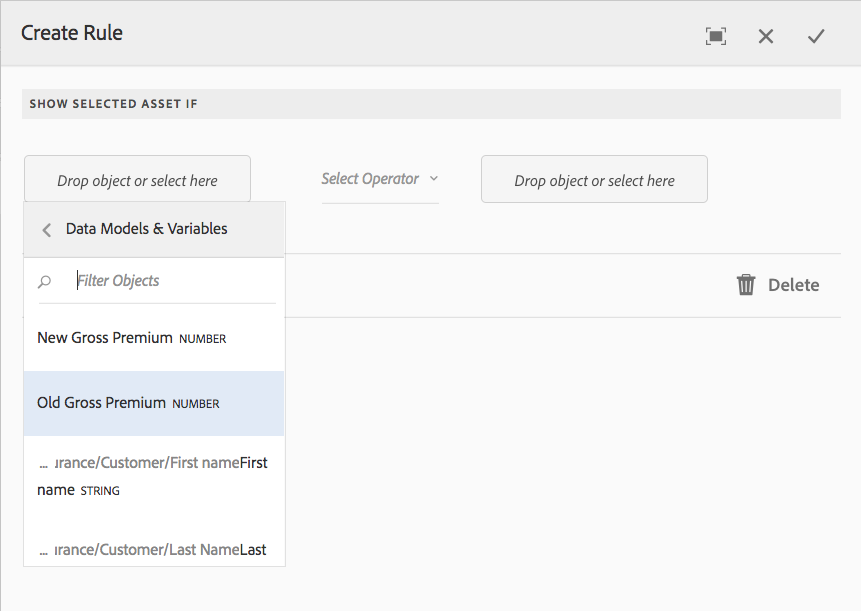

# 交互通信中的条件 {#conditions-in-interactive-communications}

创建和编辑要在交互通信中使用的条件片段——条件是用于构建交互通信的四种类型的文档片段之一。 另外三个是文本、列表和布局片段。

## 概述 {#overview}

条件是可以包含在交互通信中的文档片段。 其他文档片段是文 [本](/help/forms/using/texts-interactive-communications.md)、列表和布局片段。 条件允许您根据提供的数据和规则定义一个或多个上下文资产，这些资产将包含在交互式通信中。

示例:

* 在信用卡对帐单中，根据客户的信用卡类型显示信用卡年费和信用卡图像。
* 在保险费到期提醒中，显示根据客户所在州的税款计算的税款。

根据已应用的规则和传递给规则的值呈现的条件中的资产。 条件中的规则可以检查以下类型数据中的值：

* 关联表单数据模型的属性
* 在条件中创建的任何变量
* 字符串
* 数字
* 数学表达式
* 日期

## Create condition {#createcondition}

1. 选择“ **[!UICONTROL 表单]** ”>“ **[!UICONTROL 文档片段”]**。
1. 选择 **[!UICONTROL 创建]** >条 **[!UICONTROL 件]**。
1. 指定以下信息：

   * **[!UICONTROL 标题]**:（可选）输入条件的标题。 标题不必是唯一的，并且可以具有特殊字符和非英文字符。 条件由其标题（如果可用）引用，例如在缩略图和属性中。
   * **[!UICONTROL 名称]**:条件的唯一名称，在文件夹中。 任何状态中都不能存在两个文档片段（文本、条件或列表），并且文件夹中的名称相同。 在“名称”字段中，只能输入英语字符、数字和连字符。 名称字段会根据标题字段自动填充。 在“标题”字段中输入的特殊字符、空格、数字和非英语字符将替换为“名称”字段中的连字符。 尽管“标题”字段中的值会自动复制到“名称”中，但您可以编辑该值。
   * **[!UICONTROL 说明]**:键入文档片段的说明。
   * **[!UICONTROL 表单数据模型]**:（可选）选择“表单数据模型”单选按钮，以基于表单数据模型创建条件。 选择“表单数据模型”单选按钮时，将显 **[!UICONTROL 示“表单数据模型*]** ”字段。 浏览并选择表单数据模型。 在为交互式通信创建条件时，请确保您使用的数据模型与要在交互式通信中使用的数据模型相同。 有关表单数据模型的详细信息，请参阅 [数据集成](/help/forms/using/data-integration.md)。
   * **[!UICONTROL 标记]**:（可选）要创建自定义标记，请在文本字段中输入值，然后点按Enter。 保存此条件时，将创建新添加的标记。

1. 点按下 **[!UICONTROL 一步]**。

   “创建条件”页面。

   

1. 点按 **[!UICONTROL 添加资产]**。

   选择资产页面会显示可用的文本、列表、条件和可在条件中添加的图像。

   >[!NOTE]
   >
   >“选择资产”页面中仅显示基于无基础的新创建资产和基于FDM的资产（使用与创建条件相同的FDM创建）。

1. 点按相应的资产以选择要包含在条件中的资产，然后点按完 **[!UICONTROL 成]**。

   创建条件”页面，并列出添加的资产。

   

   您可以使用以下选项来管理条件中的资产：

   

   **`[A]`拒绝更改。**点按此图标可拒绝您对资产和条件中的规则所做的更改。

   **`[B]`接受更改。**点按此图标以接受您在资产和条件中的规则中所做的更改。

   **`[C]`复制资产。**点按此图标，以在条件中创建资产的副本以及已应用的规则（如果有）。 然后，您可以继续编辑重复资产的规则和资产。 复制资产对于创建类似规则以根据特定上下文显示替代资产很有用。

   **`[D]`显示预览.**点按此图标可在创建\编辑条件页面中显示资产的预览。

   **`[E]`重新排序.**点按并按住此图标可拖放资产以在某个条件内对其重新排序。

   您可以选择以下选项以指定条件在运行时的行为方式：

   * **已禁用多个结果评估\启用多个结果评估**:启用此选项（显示为“已启用多个结果评估”）后，将评估所有规则，结果是所有真实规则的总和。 如果禁用此选项（显示为“已禁用多个结果评估”），则仅评估发现为true的第一个规则，并成为条件的输出。
   * **分页符**:选择此选项( )可在条件的资产之间添加分页符。 如果未选择此选项( )，则如果条件溢出到打印输出中的下一页，则整个条件将移至下一页，而不是在该条件中的资产之间的页中断。

1. 点按 **[!UICONTROL 创建规则]** ，以根据需要添加规则以显示或隐藏资产。 要在规则中使用变量，请参阅 [创建变量](#variables)。 有关详细信息，请参 [阅将规则添加到条件](#ruleeditor)。

   创建的规则显示在创建条件屏幕的RULE列中。

   

   >[!NOTE]
   >
   >您可以在已应用规则或重复应用的条件中插入资产。

1. 点按&#x200B;**[!UICONTROL 保存]**。

   条件已创建。 现在，您可以在创建交互式通信时继续将条件用作构建块。

   >[!NOTE]
   >
   >要保存新条件或已编辑条件，您必须至少为该条件中添加的每个资产具有一条规则。

## 编辑条件 {#edit-a-condition}

您可以使用以下步骤编辑条件。 您还可以通过在弹出菜单中选择编辑片段，从交互通信中选择编辑条件。

1. 选择“ **[!UICONTROL 表单]** ”>“ **[!UICONTROL 文档片段”]**。
1. 导航到该条件并将其选中。
1. 点按 **[!UICONTROL 编辑]**。
1. 在条件中进行所需的更改。 有关可在条件中更改的信息的更多详细信息，请参阅创 [建条件](#createcondition)。
1. 点按 **[!UICONTROL 保存]** ，然后点按 **[!UICONTROL 关闭]**。

## 在条件下创建规则 {#ruleeditor}

在条件中使用规则编辑器，您可以创建规则以根据预设条件显示或隐 **藏资产**。 这些条件可以基于以下条件构建：

* 字符串
* 数字
* 数学表达式
* 日期
* 关联表单数据模型的属性
* 您可 [能已](#variables) 创建的任何变量

### 在条件中创建规则 {#create-rule-in-condition}

1. 在创建或编辑条件时，点按相  （规则编辑器）图标。

   此时将显示创建规则对话框。 除了字符串、数字、数学表达式和日期之外，规则编辑器中还提供以下内容，用于创建规则的语句：

   * 关联表单数据模型的属性
   * 您可 [能已](#variables) 创建的任何变量。
   

   选择要评估的相应选项。

   >[!NOTE]
   >
   >创建用于显示资产的规则时不支持集合属性。

1. 选择相应的运算符以评估规则，如“等于”、“包含”和“开头为”。
1. 插入计算表达式、字符串、数据模型属性、变量或日期。

   

   在策略类型为标准时显示资产的规则

   * 在创建或编辑规则时，您还可以点按  (Resize)以展开“创建规则／编辑规则”对话框。 扩展的全窗口对话框允许您创建变 [量](#variables) ，以构建规则。 再次点按调整大小以返回到常规的创建规则对话框。
   * 您还可以在规则中创建多个条件。

1. 点按&#x200B;**[!UICONTROL 完成]**。

   规则将应用于资产。

## 在条件中创建和使用变量 {#variables}

在条件中创建或编辑规则时，可点按  (Resize)以展开“创建规则\编辑规则”对话框。 扩展的全窗口对话框允许您：

* 在规则中创建和使用变量
* 规则中表单数据模型的属性和变量

再次点按调整大小以返回“创建规则\编辑规则”对话框。

### 创建变量 {#create-variables}

1. 在条件中创建或编辑规则时，可点按  (Resize)以展开“创建规则／编辑规则”对话框。

   将出现“扩展的全窗口”对话框。

   

1. 在左窗格中，点按变 **[!UICONTROL 量]**。

   此时会出现“变量”窗格。

   

1. 点按&#x200B;**[!UICONTROL 创建]**。

   此时会显示“创建变量”窗格。

1. 输入以下信息，然后点按 **[!UICONTROL 创建]**:

   * **[!UICONTROL 名称*]**:变量的名称。
   * **[!UICONTROL 说明]**:（可选）输入有关变量的说明。
   * **[!UICONTROL 类型*]**:选择变量类型：字符串、数字、布尔值或日期。
   * **[!UICONTROL 仅允许特定值]**:对于字符串和数字变量，您可以确保代理在代理UI中从特定的一组值中选择占位符。 要指定值集，请选择此选项，然后指定“值”*字段中允许的以逗号分隔的 **[!UICONTROL 值]** 。

1. 点按&#x200B;**[!UICONTROL 创建]**。

   变量将创建并列在“变量”窗格中。

1. 要在规则中插入变量，请将该变量拖放到规则中某个选项的占位符中。
1. 构建有效规则后，点按完 **[!UICONTROL 成]**。

   根据需要，继续在条件中进行进一步更改并保存。

