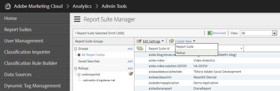
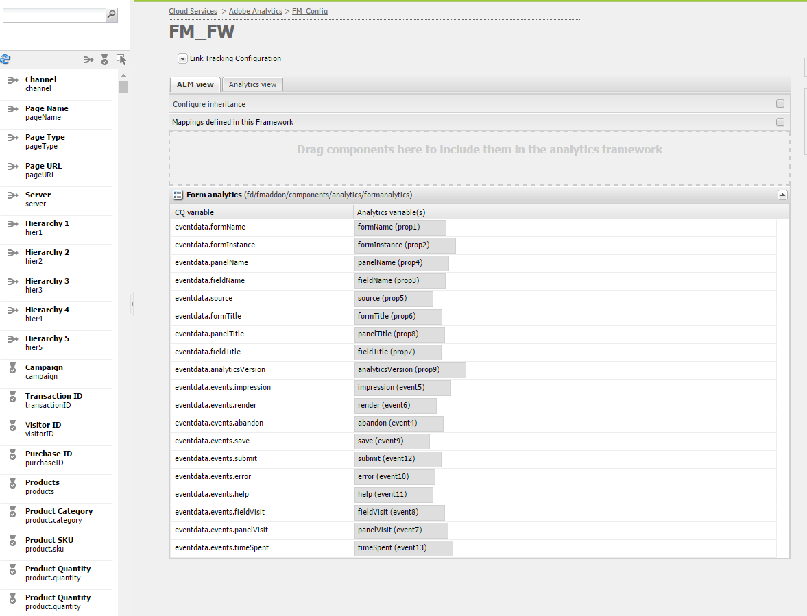

# 配置分析和报告 {#configuring-analytics-and-reports}

AEM Forms与Adobe Analytics集成，使您能够捕获和跟踪已发布表单和文档的绩效指标。 分析这些指标的目的是根据使表单或文档更可用所需的更改数据做出明智决策。

>[!NOTE]
>
>AEM Forms的分析功能可作为AEM Forms加载项包的一部分提供。 有关安装加载项包的信息，请参阅安 [装和配置AEM Forms](/help/forms/using/installing-configuring-aem-forms-osgi.md)。
>
>除了加载项包外，您还需要AEM实例的Adobe Analytics帐户和管理员权限。 有关该解决方案的信息，请参 [阅Adobe Analytics](https://www.adobe.com/solutions/digital-analytics.html)。

## 概述 {#overview}

您可以使用Adobe Analytics发现用户在使用自适应表单、HTML5表单和交互式通信时遇到的交互模式和问题。 开箱即用，Adobe分析会跟踪和存储有关以下参数的信息：

* **平均填充时间**: 填写表单的平均时间。
* **演绎版**: 表单的打开次数。
* **草稿**: 表单在草稿状态中保存的次数。
* **提交**: 提交表单的次数。
* **中止**: 用户在未完成表单的情况下离开的次数。

您可以自定义Adobe Analytics以添加／删除更多参数。 除了上述信息，报告还包含有关HTML5和自适应表单的每个面板的以下信息：

* **时间**: 在面板和面板字段上花费的时间。
* **错误**: 面板和面板字段上遇到的错误数。
* **帮助**: 用户打开面板帮助和面板字段的次数。

## 创建报表包 {#creating-report-suite}

分析数据存储在客户特定存储库（称为报表包）中。 要创建报表包并使用Adobe Analytics，您必须拥有有效的Adobe Marketing Cloud帐户。 在执行以下步骤之前，请确保您具有有效的Adobe Marketing Cloud帐户。

请执行以下步骤来创建报表包。

1. 登录网 [址：https://sc.omniture.com/login/](https://sc.omniture.com/login/)
1. 在Marketing Cloud中，选择 **管理** > **Admin Console** > **报**&#x200B;表包。
1. 在报 **表包管理器****中选择** “新建”>“报表包”。

   

   新建报表包

1. 确保将第一个下拉列表设置为“从 **模板创建”** ，然后选择 **“商务”**。

1. 找到报 **表包ID字段** ，然后添加新的报表包ID。 例如，JJEsquire。 报表包ID显示在报表包ID字段的下方。 它包含一个自动前缀，通常是公司名称。

1. 添加新 **站点标题**。 例如，JJEsquire Getting Suite。 此标题在Analytics UI中使用。 在代码中使用报表包ID。

1. 从下拉 **菜单中选择** “时区”。 此报表包中的所有数据都将根据定义的时区进行记录。

1. 将“基 **本URL** ”和“ **默认页面** ”字段保留为空。 这两个值仅从Adobe Marketing Cloud界面用于链接到您的网站。
1. 将“开始 **生效日期** ”设置为今天。 开始起始日期决定激活报表包的日期。

1. 在“估 **计的每天页面视图** ”字段中，键入100。 使用此字段可估计您预计网站每天的页面视图数。 此估计允许Adobe配置适当数量的硬件以处理您要收集的数据。

1. 从下拉 **菜单中选择** “基本货币”。 此报表包中的所有货币数据都将以此货币格式转换和存储。

1. 单击 **创建报表** Suite。 您应当看到页面刷新，并显示一条消息，告知您的报表包已成功创建。

1. 选择新建的报表包。 导航到 **编辑设置** >常 **规** >一 **般帐户设置**。

   
   **图：** *常规帐户设置*

1. 在“常规帐户设置”屏幕中，启 **用“地理报告**”，然后单 **击“保存**”。
1. 导航到 **编辑设置** > **流量** >流 **量变量**。

1. 在报表包中，配置并启用以下流量变量。

   * **formName**: 自适应表单的标识符。
   * **formInstance**: 自适应表单实例的标识符。 为此变量启用路径报告。
   * **fieldName**: 自适应表单字段的标识符。 为此变量启用路径报告。
   * **panelName**: 自适应表单面板的标识符。 为此变量启用路径报告。
   * **formTitle**: 表单的标题。
   * **fieldTitle**: 表单字段的标题。
   * **panelTitle**: 表单面板的标题。
   * **analyticsVersion**: 表单分析版本。

1. 导航到 **编辑设置** >转 **换** >成 **功事件**。 定义并启用以下成功事件:

   | 成功事件 | 类型 |
   |---|---|
   | 放弃 | 计数器 |
   | 渲染 | 计数器 |
   | panelVisit | 计数器 |
   | fieldVisit | 计数器 |
   | 保存 | 计数器 |
   | 错误 | 计数器 |
   | 帮助 | 计数器 |
   | 提交 | 计数器 |
   | timeSpent | 数值 |

   >[!NOTE]
   >
   >用于配置AEM Forms分析的事件号和属性号必须与AEM分析配置中使用的事件号和属性 [号不](/help/sites-administering/adobeanalytics.md) 同。

1. 注销Adobe Marketing Cloud帐户。

## 创建Cloud Service配置 {#creating-cloud-service-configuration}

Cloud Service配置是关于您的Adobe Analytics帐户的信息。 此配置使Adobe Experience Manager(AEM)能够连接到Adobe Analytics。 为您使用的每个Analytics帐户创建单独的配置。

1. 以管理员身份登录到AEM作者实例。
1. 在左上角，单击 **Adobe Experience Manager** >工 **具** > **** > **Propelyment** Cloud Services。
1. 找到 **Adobe Analytics** 图标。 单击 **显示配置** ，然后继续单击 **[+以添]** 加新配置。

   如果您是首次使用者，请单击“立即 **配置”**。

1. 为新配置添加标题（填写名称字段是可选字段）。 例如，我的分析配置。 单击&#x200B;**创建**。

1. 当配置页面上的编辑面板打开时，填写以下字段：

   * **公司**: 你公司的名字在Adobe Analytics。

   * **用户名**: 用于登录Adobe Analytics的名称。

   * **密码**: 上述帐户的Adobe Analytics密码。

   * **数据中心**: 您的Adobe Analytics帐户的数据中心。

1. 单击 **连接到分析**。 将显示一个对话框，其中显示连接成功的消息。 单击&#x200B;**确定**。

## 创建Cloud Service框架 {#creating-cloud-service-framework}

Adobe Analytics框架是Adobe Analytics变量与AEM变量之间的一组映射。 使用框架配置表单如何将数据填充到Adobe Analytics报表。 框架与Adobe Analytics配置相关。 您可以为每个配置创建多个框架。

1. 在AEM云服务控制台上，单击 **Adobe Analytics**&#x200B;下的显示配置。

1. 单击 **[Analytics配]** 置旁边的+链接。

   
   **图：** *Adobe Analytics配置*

1. 键入框 **架的标** 题 **** 和名称 **，选择** “Adobe Analytics框架”，然 **后单击“**&#x200B;创建”。 此时将打开框架进行编辑。

1. 在侧面窗格的“报表包”部 **分中**，单击“添加项目”，然后使用下拉框选择框架将与之交互的报表包ID（例如JJEsquire）。

1. 在报表包ID旁，选择要向报表包发送信息的服务器实例。

   

1. 将表 **单分析组件** 从其 **他类别** 从SideKick拖到框架上。
1. 要将Analytics变量与组件中定义的变量进行映射，请将变量从AEM Content Finder拖到跟踪组件上的字段上。

   

1. 使用Sidekick中的页面选 **项卡激活框** 架，单击 **激活框架**。

## 配置AEM Forms分析配置服务 {#configuring-aem-forms-analytics-configuration-service}

1. 在创作实例上，打开位于https://&lt;*server*>:&lt;*port*>/system/console/configMgr的AEM Web Console Configuration Manager。
1. 找到并打开AEM Forms分析配置

   
   **图：** *AEM Forms分析配置服务*

1. 为以下字段指定适当的值，然后单击“ **保存**”。

   * **SiteCatalyst框架**: 在设置跟踪框架部分中选择您定义的框架／配置。
   * **字段时间跟踪基线**: 指定跟踪字段访问的持续时间（以秒为单位）。 默认值为 0。当值大于0（零）时，将向Adobe Analytics服务器发送两个单独的跟踪事件。 第一个事件指示分析服务器停止跟踪退出字段。 在经过指定的持续时间后发送第二个事件。 第二个事件指示分析服务器开始跟踪已访问字段。 使用两个单独的事件有助于准确测量在某个字段上花费的时间。 当值为0（零）时，将向Adobe Analytics服务器发送单个跟踪事件。
   * **分析报告同步cron**: 指定从Adobe Analytics获取报告的cron表达式。 默认值为0 0 2 ?。
   * **提取报告超时：** 指定等待服务器响应分析报告的持续时间（以秒为单位）。 默认时间为120秒。

   >[!NOTE]
   >
   >超时报告提取操作和指定的秒数最多可能需要10秒。

1. 对发布实例重复步骤1-3以配置分析。

现在，您可以启用表单分析并生成分析报告。

## 为表单或文档启用分析 {#enabling-analytics-for-a-form-or-document}

1. 登录AEM门户网站 `https://[hostname]:[port]`。
1. 单击 **Forms>Forms和文档**，选择一个表单或文档，然后单击启 **用分析**。 分析已启用。

   
   **图：** *为表单启用分析*

   **A.** “启用分析”按 **钮B.选** 定表单

   有关查看表单分析报告的详细信息，请参阅查 [看和了解AEM Forms分析报告](/help/forms/using/view-understand-aem-forms-analytics-reports.md)

