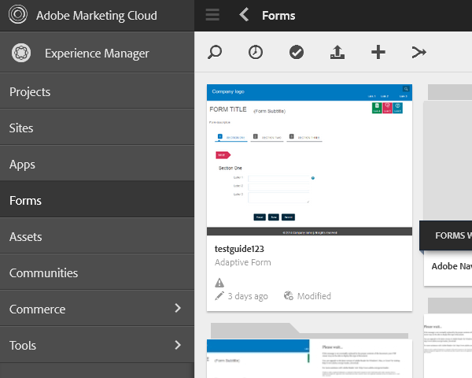

# 配置同步调度程序 {#configuring-the-synchronization-scheduler}

默认情况下，同步调度程序会在每3分钟后运行一次，以通过LiveCycle工作台11同步存储库中修改和更新的所有资产。 同步过程完成后，包含表单和资源的应用程序在AEM Forms用户界面中可见。

## 更改同步调度程序的时间间隔 {#change-interval-of-the-synchronization-scheduler}

请执行以下步骤来更改同步调度程序的时间间隔：

1. 登录到AEM Configuration Manager。 Configuration Manager的URL为 `https://[Server]:[Port]/lc/system/console/configMgr`

1. 找到并打开 **FormsManagerConfiguration** bundle。

1. 为“同步调度程序频率”选 **项指定新值** 。

   频率的单位是分钟。 例如，要将调度程序配置为每60分钟运行一次，请指定60。

## 同步资产 {#synchronizing-assets}

您可以使用“ **从存储库同步资产** ”选项手动同步资产。 请执行以下步骤以手动同步资产：

1. 登录AEM Forms。 默认URL为 `https://[Server]:[Port]/lc/aem/forms/`。

   

   **图：** *AEM Forms用户界面*

1. 单击工  _sync图标。 如果您在最后配置的路径上没有任何资产，则会出现如下对话框。 单击 **开始** ，以启动同步。

   

   **图：** *“同步”对话框*

## 同步错误疑难解答 {#troubleshooting-synchronization-error}

您可以在工作流设计器(LiveCycle工作台)中创建新应用程序。

如果新创建的应用程序和/content/dam/formsanddocuments中的文件夹具有相同的名称，则会出现错误“*根级别已存在与此应用程序同名的资产。*”。

要解决冲突，请重命名应用程序，然后手动同步资产。

**图：** *“资产同步”对话框中的冲突*

