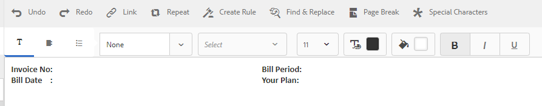

# 教程： 创建文档片段 {#tutorial-create-document-fragments}

为交互式通信创建文档片段

本教程是创建您的第一个 [交互式通信系列中的一个](/help/forms/using/create-your-first-interactive-communication.md) 步骤。 建议按照时间顺序按照系列来了解、执行和演示完整的教程用例。

文档片段是用于组成交互通信的通信的可重用组件。 文档片段有以下类型：

* 文本——文本资产是由一个或多个文本段落组成的内容。 段落可以是静态的或动态的。
* 列表-列表是一组文档片段，包括文本、列表、条件和图像。
* 条件——条件允许您根据从表单数据模型接收的数据定义交互通信中包含的内容。

本教程将指导您逐步根据“规划交互式通信”部分中提供的解剖结构创 [建多个文本文档片段](/help/forms/using/planning-interactive-communications.md) 。 在本教程的结尾，您将能够：

* 创建文档片段
* 创建变量
* 创建和应用规则

以下是本教程中创建的文档片段的列表:

* [帐单详细信息](/help/forms/using/create-document-fragments.md#step-create-bill-details-text-document-fragment)
* [客户详细信息](/help/forms/using/create-document-fragments.md#step-create-customer-details-text-document-fragment)
* [帐单摘要](/help/forms/using/create-document-fragments.md#step-create-bill-summary-text-document-fragment)
* [费用汇总](/help/forms/using/create-document-fragments.md#step-create-summary-of-charges-text-document-fragment)

每个文档片段都包括带有静态文本的字段、从表单数据模型接收的数据以及使用代理UI输入的数据。 “规划交互式通信”部分中 [描述了所有这些字段](/help/forms/using/planning-interactive-communications.md) 。

在本教程中创建文档片段时，会为使用代理UI接收数据的字段创建变量。

如 **创建表单数据模型部分中所**&#x200B;述，请使用FDM_Create_First_IC  ，作为本教程中用于创建文档片段的表单数据模型。

## 第1步： 创建帐单详细信息文本文档片段 {#step-create-bill-details-text-document-fragment}

“清单详细信息”文档片段包含以下字段：

| 字段 | 数据源 |
|---|---|
| 发票编号 | 代理 UI |
| 帐单期间 | 代理 UI |
| 帐单日期 | 代理 UI |
| 您的计划 | 表单数据模型 |

执行以下步骤，为以Agent UI为数据源的字段创建变量，创建静态文本，并在文档片段中使用表单数据模型元素：

1. 选择 **[!UICONTROL Forms]** > **[!UICONTROL 文档片段]**。

1. 选择 **创建** > **文本**。
1. 指定以下信息：

   1. 在“ **标题”字段中输入bill_details** _first_ic **作为名称** 。 标题将自动填充在“名称” **字段中** 。
   1. 从“ **数据模型** ”部分选 **择“表单数据模型** ”。
   1. 选 **择FDM_Create_First_IC** 作为表单数据模型，然后点按 **选择**。
   1. 点按 **下一步**。

1. 选择左侧 **窗格** 中的“变量”选项卡，然后点 **按创建**。
1. 在创建 **变量部分** :

   1. 输入 **发票编号** ，作为变量的名称。
   1. 选择 **字符串** （类型）。
   1. 点按&#x200B;**创建**。

   

   重复第4步和第5步，创建以下变量：

   * 开单期间： 字符串类型
   * 帐单日期： 日期类型

   

1. 使用右侧窗格为以下字段创建静态文本：

   * 发票编号
   * 帐单期间
   * 帐单日期
   * 您的计划

   

1. 将光标放在“发票 **否** ”字段旁，并在左窗格的“变量”选项卡中 **按住InvoiceNumber** (InvoiceNumber **** 变量)。
1. 将光标放在“帐单期间” **字段旁** ，并多次单 **击“帐单期间** ”变量。
1. 将光标放在“帐单日期” **字段旁** ，并多次单 **击“帐单日期** ”变量。
1. 在左窗格 **中选择** “数据模型对象”(Data Model Objects)选项卡。
1. 将光标放在“您的计 **划”字段旁** ，然后多次 **单击“** customer **** ” > customerplan属性。

   

1. 单击 **保存** ，以创建“清单详细信息”文本文档片段。

## 第2步： 创建客户详细信息文本文档片段 {#step-create-customer-details-text-document-fragment}

“客户详细信息”文档片段包括以下字段：

| 字段 | 数据源 |
|---|---|
| 客户名称 | 表单数据模型 |
| 地址 | 表单数据模型 |
| 供应地 | 代理 UI |
| 状态代码 | 代理 UI |
| 移动号码 | 表单数据模型 |
| 备用联系人号码 | 表单数据模型 |
| 关系编号 | 表单数据模型 |
| 连接数 | 代理 UI |

执行以下步骤，为以Agent UI为数据源的字段创建变量，创建静态文本，并在文档片段中使用表单数据模型元素：

1. 选择 **[!UICONTROL Forms]** > **[!UICONTROL 文档片段]**。
1. 选择 **创建** > **文本**。
1. 指定以下信息：

   1. 在 **“标题”字段中输入customer_details** _first_ic **作为名称** 。 标题将自动填充在“名称” **字段中** 。
   1. 从“ **数据模型** ”部分选 **择“表单数据模型** ”。
   1. 选 **择FDM_Create_First_IC** 作为表单数据模型，然后点按 **选择**。
   1. 点按 **下一步**。

1. 选择左侧 **窗格** 中的“变量”选项卡，然后点 **按创建**。
1. 在创建 **变量部分** :

   1. 输 **入** Placesupply作为变量的名称。
   1. 选择 **字符串** （类型）。
   1. 点按&#x200B;**创建**。

   重复第4步和第5步，创建以下变量：

   * 语句代码： 数字类型
   * 数字连接： 数字类型

1. 选择“ **多次模型对象** ”选项卡，将光标放在右侧窗格中，然后 **单击“** customer **”** > name属性。
1. 按Enter将光标移到下一行，然后多次单击 **customer** > **address** 属性。
1. 使用右侧窗格为以下字段创建静态文本：

   * 移动号码
   * 备用联系人号码
   * 供应地
   * 关系编号
   * 状态代码
   * 连接数

   

1. 将光标放在“Mobile Number” **字段旁** ，然后多次 **单击“** customer **** ” > mobilenum属性。
1. 将光标放在“Alternate Contact Number(备用联 **系号码** )”字段旁，并按住多次 **单击“customer** > **alternatemobilenumber** （客户>替代mobilenumber）”属性。
1. 将光标放在“关系编 **号”字段旁** ，并按住多次 **单击“客户** ” **>“** 关系编号”属性。
1. 选择“ **变量** ”选项卡，将光标放在“ **Place of Supply** ”（供应位置）字段旁，并多次 **单击Placesupply** （放置）变量。
1. 将光标放在“状态代码 **”字段旁** ，并多次单击 **“状态代码** ”变量。
1. 将光标放在“连接数 **”字段旁** ，并多次单击“ **数量连接** ”变量。

   

1. 单击 **保存** ，以创建Customer Details（客户详细信息）文本文档片段。

## 第3步： 创建帐单汇总文本文档片段 {#step-create-bill-summary-text-document-fragment}

“清单汇总”文档片段包含以下字段：

| 字段 | 数据源 |
|---|---|
| 上一余额 | 代理 UI |
| 付款 | 代理 UI |
| 调整 | 代理 UI |
| 当前帐单期间的费用 | 表单数据模型 |
| 到期金额 | 代理 UI |
| 到期日期 | 代理 UI |

执行以下步骤，为以Agent UI为数据源的字段创建变量，创建静态文本，并在文档片段中使用表单数据模型元素：

1. 选择 **[!UICONTROL Forms]** > **[!UICONTROL 文档片段]**。
1. 选择 **创建** > **文本**。
1. 指定以下信息：

   1. 在“ **标题”字段中输入bill** _summary_first_ic **作为名称** 。 标题将自动填充在“名称” **字段中** 。
   1. 从“ **数据模型** ”部分选 **择“表单数据模型** ”。
   1. 选 **择FDM_Create_First_IC** 作为表单数据模型，然后点按 **选择**。
   1. 点按 **下一步**。

1. 选择左侧 **窗格** 中的“变量”选项卡，然后点 **按创建**。
1. 在创建 **变量部分** :

   1. 输 **入** “预览余额”作为变量的名称。
   1. 选择 **数字** （类型）。
   1. 点按&#x200B;**创建**。

   重复第4步和第5步，创建以下变量：

   * 付款： 数字类型
   * 调整： 数字类型
   * 到期款项： 数字类型
   * Duedate: 日期类型

1. 使用右侧窗格为以下字段创建静态文本：

   * 上一余额
   * 付款
   * 调整
   * 当前帐单期间的费用
   * 到期金额
   * 到期日期
   * 到期日后的延迟付款费用为$ 20

   

1. 将光标放在“上一个余 **额”字段旁** ，并多次单击“ **上一个余额** ”变量。
1. 将光标放在“付款”字 **段旁** ，并多次单击 **“付款** ”变量。
1. 将光标放在“调整” **字段旁** ，并多次单击“调 **整** ”变量。
1. 将光标放在“到期 **金额** ”字段旁，并多次 **单击Amountdue** 变量。
1. 将光标放在“到期日 **期”字段旁** ，并多次单 **击Duedate** 变量。
1. 选择“ **数据模型对象** ”标签，将光标放在右侧窗格中的“ **当前开单期间** ”字段旁，并多次单击“清单 **”>“****** ”属性。

   

1. 单击 **保存** ，以创建Customer Details（客户详细信息）文本文档片段。

## 第4步： 创建费用文本文档片段的汇总 {#step-create-summary-of-charges-text-document-fragment}

费用文档片段的汇总包括以下字段：

| 字段 | 数据源 |
|---|---|
| 通话费 | 表单数据模型 |
| 电话会议费用 | 表单数据模型 |
| 短信费用 | 表单数据模型 |
| 移动Internet费用 | 表单数据模型 |
| 国家漫游费用 | 表单数据模型 |
| 国际漫游费用 | 表单数据模型 |
| 增值服务费 | 表单数据模型 |
| 总费用 | 表单数据模型 |
| 应付总额 | 表单数据模型 |

执行以下步骤以创建静态文本并在文档片段中使用表单数据模型元素：

1. 选择 **[!UICONTROL Forms]** > **[!UICONTROL 文档片段]**。
1. 选择 **创建** > **文本**。
1. 指定以下信息：

   1. 在 **“标题”字段中输入** summary_charges_first_ic **作为名称** 。 标题将自动填充到名称字段中。
   1. 从“ **数据模型** ”部分选 **择“表单数据模型** ”。
   1. 选 **择FDM_Create_First_IC** 作为表单数据模型，然后点按 **选择**。
   1. 点按 **下一步**。

1. 使用右侧窗格为以下字段创建静态文本：

   * 通话费
   * 电话会议费用
   * 短信费用
   * 移动Internet费用
   * 国家漫游费用
   * 国际漫游费用
   * 增值服务费
   * 总费用
   * 应付总额

   

1. 选择“数 **据模型对象** ”选项卡。
1. 将光标放在“呼叫费 **用”字段旁** ，并多次 **单击“帐单** ” **>“呼** 叫费用”属性。
1. 将光标放在“电话会议 **费用”字段旁** ，并按住多次单 **击“帐单** ” **>“** confcallcarges”属性。
1. 将光标放在“SMS Carges(SMS **费用)”字段旁** ，然后多次 **单击“** 帐单 **”** >“smscarges()”属性。
1. 将光标放在“Mobile Internet Carges(移 **动互联网收费** )”字段旁，并按住多次 **单击“** 帐单 **”** >“internetcarges（互联网收费）”属性。
1. 将光标放在“国家漫游 **费用”字段旁** ，并按住多次单 **击“帐单** ” **>“** 漫游国家财产”。
1. 将光标放在“国际漫游 **费用** ”字段旁边，并多次 **单击“帐单** ” **>** “漫游”属性。
1. 将光标放在“Value Added Services Charges(增 **值服务费用** )”字段旁，并按住多次 **单击“** 帐单 **”** > vas（增值服务费）属性。
1. 将光标放在“总费用” **字段旁** ，并多次 **单击“帐单****”** >“使用”。
1. 将光标放在“TOTAL PAYABLE(总应付 **款)** ”字段旁边，并按住多次 **单击“** 帐单 **”** >“使用”图表属性。

   

1. 选择“增值服 **务费用** ”行中的文本， **然后点按创建规** 则，以创建在交互通信中显示该行的条件：
1. 在“创 **建规则** ”弹出窗口中：

   1. 选择 **数据模型和变量** ，然后 **选择清单** >调 **用费用**。
   1. 选 **择小于** （作为运算符）。
   1. 选 **择** “编号”并输入 **60**。

   根据此条件，仅当“呼叫费用”字段的值小于60时，才会显示“增值服务费用”行。

   

1. 单击 **保存** ，以创建费用文本文档片段的摘要。

