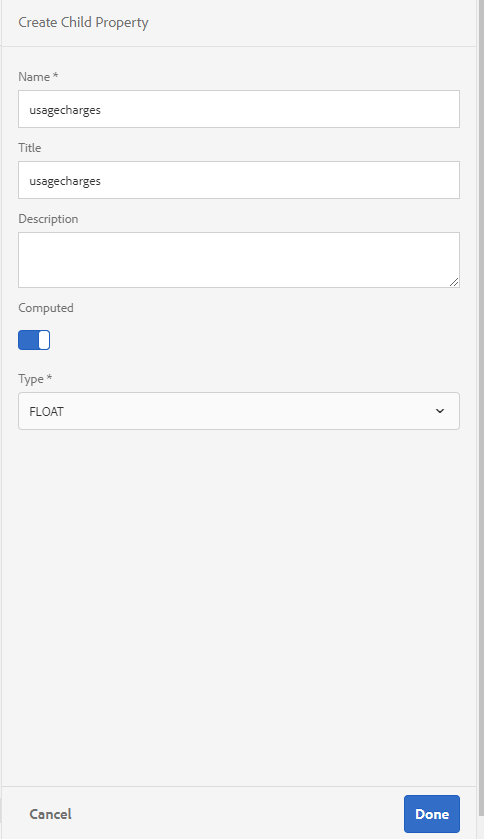
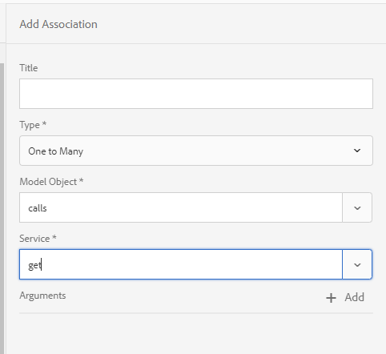
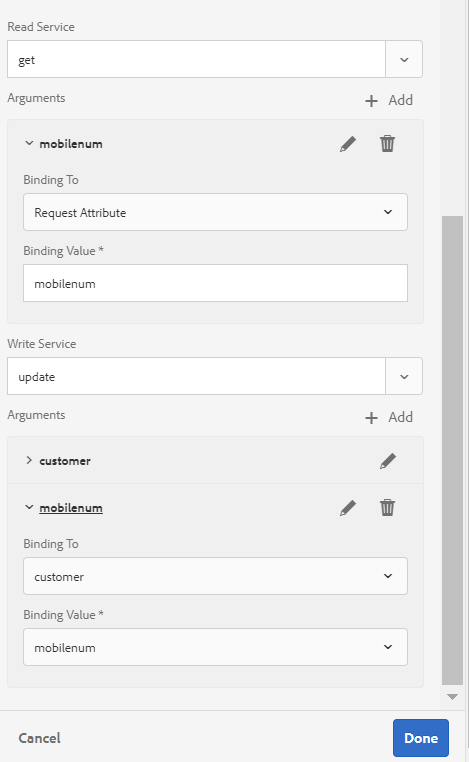
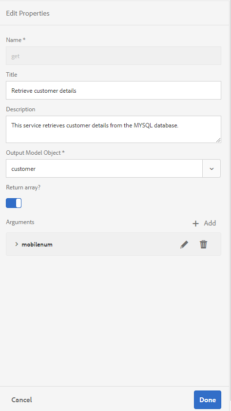

# Tutorial: Create form data model {#tutorial-create-form-data-model}

为交互通信创建表单数据模型


本教程是创建您的第一个 [交互式通信系列中的一个](/help/forms/using/create-your-first-interactive-communication.md) 步骤。 建议按照时间顺序按照系列来了解、执行和演示完整的教程用例。

## 关于教程 {#about-the-tutorial}

AEM Forms数据集成模块允许您从AEM用户用户档案、RESTful Web服务、基于SOAP的Web服务、OData服务和关系数据库等不同的后端数据源创建表单数据模型。 您可以在表单数据模型中配置数据模型对象和服务，并将其与自适应表单关联。 自适应表单字段绑定到数据模型对象属性。 这些服务使您能够预填自适应表单并将提交的表单数据写入数据模型对象。

有关表单数据集成和表单数据模型的更多信息，请参 [阅AEM Forms数据集成](data-integration.md)。

本教程将指导您逐步准备、创建、配置表单数据模型并将其与交互式通信相关联。 在本教程的结尾，您将能够：

* [设置数据库](#step-set-up-the-database)
* [将MySQL数据库配置为数据源](#step-configure-mysql-database-as-data-source)
* [创建表单数据模型](#step-create-form-data-model)
* [配置表单数据模型](#step-configure-form-data-model)
* [测试表单数据模型](#step-test-form-data-model-and-services)

表单数据模型类似于以下内容：


**A.配置** 的数 **据源** B.数据 **源模式** C.Available Services **D.Data****** Model对象E.Configured Services

## 前提条件 {#prerequisites}

在开始之前，请确保您具有以下各项：

* MySQL数据库，其示例数据如“设置 [数据库”部分所述](#step-set-up-the-database) 。
* MySQL JDBC驱动程序的OSGi捆绑，如捆绑JDBC数 [据库驱动程序中所述](https://helpx.adobe.com/experience-manager/6-3/sites-developing/jdbc.html#bundling-the-jdbc-database-driver)

## 第1步： 设置数据库 {#step-set-up-the-database}

数据库是创建交互式通信的必备工具。 本教程使用数据库来显示Interactive Communications的表单数据模型和持久性功能。 设置包含客户、帐单和调用表的数据库。\
下图说明了客户表的示例数据：


使用以下DDL语句在数 **据库** 中创建customer表。

```sql
CREATE TABLE `customer` (
   `mobilenum` int(11) NOT NULL,
   `name` varchar(45) NOT NULL,
   `address` varchar(45) NOT NULL,
   `alternatemobilenumber` int(11) DEFAULT NULL,
   `relationshipnumber` int(11) DEFAULT NULL,
   `customerplan` varchar(45) DEFAULT NULL,
   PRIMARY KEY (`mobilenum`),
   UNIQUE KEY `mobilenum_UNIQUE` (`mobilenum`)
 ) ENGINE=InnoDB DEFAULT CHARSET=utf8
```

使用以下DDL语句在数据 **库中** 创建清单表。

```sql
CREATE TABLE `bills` (
   `billplan` varchar(45) NOT NULL,
   `latepayment` decimal(4,2) NOT NULL,
   `monthlycharges` decimal(4,2) NOT NULL,
   `billdate` date NOT NULL,
   `billperiod` varchar(45) NOT NULL,
   `prevbal` decimal(4,2) NOT NULL,
   `callcharges` decimal(4,2) NOT NULL,
   `confcallcharges` decimal(4,2) NOT NULL,
   `smscharges` decimal(4,2) NOT NULL,
   `internetcharges` decimal(4,2) NOT NULL,
   `roamingnational` decimal(4,2) NOT NULL,
   `roamingintnl` decimal(4,2) NOT NULL,
   `vas` decimal(4,2) NOT NULL,
   `discounts` decimal(4,2) NOT NULL,
   `tax` decimal(4,2) NOT NULL,
   PRIMARY KEY (`billplan`)
 ) ENGINE=InnoDB DEFAULT CHARSET=utf8
```

使用以下DDL语句在数据 **库中** 创建调用表。

```sql
CREATE TABLE `calls` (
   `mobilenum` int(11) DEFAULT NULL,
   `calldate` date DEFAULT NULL,
   `calltime` varchar(45) DEFAULT NULL,
   `callnumber` int(11) DEFAULT NULL,
   `callduration` varchar(45) DEFAULT NULL,
   `callcharges` decimal(4,2) DEFAULT NULL,
   `calltype` varchar(45) DEFAULT NULL
 ) ENGINE=InnoDB DEFAULT CHARSET=utf8
```

呼 **叫表** 包括呼叫详细信息，如呼叫日期、呼叫时间、呼叫号码、呼叫持续时间和呼叫费用。 客 **户表** 使用“移动号码”(mobilenum)字段链接到呼叫表。 对于客户表中列出的每 **个手机** ，呼叫表中有多个 **记录** 。 例如，您可以通过引用呼叫表来检索1457892541 **移动号码** ，以获得呼叫 **详细信息** 。

帐单 **表** 包括帐单详细信息，如帐单日期、帐单期间、月费和通话费。 客 **户表** 使用“清单计 **划** ”字段链接到清单表。 客户表中有一个与每个客户关 **联的** 计划。 清 **单表** 包括所有现有计划的定价详细信息。 例如，您可以从客户表中检索 **Sarah的计划详细** 信息 **，并使用这些详细** 信息从清单表中检索定 **价详细** 信息。

## 第2步： 将MySQL数据库配置为数据源 {#step-configure-mysql-database-as-data-source}

您可以配置不同类型的数据源以创建表单数据模型。 在本教程中，您将配置已配置并填充示例数据的MySQL数据库。 有关其他受支持数据源以及如何配置数据源的信息，请参 [阅AEM Forms数据集成](data-integration.md)。

执行以下操作以配置MySQL数据库：

1. 将MySQL数据库的JDBC驱动程序作为OSGi捆绑安装：

   1. 以管理员身份登录到AEM Forms作者实例，然后转到AEM Web控制台包。 默认URL为 [http://localhost:4502/system/console/bundles](http://localhost:4502/system/console/bundles)。
   1. 点按 **安装／更新**。 将显 **示“上传／安装包** ”对话框。
   1. 点 **按选择** “文件”以浏览并选择MySQL JDBC驱动程序OSGi捆绑。 选择 **开始包** 和刷 **新包**，然后点 **按安** 装 **或**&#x200B;更新。 确保Oracle Corporation的MySQL JDBC驱动程序处于活动状态。 已安装驱动程序。

1. 将MySQL数据库配置为数据源：

   1. 转到AEM Web控制台，网 [址为](http://localhost:4502/system/console/configMgr)http://localhost:4502/system/console/configMgr。
   1. 找到 **Apache Sling Connection池化DataSource配置** 。 点击以在编辑模式下打开配置。
   1. 在配置对话框中，指定以下详细信息：

      * **数据源名称：** 您可以指定任何名称。 例如，指定 **MySQL**。
      * **DataSource服务属性名称**: 指定包含DataSource名称的服务属性的名称。 将数据源实例注册为OSGi服务时指定它。 例如， **datasource.name**。
      * **JDBC驱动程序类**: 指定JDBC驱动程序的Java类名称。 对于MySQL数据库， **请指定com.mysql.jdbc.Driver**。
      * **JDBC连接URI**: 指定数据库的连接URL。 对于在端口3306和模式电话上运行的MySQL数据库，URL为： `jdbc:mysql://[server]:3306/teleca?autoReconnect=true&useUnicode=true&characterEncoding=utf-8`
      * **用户名：** 数据库的用户名。 需要启用JDBC驱动程序以建立与数据库的连接。
      * **密码：** 数据库的口令。 需要启用JDBC驱动程序以建立与数据库的连接。
      * **借阅测试：** 启用“ **借阅时测试** ”选项。
      * **返回时测试：** 启用“ **返回时测试** ”选项。
      * **验证查询:** 指定SQL SELECT查询以验证池中的连接。 查询必须至少返回一行。 例如， **选择&amp;ast; 客户**。
      * **事务隔离**: 将该值设 **置为READ_COMMITTED**。

   保留其他属性并 [点按](https://tomcat.apache.org/tomcat-7.0-doc/jdbc-pool.html) “保 **存”**。

   将创建与以下配置类似的配置。

   

## Step 3: Create form data model {#step-create-form-data-model}

AEM Forms提供直观的用户界面， [以便从配置的](data-integration.md)数据源创建表单数据模型。 您可以在表单数据模型中使用多个数据源。 对于本教程中的用例，您将使用MySQL作为数据源。

执行以下操作以创建表单数据模型：

1. 在AEM创作实例中，导航到 **Forms** > **数据集成**。
1. Tap **Create** >  **Form Data Model**.
1. 在创建表单数据模型向导中，指 **定表单** 数据模型的名称。 例如， **FDM_Create_First_IC**。 点按 **下一步**。
1. 选择数据源屏幕列表所有已配置的数据源。 选择 **MySQL** 数据源并点 **按创建**。

   

1. 单击&#x200B;**完成**。将 **创建FDM_Create_First_IC** 表单数据模型。

## 第4步： 配置表单数据模型 {#step-configure-form-data-model}

配置表单数据模型包括：

* [添加数据模型对象和服务](#add-data-model-objects-and-services)
* [为数据模型对象创建计算子属性](#create-computed-child-properties-for-data-model-object)
* [添加数据模型对象之间的关联](#add-associations-between-data-model-objects)
* [编辑数据模型对象属性](#edit-data-model-object-properties)
* [为数据模型对象配置服务](#configure-services)

### 添加数据模型对象和服务 {#add-data-model-objects-and-services}

1. 在AEM创作实例上，导航到 **Forms** > **数据集成**。 默认URL为 [http://localhost:4502/aem/forms.html/content/dam/formsanddocuments-fdm](http://localhost:4502/aem/forms.html/content/dam/formsanddocuments-fdm)。
1. 此处 **列出您之前创建的** FDM_Create_First_IC表单数据模型。 选择它并点按 **编辑**。

   所选数据源 **MySQL** 显示在“数 **据源** ”窗格中。

   

1. 展开 **MySQL** 数据源树。 从电信模式中选择以下数据模型对 **象和** 服务：

   * **数据模型对象**:

      * 帐单
      * 呼叫
      * 客户
   * **服务:**

      * 获取
      * 更新

   点按 **添加选定** ，以将选定数据模型对象和服务添加到表单数据模型。

   

   清单、调用和客户数据模型对象显示在“模型”选项卡的右 **窗格中** 。 获取和更新服务显示在“服务” **选项卡** 中。

   

### 为数据模型对象创建计算的子属性 {#create-computed-child-properties-for-data-model-object}

计算属性是根据规则或表达式计算其值的属性。 使用规则，您可以将计算属性的值设置为文本字符串、数字、数学表达式的结果或表单数据模型中其他属性的值。

根据用例，使用以下数 **学表达式** ，在清单数 **据模型对** 象中创建Usagecharges子计算属性：

* 使用费=电话费+电话会议费+手机短信费+移动互联网费+漫游国家+漫游国际+ VAS（所有这些属性都存在于帐单数据模型对象中）

   有关usagecharges子计算属 **性的详** 细信息，请参 [阅规划交互式通信](/help/forms/using/planning-interactive-communications.md)。

执行以下步骤为清单数据模型对象创建计算的子属性：

1. 选中清单数据模型对象顶部的复 **选框** ，选择该对象并点按 **创建子属性**。
1. 在“创建 **子属性** ”窗格中：

   1. 输 **入** usagecharges作为子属性的名称。
   1. 启用 **计算**。
   1. 选 **择** Float **作为类型，然后点按** 完成 **，将子属性添加** 到Bills数据模型对象。

   

1. 点按 **编辑规则** ，以打开规则编辑器。
1. 点按&#x200B;**创建**。“设 **置值** ”规则窗口打开。
1. 从选择选项下拉框中，选择数学 **表达式**。

   

1. 在数学表达式中，选 **择调用** , **将调用** CallCharges分别作为第一个和第二个对象。 选择 **加号** 作为运算符。 在数学表达式内点击并点 **击扩展表达式** ，以添 **加smscharges**、internet **carges**、roamingnal **、********** roaminginingintin表达式、、、。

   下图描述了规则编辑器中的数学表达式:

   

1. 点按&#x200B;**完成**。规则在规则编辑器中创建。
1. 点按 **关闭** ，以关闭规则编辑器窗口。

### 在数据模型对象之间添加关联 {#add-associations-between-data-model-objects}

定义数据模型对象后，您可以在它们之间构建关联。 关联可以是一对一或一对多。 例如，可以有多个与某个员工关联的依赖项。 它称为一对多关联，在连接相关数据模型对象的线上由1:n描述。 但是，如果关联为给定的员工ID返回唯一的员工名称，则它称为一对一关联。

在数据源中向表单数据模型添加关联数据模型对象时，它们的关联会保留并显示为通过箭头线连接。

根据用例，在数据模型对象之间创建以下关联：

| 协会 | 数据模型对象 |
|---|---|
| 1:n | 客户：呼叫（在每月账单中，可以与客户关联多个呼叫） |
| 1:1 | 客户：帐单（一个帐单与特定月份的客户关联） |

请执行以下步骤以创建数据模型对象之间的关联：

1. 选中客户数据模型对象顶部的复 **选框** ，选择该对象并点 **按添加关联**。 此时将 **打开“添加关** 联”属性窗格。
1. 在“添加 **关联** ”窗格中：

   * 指定关联的标题。 它是可选字段。
   * 从 **“类型** ”下 **拉列表** 中选择“一对多”。
   * 从“ **模型对** 象 **”(Model Object** )下拉列表中选择调用。
   * 从 **服务** 下拉 **列表** 中选择“获取”。
   * 点按 **添加** ，将客户数 **据模型对象链** 接到使用属性调用 **** 数据模型对象。 根据用例，调用数据模型对象必须链接到客户数据模型对象中的移动号码属性。 “添 **加参数** ”对话框打开。

   

1. 在“添 **加参数** ”对话框中：

   * 从 **名称** 下拉 **列表** 中选择mobilenum。 移动号码属性是客户中可用并调用数据模型对象的公用属性。 结果，它用于在客户和调用数据模型对象之间创建关联。

      对于客户数据模型对象中的每个可用移动号码，调用表中有多个可用的调用记录。

   * 为参数指定可选标题和说明。
   * 从 **绑定** 到下 **拉列表** 中选择“客户”。
   * 从“ **绑定** 值” **下拉列表** 中选择mobilenum。
   * 点按 **添加**。

   

   mobilenum属性显示在“参数 **”部分** 。

   

1. 点按 **完成** ，在客户和调用数据模型对象之间创建1:n关联。

   在创建客户与调用数据模型对象之间的关联后，在客户与清单数据模型对象之间创建1:1关联。

1. 选中客户数据模型对象顶部的复 **选框** ，选择该对象并点 **按添加关联**。 此时将 **打开“添加关** 联”属性窗格。
1. 在“添加 **关联** ”窗格中：

   * 指定关联的标题。 它是可选字段。
   * 从 **“类型** ”下 **拉列表** 中选择“一到一”。
   * 从 **模型** 对象 **下拉列表** 中选择“清单”。
   * 从 **服务** 下拉 **列表** 中选择“获取”。 帐单 **计划** 属性是帐单表的主键，它已在参数部分中 **可用** 。

      清单和客户数据模型对象分别使用开单计划（清单）和客户计划（客户）属性进行链接。 在这些属性之间创建一个绑定，以检索MySQL数据库中任何可用客户的计划详细信息。

   * 从 **绑定** 到下 **拉列表** 中选择“客户”。
   * 从“ **绑定** 值” **下拉列表** 中选择“客户计划”。
   * 点按 **完成** ，在开单计划和客户计划属性之间创建绑定。

   

   下图描绘了数据模型对象与用于创建它们之间关联的属性之间的关联：

   

### 编辑数据模型对象属性 {#edit-data-model-object-properties}

在创建客户与其他数据模型对象之间的关联后，编辑客户属性以定义从数据模型对象检索数据的属性。 根据用例，使用移动号码作为属性从客户数据模型对象检索数据。

1. 选中客户数据模型对象顶部的复 **选框** ，选择该对象并点按编 **辑属性**。 此时将 **打开“编辑** 属性”窗格。
1. 将 **customer** 指定为 **顶级模型对象**。
1. 从 **读取****服务下拉** 列表中选择“获取”。
1. 在参数 **部分** :

   * 从“ **绑定到** ”下 **拉列表** 中选择“请求属性”。
   * 指定 **mobilenum** 作为绑定值。

1. 从 **Write** Service下 **拉列表** 中选择更新。
1. 在参数 **部分** :

   * 对 **于mobilenum** 属性，从“绑定 **到”下** 拉列表中选 **** 择“客户”。
   * 从“ **绑定** 值” **下拉列表** 中选择mobilenum。

1. 点按 **完成** ，以保存属性。

   

1. 选中调用数据模型对象顶部的复 **选框** ，选择该对象并点按编 **辑属性**。 此时将 **打开“编辑** 属性”窗格。
1. 为调用 **数据模型对象****禁用** “顶级模型”对象。
1. 点按&#x200B;**完成**。

   重复步骤8 - 10以配置清单数据 **模型** 对象的属性。

### 配置服务 {#configure-services}

1. 转到“服 **务** ”选项卡。
1. 选择get服 **务** ，然后点 **按编辑属性**。 此时将 **打开“编辑** 属性”窗格。
1. 在“编辑 **属性** ”窗格中：

   * 输入可选标题和说明。
   * 从 **“输** 出模型对象 **** ”下拉列表中选择客户。
   * 点按 **完成** ，以保存属性。

   

1. 选择更新 **服务** ，然后点 **按编辑属性**。 此时将 **打开“编辑** 属性”窗格。
1. 在“编辑 **属性** ”窗格中：

   * 输入可选标题和说明。
   * 从 **输入模** 型对象下 **拉列表中** 选择客户。
   * 点按&#x200B;**完成**。
   * 点按 **保存** ，以保存表单数据模型。

   

## 第5步： 测试表单数据模型和服务 {#step-test-form-data-model-and-services}

您可以测试数据模型对象和服务，以验证表单数据模型配置是否正确。

执行以下操作以运行测试：

1. 转到“模 **型** ”选项卡，选 **择客户** 数据模型对象，然 **后点按测试模型对象**。
1. 在“测 **试表单数据模型** ”窗口中，从“选 **择模型／服务”** 下拉列表中选择“读取模 **** 型对象”。
1. 在“输 **入** ”部分中，为已配置的MySQL数据 **库中存在** 的mobilenum **属性指定一个值，然后点按**&#x200B;测试。

   将获取与指定mobilenum属性关联的客户详细信息并在“输出”部分中显示，如下所示。 关闭对话框。

   

1. 转到“服 **务** ”选项卡。
1. 选择get **服务** ，然后点 **按测试服务。**
1. 在“输 **入** ”部分中，为已配置的MySQL数据 **库中存在** 的mobilenum **属性指定一个值，然后点按**&#x200B;测试。

   将获取与指定mobilenum属性关联的客户详细信息并在“输出”部分中显示，如下所示。 关闭对话框。

   

### 编辑和保存示例数据 {#edit-and-save-sample-data}

表单数据模型编辑器允许您为表单数据模型中的所有数据模型对象属性（包括计算属性）生成示例数据。 它是一组随机值，它们符合为每个属性配置的数据类型。 您还可以编辑和保存数据，即使重新生成示例数据，数据也会保留。

执行以下操作以生成、编辑和保存示例数据：

1. 在表单数据模型页面上，点按编 **辑示例数据**。 它会在“编辑示例数据”窗口中生成并显示示例数据。

   

1. 在“ **编辑示例数据** ”窗口中，根据需要编辑数据，然后点按 **保存**。 关闭窗口。

