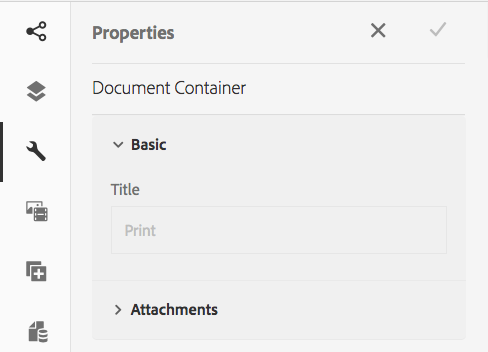

# 创建交互通信{#create-an-interactive-communication}

使用交互式通信编辑器创建交互式通信。 使用拖放功能构建交互式通信，并将打印和Web输出预览到不同的设备类型。

## 概述 {#overview}

交互通信集中管理个性化的交互式通信的创建、组合和投放。 将打印作为Web的主控渠道，您可以最大限度地减少在创建交互式通信的Web输出时的工作重复。

### 前提条件 {#prerequisites}

以下是创建交互式通信的先决条件：

* 设置[包含测试数据或与实际数据源（如Microsoft® Dynamics的实例）一起使用的表单数据模型](/help/forms/using/data-integration.md)。
* 确保您有[文档片段](/help/forms/using/document-fragments.md)。
* 确保您有[用于打印和Web渠道的模板](/help/forms/using/web-channel-print-channel.md)。
* 确保您具有Web渠道所需的[主题](/help/forms/using/themes.md)。

## 创建交互式通信 {#createic}

1. 登录到AEM作者实例，然后导航到&#x200B;**[!UICONTROL Adobe Experience Manager]** > **[!UICONTROL Forms]** > **[!UICONTROL Forms和文档]**。
1. 点按&#x200B;**[!UICONTROL 创建]**&#x200B;并选择&#x200B;**[!UICONTROL 交互通信]**。 “创建交互式通信”页面。

   

1. 输入以下信息。 : 

   * **[!UICONTROL 标题]**:输入交互通信的标题。
   * **[!UICONTROL 名称*]**:交互式通信的名称源自您输入的标题。根据需要编辑它。
   * **[!UICONTROL 描述]**:输入有关交互式通信的说明。
   * **[!UICONTROL 表单数据模型*]**:浏览并选择表单数据模型。有关表单数据模型的详细信息，请参阅[AEM Forms Data Integration](/help/forms/using/data-integration.md)。
   * **[!UICONTROL 预填服务]**:选择预填服务以检索数据并预填交互通信。
   * **[!UICONTROL 后期处理类型]**:您可以选择在提交交互通信时触发的AEM或Forms工作流。选择要触发的工作流的类型。
   * **[!UICONTROL 后期处理]**:选择要触发的工作流的名称。选择AEM工作流时，请提供附件路径、布局路径、PDF路径、打印数据路径和Web数据路径。
   * **[!UICONTROL 标记]**:选择要应用于交互通信的标记。您还可以键入新的/自定义标记名称，然后按Enter键创建它。
   * **[!UICONTROL 作者]**：作者姓名自动取自已登录用户的用户名。
   * **[!UICONTROL 发布日期：]** 输入发布交互式通信的日期。
   * **[!UICONTROL 取消发布日期]**:输入取消发布交互式通信的日期。

1. 点按&#x200B;**[!UICONTROL 下一步]**。 将显示用于指定打印和Web渠道详细信息的屏幕。
1. 输入以下内容：

   * **[!UICONTROL 打印]**:选择此选项可生成交互式通信的打印渠道。
   * **[!UICONTROL 打印模板*：浏]** 览并选择XDP作为打印模板。
   * **[!UICONTROL 使用打印为主控Web渠道:]** 选择此选项可创建与打印渠道同步的Web渠道。将打印渠道用作Web渠道的主控，可确保Web渠道的内容和数据绑定是从打印渠道派生的，并且点按“同步”时，打印渠道中所做的更改会反映在Web渠道中。 但是，作者可以根据需要中断Web渠道中特定组件的继承。 有关详细信息，请参阅[将Web渠道与打印渠道同步](/help/forms/using/create-interactive-communication.md#synchronize)。
   * **[!UICONTROL Web：选]** 择此选项可生成Web渠道或交互式通信的响应式输出。
   * **[!UICONTROL 交互通信Web模板*：浏]** 览并选择Web模板。
   * **** 主题 **[!UICONTROL 选择主题*]**:浏览并选择主题，以设置交互式通信的Web渠道的样式。有关详细信息，请参阅AEM Forms](/help/forms/using/themes.md)中的[主题。

   有关打印渠道和Web渠道的详细信息，请参阅[打印渠道和Web渠道](/help/forms/using/web-channel-print-channel.md)。

1. 点按&#x200B;**[!UICONTROL 创建]**。将创建交互通信，并显示一个警告框。 点按&#x200B;**[!UICONTROL 编辑]**&#x200B;以开始构建交互式通信的内容，如[使用交互式通信创作用户界面](#step2)添加内容中所述。 或者，您也可以点按&#x200B;**[!UICONTROL 完成]**，然后选择稍后编辑交互式通信。

## 将内容添加到交互通信{#step2}

创建交互式通信后，可以使用交互式通信创作界面来构建其内容。

有关交互式通信创作界面的详细信息，请参阅[交互式通信创作简介](/help/forms/using/introduction-interactive-communication-authoring.md)。

1. 当您按[创建交互式通信](#createic)中所述点击编辑时，将启动交互式通信创作界面。 或者，您也可以导航到AEM上的现有Interactive Communication资产，将其选中，然后点按&#x200B;**[!UICONTROL 编辑]**&#x200B;以启动Interactive Communication创作界面。

   默认情况下，将显示交互式通信的打印渠道，除非交互式通信仅限Web渠道。 交互通信的打印渠道显示目标区域，如所选XDP/打印渠道模板中所示。 在这些目标区域和字段中，您可以添加组件或资产。

1. 选择“打印”渠道后，选择&#x200B;**[!UICONTROL “组件]**”选项卡。 以下组件在打印渠道中可用：

   | **组件** | **功能** |
   |---|---|
   | 图表 | 添加一个图表，您可以在Interactive Communication中使用该图表，以可视方式表示从表单数据模型集合检索的二维数据。 有关详细信息，请参阅[在Interactive Communications中使用图表](/help/forms/using/chart-component-interactive-communications.md)。 |
   | 文档片段 | 允许您向交互式通信中添加可重用的组件，如文本、列表或条件。 添加的组件可以是基于表单数据模型的组件，也可以是没有表单数据模型的组件。 |
   | 图像 | 允许插入图像。 |

   将组件拖放到您的交互式通信中，并根据需要配置它们。

1. 选择打印渠道后，转到&#x200B;**[!UICONTROL 资产]**&#x200B;选项卡，并应用筛选器以仅显示您想看到的资产。

   使用“资产”浏览器，您还可以直接将资产拖放到交互式通信目标区域。

   

1. 将文档片段拖放到交互通信中。 以下是可在交互通信的打印渠道中使用的文档片段类型。

<table> 
 <tbody> 
  <tr> 
   <td><strong>文档片段类型</strong></td> 
   <td><strong>示例用途</strong></td> 
  </tr> 
  <tr> 
   <td><a href="/help/forms/using/texts-interactive-communications.md" target="_blank">文本</a></td> 
   <td>用于添加地址、收件人电子邮件和信件正文的文本 </td> 
  </tr> 
  <tr> 
   <td><a href="/help/forms/using/conditions-interactive-communications.md" target="_blank">条件</a></td> 
   <td>根据策略类型将相应的头图像添加到通信的条件：标准版或高级版。  </td> 
  </tr> 
  <tr> 
   <td>列表</td> 
   <td>文档片段组，包括文本、条件、其他列表和图像。  </td> 
  </tr> 
 </tbody> 
</table>

有关文档片段的详细信息，请参阅[文档片段](/help/forms/using/document-fragments.md)。

1. 要设置变量的绑定，请点按一个变量并选择(Configure)，然后在提要栏的“属性”面板中设置绑定属性。

   * **[!UICONTROL 无]**:代理将填写变量的值。
   * **[!UICONTROL 文本片段]**:如果选中，您可以浏览并选择一个文本文档片段，其内容将呈现在该字段中。只有那些文本文档片段才能绑定到没有变量的变量。
   * **[!UICONTROL 数据模型对象]**:选择在字段中填充其值的表单数据模型属性。

   您还可以选择配置相关的文本文档片段。 “属性”面板显示文本文档片段中变量的列表。 您可以点按变量名称旁边的（编辑），以显示该变量的编辑设置。

1. 要添加表，在选择打印渠道的情况下，请在&#x200B;**[!UICONTROL 资产]**&#x200B;选项卡中应用筛选器以仅显示布局片段。 将所需的布局片段拖放到交互通信中。 布局片段基于XDP，可用于在Interactive Communication中创建图形布局或用动态数据填充的静态和动态表。

   示例：一个布局表，用于显示旧政策和新政策的总溢价、忠诚度折扣%和紧急路边援助可用性。

   有关布局片段的详细信息，请参阅[文档片段](/help/forms/using/document-fragments.md)。

1. 选择打印渠道后，在&#x200B;**[!UICONTROL 资产]**&#x200B;选项卡中，将过滤器应用于显示图像。 将所需的图像拖放到交互式通信中，如公司徽标。

   此外，在交互通信中管理以下内容：

   * [添加和配置图表](/help/forms/using/chart-component-interactive-communications.md)
   * [使Web渠道与打印渠道同步](/help/forms/using/create-interactive-communication.md#synchronize)

      * 自动同步
      * 取消继承
      * 重新启用继承
      * 同步
   * [附件和库访问](/help/forms/using/create-interactive-communication.md#attachmentslibrary)
   * [XDP/布局字段属性](/help/forms/using/create-interactive-communication.md#xdplayoutfieldproperties)
   * [向组件添加规则](/help/forms/using/create-interactive-communication.md#rules)

1. 切换到&#x200B;**[!UICONTROL Web渠道]**。 Web渠道显示在交互式通信编辑器中。 首次从“打印”渠道切换到“Web”渠道时，将进行自动同步。 有关详细信息，请参阅[从打印渠道同步Web渠道](/help/forms/using/create-interactive-communication.md#synchronize)。

   由于我们在此示例中将“打印”用作Web的主控，因此“打印”渠道占位符、内容和数据绑定将同步到Web渠道。 但是，您可以根据需要在Web渠道中更改和自定义特定内容。

   

1. 要在Web渠道中添加其他组件，请点按&#x200B;**[!UICONTROL 组件]**，选择Web渠道。 在您的交互式通信的Web渠道中根据需要拖放组件，然后继续进行配置。

   | 组件 | 功能 |
   |---|---|
   | 图表 | 添加一个图表，您可以在Interactive Communication中使用该图表，以可视方式表示从表单数据模型集合检索的二维数据。 有关详细信息，请参阅[使用图表组件](/help/forms/using/chart-component-interactive-communications.md)。 |
   | 文档片段 | 允许您向交互式通信中添加可重用的组件、文本、列表或条件。 您添加到交互式通信的可重用组件可以是基于表单数据模型的组件，也可以是没有表单数据模型的组件。 |
   | 图像 | 允许插入图像。 |
   | 面板 | 面板组件是用于将其他组件组合在一起的占位符，它控制如何在交互通信中布置一组组件（如折叠面板和选项卡）。 面板组件还允许您使一组组件可重复用于最终用户，例如填写教育凭据所需的多个条目。 |
   | 表 | 添加表格以便按行和列整理数据。 |
   | 目标区域 | 在Web渠道中插入一个目标区域，以组织Web渠道特定的组件。 目标区域是一个简单容器，它允许您将Web渠道特定的组件进行分组。 |
   | 文本 | 将富文本添加到交互式通信的Web渠道。 文本还可以利用表单数据模型对象使内容动态化。 |

1. 根据需要，在您的Web渠道中插入资源。

   您可以[预览您的交互式通信](#previewic)以查看交互式通信的打印和Web输出的外观，并根据需要继续进行更改。

## 预览交互通信{#previewic}

可以使用&#x200B;**[!UICONTROL 预览]**&#x200B;选项来评估交互式通信的外观。 交互式通信的Web渠道还提供了一个选项，用于模拟不同设备的交互式通信体验。 例如，iPhone、iPad和Desktop。 您可以将&#x200B;**[!UICONTROL 预览]**&#x200B;和&#x200B;**[!UICONTROL 模拟器]** 选项相互结合使用，以针对不同屏幕大小的设备预览网络输出。 预览中的样本数据是从指定的表单数据模型填充的。

1. 选择（打印或Web）渠道以预览并点按预览。 出现“交互式通信”。

   >[!NOTE]
   >
   >预览将填充指定表单数据模型的示例数据。 有关使用某些其他数据或使用预填服务预览交互式通信的详细信息，请参阅[使用表单数据模型](/help/forms/using/using-form-data-model.md)和[使用表单数据模型](/help/forms/using/work-with-form-data-model.md)。

1. 对于Web渠道，使用视图不同设备上的交互式通信外观。

   

此外，您还可以使用代理UI](/help/forms/using/prepare-send-interactive-communication.md)准备和发送交互式通信。[

## 在交互通信中配置属性{#configuring-properties-in-interactive-communication}

### 附件和库访问{#attachmentslibrary}

在“打印”渠道中，您可以配置附件和库访问，以允许代理在交互通信的代理UI中管理附件：

1. 在“打印”渠道中，高亮显示文档容器，然后点按&#x200B;**[!UICONTROL 属性]**。

   

   “属性”面板显示在侧栏中。

   

1. 展开&#x200B;**[!UICONTROL 附件]**&#x200B;并指定以下属性：

   * **[!UICONTROL 允许库访问]**:选择以在代理UI中为代理启用库访问。如果启用，代理可在准备交互通信时从库添加文件。
   * **[!UICONTROL 允许对附件重新排序]**:选择此选项可使代理使用交互式通信重新排序附件。
   * **[!UICONTROL 允许的最大附件数]**:指定交互式通信允许的最大附件数。
   * **[!UICONTROL 要附加的文件]**:点按 **** 添加并浏览以选择要附加的文件，然后指定以下内容：

      * **[!UICONTROL 默认情况下，将此文件附加到文档]**:如果附件不是“必填”，则可以更改此选项。
      * **[!UICONTROL 必需：]** 代理将无法在代理UI中删除附件。

   

1. 点按&#x200B;**[!UICONTROL 完成]**。

### XDP/布局字段属性{#xdplayoutfieldproperties}

1. 编辑交互式通信的打印渠道时，将指针悬停在打印渠道模板中构建的字段上，然后选择(Configure)。

   提要栏中将显示“属性”对话框。

   

1. 指定以下内容：

   * **[!UICONTROL 名称]**:JCR节点名称。
   * **[!UICONTROL 标题]**:在代理UI和文档容器树中输入对代理可见的标题。
   * **[!UICONTROL 绑定类型]**:为字段选择以下绑定类型之一。

      * 无：代理将填写属性的值。
      * 文本片段：如果选中，您可以浏览并选择一个文本文档片段，其内容呈现在字段中。
      * 数据模型对象：选择在字段中填充其值的表单数据模型属性。
   * **[!UICONTROL 默认值]**:默认值确保在指定的数据模型对象或文本片段没有提供值时字段不为空。如果数据绑定类型为无，则将在字段中预填充默认值。
   * **[!UICONTROL 可由代理编辑]**:选择此选项可允许代理编辑代理UI中字段中的值。如果绑定类型是文本片段，则此设置不适用。
   * **[!UICONTROL 标签]**:指定在代理UI中向代理显示的与字段一起显示的文本字符串。如果绑定类型是文本片段，则此设置不适用。
   * **[!UICONTROL 工具提示]**:输入将在将鼠标悬停在代理UI中的代理上时可见的文本字符串。如果绑定类型是文本片段，则此设置不适用。
   * **[!UICONTROL 必需]**:选择此项可使座席的字段成为必填字段。如果绑定类型是文本片段，则此设置不适用。
   * **[!UICONTROL 允许多行]**:选择此字段可允许在字段中输入多行文本。如果绑定类型是文本片段，则此设置不适用。

1. 点按。

## 将规则应用于交互通信组件{#rules}

要在交互式通信中对组件或内容进行条件化，请点按组件/内容，然后选择（创建规则）以启动规则编辑器。

有关详细信息，请参阅：

* [规则编辑器](/help/forms/using/rule-editor.md)
* [交互通信创作介绍](/help/forms/using/introduction-interactive-communication-authoring.md)

## 使用表{#tables}

### 交互通信中的动态表{#dynamic-tables-in-interactive-communication}

您可以在交互通信中使用布局片段添加动态表。 以下步骤使用信用卡对帐单示例来说明如何使用布局片段在交互通信中创建动态表。

1. 确保创建表所需的布局片段在AEM中可用。
1. 在您的交互式通信的打印渠道中，从资产浏览器将布局片段（带有多列表）拖放到目标区。

   

   “交互式通信”布局区域中将显示一个表。

   

1. 为表的每个单元格指定数据绑定。 要创建可重复行，请在属于公用集合属性的行中插入表单数据模型属性。

   1. 点按表中的单元格并选择（配置）。

      提要栏中将显示“属性”对话框。

      

   1. 配置属性：

      * **[!UICONTROL 名称]**:JCR节点名称。
      * **[!UICONTROL 标题]**:输入将在交互式通信编辑器中可见的标题。
      * **[!UICONTROL 绑定类型]**(&amp;A);:为字段选择以下绑定类型之一。

         * **[!UICONTROL 无]**
         * **[!UICONTROL 数据模型对象]**:表单数据模型属性的值将填充在字段中。
      * **[!UICONTROL 数据模型对象]**:在字段中填充其值的表单数据模型属性。
      * **[!UICONTROL 默认值]**:默认值确保在指定数据模型对象没有提供值时字段不为空。默认值会预填充在字段中。
      * **[!UICONTROL 可由代理编辑]**:选择此选项可允许代理编辑代理UI中字段中的值。
   1. 点按。

1. 预览交互式通信以查看使用数据呈现的表。

   

### 仅Web渠道表{#web-channel-only-tables}

可以使用类型集合的渠道模型属性在交互通信中创建仅限Web的动态表。 此类表是集合属性的子属性的表示形式。 只能编辑表中各个单元格的格式属性。

1. 切换到Web渠道，然后选择显示“数据源”浏览器。
1. 将集合属性拖放到子表单中。

   在子表单中创建表。

1. 预览交互通信的Web预览中的表。

## 使Web渠道与打印渠道{#synchronize}同步

在创建交互式通信时选择“打印为Web渠道的主控”时，将创建与打印渠道同步的Web渠道，并且Web渠道的内容和数据绑定从打印渠道派生，并且点按“同步”时，打印渠道中所做的更改会反映在Web渠道中。

但是，作者可以根据需要中断Web渠道中组件的继承。

[击放大](assets/printweb_2-3.png)

### 自动同步{#auto-sync}

如果您使用打印渠道作为Web渠道的主控，并从打印渠道切换到Web渠道，则会进行自动同步。 自动同步将占位符、内容和渠道绑定从“打印”渠道引入Web。 根据交互通信的复杂性和内容，自动同步可能需要一些时间。

>[!NOTE]
>
>同步渠道仅同步从打印渠道到Web渠道的文档片段、图像、条件、列表和布局片段。 包含此类元素的子表单或父节点不会同步。

### 取消继承 {#cancel-inheritance}

在Web渠道中，组件嵌入到目标区域。

将鼠标悬停在Web渠道中的相关目标区域上，选择（取消继承），然后在“取消继承”对话框中，点按&#x200B;**[!UICONTROL 是]**。

目标区域内组件的继承将被取消，现在您可以根据需要编辑它们。

### 重新启用继承 {#re-enable-inheritance}

在Web渠道中，如果已取消组件的继承，则可以重新启用它。 要重新启用继承，请将指针悬停在包含该组件的相关目标区域的边界上，然后点按。

此时将显示“恢复继承”对话框。

如果需要，请选择&#x200B;**[!UICONTROL 还原继承后同步页面]**。 选择此选项可同步整个交互式通信。 如果不选择此选项，则恢复继承时只同步相关目标区域。

点按&#x200B;**[!UICONTROL 是]**。

### 同步 {#synchronize-1}

如果您将“打印”用作Web渠道的主控，并对打印渠道进行更改，则可以点按“同步”，将新做的更改引入Web渠道。

1. 要将Web渠道与打印渠道同步，请点按&#x200B;**[!UICONTROL 同步]**。

   将显示“从主控渠道同步内容”对话框。

   

1. 点按以下任一选项：

   * **[!UICONTROL 放弃更改]**:放弃对Web渠道所做的所有更改，而不管在Web渠道中所做的更改。
   * **[!UICONTROL 保留更改]**:仅同步继承未取消的目标区域的内容。

