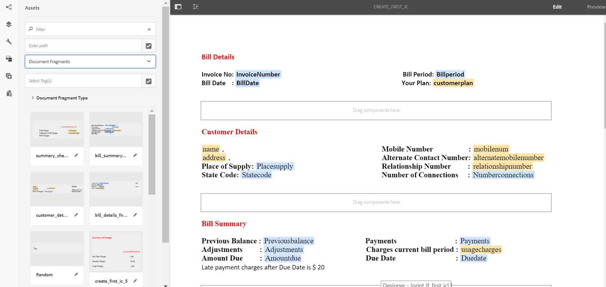
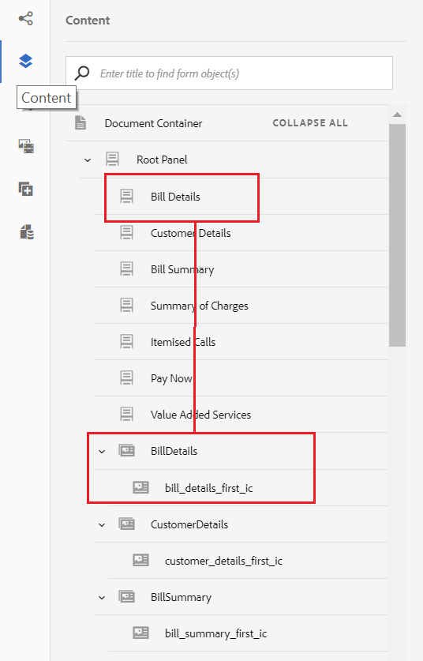

# 教程：创建交互式通信 {#tutorial-create-interactive-communication}

使用所有构件块创建交互式通信

本教程是创建您的第一个交 [互式通信系列中的一个步骤](/help/forms/using/create-your-first-interactive-communication.md) 。 建议按照时间顺序按照这一系列来了解、执行和演示完整的教程用例。

创建了表单数据模型、文档片段、模板和Web版主题等所有构建块后，您便可以开始创建交互式通信。

交互式通信可通过两个渠道交付：印刷和Web。 您还可以创建以打印渠道为主的交互式通信。 Web渠道的打印为主选项可确保Web渠道的内容、继承和数据绑定从打印渠道派生。 它还确保在打印渠道中所做的更改在Web渠道中同步。 但是，允许交互通信作者在Web渠道中中断特定组件的继承。

本教程将指导您逐步创建适用于印刷和Web渠道的交互式通信。 在本教程的结尾，您将能够：

* 为打印渠道创建交互式通信
* 为Web渠道创建交互式通信
* 以“打印为主”创建印刷和Web交互式通信

## 无需同步即可创建用于印刷和Web的交互式通信 {#create-interactive-communications-for-print-and-web-with-no-synchronization}

### 为打印渠道创建交互式通信 {#create-interactive-communication-for-print-channel}

以下是本教程中已创建的资源列表，创建打印渠道的交互式通信时需要这些资源：

**打印模板：**[create_first_ic_print_template](/help/forms/using/create-templates-print-web.md)

**表单数据模型：**[FDM_Create_First_IC](/help/forms/using/create-form-data-model0.md)

**文档片段：**[bill_details_first_ic、customer_details_first_ic、bill_summary_first_ic、summary_charges_first_ic](/help/forms/using/create-document-fragments.md)

**布局片段：**[table_lf](/help/forms/using/create-templates-print-web.md)

**图像：** PayNow和ValueAddedServices

1. 登录到AEM作者实例，然后导航到 **[!UICONTROL Adobe Experience Manager]** > **[!UICONTROL Forms]** > **[!UICONTROL Forms &amp;文档]**。
1. 点按 **创建** ，然后选择 **交互式通信**。 此时将显示 **“创建交互式通信** ”向导。
1. 在“ **标题”和“名称** ”字段中指定create_first_ic ******** 。 选 **择FDM_Create_First_IC作为表单数据模型** ，然后点按 **下一步**。
1. 在渠道 **向导中** :

   1. 将 **create_first_ic_print_template指定为“打印”模板** ，然后点按 **选择**。 确保未选 **中“使用打印为Web渠道主页** ”复选框。
   1. 指定 **Create_First_IC_templates文件夹** > **Create_First_IC_Web_Template** 作为Web模板，然后点按 **选择**。
   1. 点按&#x200B;**创建**。
   将显示一条确认消息，指示已成功创建交互式通信。

1. 点按 **编辑** ，以在右侧窗格中打开交互式通信。
1. 转到“资 **产** ”选项卡并应用筛选器，以仅在左窗格中显示文档片段。
1. 将以下文档片段拖放到交互通信中的目标区域：

   | 文档片段 | 目标区域 |
   |---|---|
   | bill_details_first_ic | BillDetails |
   | customer_details_first_ic | 客户详细信息 |
   | bill_summary_first_ic | BillSummary |
   | summary_charges_first_interactive_communication | 费用 |

   

1. 点按 **图表** 目标区域，然后点 **按+** 以添加图 **** 表组件。
1. 点按图表组件并选择  (Configure)。 图表属性显示在左窗格中：

   1. 指定图表的名称。
   1. 从“ **图表类型** ”下 **拉列表中选择** “饼图”。
   1. 从 **X** 轴部分的调 **用数据模型对象类型中选** 择调用类型属性 **** 。 点 。
   1. 从“ **函数** ”(Function **** )下拉列表中选择“频率”(Frequency)。
   1. 从 **Y轴部分** 的调用数据模 **型对象类型中选** 择调用类型属性 **** 。 点 。
   1. 点  以保存图表属性。

1. 转到“资 **产** ”选项卡并应用筛选器，以仅在左窗格中显示布局片段。 将table_lf布局片段拖 **放到Itemized Calls****** 目标区域。
1. 在“日期”列中选择文 **本字段** ，然后点  （配置）。
1. 从“ **绑定类型****”下拉列表中选择“数据模型对象”，然后选择“调用”** >“调 ********&#x200B;用date”。 点  以保存属性。

   同样，在Calltime **、Number**、Calldld **、CalldtimeCharges**、 ************************ Charges中分别创建与Calltime、CalldtimeCharges、CalldCharges、ChargesCharges的charges的绑定，以及Calldigldis的持续时间分别与CalltimeCld列。

1. 点按 **PayNow** 目标区域，然后点 **按+** 以添加图 **像组件** 。
1. 点按图像组件，然后选择  （配置）。 图像属性显示在左窗格中：

   1. 在“ **名称** ”字段中指定PayNow作为图像的 **名称** 。
   1. 点按 **上传**，选择保存在本地文件系统中的图像，然后点按打 **开**。
   1. 点  以保存图像属性。

1. 重复第13步和第14步，将 **ValueAddedServices图像添加到** ValueAddedServices **** 目标区域。

### Create Interactive Communication for Web channel {#create-interactive-communication-for-web-channel}

以下是本教程中已创建的资源列表，创建Web渠道时需要这些资源：

**Web模板：**[Create_First_IC_Web_Template](/help/forms/using/create-templates-print-web.md)

**表单数据模型：**[FDM_Create_First_IC](/help/forms/using/create-form-data-model0.md)

**文档片段：**[bill_details_first_ic、customer_details_first_ic、bill_summary_first_ic、summary_charges_first_ic](/help/forms/using/create-document-fragments.md)

**图像：** PayNowWeb和ValueAddedServicesWeb

1. 登录到AEM作者实例，然后导航到 **[!UICONTROL Adobe Experience Manager]** > **[!UICONTROL Forms]** > **[!UICONTROL Forms &amp;文档]**。
1. 点按 **创建** ，然后选择 **交互式通信**。 此时将显示 **“创建交互式通信** ”向导。
1. 在“ **标题”和“名称** ”字段中指定create_first_ic ******** 。 选 **择FDM_Create_First_IC作为表单数据模型** ，然后点按 **下一步**。
1. 在渠道 **向导中** :

   1. 将 **create_first_ic_print_template指定为“打印”模板** ，然后点按 **选择**。 确保未选 **中“使用打印为Web渠道主页** ”复选框。
   1. 指定 **Create_First_IC_templates文件夹** > **Create_First_IC_Web_Template** 作为Web模板，然后点按 **选择**。
   1. 点按&#x200B;**创建**。
   将显示一条确认消息，指示已成功创建交互式通信。

1. 点按 **编辑** ，以在右侧窗格中打开交互式通信。
1. 点按左 **窗格中** 的渠道选项卡，然后点 **按Web**。
1. 转到“资 **产** ”选项卡并应用筛选器，以仅在左窗格中显示文档片段。
1. 将以下文档片段拖放到交互通信中的目标区域：

   | 文档片段 | 目标区域 |
   |---|---|
   | bill_details_first_ic | BillDetails |
   | customer_details_first_ic | 客户详细信息 |
   | bill_summary_first_ic | BillSummary |
   | summary_charges_first_interactive_communication | 费用 |

1. 点按 **“费用汇总** ”目标区域，然后点按+ **以添加图表** 组件 **** 。
1. 点按图表组件并选择  (Configure)。 图表属性显示在左窗格中：

   1. 指定图表的名称。
   1. 从“ **图表类型** ”下 **拉列表中选择** “饼图”。
   1. 从 **X** 轴部分的调 **用数据模型对象类型中选** 择调用类型属性 **** 。 点 。
   1. 从“ **函数** ”(Function **** )下拉列表中选择“频率”(Frequency)。
   1. 从 **Y轴部分** 的调用数据模 **型对象类型中选** 择调用类型属性 **** 。 点 。
   1. 点  以保存图表属性。

1. 从左侧窗 **格中选择** “数据源”选项卡，并将调用数据模型对象拖 **放到“分项调用** ”目标 **** 区域。 调用数据模 **型对象中** ，所有属性都显示为右侧窗格的“分 **项调用** ”目标区域中的表列。

   根据用例，您需要表中的“呼叫日期”、“呼叫时间”、“呼叫号码”、“呼叫持续时间”和“呼叫费用”列。

   

1. 选择 **Mobilenum** 表列标题，然后选择“更 **多选项** ” **>“删**&#x200B;除列”。 同样，删除“ **Calltype** ”列。
1. 选择“调 **用日期** ”表列标题，然后点  （编辑）以将文本重命名为“ **调用日期”**。 同样，重命名表中的其他列标题。
1. 根据用例，在交互通信中插入“ **立即付费** ”按钮，该按钮为用户提供通过单击该按钮进行付款的选项。 执行以下步骤以插入按钮：

   1. 点按 **立即支付** 目标区域，然后点按+ **以添加文** 本组件 **** 。
   1. 点按文本组件，然后点  （编辑）。
   1. 将文本重命名为“ **立即支付”**。
   1. 选择文本，然后点按超链接图标。
   1. 在“路径”字段中指定付 **款** URL。
   1. 从 **目标下拉****列表中选择** “新建选项卡”。
   1. 点  以保存超链接属性。

1. 从 **列表** 、预览选项旁边的下拉框中选择 **样式** 。

   

1. 设置超链接文本的样式，以在交互式通信中将其显示为按钮，步骤如下：

   1. 点按文本组件，然后选择  （编辑）。
   1. 在“边 **框** ”部分中，将“宽度”指定为“宽度 **1.5px** ”，将“实边框样式”指定为“宽度”，选择“边框样式”，将“边框半径” ********************&#x200B;指定为4（作为Border Border Adober Syphing的半径）。
   1. 从“背景”部分中选择红色作为按钮的背 **景颜色** 。
   1. 在“尺寸和位 **置”的** “边距”字段 **中，点按“同时编辑** ”图标，并将“Right **margin”图标**********&#x200B;设置为50pxJ。 “顶部”、“底部”和“左侧”字段设置为空。
   

1. 点按 **立即支付** 目标区域，然后点按+ **以添加图** 像组件 **** 。
1. 点按图像组件，然后选择  （配置）。 图像属性显示在左窗格中：

   1. 在“ **名称** ”字段中指定PayNow作为图像的 **名称** 。
   1. 点 **按上传**，选择保存在本地文件 **系统上的PayNowWeb** 图像，然后点按打 **开**。
   1. 点  以保存图像属性。

1. 根据用例，在交互通信中插入 **“订阅** ”按钮，该按钮为用户提供通过单击该按钮来订阅增值服务的选项。

   重复第13 - 17步，向“增 **值服务****”目标区添加“订阅”按钮，并添加** ValueAddedServicesWeb **** 图像。

## 使用自动同步功能创建用于打印和Web的交互式通信 {#create-interactive-communications-for-print-and-web-with-auto-synchronization}

您还可以通过启用打印和Web渠道之间的自动同步来创建交互式通信。 要启用自动同步，请在创建交互式通信时选择“打印为主页”选项。 选择“打印为主渠道”选项可确保Web渠道的内容、继承和数据绑定是从“打印”派生的。 它还确保在打印渠道中所做的更改反映在Web渠道中。

执行以下步骤，使用“打印渠道”派生Web渠道内容：

1. 登录到AEM作者实例，然后导航到 **[!UICONTROL Adobe Experience Manager]** > **[!UICONTROL Forms]** > **[!UICONTROL Forms &amp;文档]**。
1. 点按 **创建** ，然后选择 **交互式通信**。 此时将显示 **“创建交互式通信** ”向导。
1. 在“ **标题”和“名称** ”字段中指定create_first_ic ******** 。 选 **择FDM_Create_First_IC作为表单数据模型** ，然后点按 **下一步**。
1. 在渠道 **向导中** :

   1. 将 **create_first_ic_print_template指定为“打印”模板** ，然后点按 **选择**。
   1. 选中“ **使用打印作为Web渠道的主页** ”复选框。
   1. 指定 **Create_First_IC_templates文件夹** > **Create_First_IC_Web_Template** 作为Web模板，然后点按 **选择**。
   1. 点按&#x200B;**创建**。
   将显示一条确认消息，指示已成功创建交互式通信。

1. 点按 **编辑** ，以在右侧窗格中打开交互式通信。
1. 执行“创建交互式通 [信以进行打印渠道](/help/forms/using/create-interactive-communication0.md#create-interactive-communication-for-print-channel) ”部分的步骤6 - 15。
1. 点按左 **侧窗格中的渠道** ，然后点按 **Web** ，以从打印渠道自动生成Web渠道的内容。
1. 在第4 **步中选中了“使用打印作为Web渠道的主渠道** ”复选框，则会从“打印渠道”中为Web自动生成内容和绑定。

   打印渠道内容会插入到Web渠道模板内容的下方。 要修改已从“打印”渠道自动生成的Web渠道内容，可以取消任何目标区域的继承。

   将指针悬停在Web渠道中的相关目标区域上，选择取消继 ********（取消继承），然后在取消继承对话框中，点按是。

   

   如果已取消组件的继承，则可重新启用它。 要重新启用继承，请将指针悬停在包括组件的相关目标区域的边界上，然后点按重新启用 。

1. 选择左 **窗格中** “内容”选项卡。
1. 使用内容树将自动生成的Web渠道内容拖放到Web模板中的现有面板。 以下是需要重新排列的组件的列表:

   * “清单详细信息”组件到“清单详细信息”面板
   * 客户详细信息组件到“客户详细信息”面板
   * “清单汇总”组件至“清单汇总”面板
   * “费用汇总”组件至“费用汇总”面板
   * 将片段（表）布局到“项目化调用”面板
   

1. 重复“为Web渠道创 [建交互式通信](/help/forms/using/create-interactive-communication0.md#create-interactive-communication-for-web-channel) ”中的步骤13 - 18，以在交互式通信的Web渠道中插入“立即付费 **”和“** 订阅 **** ”超链接。

