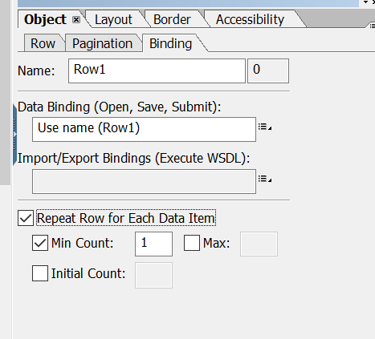

# 教程：创建模板 {#tutorial-create-templates}

为交互通信创建打印和Web模板

本教程是创建您的第一个 [交互式通信系列中的一个](/help/forms/using/create-your-first-interactive-communication.md) 步骤。 建议按照时间顺序按照系列来了解、执行和演示完整的教程用例。

要创建交互式通信，必须在AEM服务器上提供用于打印和Web渠道的模板。

打印渠道的模板在AdobeForms设计器中创建并上传到AEM服务器。 然后，这些模板便可在创建交互式通信时使用。

Web渠道的模板是在AEM中创建的。 模板作者和管理员可以创建、编辑和启用Web模板。 创建并启用这些模板后，即可在创建交互式通信时使用。

本教程将指导您逐步创建用于打印和Web渠道的模板，以便在创建交互式通信时使用它们。 在本教程的结尾，您将能够：

* 使用AdobeForms设计器创建用于印刷渠道的XDP模板
* 将XDP模板上传到AEM Forms服务器
* 创建并启用Web渠道的模板

## 为打印渠道创建模板 {#create-template-for-print-channel}

使用以下渠道创建和管理交互式通信的打印任务的模板：

* [使用Forms设计器创建XDP模板](/help/forms/using/create-templates-print-web.md#create-xdp-template-using-forms-designer)
* [将XDP模板上传到AEM Forms服务器](/help/forms/using/create-templates-print-web.md#upload-xdp-template-to-the-aem-forms-server)
* [为布局片段创建XDP模板](/help/forms/using/create-templates-print-web.md#create-xdp-template-for-layout-fragments)

### 使用Forms设计器创建XDP模板 {#create-xdp-template-using-forms-designer}

根据用 [例和解剖](/help/forms/using/create-your-first-interactive-communication.md) 结构 [,](/help/forms/using/planning-interactive-communications.md)在XDP模板中创建以下子表单：

* 帐单详细信息：包括文档片段
* 客户详细信息：包括文档片段
* 帐单汇总：包括文档片段
* 摘要：包括文档片段（费用子表单）和图表（图表子表单）
* 明细调用：包括表（布局片段）
* 立即付款：包括图像
* 增值服务：包括图像

将XDP文件上传到Forms服务器后，这些子表单在“打印”模板中显示为目标区域。 创建交互通信时，所有实体(如文档片段、图表、布局片段和图像)都会添加到目标区域。

执行以下步骤以为打印渠道创建XDP模板：

1. 打开Forms设计器，选 **择“文件** ” > **“新建** ” > **使用空白表单，点按下一个，然********** 后点按，然后点按以打开表单以创建模板。

   确保从“窗 **口”菜单****中选** 择“对象 **库”和“对** 象”选项。

1. 将子表单组件从 **对象** 库拖 **放到** 表单中。
1. 选择子表单以在右侧窗格的“对象”窗 **口中** ，显示子表单的选项。
1. 选择 **子表单** 选项卡， **然后从** “内容 **”下拉** 列表中选择“流”。 拖动子表单的左端点以调整长度。
1. 在“绑 **定** ”选项卡中：

   1. 在“ **名称** ”字段中 **指定BillDetails** 。
   1. 从“ **数据绑定** ”下 **拉列表** 中选择“无数据绑定”。

   

1. 同样，选择根子表单，选择 **子表** 单选项卡，然后从“内 **容** ”下拉 **列表中选择** “Frued”。 在“绑 **定** ”选项卡中：

   1. 在“ **名称** ”字段中 **指定Teleca** Bill。
   1. 从“ **数据绑定** ”下 **拉列表** 中选择“无数据绑定”。

   

1. 重复步骤2 - 5以创建以下子表单：

   * BillDetails
   * 客户详细信息
   * 帐单摘要
   * 摘要——选择 **子表单** 选项卡，并从 **此子表** 单的内容 **下拉** 列表中选择“定位”。 在“摘要”子表单中插 **入以** 下子表单。

      * 费用
      * 图表
   * ItemisedCalls
   * PayNow
   * ValueAddedServices

   为节省时间，您还可以复制并粘贴现有子表单以创建新子表单。

   要将Charts子 **表单** 移到Charges子表单的右侧，请从左侧窗格中选 **择Charts** 子表单，选择 **Layout** 选项卡，为AnchorX域 **** 指定值。 该值必须大于Charges子表单的 **Width** 字段 **的值** 。 选择 **Charges** 子表单并选 **择Layout** 选项卡以视图Width字 **段的值** 。

1. 将Text对象从对 **象库** 拖放 **到表单** ，然后输入拨 **** 号XXXX以订阅框中的文本。
1. 右键单击左窗格中的文本对象，选 **择“重命名对象**”，然后输入文本对象的名称为“ **订阅”**。

   

1. 选择 **“文件** ”>“ **另存为** ”，将文件保存到本地文件系统：

   1. 导览至保存文件的位置，并指定 **create_first_ic_print_template作为名称**。
   1. 从“ **另存为****类型”下拉列表** 中选择。xdp。
   1. 点按&#x200B;**保存**。

### 将XDP模板上传到AEM Forms服务器 {#upload-xdp-template-to-the-aem-forms-server}

在使用Forms设计器创建XDP模板后，必须将其上传到AEM Forms服务器，以便在创建交互通信时使用该模板。

1. 选择 **[!UICONTROL Forms]** > **[!UICONTROL Forms和文档]**。
1. 点按 **创建** > **文件上传**。

   导航并选择 **create_first_ic_print_template** (XDP)模板，然后点按 **打开** ，将XDP模板导入到AEM Forms服务器。

### 为布局片段创建XDP模板 {#create-xdp-template-for-layout-fragments}

要为交互通信的打印渠道创建布局片段，请使用Forms设计器创建XDP并将其上传到AEM Forms服务器。

1. 打开Forms设计器，选 **择“文件** ” > **“新建** ” > **使用空白表单，点按下一个，然********** 后点按，然后点按以打开表单以创建模板。

   确保从“窗 **口”菜单****中选** 择“对象 **库”和“对** 象”选项。

1. 将表组件从对 **象** 库拖 **放到** 表单。
1. 在“插入表”对话框中：

   1. 将列数指定为 **5**。
   1. 将正文行数指定为 **1**。
   1. 选中“ **在表中包含标题行** ”复选框。
   1. 选项卡 **确定**。

1. 点 **按表** 1旁左侧窗格的+，并右键单击 **Cell** 1，然后选 **择Rename Object** (对 ********&#x200B;象重命名日期)至。

   同样，将Cell2 **、Cell3**、 **Cell4和Cell5重命名**&#x200B;为TimeTime **、NumberNumber**、Cell2、Cell4和 ******************** Cell5，分别重命名为、持续时间、和。

1. 单击“设计器”视图中的“ **** ”文本字段，并将其重 **命名为**“时间”、“数 **字”、**“持 ********&#x200B;续时间”、“”和“”。

   

1. 从左 **窗格中选** 择第1行，然后选 **择“对象** ” **>“** 绑定 **”>“重**&#x200B;复每个数据项的行”。

   

1. 将文本字段组 **件从对象** 库拖 **放到设** 计器 **视图**。

   

   同样，将文本字段 **组件拖放** 到时间 **、数**&#x200B;字 **、持**&#x200B;续时 **间、**&#x200B;行 **** 和行。

1. 选择 **“文件** ”>“ **另存为** ”，将文件保存到本地文件系统：

   1. 导览至要保存文件的位置，并将名称指 **定为table_lf**。
   1. 从“ **另存为****类型”下拉列表** 中选择。xdp。
   1. 点按&#x200B;**保存**。

   在使用Forms设计器为布局片段创建XDP模板后，必须将 [其上](/help/forms/using/create-templates-print-web.md#upload-xdp-template-to-the-aem-forms-server) 传到AEM Forms服务器，以便在创建布局片段时使用该模板。

## 创建Web渠道模板 {#create-template-for-web-channel}

使用以下渠道创建和管理交互式通信的Web任务的模板：

* [为模板创建文件夹](/help/forms/using/create-templates-print-web.md#create-folder-for-templates)
* [创建模板](/help/forms/using/create-templates-print-web.md#create-the-template)
* [启用模板](/help/forms/using/create-templates-print-web.md#enable-the-template)
* [在交互通信中启用按钮](/help/forms/using/create-templates-print-web.md#enabling-buttons-in-interactive-communications)

### 为模板创建文件夹 {#create-folder-for-templates}

要创建Web渠道模板，请定义一个文件夹，您可以在其中保存创建的模板。 在该文件夹内创建模板后，启用该模板，以允许表单用户基于该模板创建交互式通信的Web渠道。

执行以下步骤为可编辑的模板创建文件夹：

1. 点按 **工具** 置浏览器 ****。
   * See the [Configuration Browser documentation](/help/sites-administering/configurations.md) for more information.
1. 在“配置浏览器”页面中，点按 **创建**。
1. 在“创 **建配置** ”对话框中，指 **定Create_First_IC_templates作为文件夹的标题** ，选中“可编 **辑的模板**”，然 **后点按创**&#x200B;建。

   

   Create_ **First_IC_templates文件夹已创建** ，并列在“配置浏览 **器”页面上** 。

### 创建模板 {#create-the-template}

根据用 [例和解剖](/help/forms/using/create-your-first-interactive-communication.md) 结构 [,](/help/forms/using/planning-interactive-communications.md)在Web模板中创建以下面板：

* 帐单详细信息：包括文档片段
* 客户详细信息：包括文档片段
* 帐单汇总：包括文档片段
* 费用汇总：包括文档片段和图表（双列布局）
* 明细调用：包括表
* 立即付款：包括“立 **即付费** ”按钮和图像
* 增值服务：包括图像和“订 **阅** ”按钮。

创建交互通信时，将添加文档片段、图表、表、图像和按钮等所有实体。

请执行以下步骤，在Create_First_IC_templates文件夹中为 **Web渠道创建模板** :

1. 通过选择“工具”>“模板 **”** > **Create_First_IC_templates** 文件夹 **，导航到相应的模板文件夹** 。
1. 点按&#x200B;**创建**。
1. 在“选 **择模板类型** ”配置向导中，选 **择“交互式通信- Web渠道** ”，然 **后点按**“下一步”。
1. 在“模 **板详细信** 息”配置向导 **中，指定Create_First_IC_Web_Template** 作为模板标题。 指定可选描述并点按 **创建**。

   将显示确 **认消息Create_First_IC_Web_Template** 。

1. 点按 **打开** ，以在模板编辑器中打开模板。
1. 从 **列表** (预览选项)旁的下拉中选择 **初始内容** 。

   

1. 点 **按根面板** ，然后点 **** 按+以视图可添加到模板的组件列表。
1. 从列表 **中选择** “面板”，以在根面板上方添 **加面板**。
1. 选择左 **窗格中** 的“内容”选项卡。 第8步中添加的新面板将显示在内 **容树中** “根面板”下。

   

1. 选择面板并点  (Configure)。
1. 在属性窗格中：

   1. 在“名 **称** ”字段中指定帐单详细信息。
   1. 在“ **标题** ”字段中指定帐单详细信息。
   1. 从 **列** 数下拉 **列表中选择** 1个。
   1. 点  以保存属性。

   面板的名称将更新为内容 **树中的** “清单详细信息”。

1. 重复步骤7 - 11，向模板添加具有以下属性的面板：

   | 名称 | 标题 | 列数 |
   |---|---|---|
   | customerdetails | 客户详细信息 | 1 |
   | 开单摘要 | 帐单汇总 | 1 |
   | 摘要费用 | 费用汇总 | 2 |
   | itimisedcalls | 明细调用 | 1 |
   | 付费 | 立即付款 | 2 |
   | vas | 增值服务 | 1 |

   下图描述了将所有面板添加到模板后的内容树：

   

### 启用模板 {#enable-the-template}

创建Web模板后，必须启用该模板才能在创建交互式通信时使用该模板。

执行以下步骤以启用Web模板：

1. 点按 **工具** 板 ****。
1. 导航到 **Create_First_IC_Web_Template模板** ，选择它，然后点按 **启用**。
1. 选项卡 **再次启** 用以进行确认。

   模板已启用，其状态显示为“已启用”。 您可以在为Web渠道创建交互式通信时使用此模板。

### 在交互通信中启用按钮 {#enabling-buttons-in-interactive-communications}

根据用例，您必须在交互通信 **中包含** “立 **即付费”和** “订阅”按钮（自适应表单组件）。 要在交互通信中启用这些按钮，请执行以下步骤：

1. 从 **列表** (预览选项)旁的下拉中选 **择结构** 。
1. 使用内 **容树选择** “文档容器”根面板，然后点 **按策略** ，以选择允许在交互通信中使用的组件。

   

1. 在属性 **的允许的组** 件选 **项卡中** ，从自适应表 **单组件中选****** 择按钮。

   

1. 点  以保存属性。

