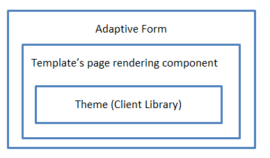

# 创建自定义自适应表单主题 {#creating-custom-adaptive-form-themes}

>[!CAUTION]
>
>AEM Forms提供了主题编 [辑器功能](/help/forms/using/themes.md) ，可用于创建和修改自适应表单 [主题](/help/forms/using/themes.md)。 只有从没有 [Theme Editor](/help/forms/using/themes.md) ，并且已对使用Less/CSS文件（预主题编辑器方法）创建的主题进行了现有投资的版本升级，才可执行本文中列出的步骤。

## 前提条件 {#prerequisites}

* LESS(Leaner CSS)框架知识
* 如何在Adobe Experience manager中创建客户端库
* [创建自适应表单模板](/help/forms/using/custom-adaptive-forms-templates.md) ，以使用您创建的主题

## Adaptive form theme {#adaptive-form-theme}

自适 **应表单主题** 是AEM客户端库，用于定义自适应表单的样式（外观和感觉）。

您可以创建自 **适应模板** ，并将该主题应用到模板。 然后，使用此自定义模板创建自适 **应表单**。



## 创建自适应表单主题 {#to-create-an-adaptive-form-theme}

>[!NOTE]
>
>使用节点、属性和文件夹等AEM对象的示例名称介绍了以下过程。
>
>如果使用名称执行这些步骤，则生成的模板应类似于以下快照：

 森林主题自适应表单快照&#x200B;****&#x200B;图：森林 *主题示例*

1. 在节点下创建类 `cq:ClientLibraryFolder` 型的 `/apps`节点。

   例如，创建以下节点：

   `/apps/myAfThemes/forestTheme`

1. 向节点添加多值字符串属 `categories` 性并相应地设置其值。

   例如，将属性设置为： `af.theme.forest`.

   

1. 将两个文件 `less` 夹、 `css`和一个文件添 `css.txt` 加到在步骤1中创建的节点：

   * `less` 文件夹：包含 `less` 用于定义变量和用于 `less` 管 `less mixins` 理。css样式的变量文件。

      该文件夹由变量文 `less` 件、混合文件 `less` 、使用混合和变量 `less` 定义样式的文件组成。 然后，所有这些较少的文件都以样式。less格式导入。

   * `css`文件夹：包含。css文件，您可以在其中定义要在主题中使用的静态样式。
   **变量文件更少**:这些文件是定义或覆盖用于定义CSS样式的变量的文件。

   自适应表单提供在以下。less文件中定义的OOTB变量：

   * `/apps/clientlibs/fd/af/guidetheme/common/less/globalvariables.less`
   * `/apps/clientlibs/fd/af/guidetheme/common/less/layoutvariables.less`
   自适应表单还提供以下定义的第三方变量：

   `/apps/clientlibs/fd/af/third-party/less/variables.less`

   您可以使用随自适应表单提供的较少变量，可以覆盖这些变量，也可以创建新的较少变量。

   >[!NOTE]
   >
   >导入较少预处理器的文件时，在import语句中指定文件的相对路径。

   覆盖变量示例：

   ```
   @button-background-color: rgb(19, 102, 44);
   @button-border-color: rgb(19, 102, 44);
   @button-border-size: 0px;
   @button-padding: 10px 15px;
   @button-font-color: #ffffff;
   ```

   要覆盖变量，请执 `less`行以下操作：

   1. 导入默认自适应表单变量：

      `/apps/clientlibs/fd/af/guidetheme/common/less/globalvariables.less/apps/clientlibs/fd/af/guidetheme/common/less/layoutvariables.less`

   1. 然后导入包含被覆盖变量的较少文件。
   示例新变量定义：

   ```
   @button-focus-bg-color: rgb(40, 208, 90);
   @button-hover-bg-color: rgb(30, 156, 67);
   ```

   **** 混音文件更少：您可以定义接受变量作为参数的函数。 这些函数的输出是生成的样式。 在不同的样式中使用这些混音，以避免重复CSS样式。

   自适应表单提供以下定义的OOTB混音：

   * `/apps/clientlibs/fd/af/guidetheme/common/less/adaptiveforms-mixins.less`
   自适应表单还提供以下定义的第三方混音：

   * `/apps/clientlibs/fd/af/third-party/less/mixins.less`
   混音定义示例：

   ```
   .rounded-corners (@radius) {
     -webkit-border-radius: @radius;
     -moz-border-radius: @radius;
     -ms-border-radius: @radius;
     -o-border-radius: @radius;
     border-radius: @radius;
   }
   
   .border(@color, @type, @size) {
      border: @color @size @type;
   }
   ```

   **** Styles.less文件：使用此文件可包含客户端库中需要使用的所有较少文件（变量、混音、样式）。

   在以下示例文 `styles.less` 件中，导入语句可以按任意顺序放置。

   导入以下。less文件的语句是必填的：

   * `globalvariables.less`
   * `layoutvariables.less`
   * `components.less`
   * `layouts.less`

   ```
   @import "../../../clientlibs/fd/af/guidetheme/common/less/globalvariables.less";
   @import "../../../clientlibs/fd/af/guidetheme/common/less/layoutvariables.less";
   @import "forestTheme-variables";
   @import "../../../clientlibs/fd/af/guidetheme/common/less/components.less";
   @import "../../../clientlibs/fd/af/guidetheme/common/less/layouts.less";
   
   /* custom styles */
   
   .guidetoolbar {
     input[type="button"], button, .button {
       .rounded-corners (@button-radius);
       &:hover {
         background-color: @button-hover-bg-color;
       }
       &:focus {
         background-color: @button-focus-bg-color;
       }
     }
   }
   
   form {
       background-image: url(../images/forest.png);
    background-repeat: no-repeat;
    background-size: 100%;
   }
   ```

   包 `css.txt` 含要为库下载的。css文件的路径。

   例如：

   ```
   #base=/apps/clientlibs/fd/af/third-party/css
   bootstrap.css
   
   #base=less
   styles.less
   
   #base=/apps/clientlibs/fd/xfaforms/xfalib/css
   datepicker.css
   listboxwidget.css
   scribble.css
   dialog.css
   ```

   >[!NOTE]
   >
   >styles.less文件不是必填文件。 这意味着，如果您尚未定义任何自定义样式、变量或混音，则无需创建此文件。
   >
   >但是，如果不创建style.less文件，则需要在css.txt文件中取消以下行的注释：
   >
   >**`#base=less`**
   >
   >并注释以下行：
   >
   >**`styles.less`**

## 在自适应表单中使用主题 {#to-use-a-theme-in-an-adaptive-form}

创建自适应表单主题后，请执行以下步骤以在自适应表单中使用此主题：

1. 要包含在中创建的主题以 [创建自适应表单主题部分](/help/forms/using/creating-custom-adaptive-form-themes.md#p-to-create-an-adaptive-form-theme-p) ，请创建自定义页面类型 `cq:Component`。

   例如，`/apps/myAfCustomizations/myAfPages/forestPage`

   1. 添加一 `sling:resourceSuperType` 个属性并将其值设置为 `fd/af/components/page/base`。

      

   1. 要使用页面中的主题，您需要向节点添加覆盖文件library.jsp。

      然后，导入在本文的“创建自适应表单主题”部分中创建的主题。

      以下示例代码片断导入主 `af.theme.forest` 题。

      ```
      <%@include file="/libs/fd/af/components/guidesglobal.jsp"%>
      <cq:includeClientLib categories="af.theme.forest"/>
      ```

   1. **可选**:在自定义页面中，根据需要覆盖header.jsp、footer.jsp和body.jsp。

1. 创建自定义模板(例如： `/apps/myAfCustomizations/myAfTemplates/forestTemplate`)其jcr:content指向在上一步中创建的自定义页面(例如： `myAfCustomizations/myAfPages/forestPage)`.

   

1. 使用在上一步中创建的模板创建自适应表单。 自适应表单的外观由本文创建自适应表单主题部分中创建的主题定义。

