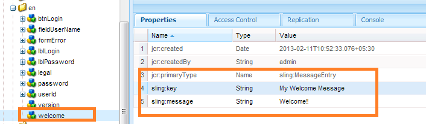

# 创建新登录屏幕{#creating-a-new-login-screen}

您可以修改所有使用AEM Forms登录屏幕的AEM Forms模块的登录屏幕。 例如，这些修改会影响Forms经理和AEM Forms工作区的登录屏幕。

## 先决条件 {#prerequisite}

1. 使用管理员权限在`/lc/crx/de`登录。
1. 执行以下操作：

   1. 复制分层结构：`/apps/livecycle/core/content`的`/libs/livecycle/core/content`。 保持相同的（节点／文件夹）属性和访问控制。
   1. 复制内容文件夹：从`/libs/livecycle/core`到`/apps/livecycle/core`。
   1. 删除`/apps/livecycle/core`文件夹的内容。

1. 执行以下操作：

   1. 复制分层结构：`/apps/livecycle/core/components/login`的`/libs/livecycle/core/components/login`。 保持相同的（节点／文件夹）属性和访问控制。
   1. 复制组件文件夹：从`/libs/livecycle/core`到`/apps/livecycle/core`。
   1. 删除文件夹的内容：`/apps/livecycle/core/components/login`。

## 添加新区域设置{#adding-a-new-locale}

1. 复制`i18n`文件夹：

   * 从 `/libs/livecycle/core/components/login`
   * 到 `/apps/livecycle/core/components/login`

1. 删除`i18n`内除一个文件夹外的所有文件夹，例如`en`。
1. 在文件夹`en`中，执行以下操作：

   1. 将文件夹重命名为要支持的区域设置名称。 例如，`ar`。
   1. 将属性`jcr:language`值更改为`ar`（对于`ar`文件夹）。

   >[!NOTE]
   >
   >如果区域设置是语言——国家／地区代码组合，例如`ar-DZ`，则将文件夹名称和属性值更改为`ar-DZ`。

1. 复制 `login.jsp`:

   * 从 `/libs/livecycle/core/components/login`
   * 到 `/apps/livecycle/core/components/login`

1. 修改`/apps/livecycle/core/components/login/login.jsp`的以下代码片断：

   ***区域设置是语言代码***

   ```
   String browserLocale = "en";
       for(int i=0; i<locales.length; i++)
       {
           String prioperty = locales[i];
           if(prioperty.trim().startsWith("en")) {
               browserLocale = "en";
               break;
           }
           if(prioperty.trim().startsWith("de")){
               browserLocale = "de";
               break;
           }
           if(prioperty.trim().startsWith("ja")){
               browserLocale = "ja";
               break;
           }
           if(prioperty.trim().startsWith("fr")){
               browserLocale = "fr";
               break;
           }
       }
   
   To
   
   String browserLocale = "en";
       for(int i=0; i<locales.length; i++)
       {
           String prioperty = locales[i];
           if(prioperty.trim().startsWith("ar")) {
               browserLocale = "ar";
               break;
           }
           if(prioperty.trim().startsWith("en")) {
               browserLocale = "en";
               break;
           }
           if(prioperty.trim().startsWith("de")){
               browserLocale = "de";
               break;
           }
           if(prioperty.trim().startsWith("ja")){
               browserLocale = "ja";
               break;
           }
           if(prioperty.trim().startsWith("fr")){
               browserLocale = "fr";
               break;
           }
       }
   ```

   ***区域设置是语言国家／地区代码***

   ```
   String browserLocale = "en";
       for(int i=0; i<locales.length; i++)
       {
           String prioperty = locales[i];
           if(prioperty.trim().startsWith("en")) {
               browserLocale = "en";
               break;
           }
           if(prioperty.trim().startsWith("de")){
               browserLocale = "de";
               break;
           }
           if(prioperty.trim().startsWith("ja")){
               browserLocale = "ja";
               break;
           }
           if(prioperty.trim().startsWith("fr")){
               browserLocale = "fr";
               break;
           }
       }
   
   To
   
   String browserLocale = "en";
       for(int i=0; i<locales.length; i++)
       {
           String prioperty = locales[i];
           if(prioperty.trim().equalsIgnoreCase("ar-DZ")) {
               browserLocale = "ar-DZ";
               break;
           }
           if(prioperty.trim().startsWith("en")) {
               browserLocale = "en";
               break;
           }
           if(prioperty.trim().startsWith("de")){
               browserLocale = "de";
               break;
           }
           if(prioperty.trim().startsWith("ja")){
               browserLocale = "ja";
               break;
           }
           if(prioperty.trim().startsWith("fr")){
               browserLocale = "fr";
               break;
           }
       }
   ```

   ***更改默认区域设置***

   ```
   String browserLocale = "en";
   for(int i=0; i<locales.length; i++)
   
   To
   
   String browserLocale = "ar";
   for(int i=0; i<locales.length; i++)
   ```

## 添加新文本或修改现有文本{#adding-new-text-or-modifying-existing-text}

1. 复制`i18n`文件夹：

   * 从 `/libs/livecycle/core/components/login`
   * 到 `/apps/livecycle/core/components/login`

1. 现在修改要更改其文本的节点属性`sling:message`的值（位于所需的区域设置代码文件夹下）。 转换通过节点`sling:key`属性值中提到的键完成。
1. 要添加新的键值对，请执行以下操作。 请查看屏幕截图中的示例。

   1. 创建类型为`sling:MessageEntry`的节点，或复制现有节点并将其重命名，位于所有区域设置文件夹下。
   1. 复制 `login.jsp` :

      * 从 `/libs/livecycle/core/components/login`
      * 到 `/apps/livecycle/core/components/login`
   1. 修改`/apps/livecycle/core/components/login/login.jsp`以合并新添加的文本。

   

   ```
   div class="loginContent">
                       <span class="loginFlow"></span>
                       <span class="loginVersion"><%= i18n.get("Version: 11.0.0") %></span>
                       <span class="loginTitle"><%= i18n.get("Login") %></span>
                       <% if (loginFailed) {%>
   
   To
   
   div class="loginContent">
                       <span class="loginFlow"></span>
                       <span class="loginVersion"><%= i18n.get("My Welcome Message") %></span>
                       <span class="loginVersion"><%= i18n.get("Version: 11.0.0") %></span>
                       <span class="loginTitle"><%= i18n.get("Login") %></span>
                       <% if (loginFailed) {%>
   ```

## 添加新样式，或修改现有样式{#adding-new-style-or-modifying-existing-style}

1. 复制`login`节点：

   * 从 `/libs/livecycle/core/content`
   * 到 `/apps/livecycle/core/content`

1. 从节点`/apps/livecycle/core/content/login.`中删除文件`login.js`和`jquery-1.8.0.min.js`
1. 修改CSS文件中的样式。
1. 添加新样式：

   1. 向`/apps/livecycle/core/content/login/login.css`添加新样式
   1. 复制 `login.jsp`

      * 从 `/libs/livecycle/core/components/login`
      * 到 `/apps/livecycle/core/components/login`
   1. 修改`/apps/livecycle/core/components/login/login.jsp`以合并新添加的样式。


1. 例如：

   * 将以下内容添加到`/apps/livecycle/core/content/login/login.css`。

   ```css
   .newLoginContentArea {
    width: 700px;
    padding: 100px 0px 0px 100px;
   }
   ```

   * 在/apps/livecycle/core/components/login.jsp中修改以下内容。

   ```
   <div class="loginContentArea">
   
   To
   
   <div class="newLoginContentArea">
   ```

>[!NOTE]
>
>如果删除了`/apps/livecycle/core/content/login`（从`/libs/livecycle/core/content/login`复制）中的现有图像，则删除CSS中的相应引用。

## 添加新图像{#add-new-images}

1. 请按照添加新样式或修改现有样式（见上文）的步骤操作。
1. 在`/apps/livecycle/core/content/login`中添加新图像。 要添加图像，请执行以下操作：

   1. 安装WebDAV客户端。
   1. 使用webDAV客户端导航到`/apps/livecycle/core/content/login`文件夹。 有关详细信息，请参阅：[https://dev.day.com/docs/en/crx/current/how_to/webdav_access.html](https://docs.adobe.com/docs/en/crx/current/how_to/webdav_access.html)。
   1. 添加新图像。

1. 在`/apps/livecycle/core/content/login/login.css,`中添加与在`/apps/livecycle/core/content/login`中添加的新图像对应的新样式。
1. 使用`login.jsp`中`/apps/livecycle/core/components`的新样式。
1. 例如：

   * 将以下内容添加到`/apps/livecycle/core/content/login/login.css`

   ```css
   .newLoginContainerBkg {
    background-image: url(my_Bg.gif);
    background-repeat: no-repeat;
    background-position: left top;
    width: 727px;
   }
   ```

   * 在/apps/livecycle/core/components/login.jsp中修改以下内容。

   ```
   <div class="loginContainerBkg">
   
   To
   
   <div class="newLginContainerBkg">
   ```
