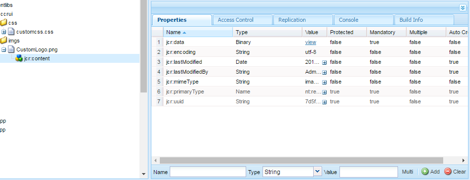

# 自定义创建对应UI {#customize-create-correspondence-ui}

## 概述 {#overview}

Correspondence Management允许您重新品牌化其解决方案模板，以提高品牌价值并遵守组织的品牌标准。 重新品牌化用户界面包括更改组织徽标，该徽标显示在“创建对应UI”的左上角。

您可以在创建通信UI中使用您组织的徽标更改徽标。


**义图** *标：创建通信UI中的自定义图标*

### 在“创建对应UI”{#changing-the-logo-in-the-create-correspondence-ui}中更改徽标

要设置您选择的徽标图像，请执行以下操作：

1. 在CRX](#creatingfolderstructure)中创建适当的[文件夹结构。
1. [在您在CRX中创](#uploadlogo) 建的文件夹中上传新的徽标文件。

1. [设置CSSon ](#createcss) CRX以引用新徽标。
1. 清除浏览器历史记录，并刷新“创建通信UI”](#refreshccrui)。[

## 创建所需的文件夹结构{#creatingfolderstructure}

创建用于托管自定义徽标图像和样式表的文件夹结构，如下所述。 根文件夹/apps的新文件夹结构与/libs文件夹的结构类似。

对于任何自定义，请在/apps分支中创建一个并行文件夹结构，如下所述。

/apps分支（文件夹结构）：

* 确保文件在系统更新时是安全的。 如果是升级、功能包或热修复，则/libs分支会更新，如果您在/libs分支中托管更改，则它们会被覆盖。
* 帮助您不干扰当前系统/分支，如果您使用默认位置存储自定义文件，则可能会误解该系统/分支。
* 帮助您的资源在AEM搜索资源时获得更高的优先级。 AEM配置为先搜索/apps分支，再搜索/libs分支以查找资源。 此机制意味着系统使用您的叠加（以及在此处定义的自定义）。

使用以下步骤在/apps分支中创建所需的文件夹结构：

1. 转到`https://[server]:[port]/[ContextPath]/crx/de`并以管理员身份登录。
1. 在apps文件夹中，创建一个名为`css`的文件夹，其路径/结构与css文件夹（位于ccrui文件夹中）类似。

   创建css文件夹的步骤：

   1. 右键单击以下路径的&#x200B;**css**&#x200B;文件夹，然后选择&#x200B;**叠加节点**:`/libs/fd/cm/ccr/gui/components/admin/clientlibs/ccrui/css`

      

   1. 确保“叠加节点”对话框具有以下值：

      **路径** :/libs/fd/cm/ccr/gui/components/admin/clientlibs/ccrui/css

      **叠加位置** :/apps/

      **匹配节点类型：已选** 中

      

      >[!NOTE]
      >
      >请勿在/libs分支中进行更改。 您所做的任何更改都可能会丢失，因为只要您：
      >
      >* 在您的实例上升级
      >* 应用热修复
      >* 安装功能包


   1. 单击&#x200B;**确定**。css文件夹是在指定路径中创建的。

1. 在apps文件夹中，创建一个名为`imgs`的文件夹，其路径/结构与imgs文件夹（位于ccrui文件夹中）类似。

   1. 右键单击以下路径的&#x200B;**imgs**&#x200B;文件夹，然后选择&#x200B;**叠加节点**:`/libs/fd/cm/ccr/gui/components/admin/clientlibs/ccrui/imgs`
   1. 确保“叠加节点”对话框具有以下值：

      **路径** :/libs/fd/cm/ccr/gui/components/admin/clientlibs/ccrui/imgs

      **叠加位置** :/apps/

      **匹配节点类型：已选** 中

   1. 单击&#x200B;**确定**。

      >[!NOTE]
      >
      >您还可以手动在/apps文件夹中创建文件夹结构。

1. 单击&#x200B;**全部保存**&#x200B;以在服务器上保存更改。

## 将新徽标上传到CRX {#uploadlogo}

将自定义徽标文件上传到CRX。 标准HTML规则控制徽标的呈现。 支持的图像文件格式取决于您访问AEM Forms时所使用的浏览器。 所有浏览器都支持JPEG、GIF和PNG。 有关详细信息，请参阅浏览器特定的文档，了解支持的图像格式。

* 徽标图像的默认尺寸为48 px &amp;ast;48 px. 确保您的图像与此大小相似或大于48 px &amp;ast;48 px.
* 如果徽标图像的高度大于50像素，则“创建对应”用户界面会将图像缩小到最大高度50像素，因为这是标题的高度。 在缩小图像时，“创建对应”用户界面会保持图像的宽高比。
* 如果图像较小，则“创建对应用户界面”不会放大图像，因此，请确保您使用的徽标图像高度至少为48像素，宽度足以清晰。

使用以下步骤将自定义徽标文件上传到CRX:

1. 转到 `https://[server]:[port]/[contextpath]/crx/de`. 如有必要，请以管理员身份登录。
1. 在CRXDE中，右键单击以下路径的&#x200B;**imgs**&#x200B;文件夹，然后选择&#x200B;**创建>创建文件**:

   `/apps/fd/cm/ccr/gui/components/admin/clientlibs/ccrui/imgs/`

   

1. 在“创建文件”对话框中，输入文件名为CustomLogo.png（或徽标文件的名称）。

   

1. 单击&#x200B;**保存全部**。

   在您创建的新文件（此处为CustomLogo.png）下，将显示jcr:content属性。

1. 在文件夹结构中单击jcr:content。

   显示jcr:content的属性。

   

1. 多次 — 单击&#x200B;**jcr:data**&#x200B;属性。

   此时将显示“编辑jcr:data”对话框。

   现在，单击newlogo.png文件夹，多次单击jcr:content（dim选项）并设置类型nt:resource。 如果不存在，请创建名为jcr:content的属性。

1. 在“编辑jcr:data”对话框中，单击&#x200B;**浏览**&#x200B;并选择要用作徽标的图像文件（此处为CustomLogo.png）。

   支持的图像文件格式取决于您访问AEM Forms时所使用的浏览器。 所有浏览器都支持JPEG、GIF和PNG。 有关详细信息，请参阅浏览器特定的文档，了解支持的图像格式。

   
   **图：** *示例 — 用作自定义徽标的CustomLogo.png*

1. 单击&#x200B;**保存全部**。

## 创建CSS以将徽标与UI {#createcss}集成

自定义徽标图像需要在内容上下文中加载其他样式表。

使用以下步骤设置用于渲染徽标的样式表：

1. 转到 `https://[server]:[port]/[contextpath]/crx/de`. 如有必要，请以管理员身份登录。
1. 在以下位置创建名为customcss.css的文件（不能使用其他文件名）：

   `/apps/fd/cm/ccr/gui/components/admin/clientlibs/ccrui/css/`

   创建customcss.css文件的步骤：

   1. 右键单击&#x200B;**css**&#x200B;文件夹，然后选择&#x200B;**创建>创建文件**。
   1. 在“新建文件”对话框中，将CSS的名称指定为`customcss.css`（不能使用其他文件名），然后单击&#x200B;**确定**。
   1. 将以下代码添加到新创建的css文件。 在代码中的content:url中，指定已上传到CRXDE中imgs文件夹的图像名称。

      ```css
      .logo, .logo:after {
      content:url("../imgs/CustomLogo.png");
      }
      ```

   1. 单击&#x200B;**保存全部**。

## 刷新“创建对应UI”，查看自定义徽标{#refreshccrui}

清除浏览器缓存，然后在浏览器中打开创建对应UI实例。 您应看到您的自定义徽标。


**用户界面图** *：“创建对应UI”中的自定义图标*

