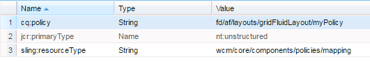

# 根据使用的模板显示组件 {#displaying-components-based-on-the-template-used}

当表单作者使用模板创建自适应表单 [时](/help/forms/using/template-editor.md)，表单作者可以根据模板策略查看和使用特定组件。 您可以指定模板内容策略，以便选择表单作者在创作表单时看到的一组组件。

## 更改模板的内容策略 {#changing-the-content-policy-of-a-template}

创建模板时，会在内容存储库 `/conf` 中的下面创建。 根据您在目录中创建的文 `/conf` 件夹，模板的路径为： `/conf/<your-folder>/settings/wcm/templates/<your-template>`.

根据模板的内容策略，执行以下步骤以在提要栏中显示组件：

1. 打开CRXDE lite。

   URL: `https://<server>:<port>/crx/de/index.jsp`

1. 在CRXDE中，导览至创建模板的文件夹。

   例如：`/conf/<your-folder>/`

1. 在CRXDE中，导航到： `/conf/<your-folder>/settings/wcm/policies/fd/af/layouts/gridFluidLayout/`

   要选择一组组件，需要新的内容策略。 要创建新策略，请复制并粘贴默认策略，然后对其重命名。

   默认内容策略的路径为： `/conf/<your-folder>/settings/wcm/policies/fd/af/layouts/gridFluidLayout/default`

   在文件 `gridFluidLayout` 夹中，复制并粘贴默认策略，然后对其重命名。 For example, `myPolicy`.

   

1. 选择您创建的新策略，然后在 **右侧** 、类型为的面板中选择组件属性 `string[]`。

   选择并打开组件属性时，将显示编辑组件对话框。 通过编辑组件对话框，可以使用+和——按钮 **添加** 或 **删除组** 件。 您可以添加包含您希望作者使用的表单的组件的组件组。

   

   添加组件组后，单击“ **确定** ”以更新列表，然后单 **击CRXDE地址栏上** 方的“保存全部”并刷新。

1. 在模板中，将内容策略从默认更改为您创建的新策略。 ( `myPolicy` 在本例中。)

   要更改策略，请在CRXDE中，导航到 `/conf/<your-folder>/settings/wcm/templates/<your-template>/policies/jcr:content/guideContainer/rootPanel/items`。

   在属 `cq:policy` 性中， `default` 更改为新策略名称( `myPolicy`)。

   

   创作使用模板创建的表单时，您可以在提要栏中看到添加的组件。

