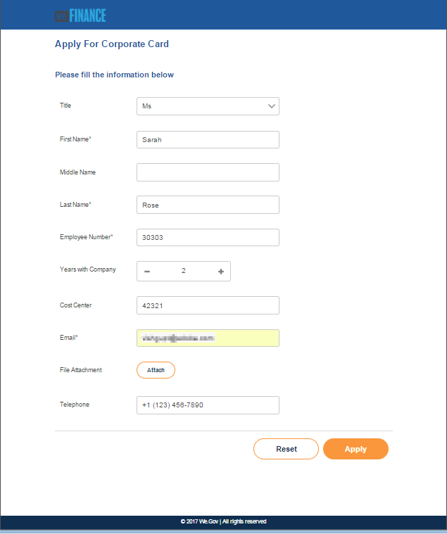
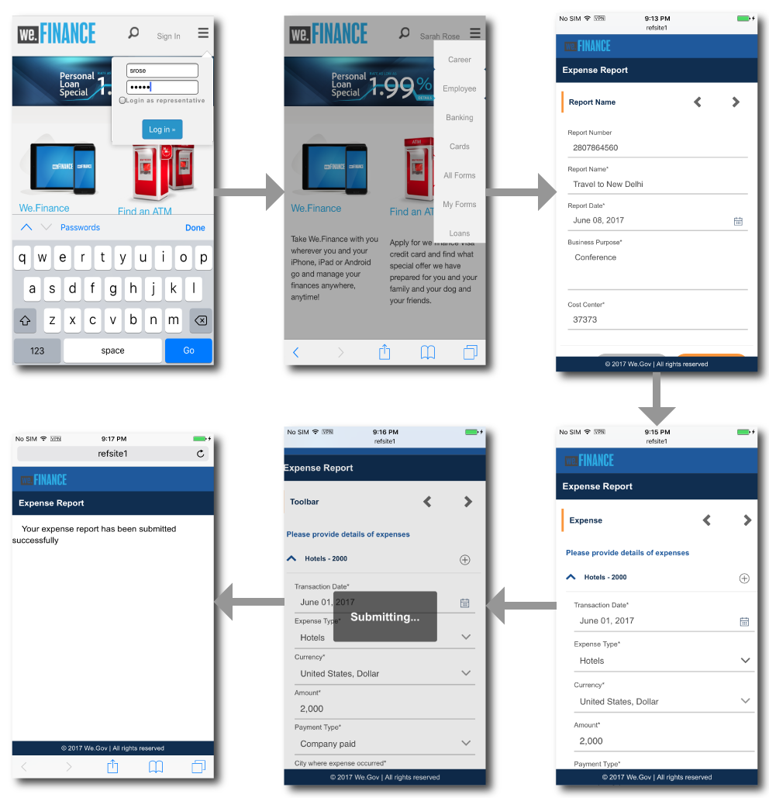
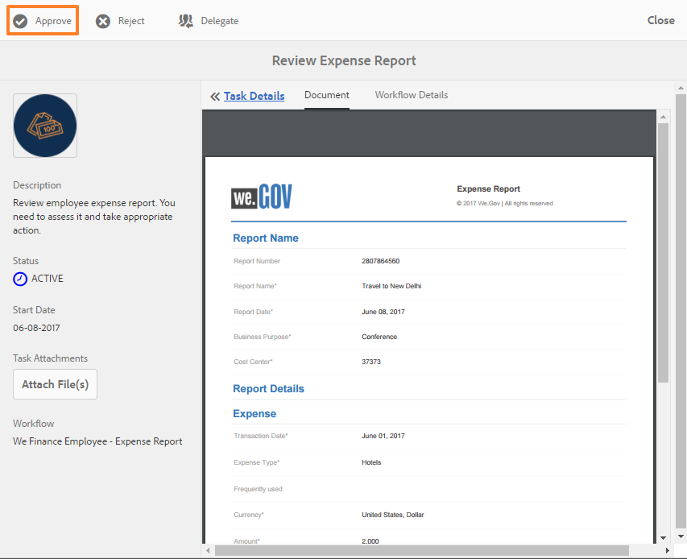

# 员工自助参考站点演练{#employee-self-service-reference-site-walkthrough}

## 先决条件 {#prerequisite}

按[设置和配置AEM Forms参考站点](/help/forms/using/setup-reference-sites.md)中所述设置参考站点。

## 概述 {#overview}

员工自助服务系统通常托管在公司的内部网上，它使员工能够访问他们可以从办公桌上使用的大量信息和服务。 它赋予员工执行操作的能力并赋予员工完全的控制权，例如访问他们的雇佣详细信息、申请休假和提交费用报告。 另一方面，它有助于组织提高流程效率并降低成本，同时让员工保持知情和参与。

员工自助服务参考站点展示如何利用AEM Forms在您的组织中实施员工自助服务系统。

>[!NOTE]
>
>We.Finance和We.Gov参考站点均提供员工自助服务用例。 演练中使用的示例、图像和说明使用We.Finance参考站点。 但是，您也可以使用We.Gov运行这些用例和检查项目。 要这样做，您必须将上述URL中的&#x200B;**we-finance**&#x200B;替换为&#x200B;**we-gov**。

## 利益冲突调查表演练{#conflict-of-interest-questionnaire-walkthrough}

组织不时要求其员工提交利益冲突调查表，以确定可能与其组织发生冲突的员工的外部活动或个人关系。

Sarah组织的合规部门已要求员工提交利益冲突调查表。

### Sarah提交利益冲突调查表{#sarah-submits-the-conflict-of-interest-questionnaire}

Sarah进入其组织的门户，登录并单击“员工”以访问员工仪表板。 她在员工仪表板上找到“利益冲突”调查表，然后单击&#x200B;**[!UICONTROL Apply]**。

**home图：组** *织门户*

**dashboard图：** *员工仪表板*

Sarah使用“下一步”按钮导航表单并阅读“简介”和“定义”部分。 她回答“问题”部分的问题。 最后，她签名并提交调查表。

组织门户和调查表具有响应性，并且适合移动。 以下工作流程显示了Sarah如何在其移动设备上导航并提交调查表。

**工作方式**

组织门户和员工仪表板是AEM Sites页面。 仪表板列表若干自助服务选项，如利益冲突调查表。 “应用”按钮链接到自适应表单。

自适应表单使用规则根据“问题”选项卡中提供的答案显示——隐藏信息。 此外，表单还使用Scribble组件在“声明”选项卡中进行签名。 查看位于`https://[authorHost]:[authorPort]/editor.html/content/forms/af/we-finance/employee/self-service/conflict-of-interest.html`的自适应表单。

**亲自查看**

转到`https://[publishHost]:[publishPort]/content/we-finance/global/en/self-service-forms.html`并使用`srose/srose`作为Sarah的用户名／密码登录。 单击&#x200B;**[!UICONTROL 员工]**&#x200B;以访问仪表板，然后单击“利益冲突”调查表上的&#x200B;**[!UICONTROL 应用]**。 审查并提交调查表。

### Gloria审查并批准利益冲突问卷提交{#gloria-reviews-and-approves-the-conflict-of-interest-questionnaire-submission}

Sarah提交的利益冲突调查表被指派给Gloria Rios审查。 Gloria在组织中担任合规官。 Gloria登录到她的AEM收件箱，并查看分配给她的任务。 她批准了Sarah提交的调查表并完成任务。

**inbox图：** *Gloria的收件箱*

**approved图：打** *开任务*

**工作方式**

Conflict of Interest调查表中的提交操作会触发一个工作流，该工作流会在Gloria的收件箱中创建一个任务以供审批。 查看`https://[authorHost]:[authorPort]/editor.html/conf/global/settings/workflow/models/we-finance/employee/self-service/we-finance-employee-conflict-of-interest.html`的Forms Workflow

**亲自查看**

转到`https://[publishHost]:[publishPort]/content/we-finance/global/en/login.html?resource=/aem/inbox.html`并使用`grios/password`作为Gloria Rios的用户名／密码登录。 打开为利益冲突创建的任务问卷并进行批准。

## 公司卡应用程序演练{#corporate-card-application-walkthrough}

莎拉为了商务旅行，她需要一张公司信用卡来支付搬家时的账单。 她通过自己组织的员工门户申请公司卡。

### Sarah提交公司卡应用程序{#sarah-submits-the-corporate-card-application}

Sarah进入其组织的门户，登录并单击&#x200B;**[!UICONTROL Employee]**&#x200B;以访问员工仪表板。 她在员工仪表板上找到公司卡应用程序，然后单击&#x200B;**[!UICONTROL 应用]**。

**：组织门** *户*

**图：** *员工仪表板*

她单击公司卡应用程序上的&#x200B;**[!UICONTROL 应用]**。 将打开单页应用程序。 她填写所有详细信息，并单击&#x200B;**[!UICONTROL Apply]**&#x200B;提交应用程序。

**工作方式**

组织门户和员工仪表板是AEM Sites页面。 仪表板列表了多种自助服务选项，如公司卡应用程序。 应用程序上的“应用”按钮链接到自适应表单。

公司卡应用程序的自适应表单是一个简单、一页、响应式自适应表单。 它使用基本的自适应表单组件，如文本、电话、数字框和数字步进器。 在以下位置查看自适应表单：\
`https://[authorHost]:[authorPort]/editor.html/content/forms/af/we-finance/employee/self-service/corporate-card.html`。

**亲自查看**

转到`https://[publishHost]:[publishPort]/content/we-finance/global/en/self-service-forms.html`并使用`srose/srose`作为Sarah的用户名／密码登录。 单击&#x200B;**[!UICONTROL 员工]**&#x200B;以访问仪表板，然后单击公司卡应用程序上的&#x200B;**[!UICONTROL 应用]**。 填写详细信息，然后提交申请。

### Gloria审查并批准公司卡应用程序{#gloria-reviews-and-approves-the-corporate-card-application}

Sarah提交的公司卡申请已分配给Gloria Rios审阅。 Gloria登录到她的AEM收件箱，并查看分配给她的任务。 她批准了Sarah提交的申请并完成任务。

**图：** *Gloria的收件箱*

**图：开** *放任务*

**工作方式**

公司卡应用程序中的提交工作流会触发一个Forms工作流，该工作流会在Gloria的收件箱中创建一个任务以供审批。 查看`https://[authorHost]:[authorPort]/editor.html/conf/global/settings/workflow/models/we-finance/employee/self-service/we-finance-employee-corporate-card.html`的Forms Workflow

**亲自查看**

转到`https://[publishHost]:[publishPort]/content/we-finance/global/en/login.html?resource=/aem/inbox.html`并使用`grios/password`作为Gloria Rios的用户名／密码登录。 打开为公司卡应用程序创建的任务并进行批准。

## 费用报告提交演练{#expense-report-submission-walkthrough}

当莎拉在商务旅行中花费时，她需要提交费用报告才能获得批准。 通过组织中的自助服务选项，她可以在线提交费用报告。

### Sarah提交Expense Report应用程序{#sarah-submits-the-expense-report-application}

Sarah进入其组织的门户，登录并单击&#x200B;**[!UICONTROL Employee]**&#x200B;以访问员工仪表板。 她在员工仪表板中找到“费用报表”应用程序，然后单击&#x200B;**[!UICONTROL “应用”]**。

**：组织门** *户*

**图：** *员工仪表板*

她单击“费用报告”应用程序上的&#x200B;**[!UICONTROL “应用”]**。 此时将打开一个应用程序表单，该表单包含两个选项卡——报告名称和报告详细信息。 “报告详细信息”选项卡中的&#x200B;**+**&#x200B;图标允许她在一个报告中添加多项支出。

组织门户和应用程序具有响应性，并且适合移动。 以下工作流程显示了Sarah如何导航并在其移动设备上提交费用报告。

**工作方式**

组织门户和员工仪表板是AEM Sites页面。 仪表板会列表多个自助服务选项，如“费用报表”应用程序。 “应用”按钮链接到自适应表单。

自适应表单中的“报表名称”和“报表详细信息”选项卡是面板组件。 “报告详细信息”面板包含“费用”面板。 这是一个可重复的面板，允许在报告中添加多项支出。 在`https://[authorHost]:[authorPort]/editor.html/content/forms/af/we-finance/employee/expense-report.html`查看自适应表单及其配置。

**亲自查看**

转到`https://[publishHost]:[publishPort]/content/we-finance/global/en/self-service-forms.html`并使用`srose/srose`作为Sarah的用户名／密码登录。 单击&#x200B;**[!UICONTROL 员工]**&#x200B;以访问仪表板，然后单击“费用报告”应用程序上的&#x200B;**[!UICONTROL 应用]**。 填写详细信息并提交申请。

### Gloria审查并批准费用报告{#gloria-reviews-and-approves-the-expense-report}

Sarah提交的费用报告被分配给Gloria Rios进行审查。 Gloria登录到她的AEM收件箱，并查看分配给她的任务。 她批准了Sarah提交的申请并完成任务。

**inbox图：** *Gloria的收件箱*

**approved图：开** *放任务*

**工作方式**

费用报表应用程序中的提交工作流会触发一个Forms工作流，该工作流会在Gloria的收件箱中创建一个任务以供审批。 查看`https://[authorHost]:[authorPort]/editor.html/conf/global/settings/workflow/models/we-finance/employee/self-service/we-finance-employee-expense-report-workflow.html`的Forms Workflow

**亲自查看**

转到`https://[publishHost]:[publishPort]/content/we-finance/global/en/login.html?resource=/aem/inbox.html`并使用`grios/password`作为Gloria Rios的用户名／密码登录。 打开为费用报表应用程序创建的任务并进行批准。

## 让应用程序演练{#leave-application-walkthrough}

莎拉计划下月进行家庭度假，希望申请一周的休假。

### Sarah提交leave应用程序{#sarah-submits-the-leave-application}

Sarah进入其组织的门户，登录并单击&#x200B;**[!UICONTROL Employee]**&#x200B;以访问员工仪表板。 她在员工仪表板上找到离开应用程序并单击&#x200B;**[!UICONTROL 应用]**。

**：组织门** *户*

**图：** *员工仪表板*

此时将打开休假申请，表格中预填了Sarah的姓名和员工ID。 它还显示了她的假期平衡和历史。 她填写了休假细节，并提交申请以供批准。

组织门户和应用程序具有响应性，并且适合移动。 以下工作流程显示了Sarah如何在其移动设备上导航和提交应用程序。

**工作方式**

组织门户和员工仪表板是AEM Sites页面。 仪表板列表了几个自助服务选项，如leave应用程序。 “应用”按钮链接到自适应表单。

离职申请的自适应表单基于员工离职表单数据模型。 在“剩余余额”部分，使用`getLeavesOf`表单数据模型服务填充剩余余额表。 “开始”和“终止日期”字段使用规则验证日期值是否等于当前日期或当前日期之后。 使用`calcBusinessDays`函数计算休假持续时间。

您可以在以下位置查看自适应表单和表单数据模型：

`https://[authorHost]:[authorPort]/editor.html/content/forms/af/we-finance/employee/self-service/leave-application.html`

`https://[authorHost]:[authorPort]/aem/fdm/editor.html/content/dam/formsanddocuments-fdm/db`

**亲自查看**

转到`https://[publishHost]:[publishPort]/content/we-finance/global/en/self-service-forms.html`并使用`srose/srose`作为Sarah的用户名／密码登录。 单击&#x200B;**[!UICONTROL 员工]**&#x200B;以访问仪表板，然后单击“离开应用程序”上的&#x200B;**[!UICONTROL 应用]**。 填写详细信息并提交申请。

### Gloria审查并批准leave应用程序{#gloria-reviews-and-approves-the-leave-application}

Sarah提交的休假申请被分配给Gloria Rios审查。 Gloria登录到她的AEM收件箱，并查看分配给她的任务。 她批准了Sarah提交的申请并完成任务。

**inbox图：** *Gloria的收件箱*

**approved图：打** *开任务*

**工作方式**

leave应用程序中的提交工作流会触发一个Forms工作流，该工作流会在Gloria的收件箱中创建一个任务以供审批。 查看`https://[authorHost]:[authorPort]/editor.html/conf/global/settings/workflow/models/we-finance/employee/self-service/we-finance-employee-leave-application.html`的Forms Workflow

**亲自查看**

转到`https://[publishHost]:[publishPort]/content/we-finance/global/en/login.html?resource=/aem/inbox.html`并使用`grios/password`作为Gloria Rios的用户名／密码登录。 打开为退出申请创建的任务并进行批准。
