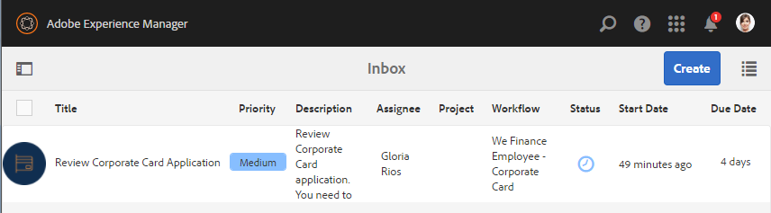

# 员工自助参考站点演练 {#employee-self-service-reference-site-walkthrough}

## 先决条件 {#prerequisite}

按照设置和配置AEM Forms参考站 [点中的说明设置参考站点](/help/forms/using/setup-reference-sites.md)。

## 概述 {#overview}

员工自助服务系统通常托管在公司的内部网上，它使员工能够访问他们可以从办公桌上使用的大量信息和服务。 它赋予员工执行操作的能力并赋予员工完全的控制权，例如访问他们的雇佣详细信息、申请休假和提交费用报告。 另一方面，它有助于组织提高流程效率并降低成本，同时让员工保持知情和参与。

员工自助服务参考站点展示如何利用AEM Forms在您的组织中实施员工自助服务系统。

>[!NOTE]
>
>We.Finance和We.Gov参考站点均提供员工自助服务用例。 演练中使用的示例、图像和说明使用We.Finance参考站点。 但是，您也可以使用We.Gov运行这些用例和检查项目。 为此，您必须在 **上述URL中****将we-finance** 替换为we-gov。

## 利益冲突问卷演练 {#conflict-of-interest-questionnaire-walkthrough}

组织不时要求其员工提交利益冲突调查表，以确定可能与其组织发生冲突的员工的外部活动或个人关系。

Sarah组织的合规部门已要求员工提交利益冲突调查表。

### Sarah提交利益冲突调查表 {#sarah-submits-the-conflict-of-interest-questionnaire}

Sarah进入其组织的门户，登录并单击“员工”以访问员工仪表板。 她查找有关员工仪表板的利益冲突调查表并单击“ **[!UICONTROL 应用]**”。

**:** *组织门户*

**图：** *员工仪表板*

Sarah使用“下一步”按钮导航表单并阅读“简介”和“定义”部分。 她回答“问题”部分的问题。 最后，她签名并提交调查表。

组织门户和调查表具有响应性，并且适合移动。 以下工作流程显示了Sarah如何在其移动设备上导航并提交调查表。

**工作方式**

组织门户和员工仪表板是AEM Sites页面。 仪表板列表若干自助服务选项，如利益冲突调查表。 “应用”按钮链接到自适应表单。

自适应表单使用规则根据“问题”选项卡中提供的答案显示——隐藏信息。 此外，表单还使用Scribble组件在“声明”选项卡中进行签名。 请在查看自适应表单 `https://[authorHost]:[authorPort]/editor.html/content/forms/af/we-finance/employee/self-service/conflict-of-interest.html`。

**亲自查看**

转到并 `https://[publishHost]:[publishPort]/content/we-finance/global/en/self-service-forms.html` 使用Sarah的 `srose/srose` 用户名／密码登录。 单击 **[!UICONTROL Employee]** （员工）以访问仪表板，然后单 **[!UICONTROL 击Apply]** on Conflict of Interest（利益冲突）调查表。 审查并提交调查表。

### Gloria审查和批准利益冲突问卷提交 {#gloria-reviews-and-approves-the-conflict-of-interest-questionnaire-submission}

Sarah提交的利益冲突调查表被指派给Gloria Rios审查。 Gloria在组织中担任合规官。 Gloria登录到她的AEM收件箱，并查看分配给她的任务。 她批准了Sarah提交的调查表并完成任务。

**图：** *Gloria的收件箱*

**图：** *打开任务*

**工作方式**

Conflict of Interest调查表中的提交操作会触发一个工作流，该工作流会在Gloria的收件箱中创建一个任务以供审批。 查看Forms Workflow `https://[authorHost]:[authorPort]/editor.html/conf/global/settings/workflow/models/we-finance/employee/self-service/we-finance-employee-conflict-of-interest.html`

**亲自查看**

转到 `https://[publishHost]:[publishPort]/content/we-finance/global/en/login.html?resource=/aem/inbox.html` 并使用Gloria Rios `grios/password` 的用户名／密码登录。 打开为利益冲突创建的任务问卷并进行批准。

## 公司卡应用程序演练 {#corporate-card-application-walkthrough}

莎拉为了商务旅行，她需要一张公司信用卡来支付搬家时的账单。 她通过自己组织的员工门户申请公司卡。

### Sarah提交公司卡申请 {#sarah-submits-the-corporate-card-application}

Sarah进入其组织的门户，登录并单击“员 **[!UICONTROL 工]** ”访问员工仪表板。 她在员工仪表板上找到公司卡应用程序，然后单击“ **[!UICONTROL 应用]**”。

**:** *组织门户*

**图：** *员工仪表板*

她单击“ **[!UICONTROL 应用]** ”(Apply on the Corporate Card)应用程序。 将打开单页应用程序。 她会填写所有详细信息并单 **[!UICONTROL 击]** “应用”提交应用程序。

**工作方式**

组织门户和员工仪表板是AEM Sites页面。 仪表板列表了多种自助服务选项，如公司卡应用程序。 应用程序上的“应用”按钮链接到自适应表单。

公司卡应用程序的自适应表单是一个简单、一页、响应式自适应表单。 它使用基本的自适应表单组件，如文本、电话、数字框和数字步进器。 在以下位置查看自适应表单：\
`https://[authorHost]:[authorPort]/editor.html/content/forms/af/we-finance/employee/self-service/corporate-card.html`。

**亲自查看**

转到并 `https://[publishHost]:[publishPort]/content/we-finance/global/en/self-service-forms.html` 使用Sarah的 `srose/srose` 用户名／密码登录。 单击 **[!UICONTROL “员工]** ”以访问仪表板，然后单击“ **[!UICONTROL 在公司卡]** 上应用”应用程序。 填写详细信息，然后提交申请。

### Gloria审阅并批准公司卡申请 {#gloria-reviews-and-approves-the-corporate-card-application}

Sarah提交的公司卡申请已分配给Gloria Rios审阅。 Gloria登录到她的AEM收件箱，并查看分配给她的任务。 她批准了Sarah提交的申请并完成任务。

**图：** *Gloria的收件箱*

**图：** *打开任务*

**工作方式**

公司卡应用程序中的提交工作流会触发一个Forms工作流，该工作流会在Gloria的收件箱中创建一个任务以供审批。 查看Forms Workflow `https://[authorHost]:[authorPort]/editor.html/conf/global/settings/workflow/models/we-finance/employee/self-service/we-finance-employee-corporate-card.html`

**亲自查看**

转到 `https://[publishHost]:[publishPort]/content/we-finance/global/en/login.html?resource=/aem/inbox.html` 并使用Gloria Rios `grios/password` 的用户名／密码登录。 打开为公司卡应用程序创建的任务并进行批准。

## 费用报告提交演练 {#expense-report-submission-walkthrough}

当莎拉在商务旅行中花费时，她需要提交费用报告才能获得批准。 通过组织中的自助服务选项，她可以在线提交费用报告。

### Sarah提交Expense Report应用程序 {#sarah-submits-the-expense-report-application}

Sarah进入其组织的门户，登录并单击“员 **[!UICONTROL 工]** ”访问员工仪表板。 她在员工仪表板中查找“费用报表”应用程序，然后单击“ **[!UICONTROL 应用]**”。

**:** *组织门户*

**图：** *员工仪表板*

她单击“ **[!UICONTROL 应用]** ”(Apply on the Expense Report)应用程序。 此时将打开一个应用程序表单，该表单包含两个选项卡——报告名称和报告详细信息。 “报 **表详细** 信息”选项卡中的+图标允许她在一个报表中添加多项支出。

组织门户和应用程序具有响应性，并且适合移动。 以下工作流程显示了Sarah如何导航并在其移动设备上提交费用报告。

**工作方式**

组织门户和员工仪表板是AEM Sites页面。 仪表板会列表多个自助服务选项，如“费用报表”应用程序。 “应用”按钮链接到自适应表单。

自适应表单中的“报表名称”和“报表详细信息”选项卡是面板组件。 “报告详细信息”面板包含“费用”面板。 这是一个可重复的面板，允许在报告中添加多项支出。 请在查看自适应表单及其配置 `https://[authorHost]:[authorPort]/editor.html/content/forms/af/we-finance/employee/expense-report.html`。

**亲自查看**

转到并 `https://[publishHost]:[publishPort]/content/we-finance/global/en/self-service-forms.html` 使用Sarah的 `srose/srose` 用户名／密码登录。 单击 **[!UICONTROL Employee]** （员工）以访问仪表板，然后单 **[!UICONTROL 击Apply]** on Expense Report（应用费用报表）。 填写详细信息并提交申请。

### Gloria审阅并批准费用报告 {#gloria-reviews-and-approves-the-expense-report}

Sarah提交的费用报告被分配给Gloria Rios进行审查。 Gloria登录到她的AEM收件箱，并查看分配给她的任务。 她批准了Sarah提交的申请并完成任务。

**:** *Gloria的收件箱*

**:** *打开任务*

**工作方式**

费用报表应用程序中的提交工作流会触发一个Forms工作流，该工作流会在Gloria的收件箱中创建一个任务以供审批。 查看Forms Workflow `https://[authorHost]:[authorPort]/editor.html/conf/global/settings/workflow/models/we-finance/employee/self-service/we-finance-employee-expense-report-workflow.html`

**亲自查看**

转到 `https://[publishHost]:[publishPort]/content/we-finance/global/en/login.html?resource=/aem/inbox.html` 并使用Gloria Rios `grios/password` 的用户名／密码登录。 打开为费用报表应用程序创建的任务并进行批准。

## 离开应用程序演练 {#leave-application-walkthrough}

莎拉计划下月进行家庭度假，希望申请一周的休假。

### Sarah提交休假申请 {#sarah-submits-the-leave-application}

Sarah进入其组织的门户，登录并单击“员 **[!UICONTROL 工]** ”访问员工仪表板。 她会在员工仪表板上找到离开申请并单击“ **[!UICONTROL 应用]**”。

**:** *组织门户*

**图：** *员工仪表板*

此时将打开休假申请，表格中预填了Sarah的姓名和员工ID。 它还显示了她的假期平衡和历史。 她填写了休假细节，并提交申请以供批准。

组织门户和应用程序具有响应性，并且适合移动。 以下工作流程显示了Sarah如何在其移动设备上导航和提交应用程序。

**工作方式**

组织门户和员工仪表板是AEM Sites页面。 仪表板列表了几个自助服务选项，如leave应用程序。 “应用”按钮链接到自适应表单。

离职申请的自适应表单基于员工离职表单数据模型。 在“剩余余额”部分，将使用表单数据模型服务填 `getLeavesOf` 充剩余余额表。 “开始”和“终止日期”字段使用规则验证日期值是否等于当前日期或当前日期之后。 使用函数计算休假持 `calcBusinessDays` 续时间。

您可以在以下位置查看自适应表单和表单数据模型：

`https://[authorHost]:[authorPort]/editor.html/content/forms/af/we-finance/employee/self-service/leave-application.html`

`https://[authorHost]:[authorPort]/aem/fdm/editor.html/content/dam/formsanddocuments-fdm/db`

**亲自查看**

转到并 `https://[publishHost]:[publishPort]/content/we-finance/global/en/self-service-forms.html` 使用Sarah的 `srose/srose` 用户名／密码登录。 单击 **[!UICONTROL “员工]** ”以访问仪表板，然后单击“在离开 **[!UICONTROL 应用]** 时应用”。 填写详细信息并提交申请。

### Gloria审阅并批准休假申请 {#gloria-reviews-and-approves-the-leave-application}

Sarah提交的休假申请被分配给Gloria Rios审查。 Gloria登录到她的AEM收件箱，并查看分配给她的任务。 她批准了Sarah提交的申请并完成任务。

**图：** *Gloria的收件箱*

**图：** *打开任务*

**工作方式**

leave应用程序中的提交工作流会触发一个Forms工作流，该工作流会在Gloria的收件箱中创建一个任务以供审批。 查看Forms Workflow `https://[authorHost]:[authorPort]/editor.html/conf/global/settings/workflow/models/we-finance/employee/self-service/we-finance-employee-leave-application.html`

**亲自查看**

转到 `https://[publishHost]:[publishPort]/content/we-finance/global/en/login.html?resource=/aem/inbox.html` 并使用Gloria Rios `grios/password` 的用户名／密码登录。 打开为退出申请创建的任务并进行批准。
