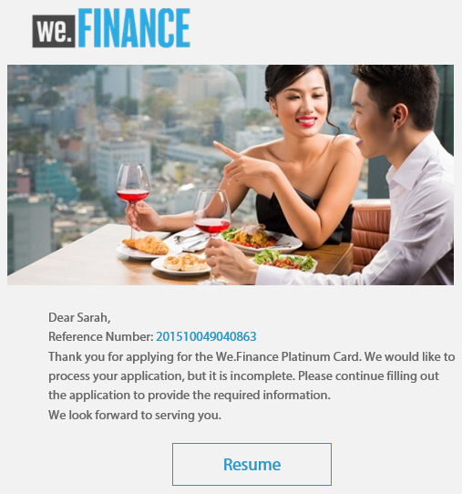
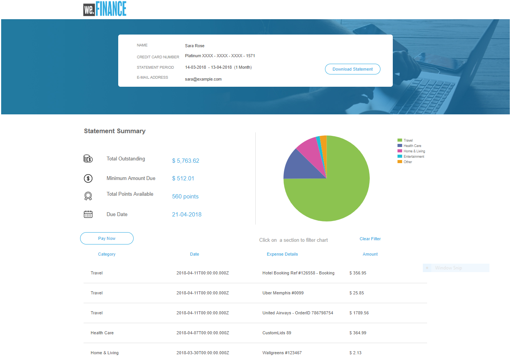
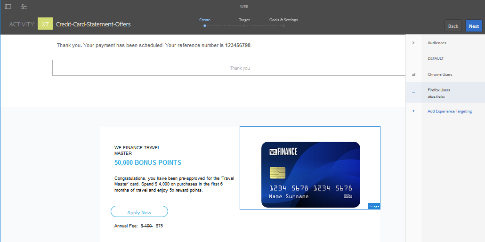
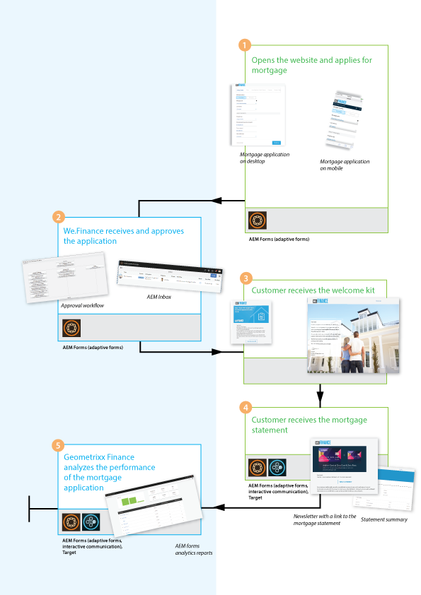
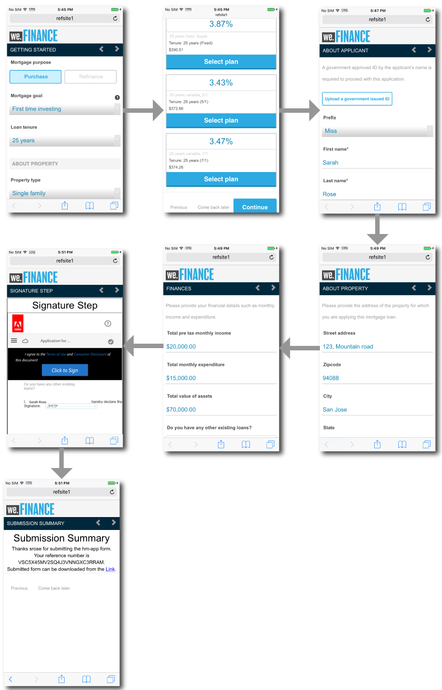
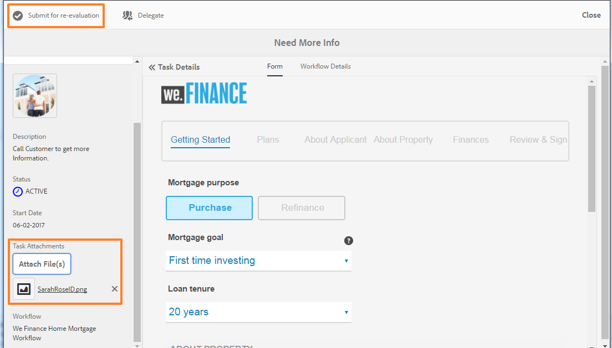

# We.Finance参考站点演练 {#we-finance-reference-site-walkthrough}

>[!CAUTION]
>
>AEM 6.4已结束扩展支持，本文档将不再更新。 有关更多详细信息，请参阅 [技术支助期](https://helpx.adobe.com/cn/support/programs/eol-matrix.html). 查找支持的版本 [此处](https://experienceleague.adobe.com/docs/).

## 先决条件 {#pre-requisites}

按照 [设置和配置AEM Forms引用站点](/help/forms/using/setup-reference-sites.md).

## We.Finance参考站点方案 {#we-finance-reference-site-scenarios}

We.Finance是金融服务领域的一家领先组织，提供全面和个性化的财务解决方案，以满足不同客户档案的要求。 他们提供信用卡、住房抵押和住房保险服务。

他们的目标是通过其首选设备与现有客户和潜在客户联系，解释其服务的好处，并帮助他们注册其服务。 此外，他们还希望推销更多金融产品，比如客户可能会觉得有趣的附加卡。

阅读We.Finance用例的详细演练，并了解AEM Forms如何帮助金融组织实现其目标。 涵盖以下演练：

* [信用卡申请演练](#credit-card-application-walkthrough)
* [住房抵押申请演练](#home-mortgage-application-walkthrough)
* [Microsoft Dynamics住宅抵押申请演练](#home-mortgage-application-walkthrough-with-microsoft-dynamics)
* [家庭保险申请演练](#home-insurance-application-walkthrough)
* [财富管理演练](#wealthmanagementwalkthrough)
* [车险申请演练](#autoinsuranceapplicationwalkthrough)

## 信用卡申请演练 {#credit-card-application-walkthrough}

We.Finance信用卡应用方案涉及以下角色：

* Sarah Rose，We.Finance客户
* Gloria Rios，We.Finance信用卡和抵押业务负责人

以下信息图描述了信用卡应用程序的分步工作流程。

让我们详细查看参考站点情景，了解AEM Forms如何帮助We.Finance实现其目标。

### Sarah收到We.Finance发来的快讯并申请信用卡 {#sarah-receives-a-newsletter-from-we-finance-and-applies-for-a-credit-card}

莎拉·罗斯是We.Finance的现有客户。 她收到We.Finance发来的关于所提供新信用卡的通讯。 她觉得这些优惠很刺激，决定申请一张信用卡。 她单击新闻稿中的立即申请按钮，此按钮会将她转到We.Finance门户上的信用卡申请。

#### 工作原理 {#how-it-works}

发送给Sarah的Newsletter是一个自定义实施，它会触发到指定电子邮件ID的电子邮件。 电子邮件中的立即申请按钮已链接到信用卡应用程序，该应用程序是发布实例上的自适应表单。

#### 亲眼看看 {#see-it-yourself}

在发布实例中打开以下URL以触发新闻稿电子邮件。 确保将 `[emailID]` 具有有效的电子邮件帐户来接收新闻稿。 打开新闻稿，然后单击 **[!UICONTROL 立即申请]** 转到信用卡申请。

`https://[publishServer]:[publsihPort]/content/campaigns/we-finance/start.html?app=cc&email=[emailID]&givenName=Sarah&familyName=Rose`

### 莎拉觉得这个提议很有趣，并选择申请 {#sarah-finds-the-offer-interesting-and-chooses-to-apply}

莎拉决定申请信用卡和水龙头 **[!UICONTROL 立即申请]** 按钮。 Sarah通过We.Finance门户查看信用卡申请。 应用程序表单使用卡布局按部分组织。

Sarah会从可用选项中选择一张信用卡并单击 **[!UICONTROL 继续]**.

在“个人信息”页面上，当Sarah提供其社会保险号时，她会收到一条提示，要用她的凭据登录。

莎拉是We.Finance的现有客户。 她使用自己的We.Finance帐户凭据登录，并且其个人详细信息会以表单自动填充。 莎拉继续填写申请表，这时她必须出席的会议的提醒会弹出。 她点击 **[!UICONTROL 保存进度]** 在申请表上。 它保存了Sarah迄今填写的所有信息，并弹出一个对话框，确认她是否希望收到一封电子邮件，其中包含指向她草稿应用程序的链接，以供日后完成。

Sarah点击 **[!UICONTROL 发送邮件]**. 她收到一封电子邮件，其中包含恢复信用卡申请的链接。

<!--Theses sections used to be an accordion until converted to straight Markdown. When accordions are enabled, revert-->

### Sarah通过她的移动设备访问信用卡申请 {#a-sarah-access}

如果Sarah正从其移动设备访问信用卡应用程序，则响应式应用程序将在针对移动设备优化的视图中打开。 在此视图中，应用程序表单一次呈现为一个部分。 它使Sarah能够在浏览应用程序时逐步查看和提供信息。

### 工作原理 {#a-how-it-works}

的 **[!UICONTROL 立即申请]** 按钮将Sarah引导至信用卡申请。 应用程序是自适应表单，您可以在创作实例中查看，具体位于 `https://[host]:[Port]/editor.html/content/forms/af/we-finance/cc-app.html`.

您可以在自适应表单中查看的一些主要功能包括：

* 它基于XSD架构。
* 它是使用We Finance Theme A构建的，用于样式，使用We.Finance模板构建布局。 此外，它还在移动导航中使用表单标题布局中不含面板标题的布局。 当从移动设备打开时，它会显示渐进式移动布局。 您可以在 `https://[host]:[Port]/libs/wcm/core/content/sites/templates.html/conf/we-finance` 主题是 `https://[host]:[Port]/editor.html/content/dam/formsanddocuments-themes/we-finance/we-finance-theme-a/jcr:content`.
* 它包括自适应表单规则，用于调用表单数据模型服务来预填已登录用户的用户详细信息。 它还调用服务，按社会保障号码或表格中提供的电子邮件地址预填信息。 您可以在 `https://[host]:[Port]/aem/forms.html/content/dam/formsanddocuments-fdm`.
* 它使用各种自适应表单组件来捕获输入并根据用户响应进行调整。 它还使用支持HTML5输入类型的电子邮件等组件。
* 它使用签名步骤组件来显示完成的表单，并允许在表单上进行电子签名。
* “保存我的进度”按钮为用户生成一个唯一ID，并将部分填充的应用程序另存为草稿，保存到AEM存储库的节点中。 此外，还会显示一个对话框，用于请求权限发送包含指向包含草稿应用程序节点的链接的电子邮件。 确认对话框中的“发送邮件”按钮会触发一封电子邮件，其中包含指向包含草稿的节点的链接。
* 它使用调用AEM工作流提交操作来触发信用卡审批工作流。 您可以在 `https://[host]:[Port]/editor.html/conf/global/settings/workflow/models/we-finance-credit-card-workflow.html`

建议查看表单，以了解用于构建表单的架构、组件、规则、表单数据模型、表单工作流以及提交操作。

此外，请参阅以下文档，以了解有关信用卡应用程序自适应表单中所用功能的更多信息：

* [创作自适应表单简介](/help/forms/using/introduction-forms-authoring.md)
* [使用XML架构创建自适应表单](/help/forms/using/adaptive-form-xml-schema-form-model.md)
* [规则编辑器](/help/forms/using/rule-editor.md)
* [主题](/help/forms/using/themes.md)
* [数据集成](/help/forms/using/data-integration.md)
* [在自适应表单中使用Acrobat Sign](/help/forms/using/working-with-adobe-sign.md)
* [基于OSGi的以Forms为中心的工作流](/help/forms/using/aem-forms-workflow.md)

### 亲眼看看 {#a-see-it-yourself}

以Sarah Rose身份登录后，单击 **[!UICONTROL 立即申请]** 按钮。 填写一些详细信息，浏览各种自适应表单组件，然后单击 **[!UICONTROL 保存进度]** 要通过 **[!UICONTROL 恢复]** 链接到草稿应用程序的按钮。 确保在应用程序表单中指定用于接收电子邮件的电子邮件ID。

查看We.Finance主题：

`https://<host>:<AuthorPort>/editor.html/content/dam/formsanddocuments-themes/we-Finance/we-Finance-Theme-A/jcr:content`

您可以在以下位置查看We.Finance模板：

`https://<host>:<AuthorPort>/editor.html/conf/we-finance/settings/wcm/templates/we-finance-template/structure.html`

### Sarah继续提交申请 {#sarah-resumes-and-submits-the-application}

莎拉稍后回来，找到We.Finance的一封电子邮件。 她点击 **[!UICONTROL 恢复]** 按钮，以查看信用卡申请草稿。 她之前填写的信息已预先填好。 她填写剩余的申请表，签名并提交申请。

或者，她可以在 **[!UICONTROL 我的Forms]** 在We.Finance主页上。

#### 工作原理 {#how-it-works-1}

电子邮件中的“恢复”按钮可将Sarah重定向到包含其草稿应用程序的节点。

#### 亲眼看看 {#see-it-yourself-1}

您必须已收到一封电子邮件，其中包含在填写申请表时指定的电子邮件ID上指向草稿应用程序的链接。 继续，填写申请中的其余部分并提交。

### We.Finance接收并批准该申请 {#approving-the-application}

We.Finance收到Sarah提交的信用卡申请。 任务已分配给Gloria Rios。 她在AEM收件箱中查看任务并批准该任务。

#### 工作原理 {#how-it-works-2}

当Sarah填写并提交信用卡应用程序时，Forms Workflow会触发，并会在Gloria的AEM收件箱中创建任务。

AEM Forms on OSGi提供了以表单为中心的工作流，允许您构建基于表单的自适应工作流。 这些工作流可用于审核和批准、业务流程、启动文档服务、与Acrobat Sign签名工作流集成等。 有关更多信息，请参阅 [基于OSGi的以Forms为中心的工作流](/help/forms/using/aem-forms-workflow.md).

下图描述了处理信用卡应用程序并生成应用程序PDF输出的AEM工作流。

#### 亲眼看看 {#see-it-yourself-2}

您可以访问we.finance网站的AEM收件箱： https://&lt;*主机名*>:&lt;*PublishPort*>/content/we-finance/global/en.html。 在页面上，点按 **[!UICONTROL 登录]**，选择 **[!UICONTROL 以代表身份登录]** 复选框，使用登录AEM收件箱 `grios/password` 作为Gloria Rios的用户名/密码，并批准信用卡申请。 有关使用AEM收件箱执行以表单为中心的工作流任务的信息，请参阅 [在AEM收件箱中管理Forms应用程序和任务](/help/forms/using/manage-applications-inbox.md).

当您批准该申请时，Sarah会收到一封包含欢迎工具包的电子邮件。

### Sarah收到欢迎工具包并申请附加卡 {#sarah-receives-the-welcome-kit-and-applies-for-an-add-on-card}

Sarah的信用卡申请获得批准后，她收到一封电子邮件，其中包含欢迎工具包的链接。 她打开欢迎工具包，其中包括她的信用卡帐户详情。 Welcome Kit还为Sarah显示个性化的促销优惠。 当她向下滚动时，欢迎工具包包含一个嵌入式表单，用于申请附加卡。 Sarah从欢迎工具包中快速填写了所需的详细信息并申请附加卡。 此时将显示附加卡应用程序的确认对话框。

欢迎工具包是为Sarah提供的，并显示与她相关的信息。 它为她提供了下载欢迎工具包的PDF版本的选项。

欢迎工具包中还包含另一份申请表，Sarah可以填写并提交该申请表，以便从欢迎工具包中申请附加卡，而无需访问We.Finance门户。

#### 工作原理 {#how-it-works-3}

欢迎工具包是 `cq-we-finance-content-pkg.zip` 包。 桌面版中用于展示欢迎工具包中信用卡优势的交互式卡片是使用文档片段的默认卡片布局创建的自定义布局。

附加卡应用程序是欢迎工具包交互式通信中的嵌入式自适应表单。

#### 亲眼看看 {#see-it-yourself-3}

单击 **[!UICONTROL 恢复]** 按钮。 它将打开草稿应用程序。 填写所有详细信息并提交申请。 然后，您将收到欢迎工具包。 查看欢迎工具包。

您还可以通过以下URL查看欢迎工具包：

https://&lt;*主机*>:&lt;*端口*>/content/aemforms-refsite/doclink.html?document=/content/forms/af/we-finance/credit-card/creditcardwelcomkit&amp;customerId=197&amp;channel=web

您可以在创作实例和发布实例中访问该实例。

### 莎拉收到信用卡报表 {#sarah-receives-a-credit-card-statement}

当莎拉开始使用信用卡时，她又收到We.Finance发来的另一封电子邮件，其中包括她的信用卡报表。 下图显示了在移动设备上包含信用卡对帐单链接的电子邮件。

Sarah单击电子邮件中的查看对帐单以查看信用卡对帐单。 声明是交互式通信。 它同时具有Web和打印(PDF)版本。 该语句与Forms数据模型集成，以从数据库中检索特定于客户的数据。 该互动式声明包含各种元素：

* 语句摘要
* 详细费用报表
* 图形费用分析
* 从报表内支付到期款项的选择
* 下载付款收据

Sarah无需访问门户或通过电子邮件搜索信用卡对帐单的PDF版本，即可进行离线存档。 她只需点击“下载声明”即可下载该声明的PDF版本。

详细语句在响应表中列出。 报表还提供了从报表内支付部分或全部到期款项的选项。

Sarah从对帐单中计划付款。 Sarah还可以使用“Flexi Pay”（跳出式付薪）选项将付款分成等份。

#### 工作原理 {#how-it-works-4}

信用卡对帐单是交互式通信。 语句中的详细费用表是响应表。 用于费用分析的图形是图表组件，读取费用表并生成饼图。

#### 亲眼看看 {#see-it-yourself-4}

您可以通过以下URL查看交互式信用卡对帐单：

https://&lt;*主机名*>:&lt;*端口*>/content/aemforms-refsite/doclink.html?document=/content/forms/af/we-finance/credit-card/credit-card-statement&amp;customerId=197&amp;channel=web

您可以在创作实例和发布实例中访问该实例。

信用卡报表在报表结束时显示促销优惠。 您可以将Adobe Target与AEM Forms交互式通信集成，以根据特定客户区段提供促销目标选件。 要将您的交互式通信配置为使用Adobe Target提供自定义和定向的选件，请参阅 [创建定位体验](/help/forms/using/experience-targeting-forms.md).

### We.Finance对信用卡申请的绩效进行分析 {#we-finance-analyzes-the-performance-of-the-credit-card-application}

We.Finance会不时检查其信用卡申请的绩效，以检查客户可能遇到的任何问题。 他们使用此分析对信用卡应用程序中所需的更改做出明智决策，以增强用户体验，降低表单放弃率，从而提高转化。 他们利用AEM Forms与Adobe Analytics的集成进行分析。 下图描述了其分析功能板。

有关如何解释分析功能板的更多信息，请参阅 [查看和了解AEM Forms分析报表](/help/forms/using/view-understand-aem-forms-analytics-reports.md).

#### 工作原理 {#how-it-works-5}

使用Adobe Analytics跟踪信用卡应用程序表单的性能量度。 有关配置Adobe Analytics和查看报表的更多信息，请参阅 [为表单和文档配置分析](/help/forms/using/configure-analytics-forms-documents.md).

#### 亲眼看看 {#see-it-yourself-br}

为便于您查看和浏览分析报表，我们将在参考站点中为信用卡应用程序提供种子数据。 在使用种子数据之前，请参阅 [配置Analytics](/help/forms/using/setup-reference-sites.md#configureanalytics). 在创作实例中执行以下步骤以查看包含种子数据的报表：

1. 转到 **[!UICONTROL Forms和文档]** UI: https://&lt;*主机名*>:&lt;*AuthorPort*>/aem/forms.html/content/dam/formsanddocuments.

1. 单击以打开 **[!UICONTROL We.Finance]** 文件夹。
1. 选择 **[!UICONTROL 信用卡申请]** 自适应表单，然后在工具栏中，单击 **[!UICONTROL 启用Analytics]**.

1. 再次选择自适应表单并单击 **[!UICONTROL Analytics报表]** ，以生成报表。 您最初会看到一个空白报表。

要生成包含种子数据的分析报表，请执行以下操作：

1. 在CRXDE Lite的地址浏览器中，键入： `/apps/we-finance/demo-artifacts/analyticsTestData/Credit card Analytics Test Data`
1. 测试数据在左侧目录结构中被选中。
1. 双击所选文件以在右侧面板中打开其内容。
1. 复制种子数据文件中的所有内容。
1. 在CRXDE中，导航到： `/content/dam/formsanddocuments/we-finance/cc-app/jcr:content/analyticsdatanode/lastsevendays`
1. 在 **[!UICONTROL analyticsdata]** 字段 **[!UICONTROL 属性]**，粘贴种子数据文件的复制内容。

1. 选择 **信用卡申请** 自适应表单并单击 **[!UICONTROL Analytics报表]** ，以生成包含种子数据的报表。

**信用卡申请的A/B测试**

除了分析信用卡应用程序的性能并不断改进它之外，We.Finance还利用AEM Forms与Target的集成来创建A/B测试。 它允许他们提供信用卡申请表的不同体验，并识别在表单填写和提交方面导致转化率提高的体验。

要在AEM Forms服务器中配置Target，请参阅 [在AEM Forms中设置和集成Target](/help/forms/using/ab-testing-adaptive-forms.md#set%20up%20and%20integrate%20target%20in%20aem%20forms).

请执行以下步骤，以体验为We.Finance信用卡申请表创建A/B测试：

1. 转到 **[!UICONTROL Forms和文档]** https://&lt;*主机名*>:&lt;*AuthorPort*>/aem/forms.html/content/dam/formsanddocuments.

1. 单击以打开 **[!UICONTROL We.Finance]** 文件夹。
1. 选择 **[!UICONTROL 信用卡申请]** 自适应表单。
1. 单击 **[!UICONTROL 更多]** 在工具栏中，选择 **[!UICONTROL 配置A/B测试]**. 此时会打开配置A/B测试页面。

1. 指定 **[!UICONTROL 活动名称]**.
1. 从“受众”下拉列表中，选择您要向其提供表单不同体验的受众。 例如， **使用Chrome的访客**.
1. 在 **[!UICONTROL Experience Distribution]** 体验A和B的字段中，以百分比形式指定分布，以确定体验在总受众中的分布。 例如，如果您为体验A和B分别指定40、60，则体验A将提供给40%的受众，其余60%的受众将看到体验B。
1. 单击 **配置**. 将显示一个对话框，确认创建A/B测试。
1. 单击 **完成**.
1. 选择 **信用卡申请** 表单并单击 **编辑**. 它提供了打开其中一个体验的选项。 单击 **体验B**. 在编辑模式下将打开表单。

1. 根据需要修改表单，以创建与默认体验A不同的体验。
1. 转到Forms和文档UI，选择表单，单击 **更多**，然后选择 **开始A/B测试**.

1. 现在，使用以下url在Chrome浏览器中多次打开表单：

   `https://[hostname]:[port]/content/dam/formsanddocuments/we-finance/cc-app/jcr:content?wcmmode=disabled`

   >[!NOTE]
   >
   >删除名为的Cookie **mbox** 从浏览器的Cookie持久性中删除。 您将随机看到表单的体验A和B。

1. 选择表单，单击 **更多**，然后单击 **A/B测试报告**. 由于您刚刚开始测试，因此在报表中找不到大量数据。 现在，让我们提供一些种子数据，以了解A/B测试报表的外观。

1. 打开CRXDE Lite并备份以下文件：/libs/fd/fmaddon/gui/components/admin/targetreport/clientlibs/targetreport/js/targetreport.js
1. 替换函数的定义 `onReportLoadSuccess` 在上述文件中，且函数定义位于以下文件中：/apps/we-finance/demo-artifacts/targetreport.js

   **注意：** 这些更改仅用于演示目的。 确保完成此过程后恢复文件内容。

1. 刷新您生成的报表，您将看到如下内容。 查看报表功能板。

要结束A/B测试，请单击 **结束A/B测试** 按钮。 此时，会出现一个对话框，提示您声明体验。 选择一个入选者并确认结束A/B测试。

如果您选择体验A作为入选者，则A/B测试将结束，并且今后，只会向所有受众（包括Chrome上的受众）提供体验A。

## 住房抵押申请演练 {#home-mortgage-application-walkthrough}

We.Finance住房抵押方案涉及以下角色：

* Sarah Rose，We.Finance客户
* Gloria Rios，We.Finance信用卡和抵押业务负责人
* John Doe，We.Finance客户关怀代表

以下信息图描述了住房抵押申请的分步工作流程。

现在，让我们详细查看参考站点场景中的步骤，了解AEM Forms如何帮助We.Finance实现其目标。

### 莎拉访问We.Finance网站并申请住房抵押 {#sarah-visits-we-finance-website-and-applies-for-home-mortgage}

莎拉·罗斯正计划买一套房子，并寻找住房抵押贷款计划。 她是We.Finance客户，因此访问We.Finance门户以探索住房抵押优惠。 她去贷款部门，在门户找到抵押贷款计算器。 她填写详细信息并点击“计算我的抵押贷款”，这会返回一个抵押贷款计划。

 
**图：** *抵押计算器*

**图：** *抵押计算器结果*

#### 工作原理 {#how-it-works-6}

“贷款”页面上的住房抵押贷款计算器是AEM Sites页面中的嵌入式自适应表单。 在编辑模式下，您可以在 `https://[authorHost]:[authorPort]/editor.html/content/we-finance/global/en/loan-landing-page.html`.

嵌入式抵押贷款计算器是一种自适应表单，它使用规则根据计算器字段中提供的贷款详细信息计算EMI金额。 您可以在 `https://[authorHost]:[authorPort]/editor.html/content/forms/af/we-finance/hm-calc.html`.

#### 亲眼看看 {#see-it-yourself-5}

转到We.Finance门户，网址为 `https://<publishHost>:<publishPort>/content/we-finance/global/en.html` 单击 **[!UICONTROL 贷款]**. 在抵押贷款计算器中提供详细信息并查看结果。

### 莎拉觉得这个提议很有趣，并选择申请 {#sarah-finds-the-offer-interesting-and-chooses-to-apply-1}

莎拉选择申请住房抵押贷款和点击 **[!UICONTROL 立即申请]** 房屋抵押贷款计算结果。 它打开了房屋抵押申请。

如果Sarah正从其移动设备访问住房抵押应用程序，则会在优化后可在移动设备上查看的视图中打开该应用程序表单。 在此视图中，应用程序表单一次呈现一个部分。 它使Sarah能够在浏览申请表时逐步查看和提供信息。

下图显示了Sarah在移动设备上浏览住房抵押申请时的工作流。

如果莎拉点击 **立即申请** 在她的桌面上，按揭申请表将如下打开。 抵押贷款计算器中Sarah提供的信息已预填入申请表。 Sarah会填写剩余的详细信息和点击 **继续**.

根据莎拉在抵押贷款计算器中填写的信息，她得到一些抵押贷款计划。 她选择符合自己要求的计划，并继续填写申请。 她终于签了字，提交了申请。

提交的申请将提交We.Finance以供批准。

#### 工作原理 {#how-it-works-7}

的 **立即申请** 按钮将Sarah引导至房屋抵押申请。 应用程序是自适应表单，您可以在创作实例中查看，具体位于 `https://[host]:[Port]/editor.html/content/forms/af/we-finance/hm-app.html`.

您可以在自适应表单中查看的一些主要功能包括：

* 它基于XSD架构， `homeMortgageApplication.xsd`.
* 它是使用We Finance Theme B构建的，用于样式设计，使用We.Finance模板构建布局。 此外，它还在移动导航中使用表单标题布局中不含面板标题的布局。 当从移动设备打开时，它会显示渐进式移动布局。 您可以在AEM创作实例上的以下位置查看自适应表单中使用的模板和主题：

   * `https://[host]:[Port]/libs/wcm/core/content/sites/templates.html/conf/we-finance`
   * `https://[host]:[Port]/editor.html/content/dam/formsanddocuments-themes/we-finance/we-finance-theme-b/jcr:content`

* 应用程序中的第一个选项卡“快速入门”是一个动态抵押计算器，它根据用户选择显示相应选项。 例如，“购买”和“再融资”选项的字段和值不同。 此功能是使用显示隐藏规则实现的。 此外，在单击继续并初始化“计划”选项卡时，它会调用在表单数据模型中配置的Web服务，以获取和显示抵押计划。 您可以在 `https://[host]:[Port]/aem/forms.html/content/dam/formsanddocuments-fdm`.
* 它使用各种自适应表单组件来捕获输入并根据用户响应进行调整。 它还使用支持HTML5输入类型的电子邮件等组件。
* 它使用签名步骤组件来显示完成的表单，并允许在表单上进行电子签名。
* 它使用调用AEM工作流提交操作来触发We Finance Home Mortgage AEM工作流。 您可以在 `https://[host]:[Port]/editor.html/conf/global/settings/workflow/models/we-finance-home-mortgage-workflow.html`

建议查看表单，以了解用于构建表单的架构、组件、规则、表单数据模型、表单工作流以及提交操作。

另外，请参阅以下文档，以了解有关住房抵押申请自适应表单中所用功能的更多信息：

* [创作自适应表单简介](/help/forms/using/introduction-forms-authoring.md)
* [使用XML架构创建自适应表单](/help/forms/using/adaptive-form-xml-schema-form-model.md)
* [规则编辑器](/help/forms/using/rule-editor.md)
* [主题](/help/forms/using/themes.md)
* [数据集成](/help/forms/using/data-integration.md)
* [在自适应表单中使用Acrobat Sign](/help/forms/using/working-with-adobe-sign.md)
* [基于OSGi的以Forms为中心的工作流](/help/forms/using/aem-forms-workflow.md)

#### 亲眼看看 {#see-it-yourself-6}

转到 `https://[server]:[port]/content/we-finance/global/en/all-forms.html` ，然后单击 **立即申请** 按钮。 在快速入门选项卡中填写详细信息，尝试其他选项，然后提交应用程序。

确保您在应用程序中指定了有效的电子邮件ID，以便在收件箱中接收确认邮件。

### We.Finance收到申请 {#approving_the_application-1}

We.Finance收到Sarah提交的抵押申请。 批准或拒绝应用程序的任务已分配给Gloria Rios。 她审查了申请，发现Sarah的政府身份证缺失。

Gloria会打开任务并单击“需要更多信息”，并就缺少的政府ID发表评论。

该任务现已分配给We.Finance的客户关怀代表John Doe。 他开始工作，审阅歌洛丽亚的评论。 他联系了莎拉，要求她寄一份身份证。 在收到Sarah身份证的副本后，他将其附加到任务中，并提交重新评估申请。

任务被重新指派给格洛丽亚。 她审阅附带的ID并批准该申请。

#### 工作原理 {#how-it-works-8}

当Sarah填写并提交住房抵押申请时，Forms Workflow会触发并在Gloria的AEM收件箱中创建任务。 当Gloria审核应用程序并请求获取更多信息时，任务会分配给John Doe。 当John Doe附加ID并重新提交应用程序时，会将其分配给Gloria。 这在与抵押贷款应用程序关联的AEM工作流中定义。

AEM Forms on OSGi提供了以表单为中心的工作流，允许您构建基于表单的自适应工作流。 这些工作流可用于审核和批准、业务流程、启动文档服务、与Acrobat Sign签名工作流集成等。 有关更多信息，请参阅 [基于OSGi的以Forms为中心的工作流](/help/forms/using/aem-forms-workflow.md).

下图描述了与抵押贷款应用程序关联的AEM工作流。

#### 亲眼看看 {#see-it-yourself-7}

您可以访问AEM收件箱： https://&lt;***主机名***>:&lt;***AuthorPort***>/content/we-finance/global/en/login.html?resource=/aem/inbox.html。 使用登录AEM收件箱 `grios/password` 作为Gloria Rios和 `jdoe/jdoe` ，并探索住房抵押申请工作流程。

有关使用AEM收件箱执行以表单为中心的工作流任务的信息，请参阅 [在AEM收件箱中管理Forms应用程序和任务](/help/forms/using/manage-applications-inbox.md).

### 莎拉收到了欢迎工具包 {#sarah-receives-the-welcome-kit}

Sarah的抵押贷款申请获得批准后，她收到一封电子邮件，其中包含Welcome Kit的链接。 她打开了欢迎工具包，包括一个轮播，展示为莎拉提供的个性化促销优惠。

欢迎工具包是为Sarah提供的，并显示与她相关的信息。 它为她提供了下载欢迎工具包的PDF版本的选项。 底部的箭头按钮允许Sarah向下滚动并浏览欢迎工具包中的其他部分。

#### 工作原理 {#how-it-works-9}

欢迎工具包是 `cq-we-finance-content-pkg.zip` 包。 欢迎工具包中的促销活动由Adobe Target服务器提供。 这些选件是针对特定客户区段自定义和定位的。 欢迎工具包从预配置的Adobe Target服务器中为女性客户的受众区段获取选件。

欢迎工具包桌面版中的交互式卡片使用使用文档片段的默认卡片布局创建的自定义布局。

#### 亲眼看看 {#see-it-yourself-8}

如果您在填写抵押贷款申请时提供了电子邮件ID，则您应该已收到一封电子邮件，其中包含指向欢迎工具包的链接。 查看收件箱并查看欢迎工具包。

您可以在AEM发布实例中通过以下URL查看该内容：

`https://[host]:[port]/content/forms/af/we-finance/mortgage-loan-welcome-kit.html`

### Sarah收到帐户报表 {#sarah-receives-an-account-statement}

当Sarah获得贷款并开始支付分期付款时，她又收到We.Finance发来的另一封电子邮件，其中包括她的月度账户报表。

Sarah单击电子邮件中的View Statement（查看报表）以查看抵押贷款帐户报表。 该互动式声明包含各种元素：

* 语句摘要
* 报表详细信息

下图显示了桌面上帐户对帐单的不同部分。

详细报表在响应表中列出，并提供了从报表内支付部分或全部到期款项的选项。

#### 工作原理 {#how-it-works-10}

抵押书是一种互动式通信。 它是使用JSON批量处理过程生成的。 语句中的详细费用表是响应表。

#### 亲眼看看 {#see-it-yourself-9}

您可以通过以下URL查看交互式抵押贷款帐户报表：

https://&lt;*主机名*>:&lt;*端口*>/content/forms/af/we-finance/mortgage-account-statement.html?wcmmode=disabled

您可以在创作实例和发布实例中访问该实例。

### We.Finance分析抵押申请的绩效 {#we-finance-analyzes-the-performance-of-the-mortgage-application}

We.Finance会不时检查其抵押申请的绩效，以检查客户可能遇到的任何问题。 他们利用此分析对抵押申请中需要进行的更改做出明智决策，以增强用户体验，降低表单放弃率，从而提高转化。 他们利用AEM Forms与Adobe Analytics的集成进行分析。 下图描述了其分析功能板。

有关如何解释分析功能板的更多信息，请参阅 [查看和了解AEM Forms分析报表](/help/forms/using/view-understand-aem-forms-analytics-reports.md).

#### 工作原理 {#how-it-works-11}

使用Adobe Analytics跟踪抵押贷款申请表单的绩效量度。 有关配置Adobe Analytics和查看报表的更多信息，请参阅 [为表单和文档配置分析](/help/forms/using/configure-analytics-forms-documents.md).

#### 亲眼看看 {#see-it-yourself-br-1}

为便于您查看和浏览分析报表，我们将在参考站点中为抵押贷款应用程序提供种子数据。 在使用种子数据之前，请参阅 [配置Analytics](/help/forms/using/setup-reference-sites.md#configureanalytics). 在创作实例中执行以下步骤以查看包含种子数据的报表：

1. 转到 **Forms和文档** UI: https://&lt;*主机名*>:&lt;*AuthorPort*>/aem/forms.html/content/dam/formsanddocuments.

1. 单击以打开 **we-finance** 文件夹。
1. 选择 **[!UICONTROL 住房抵押申请]** 自适应表单，然后在工具栏中，单击 **[!UICONTROL 启用Analytics]**.

1. 再次选择表单并单击 **[!UICONTROL Analytics报表]** ，以生成报表。 您最初会看到一个空白报表。

要生成包含种子数据的分析报表，请执行以下操作：

1. 在CRXDE Lite的地址浏览器中，键入以下内容： `/apps/we-finance/demo-artifacts/analyticsTestData/HomeMortgageAnalyticsTestData`
1. 测试数据在左侧目录结构中被选中。
1. 双击所选文件以在右侧面板中打开其内容。
1. 复制种子数据文件中的所有内容。
1. 在CRXDE中，导航到： `/content/dam/formsanddocuments/we-finance/hm-app/jcr:content/analyticsdatanode/lastsevendays`
1. 在属性下的analyticsdata字段中，粘贴种子数据文件的复制内容。
1. 现在，再次为“住房抵押申请表”生成分析报表。 您将看到包含种子数据的报表。

**抵押申请的A/B测试**

除了分析抵押贷款应用程序的性能并不断改进它之外，We.Finance还利用AEM Forms与Target的集成来创建A/B测试。 它允许他们提供不同的申请表单体验，并识别在表单填写和提交方面导致转化率提高的体验。

要在AEM Forms服务器中配置Target，请参阅 [在AEM Forms中设置和集成Target](/help/forms/using/ab-testing-adaptive-forms.md#set%20up%20and%20integrate%20target%20in%20aem%20forms).

在创作实例中执行以下步骤，以体验We.Finance抵押申请表的A/B测试的创建：

1. 转到 **Forms和文档** https://&lt;*主机名*>:&lt;*AuthorPort*>/aem/forms.html/content/dam/formsanddocuments.

1. 单击以打开 **We.Finance** 文件夹。
1. 选择 **住房抵押申请** 自适应表单。
1. 单击 **更多** 在工具栏中，选择 **配置A/B测试**. 此时会打开配置A/B测试页面。

1. 指定 **活动名称**.
1. 从“受众”下拉列表中，选择您要向其提供表单不同体验的受众。 例如， **使用Chrome的访客**.
1. 在 **Experience Distribution** 体验A和B的字段中，以百分比形式指定分布，以确定体验在总受众中的分布。 例如，如果您为体验A和B分别指定40、60，则体验A将提供给40%的受众，其余60%的受众将看到体验B。
1. 单击 **配置**. 将显示一个对话框，确认创建A/B测试。
1. 单击 **完成**.
1. 选择 **住房抵押申请** 自适应表单并单击 **编辑**. 它提供了打开其中一个体验的选项。 单击 **体验B**. 在编辑模式下将打开表单。

1. 根据需要修改表单，以创建与默认体验A不同的体验。
1. 转到Forms和文档UI，选择表单，单击 **更多**，然后选择 **开始A/B测试**.

1. 现在，使用以下url在Chrome浏览器中多次打开表单：

   `https://[hostname]:[port]/content/dam/formsanddocuments/we-finance/hm-app/jcr:content?wcmmode=disabled`

   >[!NOTE]
   >
   >删除名为的Cookie **mbox** 从浏览器的Cookie持久性中删除。 您将随机看到表单的体验A和B。

1. 选择表单，单击 **更多**，然后单击 **A/B测试报告**. 由于您刚刚开始测试，因此在报表中找不到大量数据。 现在，让我们提供一些种子数据，以了解A/B测试报表的外观。

1. 打开CRXDE Lite并备份以下文件：/libs/fd/fmaddon/gui/components/admin/targetreport/clientlibs/targetreport/js/targetreport.js
1. 替换 `onReportLoadSuccess` 函数中的函数，且函数定义位于以下文件中：/apps/we-finance/demo-artifacts/targetreport.js

   >[!NOTE]
   >
   >这些更改仅用于演示目的。 确保完成此过程后恢复文件内容。

1. 刷新您生成的报表，您将看到如下内容。 查看报表功能板。

要结束A/B测试，请单击 **结束A/B测试** 按钮。 此时，会出现一个对话框，提示您声明体验。 选择一个入选者并确认结束A/B测试。

如果您选择体验A作为入选者，则A/B测试将结束，并且今后，只会向所有受众（包括Chrome上的受众）提供体验A。

## Microsoft Dynamics住宅抵押申请演练 {#home-mortgage-application-walkthrough-with-microsoft-dynamics}

We.Finance home mortgage with Microsoft Dynamics方案涉及以下角色：

* Sarah Rose，We.Finance客户
* We.Finance Microsoft Dynamics实例的管理员

Microsoft Dynamics的住房抵押贷款应用程序演练，演示了当参考网站使用Microsoft Dynamics进行数据集成时，We.Finance客户如何使用网站申请住房抵押。 此演练以Microsoft Dynamics接收的用户填充的数据结束。 在继续执行此方案之前，您需要先完成 [Microsoft Dynamics 365配置We.Finance参考站点的住房抵押工作流程](/help/forms/using/ms-dynamics-configuration-home-mortgage.md).

### 莎拉访问We.Finance网站并申请住房抵押 {#sarah-visits-we-finance-website-and-applies-for-home-mortgage-1}

莎拉·罗斯正计划买一套房子，并寻找住房抵押贷款计划。 她是We.Finance客户，因此访问We.Finance门户以探索住房抵押优惠。 她去贷款部门，在门户找到抵押贷款计算器。 她填写详细信息并点击“计算我的抵押贷款”，这会返回一个抵押贷款计划。

 
**图：** *抵押计算器*

**图：** *抵押计算器结果*

#### 工作原理 {#how-it-works-12}

“贷款”页面上的住房抵押贷款计算器是AEM Sites页面中的嵌入式自适应表单。 在编辑模式下，您可以在 `https://[authorHost]:[authorPort]/editor.html/content/we-finance/global/en/loan-landing-page.html`.

嵌入式抵押贷款计算器是一种自适应表单，它使用规则根据计算器字段中提供的贷款详细信息计算EMI金额。 您可以在 `https://[authorHost]:[authorPort]/editor.html/content/forms/af/we-finance/ms-dynamics/home-mortgage-calculator.html`.

#### 亲眼看看 {#see-it-yourself-10}

转到We.Finance门户，网址为 `https://<publishHost>:<publishPort>/content/we-finance/global/en.html` 单击 **[!UICONTROL 贷款]**. 在抵押贷款计算器中提供详细信息并查看结果。

### 莎拉觉得这个提议很有趣，并选择申请 {#sarah-finds-the-offer-interesting-and-chooses-to-apply-2}

莎拉选择申请住房抵押贷款和点击 **[!UICONTROL 立即申请]** 房屋抵押贷款计算结果。 它打开了房屋抵押申请。

如果Sarah正从其移动设备访问住房抵押应用程序，则会在优化后可在移动设备上查看的视图中打开该应用程序表单。 在此视图中，应用程序表单一次呈现一个部分。 它使Sarah能够在浏览申请表时逐步查看和提供信息。

下图显示了Sarah在移动设备上浏览住房抵押申请时的工作流。

如果莎拉点击 **立即申请** 在她的桌面上，按揭申请表将如下打开。 抵押贷款计算器中Sarah提供的信息已预填入申请表。 Sarah会填写剩余的详细信息和点击 **继续**.

根据莎拉在抵押贷款计算器中填写的信息，她得到一些抵押贷款计划。 她选择符合自己要求的计划，并继续填写申请。 她终于签了字，提交了申请。

提交的申请将提交We.Finance以供批准。

#### 工作原理 {#how-it-works-13}

的 **立即申请** 按钮将Sarah引导至房屋抵押申请。 应用程序是自适应表单，您可以在创作实例中查看，具体位于 `https://[host]:[Port]/editor.html/content/forms/af/we-finance/ms-dynamics/application-for-home-mortgage.html`.

您可以在自适应表单中查看的一些主要功能包括：

* 它基于XSD架构， `homeMortgageApplication.xsd`.
* 它是使用We Finance Theme B构建的，用于样式设计，使用We.Finance模板构建布局。 此外，它还在移动导航中使用表单标题布局中不含面板标题的布局。 当从移动设备打开时，它会显示渐进式移动布局。 您可以在AEM创作实例上的以下位置查看自适应表单中使用的模板和主题：

   * `https://[host]:[Port]/libs/wcm/core/content/sites/templates.html/conf/we-finance`
   * `https://[host]:[Port]/editor.html/content/dam/formsanddocuments-themes/we-finance/we-finance-theme-b/jcr:content`

* 应用程序中的第一个选项卡“快速入门”是一个动态抵押计算器，它根据用户选择显示相应选项。 例如，“购买”和“再融资”选项的字段和值不同。 此功能是使用显示隐藏规则实现的。 此外，在单击继续并初始化“计划”选项卡时，它会调用在表单数据模型中配置的Web服务，以获取和显示抵押计划。 您可以在 `https://[host]:[Port]/aem/forms.html/content/dam/formsanddocuments-fdm`.
* 它使用各种自适应表单组件来捕获输入并根据用户响应进行调整。 它还使用支持HTML5输入类型的电子邮件等组件。
* 它使用签名步骤组件来显示完成的表单，并允许在表单上进行电子签名。

建议查看表单，以了解用于构建表单的架构、组件、规则、表单数据模型、表单工作流以及提交操作。

### 管理员在Microsoft Dynamics实例中查看提交的数据 {#the-administrator-views-the-submitted-data-in-the-microsoft-dynamics-instance}

We.Finance收到Sarah在Microsoft Dynamics实例上提交的抵押申请。 管理员点按潜在客户列中的条目，以转到为Sarah Rose创建的潜在客户记录。

## 家庭保险申请演练 {#home-insurance-application-walkthrough}

We.Finance家庭保险方案涉及以下角色：

* Sarah Rose，We.Finance客户
* Gloria Rios，We.Finance信用卡和抵押业务负责人
* Frank De Costa，We.Finance保险代理

以下信息图描述了家庭保险应用程序方案的分步工作流程。

现在，让我们详细查看参考站点场景中的步骤，了解AEM Forms如何帮助We.Finance实现其目标。

### 莎拉收到We.Finance发来的快讯，申请家庭保险 {#sarah-receives-a-newsletter-from-we-finance-and-applies-for-home-insurance}

莎拉·罗斯是We.Finance的住房抵押贷款客户，正在为住房保险寻找一笔好交易。 她访问We.Finance门户网站，探索家庭保险计划。 We.Finance将她识别为现有客户，并在其电子邮件中向她发送定向的新闻稿。 时事通讯包含家庭保险优惠。

#### 工作原理 {#how-it-works-14}

发送给Sarah的Newsletter是一个自定义实施，它会触发到指定电子邮件ID的电子邮件。 新闻稿中的立即申请按钮会链接到主页保险应用程序，该应用程序是发布实例上的自适应表单。

#### 亲眼看看 {#see-it-yourself-11}

打开以下URL以触发新闻稿电子邮件。 确保将 `[emailID]` 具有有效的电子邮件帐户来接收新闻稿。 打开新闻稿，然后单击 **[!UICONTROL 立即申请]** 去家庭保险申请。

`https://[authorServer]:[authorPort]/content/campaigns/we-finance/start.html?app=ins&email=[emailID]&givenName=Sarah&familyName=Rose`

### 莎拉觉得房产保险很有意思，选择申请 {#sarah-finds-the-home-insurance-offer-interesting-and-chooses-to-apply}

莎拉喜欢时事通讯中的家庭保险计划，并决定申请该计划。 她单击新闻稿上的立即申请，此时将在We.Finance门户上打开家庭保险申请。 应用程序表单使用卡布局按部分组织。

在“个人信息”页面上，当Sarah提供其社会保险号时，她会收到一条提示，要用她的凭据登录。

莎拉是We.Finance的现有客户。 她使用自己的We.Finance帐户凭据登录，并且其个人详细信息会以表单自动填充。 她继续填写并提交申请。

如果Sarah在移动设备上提交了该应用程序，她将浏览以下屏幕。

#### 工作原理 {#how-it-works-15}

的 **立即申请** 时事通讯上的按钮，将Sarah引导至We.Finance门户上的家庭保险应用程序。 应用程序是自适应表单，您可以在创作实例中查看该表单，具体位于 `https://[host]:[Port]/editor.html/content/forms/af/we-finance/insurance/application-for-insurance.html`.

您可以在自适应表单中查看的一些主要功能包括：

* 它基于XSD架构， `insurance.xsd`.
* 它是使用保险主题构建的，用于样式设计，并且在移动导航的表单标题布局中使用没有面板标题的布局。 当从移动设备打开时，它会显示渐进式移动布局。 您可以在 `https://[host]:[Port]/libs/wcm/core/content/sites/templates.html/conf/we-finance` 主题是 `https://[host]:[Port]/editor.html/content/dam/formsanddocuments-themes/we-finance/insurance/jcr:content`.

* 它包括自适应表单规则，用于调用表单数据模型服务来预填已登录用户的用户详细信息。 它还调用服务，按社会保障号码或表格中提供的电子邮件地址预填信息。 您可以在 `https://[host]:[Port]/aem/forms.html/content/dam/formsanddocuments-fdm`.
* 它使用各种自适应表单组件来捕获输入并根据用户响应进行调整。 它还使用支持HTML5输入类型的电子邮件等组件。
* “保存我的进度”按钮为用户生成一个唯一ID，并将部分填充的应用程序另存为草稿，保存到AEM存储库的节点中。 此外，还会显示一个对话框，用于请求权限发送包含指向包含草稿应用程序节点的链接的电子邮件。 确认对话框中的“发送邮件”按钮会触发一封电子邮件，其中包含指向包含草稿的节点的链接。
* 它使用调用AEM工作流提交操作来触发主页保险审批工作流。 您可以在 `https://[host]:[Port]/editor.html/conf/global/settings/workflow/models/we-finance-insurance-workflow.html`

建议查看表单，以了解用于构建表单的架构、组件、规则、表单数据模型、表单工作流以及提交操作。

另外，请参阅以下文档，了解有关家庭保险申请自适应表单中所用功能的更多信息：

* [创作自适应表单简介](/help/forms/using/introduction-forms-authoring.md)
* [使用XML架构创建自适应表单](/help/forms/using/adaptive-form-xml-schema-form-model.md)
* [规则编辑器](/help/forms/using/rule-editor.md)
* [主题](/help/forms/using/themes.md)
* [数据集成](/help/forms/using/data-integration.md)
* [在自适应表单中使用Acrobat Sign](/help/forms/using/working-with-adobe-sign.md)
* [基于OSGi的以Forms为中心的工作流](/help/forms/using/aem-forms-workflow.md)

#### 亲眼看看 {#see-it-yourself-12}

单击 **立即申请** 按钮。 或者，转到 `https://[publishHost]:[publishPort]/content/we-finance/global/en/all-forms.html` 单击 **[!UICONTROL 应用]** 保险申请。 指定 `123456789` 在“社会保险号”字段中。 出现提示时，使用登录 `srose/srose` 作为用户名/密码。

填写详细信息、浏览各种自适应表单组件并提交应用程序。 您可以在 `https://[authorHost]:[authorPort]/editor.html/content/forms/af/we-finance/insurance/application-for-insurance.html`.

### 我们财务批准申请并签订合同 {#we-finance-approves-the-application-and-a-contract-is-signed}

We.Finance收到Sarah提交的家庭保险申请。 任务已分配给Gloria Rios。 她在AEM收件箱中查看应用程序并予以批准。

当Gloria批准Sarah的家庭保险申请时，Frank De Costa的AEM收件箱中会创建一个任务。 弗兰克审查了这项任务。 他为莎拉准备了一份家庭保险单合同，将合同附在她的申请上，并寄给莎拉签合同。 下面代理UI中显示的合同是交互式通信的打印版本。

Sarah收到一封电子邮件，其中包含用于签署家庭保单合同的链接。 莎拉审阅并签署合同。

#### 工作原理 {#how-it-works-16}

当Sarah提交家庭保险申请时，将触发Forms Workflow，并在Gloria的AEM收件箱中创建任务。 当Gloria审核并批准该应用程序时，任务被分配给Frank De Costa。 在与保险应用程序关联的AEM工作流中，定义了从一个角色到另一个角色的任务流。 有关工作流的更多信息，请参阅 [基于OSGi的以Forms为中心的工作流](/help/forms/using/aem-forms-workflow.md).

下图描述了与保险应用程序关联的AEM工作流。

Frank使用通信管理来准备家庭保险单合同。 他下载合同PDF，并将其附加到Sarah的应用程序，然后单击“发送合同”。 工作流会触发一封邮件给Sarah，邮件中附有家庭保险单合同供您签订。

#### 亲眼看看 {#see-it-yourself-13}

执行以下操作：

1. 转到AEM收件箱， `https://[publishHost]:[publishPort]/content/we-finance/global/en/login.html?resource=/aem/inbox.html`，然后使用登录 `grios/grios` 作为格洛丽亚角色的用户名密码。 批准Sarah的家庭保险申请。

1. 接下来，使用登录AEM收件箱 `fdcosta/password` 作为弗兰克角色的用户名密码。 查看任务。
1. 现在，转到 `https://[authorHost]:[authorPort]/aem/forms.html/content/dam/formsanddocuments/we-finance/insurance` 并预览HomeInsuranceWelcomeKit的信件模板。
1. 在“数据”面板中指定信息。 单击 **[!UICONTROL 预览]** 然后将PDF下载到本地文件系统。 确保PDF文件以contract.pdf文件名保存。
1. 转到Frank的AEM收件箱，打开任务，附加下载的合同PDF，然后单击 **[!UICONTROL 发送合同]**.
1. 使用合同打开电子邮件并签署文档。

### 莎拉收到了欢迎礼包 {#sarah-receives-a-welcome-kit}

当莎拉签下家庭保险合同时，她收到一封包含保单细节的电子邮件。

不久，她又收到We.Finance发来的一封电子邮件，其中附有她的保险单的欢迎工具包。 从欢迎工具包中，Sarah可以访问她的政策文件和查看声明。

#### 亲眼看看 {#see-it-yourself-14}

如果您在应用程序中指定了电子邮件ID，则会收到一封电子邮件，其中包含指向欢迎工具包的链接。 单击 **[!UICONTROL 我的欢迎工具包]** 打开欢迎工具包。

## 财富管理招股说明书演练 {#wealth-management-prospectus-walkthrough}

We.Finance Wealth Management方案涉及以下角色：

* Sarah Rose，We.Finance客户

财富管理演练演示了We.Finance客户如何使用该网站了解共同基金蓝筹增长基金。 参考网站使用交互式通信来显示有关基金的信息。 该信息可以采用Web和PDF格式。 此演练结束时，客户通过电子邮件将信息的PDF版本发送给她的兄弟。

下图显示了财富管理演练的工作流程：

### 莎拉访问We.Finance网站并打开蓝筹股增长基金招股说明书 {#sarah-visits-we-finance-website-and-opens-the-blue-chip-growth-fund-prospectus}

莎拉·罗丝正计划投资一只共同基金。 她是We.Finance的现有客户，因此访问We.Finance门户以探索可用的共同基金。 她进入财富管理部，打开We.Finance蓝筹股增长基金页面。 本页包含招股说明书的链接，其中包含有关当前和历史价格、月度表现、行业多元化、开支、费用、税金以及有关基金的更多信息的详细信息。

#### 工作原理 {#how-it-works-17}

蓝筹基金招股说明书是一种互动通信。 它使用文本、图像、图表和表格组件（文档片段）来显示产品摘要、股票风格、基金业绩、基金详细信息和其他相关信息。 您可以在编辑模式下查看交互式通信，网址为https://[authorHost]:[ authorPort]/editor.html/content/forms/af/we-finance/wealth-management/wealth-management/channels/web.html

图表和表从表单数据模型中检索数据。 表单数据模型连接到配置的数据源（本演练中的数据库），以检索特定于基金的信息。 您可以在https://查看表单数据模型[authorHost]:[authorPort]/aem/fdm/editor.html/content/dam/formsanddocuments-fdm/we-finance/wealth management

#### 亲眼看看  {#see-it-yourself-15}

转到We.Finance门户，网址为https://[publishHost]:[publishPort]/wefinance，点按财富管理，按资产类别扩展基金，然后点按We.Finance蓝筹股增长基金。 We.Finance蓝筹增长基金招股说明书开幕。

### 莎拉探索蓝筹基金招股说明书以了解该基金 {#sarah-explores-the-blue-chip-growth-fund-prospectus-to-learn-about-the-fund}

Sarah浏览了招股说明书的“概述”、“价格与业绩”、“Portfolio管理”、“费用与最低值”、“税金与付款”选项卡，以了解当前和历史价格、历史增长、与标普500指数的比较、按部门进行的多样化调整、基金管理人员以及与基金相关的开支。 相关信息被分隔到不同的选项卡中。 招股说明书是一种互动式沟通方式。 交互式通信具有响应式设计。 她可以在任何屏幕大小的设备上打开交互式通信，并且交互式通信会重排设计以适合底层设备。

#### 工作原理 {#how-it-works-18}

蓝筹基金互动式通信使用母板和子板，将相关信息分成不同的部分。 父面板将所有子面板都组织成选项卡。

父选项卡的布局设置为“顶部的制表符”，以将所有子面板转换为制表符。 您可以在编辑模式下查看交互式通信的面板，网址为https://[authorHost]:[ authorPort]/editor.html/content/forms/af/we-finance/wealth-management/wealth-management/channels/web.html。

#### 亲眼看看  {#see-it-yourself-16}

请访问Blue Chip Growth Fund互动通信网： https://[publishHost]:[ publishPort]/content/forms/af/we-finance/wealth-management/wealth-management/channels/web.html?wcmmode=disabled。 浏览所有选项卡。

### Sarah查看并发送电子邮件给Blue Chip Growth Fund页面的PDF版本 {#sarah-views-and-emails-the-pdf-version-of-the-blue-chip-growth-fund-page}

莎拉周末要去乡下。 她计划与哥哥讨论蓝筹基金。 她的哥哥在银行工作，并帮助她做出与金融相关的决策。 Sarah在笔记本电脑上下载了PDF版蓝筹基金页面的副本，以便脱机阅读。 她还给弟弟发了一封PDF版的电子邮件。

#### 工作原理 {#how-it-works-19}

蓝筹基金招股说明书是一种互动通信。 它有一个Web和PDF渠道。 交互式通信与AEM工作流集成，以通过电子邮件发送PDF版本。 您可以在https://查看工作流模型[authorHost]:[ authorPort]/editor.html/conf/global/settings/workflow/models/wealthmanagement.html。

#### 亲眼看看  {#see-it-yourself-17}

要下载PDF版本，请转到Blue Chip Growth Fund交互式通信https://[publishHost]:[ publishPort]/content/forms/af/we-finance/wealth-management/wealth-management/channels/web.html中，点按下载PDF。

要通过电子邮件发送PDF，请转到Blue Chip Growth Fund交互式通信https://[publishHost]:[ publishPort]/content/forms/af/we-finance/wealth-management/wealth-management/channels/web.html中，点按电子邮件PDF。 指定 **全名** 和 **电子邮件地址**. 单击 **发送电子邮件**.

## 车险申请演练 {#auto-insurance-application-walkthrough}

We.Finance汽车保险应用程序方案涉及以下角色：

* Sarah Rose，We.Finance客户
* Conrad Simms，We.Finance保险代理

莎拉·罗斯是We.Finance的现有客户，并购买了汽车保险单。 现在是她的保险单续保的时候了。 We.Finance保险代理的康拉德·西姆斯向莎拉发出关于她保单续期的提醒。 提醒电子邮件包含一个PDF，其中包含策略续订详细信息以及指向交互式通信Web版本的链接。 交互式通信具有移动友好且响应迅速的设计。 她可以在任何设备上打开交互式通信，并且交互式通信会重新流动，以适合底层设备的屏幕大小。 交互式通信的PDF版本（附加到电子邮件）有助于脱机阅读。

Sarah按照电子邮件中提供的说明操作，并成功地重新发布该过程。 下图显示了汽车保险应用程序演练的工作流：  

### 康拉德从We.Finance发送保单续约信 {#conrad-sends-an-insurance-policy-renewal-communication-from-we-finance}

Conrad登录AEM实例，打开“汽车保险”仪表板，指定Sarah的 **客户ID**&#x200B;和点击量 **续订策略**. 的 **代理UI** 开场白中，莎拉·罗斯的政策细节已经填满。 康拉德指定了莎拉的电子邮件地址并点击 **提交**. 莎拉收到一封邮件 **您的汽车保险续订**.

#### 工作原理 {#how-it-works-20}

保险单续保通信是一种交互式通信。 Conrad Simms使用代理用户界面将保险单续订通信发送给Sarah。 该通信包括打印(PDF)和到交互式通信的Web信道的链接。 交互式通信使用AEM Workflow发送电子邮件。 您可以在https://上查看工作流[authorHost]:[ authorPort]/editor.html/conf/global/settings/workflow/models/we-finance-auto-insurance-renewal.html

#### 亲眼看看  {#see-it-yourself-18}

登录到 **We.Finance汽车保险仪表板** 作为Conrad Simms（csimms/密码）。 URL为https://[publishost]:[publishport]/content/we-finance/global/en/login.html?resource=/content/we-finance/ccdashboard.html。 指定 **客户ID**. 莎拉·罗斯的客户ID是900001。 单击 **续订策略**. 交互式通信在代理UI中打开。 在代理UI中，输入有效的电子邮件地址以发送附加了策略文档的电子邮件，然后单击 **提交**. 屏幕上会显示消息“已启动提交”，然后在几秒内显示另一条消息“已成功提交”。 包含主题的电子邮件 **您的汽车保险续订** 和以指定的电子邮件地址发送。 对莎拉·罗斯的政策是一项高级政策。

汽车保险演练还包含另一位客户，艾莉森·琼斯。 艾莉森·琼斯的客户ID是900002。 当您将交互式通信发送给Alison Jones时，将发送标准策略。 标准政策与特优政策之间的区别在于：

* 高级策略具有横幅图像，而标准策略只在地址块下方显示文本。
* 标准政策的成本低于特优政策。
* 优惠政策有防盗奖励，标准政策有明智的骑行奖励

这两个策略使用相同的交互式通信。 策略中的部分会根据策略类型条件进行更改或隐藏。 您可以直接从访问和查看汽车保险续订交互式通信 `https://[authorHost]: [authorPort]/aem/formdetails.html/content/dam/formsanddocuments/we-finance/autoinsurance/auto-insurance-renewal`

**使用Microsoft Dynamics作为数据源**

参考站点还提供了一种交互式通信，该通信使用Microsoft Dynamics作为表单数据模型的数据源。 执行以下步骤以配置汽车保险演练的交互式通信：

1. 登录到https://[作者]:[端口]/crx/de作为管理员。
1. 打开 `/apps/we-finance/components/ccrui/ccrui.jsp`文件。
1. 设置的值 `FormFieldRequestParameter`to `/content/dam/formsanddocuments/we-finance/autoinsurance/auto-insurance-renewal-dynamics`
1. 点按 **全部保存**. 参考站点配置为使用使用MS Dynamics作为数据源的交互式通信。

现在，登录 **We.Finance汽车保险仪表板** 作为Conrad Simms（csimms/密码）。 URL为https://[publishost]:[publishport]/content/we-finance/global/en/login.html?resource=/content/we-finance/ccdashboard.html。 指定 **客户ID**. 莎拉·罗斯的客户ID是900001。 单击 **续订策略**. 交互式通信在代理UI中打开。 在代理UI中，输入有效的电子邮件地址以发送附加了策略文档的电子邮件，然后单击 **提交**. 屏幕上会显示消息“已启动提交”，然后在几秒内显示另一条消息“已成功提交”。 包含主题的电子邮件 **您的汽车保险续订** 以指定的电子邮件地址发送。

>[!NOTE]
>
>当您使用使用Microsoft Dynamics作为数据源的交互式通信时，发送到Sarah的电子邮件中的链接指向不使用Microsoft Dynamics的交互式通信。 要修复此问题，请手动更改电子邮件模板中的链接。

### Sarah收到We.Finance发来的保单续订通信，并决定续订 {#sarah-receives-an-insurance-policy-renewal-communication-from-we-finance-and-decides-to-renew}

Sarah收到一封邮件，邮件中附有We.Finance的附件，提醒她自己的汽车保险政策即将到期。 附件是其汽车保险单续订详情的打印版。

Sarah点击 **立即续订** 她的车险信的网络版。 除了这封信，Sarah还剩几天时间，她的政策会到期。 本页为Sarah提供了她的保险单详细信息（如保单编号、到期金额）的概述，以及折扣优惠和忠诚奖励等其他信息。 莎拉再次点击 **立即续订** 在政策的底部。

#### 工作原理  {#how-it-works-21}

您的汽车保险信的Web和打印输出是使用Interactive Communications的多渠道功能创建的。 的 **立即续订** 按钮链接到汽车保险续订应用程序，该应用程序是发布实例上的交互式通信。

#### 亲眼看看  {#see-it-yourself-19}

您必须已收到附有的PDF的电子邮件。 PDF是您的汽车保险信的打印版本。 单击 **立即续订** 以访问Web版本的策略。 检查您的个人信息和策略详细信息，然后单击 **立即续订**. 您可以使用自适应表单进行付款。

的 **立即续订** 按钮，将Sarah引导至策略的Web版本。 您可以访问以下URL:

https://[publishServer]:[publishPort]/content/document.html?schema=fdm&amp;documentId=/content/forms/af/we-finance/autoinsurance/auto-insurance-renewal/channels/web.html&amp;customerId=900001

您可以查看有关汽车保险续订的详细摘要，然后单击 **立即续订** 页面底部。

### Sarah打开付款页面并付款并完成该过程 {#sarah-opens-the-payment-page-and-makes-the-payment-and-completes-the-process}

莎拉点击 **立即续订** 在交互式通信的Web版本上，将打开支付页面。 Sarah会使用她的记录重新检查她的政策编号和过期日期。 在页面右侧，她检查续订的“付款摘要”，其总金额有10%的溢价折扣。 Sarah会填写她的信用卡详细信息和点击量 **付款**.

#### 工作原理  {#how-it-works-22}

立即续订按钮将Sarah引导至付款页面。 付款页面是自适应表单。 Sarah会填写信用卡详细信息和点击量 **提交**. 她的信用卡付款已处理完毕，屏幕上会显示在自适应表单中配置的感谢信。

#### 亲眼看看  {#see-it-yourself-20}

单击 **立即续订** 以访问“付款”页面。 填写您的信用卡信息，然后单击 **付款。** 您可以在创作实例中访问付款页面：

https://[authorServer]:[authorPort]/content/document.html?documentId=/content/forms/af/we-finance/credit-card/ccbillpayment.html&amp;schema=fdm&amp;customerId=900001

单击“付款”按钮后，将显示“谢谢您”消息。
