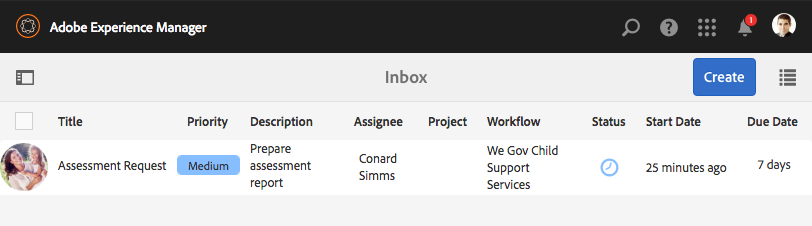

# We.Gov引用站点演练 {#we-gov-reference-site-walkthrough}

>[!CAUTION]
>
>AEM 6.4已结束扩展支持，本文档将不再更新。 有关更多详细信息，请参阅 [技术支助期](https://helpx.adobe.com/cn/support/programs/eol-matrix.html). 查找支持的版本 [此处](https://experienceleague.adobe.com/docs/).

## 先决条件 {#pre-requisite}

按照 [设置和配置AEM Forms引用站点](/help/forms/using/setup-reference-sites.md).

## 引用网站方案 {#reference-site-scenario}

We.Gov是一个国有组织，允许养父母在收养孩子时报养子女。 网站可管理以下内容：

* 申请人、养父母的资格
* 申请人的个人和专业细节（如果申请人有资格获得儿童抚养费）
* 收养儿童的个人细节

   申请人可以提供一个以上子女的详细信息
* 申请人可领取子女抚养费的银行账户详情
* 收回申请费
* 应用程序评估
* 批准申请
* 自动与申请人沟通

申请提交并支付费用后，申请人会收到组织发来的一封电子邮件，其中附有所提交申请的确认。

We.Gov组织接收应用程序。 该组织会对申请进行评估，并批准正版的申请。

申请获得批准后，申请人会从We.Gov网站收到一封电子邮件。 的 **查看文档** 电子邮件中的选项链接到包含申请人注册详细信息的文档。

以下信息图显示了We.Gov引用网站方案的分步工作流程。

方案涉及以下角色：

* 萨拉·罗斯，一位要求抚养孩子的养父母
* 乔，领养的孩子
* We.Gov审批部门负责人Gloria Rios
* 负责申请评估的现场代理Conard Simms

## Sarah启动资格检查 {#sarah-initiates-her-eligibility-check}

申请人可以检查申请儿童抚养费的资格。 该网站允许用户回答问题，以便确定其应用程序是否符合福利条件。 养父母莎拉是养父母的潜在申请人。 资格表是We.Gov网站的“儿童支持申请”服务的一部分。 为了检查她的资格，莎拉点击 **[!UICONTROL 子项支持]** 在We.Gov网站上。 在“子支持”页面中，Sarah单击 **[!UICONTROL 检查您的资格]**.

除了上述方法外，Sarah还可以单击 **[!UICONTROL 入门]** 中。 Sarah导航到“所有应用程序”页面，在该页面中，她可以单击下方的“应用” **[!UICONTROL 儿童支助服务申请]**. 然后，莎拉被带到资格检查。

在“检查子女支持资格”页面中，向Sarah提出一系列问题，以确定她是否有资格享受子女支持福利。 通过这套问题，她被问到：

* 如果她是孩子的监护父母
* 如果她和孩子生活在GX状态
* 儿童的年龄组和儿童的教育。

莎拉回答了这些问题，她的资格已得到验证。 她的回答决定了她是否有资格获得儿童抚养费。

Sarah被告知她有资格获得儿童抚养费，申请费为25美元。

### 工作原理 {#how-it-works}

Sarah的资格通过使用规则编辑器创建的资格障碍进行验证。 规则编辑器允许您指定在申请人填写申请表之前满足的条件。 当申请人Sarah符合所有资格条件时，她就登上了申请表。

资格检查是子支持申请自适应表的一部分。 规则将在以下情况下验证资格：

* 申请人是监护人的父母
* 申请人和儿童留在GX状态
* 申请人对儿童进行日常照料
* 获得支助服务的儿童年龄在16岁以下。

### 亲眼看看 {#see-it-yourself}

在浏览器中，打开 `https://<hostname>:<PublishPort>/content/we-gov/en.html`. 在We.Gov网站中，单击子项支持。 在“子项支持”页面中，单击检查您的资格。

要查看规则，请执行以下操作：

1. 在创作实例上以编辑模式打开表单。 URL: `https://<hostname>:<AuthorPort>/editor.html/content/forms/af/we-gov/child-support/css.html`.
1. 选择组件并单击 .

   此时将打开规则编辑器，其中列出了表单中应用的所有规则。

1. 在左侧面板中，单击规则 `passMsg` 和 `failMsg` 以了解资格检查的工作方式。

## 莎拉开始申请儿童抚养费 {#sarah-starts-her-application-for-child-support}

Sarah点击 **[!UICONTROL 启动应用程序]** 在她得知她有资格获得抚养费后。\
在“子项支持服务应用程序”页面中，Sarah提供了以下部分的详细信息：

* **[!UICONTROL 关于申请人]**:让Sarah在此部分中提供详细信息。

* **[!UICONTROL 子信息]**:让Sarah提供儿童信息，该信息由支持服务提供。

* **[!UICONTROL 付款]**:让莎拉提供她的银行详情，We.Gov可以在这些银行存放每月的支持补偿。

* **[!UICONTROL 费用支付]**:让Sarah提供她的信用卡详细信息，以支付申请费。

默认情况下，Sarah会转到 **[!UICONTROL 关于申请人]** 中。

Sarah随时可以点击 **[!UICONTROL 稍后再来]** 然后继续申请。 当她点击 **[!UICONTROL 稍后再来]**，则进度会另存为草稿，并且她可以选择通过电子邮件发送草稿。

当她点击 **[!UICONTROL 发送电子邮件]**，则她会收到一封电子邮件，其中包含其表单草稿的链接。

We.Gov网站上的子支持表单使用自适应表单。 她可以使用电子邮件中的链接，并在移动设备上填写表格。

>[!NOTE]
>
>从电子邮件继续工作流仅适用于已登录的用户。 在参考站点方案中，确保添加了用户Sarah Rose。 莎拉的登录凭据是 `srose/password`.

Sarah可以在任何部分提供详细信息，但只有在所有部分都提供必需的信息后，才会接受申请费。 没有付费的应用程序不完整，并且需要标有星号的字段。

### <strong>莎拉提供她的信息</strong> {#strong-sarah-provides-her-information-strong}

莎拉点击 **[!UICONTROL 启动应用程序]**，将转到“儿童支持服务申请”页的“申请人信息”部分。 在“申请人信息”下，Sarah浏览选项卡，并为申请提供个人信息。 她点击 **[!UICONTROL 下一个]** 来导航。

在“申请人信息”下，要求她在以下选项卡下提供详细信息：

* **[!UICONTROL 基本信息]**

在“基本信息”下，Sarah提供了她的身份证明和个人信息。 Sarah的个人信息包括她的姓名、电子邮件ID和社保号码。

* **[!UICONTROL 关系]**

   在“关系”下，莎拉输入了她婚姻状况的信息。

* **[!UICONTROL 附加信息]**

   在“其他信息”下，Sarah输入ID号、出生日期、当前地址和电话号码。

### Sarah提供儿童信息 {#sarah-provides-child-information}

在莎拉提供她的个人信息和点击 **[!UICONTROL 下一个]**，将转到“儿童信息”部分。

在“子项信息”部分，她提供了以下详细信息：

* 申请儿童支助服务的儿童人数
* 儿童的姓名、社会保障号码、出生日期和出生地

如果莎拉选择多个孩子，她会获得额外的表格，表格中的细节与她的表格相同。\
莎拉选择她的独生子乔，然后输入他的名字。

### Sarah提供付款信息 {#sarah-provides-payment-information}

在Sarah提供被收养的儿童（或儿童）的信息和点击后 **[!UICONTROL 下一个]**，则会转到 **[!UICONTROL 付款信息]** 中。

在“付款信息”部分中，她提供了银行帐户详细信息，可在其中获得子女支持福利。\
她输入了她10位的银行帐号。

## 莎拉付了申请费并签了表格 {#sarah-pays-the-application-fee-and-signs-the-form}

莎拉同意申请的条款和条件后，她支付了25美元的申请费。 处理她的申请需要支付申请费。\
莎拉输入她的信用卡详细信息和点击量 **[!UICONTROL 立即付款]**. 支付费用后，将显示PDF版本的应用程序，并带有签名字段。

Sarah可以选择输入、使用绘图进行手写、插入签名图像，或者使用手机触摸屏来绘制她的签名。 Sarah键入她的姓名并单击“点击以签名”。

她的申请已提交到We.Gov网站。

### <strong>Sarah收到确认电子邮件</strong> {#strong-sarah-receives-an-acknowledgement-email-strong}

Sarah支付申请费后，她会收到We.Gov网站发来的确认电子邮件。\
We.Gov处理申请，Sarah被告知，她在申请获得批准后将每月获得赔偿。

### 工作原理 {#how-it-works-1}

子支持应用程序使用顶部选项卡、向导和折叠面板等面板布局的组合来创建体验。 它使用名为We.Gov子模板的表单模板。

申请人可以跨部分移动，以填写表单的不同部分。 当申请人填写表格、提交表格、同意条款和条件并支付费用时，将启动自定义工作流。 自定义工作流向确认提交申请的申请人发送自动电子邮件。 申请转送组织有关部门核准。

表单的布局在Gov子项支持服务主题中指定。 样式包括组件样式、页面背景、组件的错误状态格式和字体样式。

资格检查使用表单中指定的规则。 它使用下面指定的有效性检查：

`SHOW passMsgWHEN (Does the child live in the state of GX? is equal to Yes) AND (Do you live in the state of GX? is equal to Yes) AND ( (Who has the main day-to-day care of the child? is equal to You) AND (Are you: is equal to The custodial parent) ) AND (Is the child you are applying for: is equal to Under 16 years) ELSE Hide`

`HIDE failMsg WHEN (Does the child lives in the state of GX? is equal to Yes) AND ( (Do you live in the state of GX? is equal to Yes) AND (Who has the main day-to-day care of the child? is equal to You) ) AND (Is the child you are applying for: is equal to Under 16 years) AND (Are you: is equal to The custodial parent) ELSE Show`

### 亲眼看看 {#see-it-yourself-1}

在浏览器中，打开 `https://<hostname>:<PublishPort>/content/forms/af/we-gov/child-support/css.html` 并填写所需信息。 在填写所需信息、支付费用并签署文档后提交申请时，您会收到确认电子邮件。

请在此处查看We.Gov子模板： `https://<hostname>:<AuthorPort>/editor.html/conf/we-gov/settings/wcm/templates/we-gov-child-template/structure.html`

请在此处查看主题： `https://<hostname>:<AuthorPort>/editor.html/content/dam/formsanddocuments-themes/we-gov/we-gov-theme-A/jcr:content`

要查看所有规则，请执行以下步骤：

1. 在创作模式下打开表单。

   URL: `https://<hostname>:<AuthorPort>/editor.html/content/forms/af/we-gov/child-support/css.html`

1. 选择组件，然后点按 . 所有规则都在规则编辑器中列出，包括上面列出的规则。

## Gloria收到申请 {#gloria-receives-the-application}

We.Gov审批负责人Gloria可以查看、批准或拒绝提交的申请。 AEM收件箱可让她在一个位置查看所有提交的应用程序。

### 工作原理 {#how-it-works-2}

当Sarah填写并提交子支持应用程序时，将创建应用程序的PDF或记录文档，并将其发送到Gloria Rios的收件箱。 Gloria可以查看提交的申请，并接受或拒绝。

### 亲眼看看 {#see-it-yourself-2}

打开页面 `https://<hostname***>:<PublishPort>/content/we-gov/en.html`. 在页面上，点按 **[!UICONTROL 登录]**，选择 **[!UICONTROL 以代表身份登录]** 复选框，使用grios/password作为Gloria Rios的用户名/密码登录到AEM收件箱。 出现子支持应用程序。 有关使用AEM收件箱执行以表单为中心的工作流任务的信息，请参阅 [在AEM收件箱中管理Forms应用程序和任务](/help/forms/using/manage-applications-inbox.md).

Gloria可以在应用程序仪表板中查看、批准或拒绝应用程序。

### 工作原理 {#how-it-works-3}

We.Gov审批负责人Gloria打开了她的AEM收件箱。 她在任务列表中看到一个审阅任务。 她打开并查看审阅任务。

她看到表格的PDF，里面填满了Sarah输入的详细信息以及Sarah上传的文件。\
Gloria可以批准或拒绝该申请。 但是，Gloria点击 **[!UICONTROL 需要评估]** 来评估申请。

Sarah的应用程序是AEM工作流的起点。 在提交子支持应用程序表单时，它会启动AEM工作流。 AEM工作流会为Gloria创建一个任务，该任务会显示在其AEM收件箱中。 当Gloria请求现场评估时，将为现场代理创建新任务。

### 亲眼看看 {#see-it-yourself-3}

如果配置完成，则在提交表单后，AEM工作流会立即启动。 使用Gloria的凭据登录收件箱。

访问收件箱https://&lt;***主机名***>:&lt;***PublishPort***>/content/we-gov/en.html。 在页面上，点按 **[!UICONTROL 登录]**，选择 **[!UICONTROL 以代表身份登录]** 复选框使用Gloria的默认凭据：

* 用户名：格里奥
* 密码：密码

在她的AEM收件箱中，Sarah的应用程序将添加为审阅任务。 选择任务，然后单击 **需要评估** 以继续执行下一步。

### Conard获得评估任务 {#conard-assessment-task}

格洛丽亚点击 **[!UICONTROL 需要评估]**，则Conard会在其AEM收件箱中获取审阅任务。 任务是在工作流模型中定义的AEM工作流的下一步。 他看到审阅任务并打开它。

Conard将获取申请人评估任务，如下所示。

子支持评估是与任务关联的表单。 他得到了莎拉的细节，以及支持文件（附在任务细节中）。 Conard在设备上填写字段中的评估表单，并提交以进行重新评估。

Conard核实了Sarah提供的所有细节，Sarah签了评估书。 AEM Forms可以获取位置和时间戳，并将它们添加到签名中。

控制点击 **[!UICONTROL 提交以进行重新评估]**，则AEM工作流会将评估提交给We.Gov组织。

### 工作原理 {#how-it-works-4}

当Gloria请求评估时，将启动AEM工作流中的下一步，并将评估任务添加到Conard的收件箱中。 康纳德是现场工作人员。

康纳德拜访了莎拉的住处，核实了莎拉提供的信息是真实的，并填写了评估表。 Conard可以访问Sarah填写的完整表单PDF。

### 亲眼看看 {#see-it-yourself-4}

在平板电脑上打开AEM收件箱，然后使用Conard的凭据登录。

Conard的默认凭据为：

* 用户名：csimms
* 密码：密码

您可以在收件箱中看到新的“评估请求”任务。 提交已完成的评估并继续执行下一步。

### Gloria审查评估并批准申请 {#gloria-reviews-the-assessment-and-approves-the-application}

在Conard提交评估后，Gloria会在其收件箱中看到“审阅”任务。 她选择并打开 **[!UICONTROL 审阅]**.

在“任务详细信息”下，Gloria将“上次采取的操作”视为“提交以进行重新评估”（由Conard）。 格洛丽亚认为科纳德·西姆斯评估了申请。

### 工作原理 {#how-it-works-5}

在Conard提交评估后，Gloria会在其收件箱中看到“审阅”任务。 她选择并打开“审阅”。 在“任务详细信息”下，Gloria看到Conard的评估评论，即“发现的所有内容都按顺序排列”。

格洛丽亚批准了申请。

### 亲眼看看 {#see-it-yourself-5}

打开收件箱，然后使用Gloria的凭据登录。 收件箱中会显示一个名为Review的新任务。

打开任务以查看“上次执行的操作”的状态。 根据评估，批准申请。

## Sarah收到一封批准电子邮件 {#sarah-receives-an-approval-email}

Gloria批准该申请后，Sarah收到We.Gov发来的一封电子邮件，表明她的申请获得批准。

的 **[!UICONTROL 查看文档]** 按钮，以查看其注册详细信息。 Sarah点击 **[!UICONTROL 查看文档。]**

登记单据列出诸如参考ID、子项覆盖、启动日期、银行帐号、付款频率和付款金额等详细信息。

Sarah可以查看她在同一页面上上传的文档。

### 工作原理 {#how-it-works-6}

Gloria批准该应用程序后，Sarah会收到一封自动电子邮件，其中包含指向注册文档的链接。

注册文档是交互式通信，可在任何设备上查看。 它包含儿童支持服务的细节，以及Sarah提供的信息。

### 亲眼看看 {#see-it-yourself-6}

检查您为自动电子邮件配置的电子邮件客户端，其中包含指向注册文档的链接。

或者，要在浏览器中查看文档，请打开： `https://<hostname>:<PublishPort>/content/aemforms-refsite/doclink.html?document=/content/forms/af/we-gov/child-support/enrollment-document&referenceId=[reference-id]&channel=web`

## We.Gov分析应用程序的性能 {#we-gov-analyzes-the-performance-of-the-application}

We.Gov会不时检查其子支持服务应用程序的性能，以检查客户可能遇到的任何问题。 他们利用此分析对子支持服务应用程序中所需的更改做出明智决策，以增强用户体验，降低表单放弃率，从而提高转化。 他们利用AEM Forms与Adobe Analytics的集成进行分析。 下图描述了其分析功能板。

### 工作原理 {#how-it-works-7}

使用Adobe Analytics跟踪子支持服务应用程序表单的性能量度。 有关配置Adobe Analytics和查看报表的更多信息，请参阅 [为表单和文档配置分析](/help/forms/using/configure-analytics-forms-documents.md).

### 亲眼看看 {#see-it-yourself-7}

为了便于您查看和浏览分析报告，我们将在参考站点中为子支持服务应用程序提供种子数据。 在使用种子数据之前，请参阅 [配置Analytics](/help/forms/using/setup-reference-sites.md#configureanalytics). 在创作实例中执行以下步骤以查看包含种子数据的报表：

1. 转到 **[!UICONTROL Forms和文档]** UI: https://&lt;*主机名*>:&lt;*AuthorPort*>/aem/forms.html/content/dam/formsanddocuments.

1. 单击以打开 **We.Gov** 文件夹。
1. 选择 **[!UICONTROL 儿童支助服务申请]** 自适应表单，然后单击 **[!UICONTROL 启用Analytics]** 中。

1. 再次选择表单并单击 **[!UICONTROL Analytics报表]** ，以生成报表。 您最初会看到一个空白报表。

要生成包含种子数据的分析报表，请执行以下操作：

1. 在CRXDE Lite的地址浏览器中，键入： **/apps/we-gov/demo-artics/analyticsTestData/Child支持服务Analytics测试数据**
1. 在左侧目录结构中选择种子数据。
1. 双击所选文件以在右侧面板中打开其内容。
1. 复制测试数据文件中的所有内容。
1. 在CRXDE中，导航到： **/content/dam/formsanddocuments/we-gov/child-support/css/jcr:content/analyticsdatanode/lastsevendays**
1. 在属性下的Analyticsdata字段中，粘贴测试数据文件的复制内容。
1. 现在，再次为生成分析报表 **[!UICONTROL 儿童支助服务申请]**. 您可以在生成的报表中查看种子数据。
