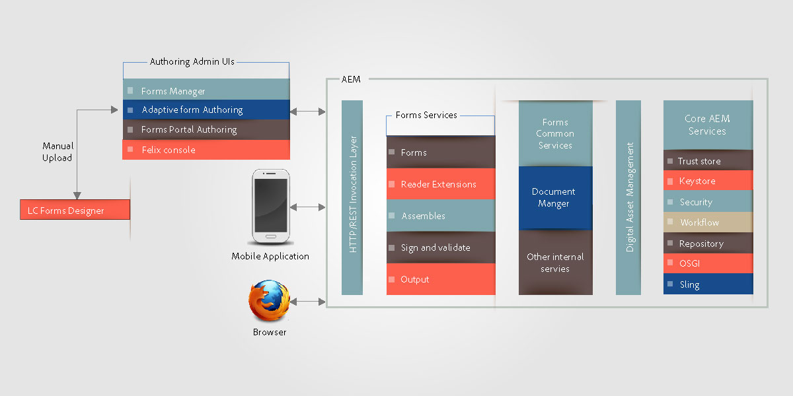

# HTML5表单的架构{#architecture-of-html-forms}

## 架构 {#architecture}

HTML5表单功能在嵌入的AEM实例中作为包进行部署，并使用RESTful [Apache Sling Architecture](https://sling.apache.org/)在HTTP/S上作为REST端点显示。

### 使用Sling框架{#using-sling-framework}

[Apache Sling](https://sling.apache.org/) 以资源为中心。它使用请求URL来首先解析资源。 每个资源都具有&#x200B;**sling:resourceType**（或&#x200B;**sling:resourceSuperType**）属性。 然后，根据此属性、请求方法和请求URL的属性，选择sling脚本以处理请求。 此sling脚本可以是JSP或Servlet。 对于HTML5表单， **配置文件**&#x200B;节点充当sling资源， **配置文件渲染器**&#x200B;用作sling脚本，用于处理使用特定配置文件渲染移动表单的请求。 **配置文件渲染器**&#x200B;是一个JSP，用于从请求中读取参数并调用Forms OSGi服务。

有关REST端点和支持的请求参数的详细信息，请参阅[渲染表单模板](/help/forms/using/rendering-form-template.md)。

当用户从客户端设备（如iOS或Android浏览器）发出请求时，Sling首先会根据请求URL解析配置文件节点。 从此配置文件节点中，它会读取&#x200B;**sling:resourceSuperType**&#x200B;和&#x200B;**sling:resourceType**，以确定可处理此表单渲染请求的所有可用脚本。 然后，它会使用Sling请求选择器以及请求方法来识别最适合处理此请求的脚本。 请求到达配置文件渲染器JSP后，JSP将调用Forms OSGi服务。

有关sling脚本解析的更多详细信息，请参阅[AEM Sling备忘单](https://docs.adobe.com/content/docs/en/cq/current/developing/sling_cheatsheet.html)或[Apache Sling Url分解](https://sling.apache.org/site/url-decomposition.html)。

### 典型表单处理调用流{#typical-form-processing-call-flow}

HTML5表单可缓存处理（呈现或提交）第一个请求时表单所需的所有中间对象。 它不会缓存依赖于数据的对象，因为此类对象可能会发生更改。

移动设备表单维护两个不同级别的缓存： PreRender缓存和Render缓存。 preRender缓存包含解析模板的所有片段和图像，而Render缓存包含渲染的内容，如HTML。

**作流图：** *HTML5表单工作流*

HTML5表单不会缓存缺少片段和图像引用的模板。 如果HTML5表单花费的时间超过正常时间，请检查服务器日志中是否缺少引用和警告。 另外，请确保未达到对象的最大大小。

Forms OSGi服务通过两个步骤处理请求：

* **布局和初始表单状态生成**:Forms OSGi呈现服务会调用Forms缓存组件，以确定表单是否已缓存且尚未失效。如果表单已缓存且有效，则它将从缓存中提供生成的HTML。 如果表单失效，Forms OSGi呈现服务将以XML格式生成初始表单布局和表单状态。 此XML将由Forms OSGi服务转换为HTML布局和初始JSON表单状态，然后缓存以备后续请求使用。
* **预填充的Forms**:在渲染时，如果用户请求使用预填充数据的表单，Forms OSGi渲染服务会调用Forms服务容器，并通过合并数据生成新的表单状态。但是，由于布局已在上述步骤中生成，因此此调用比首次调用速度更快。 此调用仅执行数据合并并对数据运行脚本。

如果表单中存在任何更新或表单内使用的任何资产，则表单缓存组件会检测到该更新，并且该特定表单的缓存将失效。 Forms OSGi服务完成处理后，配置文件渲染器jsp会将JavaScript库引用和样式添加到此表单，并将响应返回给客户端。 在此处，可以对HTML压缩使用典型的Web服务器，如[Apache](https://httpd.apache.org/)。 Web服务器将显着减少响应大小、网络流量以及在服务器和客户端计算机之间传输数据所需的时间。

当用户提交表单时，浏览器将JSON格式的表单状态发送到[提交服务代理](/help/forms/using/service-proxy.md);然后，提交服务代理使用JSON数据生成一个数据XML，并提交该数据XML以提交端点。

## 组件 {#components}

您需要AEM Forms附加组件包才能启用HTML5表单。 有关安装AEM Forms附加组件包的信息，请参阅[安装和配置AEM Forms](/help/forms/using/installing-configuring-aem-forms-osgi.md)。

### OSGi组件(adobe-lc-forms-core.jar){#osgi-components-adobe-lc-forms-core-jar}

**AdobeXFA Forms呈现器(com.adobe.livecycle.adobe-lc-forms-core)** 是从Felix Admin Console的“包”视图(https://[主机]:[端口]/system/console/bundles)查看HTML5表单OSGi包时的显示名称。

此组件包含用于呈现、缓存管理和配置设置的OSGi组件。

#### Forms OSGi服务{#forms-osgi-service}

此OSGi服务包含将XDP渲染为HTML的逻辑，并处理表单提交以生成数据XML。 此服务使用Forms服务容器。 Forms服务容器内部调用执行处理的本机组件`XMLFormService.exe`。

如果收到呈现请求，此组件将调用Forms服务容器以生成布局和状态信息，并进一步处理这些信息以生成HTML和JSON表单DOM状态。

此组件还负责从提交的表单状态JSON生成数据XML。

#### 缓存组件{#cache-component}

HTML5表单使用缓存来优化吞吐量和响应时间。 您可以配置缓存服务的级别，以微调性能和空间利用率之间的权衡。

<table> 
 <tbody> 
  <tr> 
   <th>缓存策略</th> 
   <th>描述</th> 
  </tr> 
  <tr> 
   <td>无</td> 
   <td>不缓存工件  </td> 
  </tr> 
  <tr> 
   <td>保守</td> 
   <td>仅缓存在呈现表单（如包含内联片段和图像的模板）之前生成的中间工件</td> 
  </tr> 
  <tr> 
   <td>攻击性</td> 
   <td>缓存已呈现的HTML内容 缓存保守级别中缓存的所有对象。  <strong>注意</strong>:此策略可获得最佳性能，但会消耗更多内存来存储缓存的伪像。</td> 
  </tr> 
 </tbody> 
</table>

HTML5表单使用LRU策略执行内存中缓存。 如果将缓存策略设置为无缓存，则不会创建缓存，并清除现有缓存数据（如果有）。 除缓存策略外，您还可以配置内存中缓存的总大小，这有助于限制缓存大小的最大值，如果超出此限制，则将使用LRU模式释放缓存资源。

>[!NOTE]
>
>内存内缓存不在群集节点之间共享。

#### 配置服务{#configuration-service}

配置服务允许调整HTML5表单的配置参数和缓存设置。

要更新这些设置，请转到CQ FelixAdmin Console（位于`https://[server]:[port]/system/console/configMgr`），搜索并选择移动Forms配置。

您可以配置缓存大小或使用配置服务禁用缓存。 您还可以使用“调试选项”参数启用调试。 有关调试表单的更多信息，请访问[调试HTML5表单](/help/forms/using/debug.md)。

### 运行时组件(adobe-lc-forms-runtime-pkg.zip){#runtime-components-adobe-lc-forms-runtime-pkg-zip}

运行时包包含用于呈现HTML表单的客户端库。

**作为运行时包的一部分提供的重要组件：**

#### 脚本引擎{#scripting-engine}

AdobeXFA实施支持两种脚本语言，以在表单中启用用户定义的逻辑执行：JavaScript和FormCalc。

HTML Forms的脚本引擎采用JavaScript编写，以支持这两种语言的XFA脚本API。

在呈现时，FormCalc脚本在对用户或设计人员透明的服务器上被转换为JavaScript（并缓存）。

此脚本引擎使用ECMAScript5的某些功能，如Object.defineProperty。 引擎/库将作为类别名称为&#x200B;**xfaforms.profile**&#x200B;的CQ客户端库提供。 它还提供&#x200B;**FormBridge API**，以使外部门户或应用程序能够与表单进行交互。 使用FormBridge，外部应用程序可以以编程方式隐藏某些元素、获取或设置其值，或更改其属性。

有关更多详细信息，请参阅[表单桥](/help/forms/using/form-bridge-apis.md)文章。

#### 布局引擎{#layout-engine}

HTML5表单的布局和可视方面基于SVG 1.1、jQuery、BackBone和CSS3功能。 表单的初始外观会在服务器上生成并缓存。 在客户端上管理初始布局的调整以及对表单布局的任何进一步增量更改。 要实现此目的，运行时包包含一个以JavaScript编写且基于jQuery/Backbone的布局引擎。 此引擎处理所有动态行为，如添加/删除可重复实例、可增长对象布局。 此布局引擎每次渲染一个表单一页。 最初，用户只查看一个页面，而水平滚动条仅考虑第一页。 但是，当用户向下滚动时，下一页开始渲染。 此逐页呈现可减少在浏览器中呈现第一页所需的时间，并增强表单的感知性能。 此引擎/库是CQ客户端库的一部分，类别名称为&#x200B;**xfaforms.profile**。

布局引擎还包含一组用于从用户捕获表单字段值的小组件。 这些小组件建模为[jQuery UI小组件](https://api.jqueryui.com/jQuery.widget/)，这些小组件可实施某些附加合同，以便与布局引擎无缝协作。

有关小组件和相应合同的更多详细信息，请参阅[HTML5表单的自定义小组件](/help/forms/using/introduction-widgets.md)。

#### 样式 {#styling}

与HTML元素关联的样式是内联添加的，也可以基于嵌入的CSS块添加。 某些不依赖于表单的常见样式是CQ客户端库的一部分，该客户端库的类别名称为xfaforms.profile。

除了默认的样式属性之外，每个表单元素还包含某些基于元素类型、名称和其他属性的CSS类。 使用这些类，您可以通过指定元素自己的CSS来重新设置元素样式。

有关默认样式和类的更多详细信息，请参阅[样式简介](/help/forms/using/css-styles.md)。

#### 服务器端脚本和Web服务{#server-side-script-and-web-services}

任何标记为在服务器上运行或标记为调用Web服务（无论其标记为执行的位置）的脚本始终在服务器上执行。

客户端脚本引擎：

1. 以JSON形式对传递当前表单状态的服务器进行同步调用
1. 在服务器上执行脚本或Web服务
1. 生成新的JSON状态
1. 返回响应时，将合并客户端上的新JSON状态。

#### 本地化资源包{#localization-resource-bundles}

HTML5表单支持意大利语(it)、西班牙语(es)、巴西葡萄牙语(pt_BR)、简体中文(zh_CN)、繁体中文（仅限支持）(zh_TW)、韩语(ko_KR)、英语(en_US)、法语(fr_FR)、德语(de_DE)和日语(ja)。 根据在请求标头中收到的区域设置，相应的资源包将发送到客户端。 此资源包将作为类别名称为&#x200B;**xfaforms.I18N**&#x200B;的CQ客户端库添加到配置文件JSP中。 您可以覆盖在配置文件中提取区域设置包的逻辑。

### Sling组件(adobe-lc-forms-content-pkg.zip){#sling-components-adobe-lc-forms-content-pkg-zip}

Sling包包含与“配置文件”和“配置文件渲染器”相关的内容。

#### 个人资料 {#profiles}

配置文件是sling中表示表单或Forms系列的资源节点。 在CQ级别，这些配置文件是JCR节点。 节点位于JCR存储库的&#x200B;**/content**&#x200B;文件夹下，可以位于&#x200B;**/content**&#x200B;文件夹下的任何子文件夹内。

#### 配置文件渲染器{#profile-renderers}

“配置文件”节点具有属性&#x200B;**sling:resourceSuperType**，其值为&#x200B;**xfaforms/profile**。 此属性在内部向位于&#x200B;**/libs/xfaforms/profile**&#x200B;文件夹中的“配置文件”节点的sling脚本发送转发请求。 这些脚本是JSP页，它们是将HTML表单和必需的JS/CSS工件组合在一起的容器。 这些页面包括对以下项的引用：

* **xfaforms.I18N。&lt;locale>**:此库包含本地化数据。
* **xfaforms.profile**:此库包含XFA脚本和布局引擎的实施。

这些库建模为CQ客户端库，它利用CQ框架JavaScript库的自动连接、缩小和压缩功能。\
有关CQ客户端库的更多信息，请参阅[CQ Clientlib文档](https://docs.adobe.com/docs/en/cq/current/developing/components/clientlibs.html)。

如上所述，配置文件渲染器JSP通过sling include调用Forms服务。 此JSP还根据管理员配置或请求参数设置各种调试选项。

HTML5表单允许开发人员创建配置文件和配置文件渲染器以自定义表单的外观。 例如，HTML表单允许开发人员将表单集成到现有HTML门户的面板或&lt;div>部分中。\
有关创建自定义配置文件的更多详细信息，请参阅[创建自定义配置文件](/help/forms/using/custom-profile.md)。
