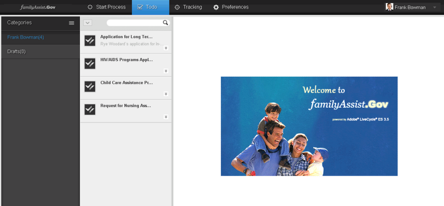

# 自定义AEM表单工作区简介 {#introduction-to-customizing-aem-form-workspace}

AEM表单工作区提供了修改其界面的表示语义和功能的功能。 更改样式、布局、格式、品牌和核心功能的自定义类型如下所述。

## 自定义类型 {#types-of-customizations}

AEM Forms工作区支持各种自定义，以更新用户界面的布局、其外观和功能等。 这些自定义包括更新以下一项或多项内容：

* 用户界面的外观
* 使用语义自定义的功能
* 在其他应用程序中重用HTML组件

### 用户界面更改 {#user-interface-changes}

您可以更改AEM Forms工作区的外观、布局和其他表示语义。 通过自定义CSS、HTML模板和JavaScript™文件更改工作区。 默认安装中提供了所有默认文件。

AEM Forms工作区自定义的常规 [步骤中介绍了最常用的步骤](/help/forms/using/generic-steps-html-workspace-customization.md)。 有关此类自定义的特定示例（包括详细步骤），请参阅本文末尾的相关文章。

#### 了解样式表 {#understanding-the-style-sheet}

在自定义工作区之前，请熟悉随AEM Forms提供的默认样式表，网址为/libs/ws/css/style.css。

要自定义工作区，建议您熟悉位于/libs/ws/css文件夹中的现有样式表style.css。 下面介绍了一些主要组件。

<table> 
 <tbody> 
  <tr> 
   <th>
CSS元素
 </th> 
   <th>
修改了用户界面组件
 </th> 
  </tr> 
  <tr> 
   <td>
#标题
 </td> 
   <td>
AEM Forms工作区的标题
 </td> 
  </tr> 
  <tr> 
   <td>
.categoryList
 </td> 
   <td>
类别列表
 </td> 
  </tr> 
  <tr> 
   <td>
.category列表。header
 </td> 
   <td>
类别列表标题
 </td> 
  </tr> 
  <tr> 
   <td>
.类别, .过滤器
 </td> 
   <td>
类别列表下的空格
 </td> 
  </tr> 
  <tr> 
   <td>
.类别, .filter
 </td> 
   <td>
类别
 </td> 
  </tr> 
  <tr> 
   <td>
.类别：悬停、.类别.selected、.filter:hover、.filter.selected
 </td> 
   <td>
选定类别和将鼠标悬停在类别样式上
 </td> 
  </tr> 
  <tr> 
   <td>
categoryListBar .tool、categoryListBar .content
 </td> 
   <td>
开始流程页(封闭类别列表)
 </td> 
  </tr> 
  <tr> 
   <td>
filterListBar .tool、filterListBar .content
 </td> 
   <td>
待办事项页面(已关闭的过滤器列表)
 </td> 
  </tr> 
  <tr> 
   <td>
processNameListBar .tool、processNameListBar .content
 </td> 
   <td>
跟踪页面(已关闭的进程名称列表)
 </td> 
  </tr> 
  <tr> 
   <td>
.startPointList、.tasklist
 </td> 
   <td>
起点列表或任务列表
 </td> 
  </tr> 
  <tr> 
   <td>
.startPointList .header、.tasklist .header
 </td> 
   <td>
起始点列表或任务列表的头
 </td> 
  </tr> 
  <tr> 
   <td>
.startpoint.selected, .任务.selected
 </td> 
   <td>
所选起点或任务
 </td> 
  </tr> 
  <tr> 
   <td>
.startpoint.selected .description, .任务.selected .description
 </td> 
   <td>
所选起点或任务的说明
 </td> 
  </tr> 
  <tr> 
   <td>
#任务区
 </td> 
   <td>
任务区
 </td> 
  </tr> 
  <tr> 
   <td>
#header.dropdown
 </td> 
   <td>
标题中的用户下拉列表
 </td> 
  </tr> 
  <tr> 
   <td>
.sortDrop dd ul
 </td> 
   <td>
排序任务下拉框
 </td> 
  </tr> 
 </tbody> 
</table>

#### CSS {#css}

AEM Forms工作区的外观从CSS中借用其外观。 通过自定义CSS，您可以更改工作区的表示语义，如字体、颜色、品牌和布局。

CSS自定义的顶级步骤包括：

* 创建CSS文件。
* 将样式项添加到此CSS。 有关详细信息，请参阅了解CSS样式。
* 在中更新其引用 `html.jsp`。

有关执行这些自定义的确切步骤，请参阅AEM Forms [工作区自定义的常规步骤](/help/forms/using/generic-steps-html-workspace-customization.md)。 AEM Forms工作区附带的CSS文件位于/libs/ws/css/。 对于与CSS相关的自定义，请使 [用送货包](/help/forms/using/introduction-customizing-html-workspace.md#p-crx-package-p)。 有关CSS相关自定义的特定示例，请参阅本文末尾的相关帮助主题。

#### 图像 {#image}

您可以自定义AEM Forms工作区，以添加用户的头像或添加您组织的徽标。 对于这些自定义，请使 [用送货包](/help/forms/using/introduction-customizing-html-workspace.md#p-crx-package-p)。

对图像进行自定义的顶级步骤有：

* 安装和配置WebDAV。
* 添加新图像。
* 添加与添加的图像相对应的新样式。
* 链接到文件中的新CSS `html.jsp` 文件。

要开始在AEM Forms工作区中自定义图像，请按照AEM Forms工作 [区自定义的常规步骤操作](/help/forms/using/generic-steps-html-workspace-customization.md)。 有关与图像相关的自定义的特定示例，请参阅本文末尾的相关帮助主题。

#### HTML模板 {#html-template}

HTML模板有助于定义工作区用户界面的外观和布局。 通过更新默认的HTML模板，您可以自定义布局默认用户界面。

对HTML模板进行自定义的顶级步骤有：

* 在用户创建的文件夹中，复制所需的默认文件。
* 在用户定义的文件夹中添加新模板。
* 对复制的文件（如新模板的路径）进行相关更新。

有关此类自定义的特定示例，请参阅本文末尾提供的“帮助”主题。 根据要自定 [义的模板](/help/forms/using/introduction-customizing-html-workspace.md#p-crx-package-p) ，在发 运包或开发包之间进行选择。

### 语义变化 {#semantic-changes}

要修改AEM Forms工作区功能，请更改JavaScript源代码。 核心功能中的修改标记为语义更改。 您可以修改作为AEM Forms工作区源代码的一部分提供的模型、视图和模板。

进行语义更改以修改AEM Forms工作区功能的顶级步骤包括：

* 在用户创建的文件夹中，复制相应的默认文件。
* 在用户定义的文件夹中添加新的型号和视图。
* 进行相关更新，如更新默认JavaScript文件中新添加的模型和视图的路径。
* 缩小包以优化性能。

有关作为源代码一部分的组件的更多概念信息，请参阅可重 [用组件的说明](/help/forms/using/description-reusable-components.md)。 对于这些自定义，请使用开发包。

### 可重用的组件 {#reusable-components}

由于AEM Forms工作区是基于组件的软件，因此可以轻松自定义和重用它。 您可以轻松地将工作区组件与Web应用程序集成。

有关更多概念信息，请参阅可重 [用组件的说明](/help/forms/using/description-reusable-components.md) ，以及有关使用组件的说明，请参阅在Web应 [用程序中集成AEM Forms工作区组件](/help/forms/using/description-reusable-components.md)。

## 构建AEM Forms工作区代码 {#building-html-workspace-code}

### SDK包 {#sdk-package}

该包包含AEM Forms工作区的源代码。 此包可在上获取 `[*LC root*]\sdk\html-workspace\adobe-lc-workspace-src.zip`。

它主要用于自定义，因为它提供了生成以下内容的功能：

* 用于发运、调试和开发用户档案的CRX包(在 [CRX包中提到](/help/forms/using/introduction-customizing-html-workspace.md#p-crx-package-p))。
* 自定义代码的缩小版本（用于语义更改）。

#### WS内容 {#ws-content}

* client-pkg:

   * src —— 包含创建CRX节点所需的伪像。
   * pom.xml —— 为各种用户档案WS-Deploy包构建部署包的脚本

* client-html:

   * assembly —— 包含由脚本用于创建AEM Forms工作区SDK的zip.xml。
   * src/main/webapp -

      * css —— 包含AEM Forms工作区的样式表。
      * 图像——包含在AEM Forms工作区中使用的图像。
      * js:

         * libs —— 包含在AEM Forms工作区中使用的所有第三方库。
         * 许可证——包含HTML和JS文件的许可证以及将这些许可证添加到相应源文件的代码。
         * minifier —— 用于组合、minification和uglification自定义javascript代码。
         * resourcejs_optimizer —— 用于javascript源的组合、缩小和增强。
         * resource_generator —— 用于生成register.js和modelcontrollerpath.js。
         * 运行时：

            * 初始值设定项——包含初始值设定项。js，用于初始化AEM Forms工作区中使用的骨干视图和模型。
            * 模型——包含AEM Forms工作区中所有组件的骨干模型。
            * 路由——包含javascript文件和HTML文件，它们在AEM Forms工作区中加载开始进程、任务、跟踪和首选项。
            * 服务——包含在AEM Forms工作区中使用的service.js。 所有服务器调用都通过service.js进行。
            * 模板——包含所有模板，即AEM Forms工作区中所有视图的HTML文件。
            * util —— 包含AEM Forms工作区中使用的所有实用程序文件(javascript)。
            * 视图-包含AEM Forms工作区中所有组件的骨干视图。
         * main.js
         * router.js
      * libs/ws:pdf.html和pluginPing.pdf用于在AEM Forms工作区中加载PDF表单，WSNextAdapter.swf用于在AEM Forms工作区中加载SWF表单和参考线。
      * 区域设置：

         * de-DE —— 包含德语的translation.json。
         * zh-CN —— 包含英语的translation.json。
         * fr-FR —— 包含法语的translation.json。
         * ja-JP —— 包含日语的translation.json。
         * html.jsp —— 包含用于查找当前浏览器区域设置的代码。
      * html.jsp
      * GET.jsp

### CRX包 {#crx-package}

CRX包可部署在CRX™存储库上。 可在上获取该服务 `[*LC root*]\crx-repository\install\adobe-lc-workspace-pkg.zip`。

此包可以使用下面描述的三个用户档案构建。

| **个人资料** | **描述** | **使用** |
|---|---|---|
| 发运用户档案 | 此用户档案使用细化创建尽可能小的CRX包。 此包最有效。 所有JavaScript™文件都合并并缩小为一个JS文件。 | 当JS文件中不需要进一步的语义更改时，请使用此用户档案。 |
| 调试用户档案 | 此用户档案创建中等效率的CRX包。 包的大小略大于使用“发运用户档案”创建的包。 此包将大部分JavaScript文件合并到一个JS文件中。 | 使用此用户档案进行调试。 |
| 开发用户档案 | 此用户档案创建最大可能大小的CRX包。 所有JavaScript文件均可单独使用，就像在SDK包中一样。 | 结合语义变化时，请使用此用户档案。 |

#### 发运用户档案 {#ship-profile}

#### Command {#command}

* mvn clean -P将安装在发运到客户端的源包的client-pkg文件夹上。
* 发运用户档案命令执行仅在64位JVM上工作。

#### WS内容 {#ws-content-1}

* css —— 包含style.css、ie.css和jquery-ui.css。
* 图像——包含所有图像。
* js:

   * libs:

      * require —— 包含require.js。
      * jqueryui —— 包含jquery.ui.datepicker.ja.js。
   * 运行时：

      * 模板——包含所有模板，即AEM Forms工作区中所有组件的HTML文件。
   * main.js（合并、缩小和增强）。
   * registry.js

* libs:

   * ws —— 包含pluginPing.pdf、pdf.html和WSNextAdapter.swf。

* 区域设置——包含。content.xml。
* 区域设置：

   * de-DE —— 包含德语的translation.json。
   * zh-CN —— 包含英语的translation.json。
   * fr-FR —— 包含法语的translation.json。
   * ja-JP —— 包含日语的translation.json。
   * html.jsp —— 包含用于查找当前浏览器区域设置的代码。

* 索引——包含。content.xml
* 用户档案-包含offline.jsp。
* GET.jsp
* html.jsp
* content.xml
* _rep_policy.xml

#### 调试用户档案 {#debug-profile}

#### Command {#command-1}

* mvn clean -P Debug install on client-pkg
* 调试用户档案命令执行仅在64位JVM上工作。

#### WS内容 {#ws-content-2}

* css —— 包含style.css、ie.css和jqueri-ui.css。
* 图像——包含所有图像。
* js:

   * libs:

      * require —— 包含require.js。
      * jqueryui —— 包含jquery.ui.datepicker.ja.js。
   * 运行时：

      * 模板——包含所有模板，即AEM Forms工作区中所有组件的HTML文件。
   * main.js（合并）。
   * registry.js

* libs:

   * ws —— 包含pluginPing.pdf、pdf.html和WSNextAdapter.swf。

* 区域设置——包含。content.xml。
* 区域设置：

   * de-DE —— 包含德语的translation.json。
   * zh-CN —— 包含英语的translation.json。
   * fr-FR —— 包含法语的translation.json。
   * ja-JP —— 包含日语的translation.json。
   * html.jsp —— 包含用于查找当前浏览器区域设置的代码。

* 索引——包含。content.xml
* 用户档案-包含offline.jsp。
* GET.jsp
* html.jsp
* content.xml
* _rep_policy.xml

#### 开发用户档案 {#dev-profile}

#### Command {#command-2}

mvn clean -P Dev安装在client-pkg上

#### WS内容 {#ws-content-3}

* css —— 包含style.css、ie.css和jqueri-ui.css。
* 图像——包含所有图像。
* js:

   * libs —— 包含AEM Forms工作区中使用的所有库。
   * require —— 包含require.js
   * jqueryui —— 包含jquery.ui.datepicker.ja.js
   * 运行时：

      * 初始值设定项——包含initializer.js和modelcontrollerpath.js。
      * 模型——包含AEM Forms工作区中所有组件的模型。
      * 路由——包含javascript文件和HTML文件，它们在AEM Forms工作区中加载开始进程、任务、跟踪和首选项。
      * 服务——包含在AEM Forms工作区中使用的service.js。
      * 模板——包含所有模板，即AEM Forms工作区中所有组件的HTML文件。
      * util —— 包含AEM Forms工作区中使用的所有实用程序文件(JavaScript)。
      * 视图-包含AEM Forms工作区中所有组件的视图。
   * main.js
   * registry.js
   * router.js

* libs:

   * ws —— 包含pluginPing.pdf、pdf.html和WSNextAdapter.swf。

* 区域设置——包含。content.xml。
* 区域设置：

   * de-DE —— 包含德语的translation.json。
   * zh-CN —— 包含英语的translation.json。
   * fr-FR —— 包含法语的translation.json。
   * ja-JP —— 包含日语的translation.json。
   * html.jsp —— 包含用于查找当前浏览器区域设置的代码。

* 索引——包含。content.xml
* 用户档案-包含offline.jsp。
* GET.jsp
* html.jsp
* content.xml
* _rep_policy.xml

