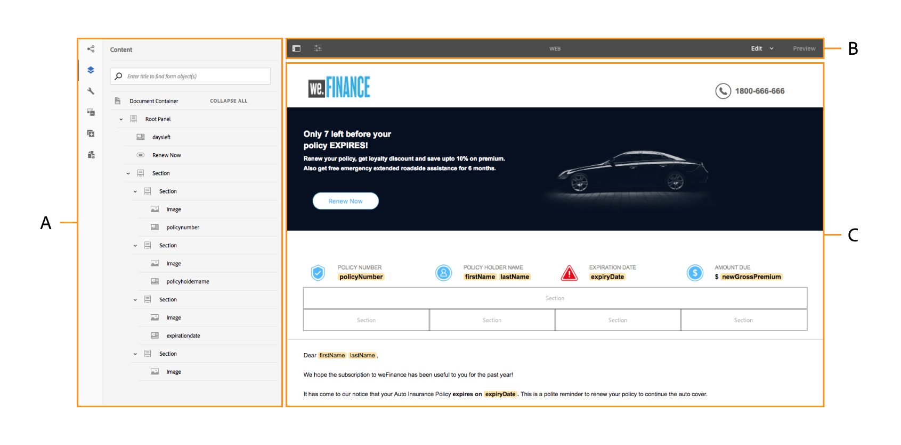

# 交互式通信创作UI简介{#introduction-to-interactive-communication-authoring-ui}

介绍可用于创作交互式通信的各种用户界面元素

用于创作[交互式通信](/help/forms/using/interactive-communications-overview.md)的用户界面是直观的，它为创作交互式通信的打印和Web渠道提供了以下功能：

* WYSIWYG拖放文档编辑器
* 集成的资产存储库 — 上传到服务器并在服务器上创建的资产，可在交互式通信创作界面的资产浏览器中使用

当您[创建新的或编辑现有的交互式通信](/help/forms/using/create-interactive-communication.md)时，可使用以下用户界面元素：

* [侧栏](#sidebar)
* [页面工具栏](#page-toolbar)

* [组件工具栏](#component-toolbar)
* 内容区域

**A.侧** 栏 **B.** 页面工具栏 **C.** 内容区域

## 侧栏 {#sidebar}

[单击放大](assets/sidebar-comps-1.png)

**A.** 渠道浏 **览器B.** 内容浏览器 **C.** 属性浏览器 **D.** 资产浏览器 **E.** 组件浏览器 **F.** 数据源浏览器 — 数据模型 **G.** 数据源浏览器 — 主控内容

侧栏包括以下内容：

* **渠道浏览器**

   渠道浏览器可帮助您在交互式通信的打印渠道和Web渠道之间切换。 根据您在渠道浏览器中选择的渠道，“内容”和“组件”等浏览器会显示相应选项。

* **内容浏览器**

   在内容浏览器中，您可以看到所选渠道文档的对象层次结构。 作者可以通过点按文档对象树中的特定组件来导航到该组件。 作者可以在Web渠道中搜索对象，并从此树中重新排列这些对象。

* **属性浏览器**

   允许您编辑组件的属性。 属性会根据组件而发生更改。 例如，要查看文档容器的属性，请执行以下操作：

   选择组件，然后点按 > **文档容器**，然后点按。

* **资产浏览器**

   分隔不同类型的内容，如布局片段、图像、文档、页面、视频。 作者可以将资产拖放到交互式通信中。

* **组件浏览器**

   包括可用于构建文档的打印和Web渠道的组件。 您可以将组件拖到交互式通信中以添加元素，并根据要求配置添加的元素。 下表描述了用于打印和Web渠道的组件浏览器中列出的组件：

| **组件** | **打印渠道** | **Web 渠道** | **功能** |
|---|---|---|---|
| 图表 | ✓ | ✓ | 添加一个图表，您可以在交互式通信中使用该图表来直观地表示从表单数据模型收集项目中检索的二维数据。 |
| 文档片段 | ✓ | ✓ | 允许向交互式通信添加可重用的组件、文本、列表或条件。 您添加到交互式通信的可重用组件可以是基于表单数据模型的组件，也可以是没有表单数据模型的组件。 |
| 图像 | ✓ | ✓ | 允许插入图像。 |
| 面板 | - | ✓ | 面板组件是用于将其他组件分组在一起的占位符，可控制在交互式通信中如何布局一组组件。 面板组件还允许您使一组组件可重复用于最终用户，例如在填写教育凭据所需的多个条目中。 最好在具有多个选项卡的交互式通信的选项卡中分别使用一个面板。 |
| 表 | &amp;ast; | ✓ | 添加表格以便按行和列整理数据。 |
| 目标区域 | &amp;ast;&amp;ast; | ✓ | 在Web渠道中插入目标区域以组织特定于Web渠道的组件。 |
| 文本 | - | ✓ | 向交互式通信的Web渠道中添加文本。 文本可以利用表单数据模型对象来使内容动态。 |

&amp;ast;使用打印渠道中的布局片段添加表。

&amp;ast;&amp;ast;在“打印”渠道中，目标区域在XDP/打印模板中进行预定义。 无法使用交互式通信创作UI添加新的目标区域。

* **数据源浏览器**

   数据源浏览器在创建交互式通信时以您选择的表单数据模型显示可用数据源。

### 使用组件{#key-points-for-working-with-components}的关键点

使用交互式通信组件时的要点如下：

* 每个组件都具有可控制其外观和功能的关联属性。 要配置组件的属性，请点按组件，然后点按 ，以在“属性”浏览器中打开组件属性。
* 组件使用其元素名称进行标识。 点按后，您可以通过更改属性浏览器中的元素名称字段值来更改组件的名称。 元素名称字段仅接受字母、数字、连字符(-)和下划线(_)。 不允许使用其他特殊字符，元素名称应以字母开头。
* 只要交互式通信中显示了标题，您就可以在编辑器中修改内联交互式通信组件的标题属性，而无需打开属性浏览器。 为此，请执行以下操作：

   1. 点按以选择具有标题属性且其隐藏标题属性处于禁用状态的组件。
   1. 点按以使标题可编辑。
   1. 修改标题并点按返回键，或点按组件外的任意位置以保存更改。 点按Esc键以放弃更改。

## 组件工具栏{#component-toolbar}

选择组件时，您会看到一个允许您处理该组件的工具栏。 您可以选择剪切、粘贴、移动和指定组件的属性。 您的选项包括：

A.**配置**:点按&#x200B;**配置**&#x200B;时，组件属性会显示在侧栏中。

B.**编辑规则**:点按编辑规则时，将显示规则编辑器，您可以在其中编辑和创建选定组件的规则。 在规则编辑器中，您还可以选择其他表单对象（组件），并编辑/创建这些表单对象的规则。

C.**Copy**:您可以使用复制选项复制组件并将其粘贴到交互式通信中的其他位置。

D.**Cut**:您可以使用剪切选项在交互式通信中将组件从一个位置移动到另一个位置。

E.**Delete**:用于从交互式通信中删除组件。

F.**插入组件**:允许您在选定组件上方插入组件。

G.**粘贴**:允许您使用上述选项粘贴您剪切或复制的组件。

H.**组**:如果要剪切、复制或粘贴多个组件，可让您选择多个组件。

我。**父项**:允许您选择组件的父组件。

J.**更多**:提供更多用于处理选定组件的选项。

* 查看SOM表达式（仅适用于面板）
* 在面板中对象组（仅适用于面板）
* 编辑片段（仅适用于片段）
* 将面板另存为片段（仅适用于面板）
* 添加子面板（仅适用于面板）
* 添加面板工具栏（仅适用于面板）
* 替换（不适用于面板）

## 页面工具栏 {#page-toolbar}

顶部的“页面”工具栏提供了用于预览交互式通信并更改其属性的选项。 您可以在创作交互式通信时预览该通信，并做出相应的更改。 在页面工具栏中，您会看到：

* 切换侧面板:允许您显示或隐藏侧栏。
* 页面信息:用于查看页面属性。
* 模拟器:允许您模拟不同显示大小（如平板电脑和手机）的交互式通信外观。
* 编辑：允许您选择其他模式，例如：编辑、样式、开发人员和设计。

   * 编辑：允许您编辑交互式通信及其组件的属性。 例如，添加组件、删除图像并指定必填字段。
   * 样式：允许您设置交互式通信组件外观的样式。 例如，在样式模式下，您可以选择面板并指定其背景颜色。
   * 开发人员：允许开发人员：

      * 了解交互式通信的组成部分。
      * 调试在何处和何时发生的事件，这反过来有助于解决问题。
   * 目标：允许您启用或禁用自定义组件，或未在侧栏中列出的现成组件。

* 预览：用于预览交互式通信在发布时的外观。
