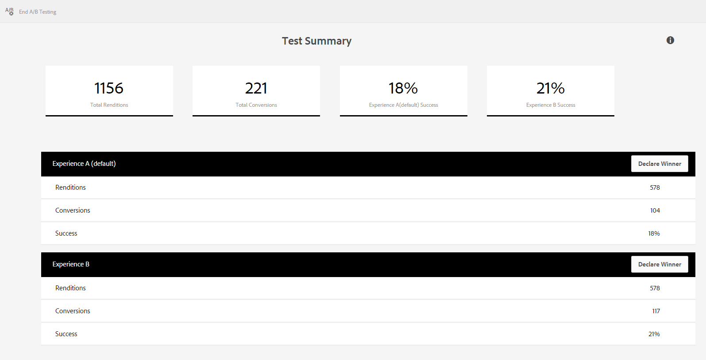

# 衡量和改进表单的有效性和转换{#measure-and-improve-effectiveness-and-conversion-of-forms}

## 挑战{#the-challenge-br}

组织正日益增强并鼓励其客户跨多个渠道使用数字自助服务进行交易。 然而，在缺乏一对一反馈机制的情况下，衡量成功程度和尝试数字表单以增强客户体验和提高转化率将变得十分困难。

为了最大化ROI，组织必须监控其客户如何与服务互动，并尝试其数字产品（表单）以增强客户体验。 要衡量成功并定义改进战略，组织需要回答以下问题：

* 有多少客户尝试访问或处理我的表单？
* 他们中有多少人成功完成了交易？
* 有多少人放弃了表格？
* 客户面临问题的问题是什么？
* 我引入了哪些更改，如何测试什么可以改进转化？

## 解决方案{#the-solution}

AEM Forms集成了[Adobe Marketing Cloud](https://www.adobe.com/marketing-cloud.html)解决方案- [Adobe Analytics](https://www.adobe.com/marketing-cloud/web-analytics.html)和[Adobe Target](https://www.adobe.com/marketing-cloud/testing-targeting.html)，可帮助您监控和分析表单的运行情况，并使您能够试验和识别可带来更好转化率的体验。

## 工作流{#the-workflow}

让我们详细了解如何衡量表单的性能并改进转化率。

### 目标受众{#target-audience}

* 负责营销战略和成功的商业用户和分析师
* 负责基础架构和解决方案设置和维护的IT人员

### AEM Forms组件和功能涉及{#aem-forms-components-and-features-involved}

* 自适应表单
* 与Adobe Analytics集成，收集、组织和报告与自适应表单的客户互动
* 与Adobe Target集成以运行自适应表单的A/B测试

### 假设{#assumptions}

* 您已拥有Adobe Marketing Cloud帐户并注册了Analytics和目标解决方案。
* 您有一个已发布的自适应表单，客户可以访问它。

### 工作流步骤{#workflow-steps}

#### 第1步：在AEM Forms配置分析和目标{#step-configure-analytics-and-target-in-aem-forms-br}

**配置 Analytics**

要深入了解客户与表单的互动，您首先需要在AEM Forms配置Analytics。 执行以下步骤：

1. 在Adobe Analytics创建报表包
1. 在AEM中创建云服务配置
1. 在AEM中创建云服务框架
1. 在AEM中配置AEM Forms分析配置服务
1. 在AEM中启用表单分析

有关详细步骤，请参阅[配置自适应表单的分析和报告](/help/forms/using/configure-analytics-forms-documents.md)。

**配置目标**

要为自适应表单创建和运行A/B测试，请按照[在AEM Forms设置和集成目标中的说明在AEM Forms配置目标。](/help/forms/using/ab-testing-adaptive-forms.md#p-set-up-and-integrate-target-in-aem-forms-p)

#### 第2步：视图分析报告{#step-view-analytics-report-br}

在您的客户访问启用了Analytics的表单并与之交互时，其交互会在高度安全的Analytics数据库中捕获。 数据库由客户端分段，并可通过安全连接访问。

您可以从AEM中视图报表，以便支持分析的表单和分析数据。 视图报表：

1. 在AEM服务器上，导航至&#x200B;**Forms>Forms和文档**。
1. 选择要为其生成分析报告的表单。
1. 单击“Analytics Reports”图标。 将显示报告。

让我们来看一下Analytics为表单收集和报告的数据点。

**Forms分析报告**

自适应表单的分析报告在表单级别捕获以下关键绩效指标(KPI):

* **平均填充时间**:填写表单的平均时间
* **展示**:表单在搜索结果中显示的次数

* **演绎版**:表单的呈现或打开次数
* **草稿**:表单已保存为草稿的次数

* **提交**:提交表单的次数
* **中止**:用户未填写表单离开的次数
* **访问／提交**:每次提交的访问率

此外，您还可以在表单中获得有关每个面板的以下详细信息：

* **时间**:面板及其字段的平均花费时间（秒）

* **错误**:每1000个表单演绎版在面板及其字段上遇到的错误数

* **帮助**:用户每1000个表单演绎版访问面板及其字段的上下文帮助的次数

有关表单分析报告的更多详细信息，请参阅[查看和了解AEM Forms分析报告](/help/forms/using/view-understand-aem-forms-analytics-reports.md)。

>[!NOTE]
>
>您可以视图详细报告，并从Adobe Marketing Cloud的Analytics帐户深入了解客户及其与表单的交互。

#### 第3步：分析数据点{#step-analyze-data-points}

在此步骤中，您将分析分析报告中的数据点并推断表单的执行方式。 如果KPI不能满足您的成功KPI，您将根据数据构建假设验证，并找到可能的解决方案来解决问题。 例如：

* 如果表单的平均填写时间高于您的预期，则您的表单可能复杂，客户难以理解，表单不使用标准术语，表单太长等。 在这种情况下，您可能希望简化表单结构和字段、修改表单设计、缩短表单长度，或为非标准表单字段添加帮助说明和示例。
* 如果数据表明大多数客户正在访问表单面板的帮助，很明显，客户对要填写的信息感到困惑。 您可能希望使用替代术语，或为该面板添加一些示例输入和帮助说明。
* 如果表单的放弃率或放弃率高于预期，则可能是由于表单渲染时间过长、客户无意中登录到表单，或者表单过于复杂。 在这种情况下，您可能希望优化搜索结果中显示的表单描述、简化表单、优化表单以加快加载速度，等等。

分析这些数据点并到达假设验证后，在表单中进行所需的更改。

#### 第4步：验证分析和修复{#step-validate-your-analysis-and-fixes}

在此步骤中，您将验证您在表单中所做的更改，并验证它是否影响转化率。

**运行A/B测试**

AEM Forms与目标的集成允许为自适应表单创建A/B测试。 在A/B测试中，您可以实时随机向客户展示表单的不同体验，以了解哪些体验效果更好或导致更多转换。 一旦您有大量数据表明一种体验能够提供比另一种更好的转化率，您就可以声明体验是赢家，而未来，它将成为所有客户都能看到的默认体验。

有关为自适应表单创建A/B测试的详细信息，请参阅自适应表单的[A/B测试](/help/forms/using/ab-testing-adaptive-forms.md)。

## 最佳实践{#best-practices}

真正的最佳实践是在执行此工作流时确定自己。 它们是您的环境和要求所特有的。 通过工作流捕获您的学习内容并将其文档为最佳实践。

有关设计表单和运行A/B测试的一些建议如下：

**Forms设计**

* 使表单简单、简单且易于导航。 使用方向提示进行导航。
* 将标准或常用术语用于表单字段。
* 通过示例或帮助说明字段和必需输入，用户可能会感到困惑。
* 尽可能在用户键入时验证用户输入，以避免在提交表单时出错。
* 优化桌面和移动设备的布局。
* 自动填充已知用户的信息。

**A/B测试**

* 运行A/B测试前，构建假设验证并确定成功指标。
* 在备用体验中尽可能少地改变（最好一次一个），以了解影响转化率的因素。
* 经常测试以消除低效率。

