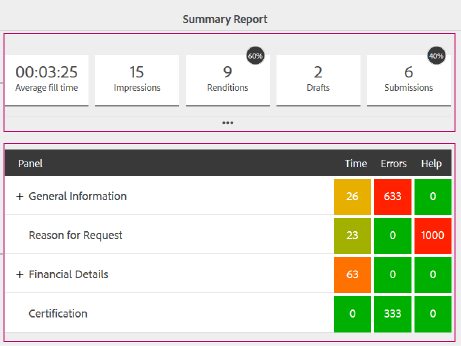

# 衡量并改进表单的有效性和转换 {#measure-and-improve-effectiveness-and-conversion-of-forms}

>[!CAUTION]
>
>AEM 6.4已结束扩展支持，本文档将不再更新。 有关更多详细信息，请参阅 [技术支助期](https://helpx.adobe.com/cn/support/programs/eol-matrix.html). 查找支持的版本 [此处](https://experienceleague.adobe.com/docs/).

## 挑战 {#the-challenge-br}

组织正日益增强其能力并鼓励其客户跨多个渠道使用数字自助服务进行交易。 但是，如果没有一对一的反馈机制，衡量成功与否以及尝试使用数字表单以提升客户体验和提高转化率将变得极具挑战性。

为了最大限度地提高投资回报，组织必须监控其客户与服务的交互方式，并尝试使用其数字工件（表单）来增强客户体验。 要衡量成功并定义改进策略，组织需要回答以下问题：

* 有多少客户尝试使用我的表单访问或处理？
* 有多少人成功完成了交易？
* 有多少人放弃了表格？
* 客户在哪些方面遇到问题？
* 我会引入哪些更改，如何测试哪些更改可以提高转化率？

## 解决方案 {#the-solution}

AEM Forms集成 [Adobe Marketing Cloud](https://www.adobe.com/marketing-cloud.html) 解决方案 —  [Adobe Analytics](https://www.adobe.com/marketing-cloud/web-analytics.html) 和 [Adobe Target](https://www.adobe.com/marketing-cloud/testing-targeting.html)  — 可帮助您监控和分析表单的执行情况，并让您能够试验和识别可提高转化率的体验。

## 工作流 {#the-workflow}

下面详细介绍如何衡量表单的性能并提高表单转化率。

### 目标受众 {#target-audience}

* 负责营销策略和成功的业务用户和分析人员
* 负责基础架构和解决方案设置和维护的IT人员

### AEM Forms组件和涉及的功能 {#aem-forms-components-and-features-involved}

* 自适应表单
* 与Adobe Analytics集成，以收集、组织和报告客户与自适应表单的交互
* 与Adobe Target集成，以运行自适应表单的A/B测试

### 假设 {#assumptions}

* 您已经拥有Adobe Marketing Cloud帐户，并已为Analytics和Target解决方案注册。
* 您有一个已发布的自适应表单，客户可以访问该表单。

### 工作流步骤 {#workflow-steps}

#### 步骤1:在AEM Forms中配置Analytics和Target {#step-configure-analytics-and-target-in-aem-forms-br}

**配置 Analytics**

要深入了解客户与表单的交互，您需要先在AEM Forms中配置Analytics。 执行以下步骤：

1. 在Adobe Analytics中创建报表包
1. 在AEM中创建云服务配置
1. 在AEM中创建云服务框架
1. 在AEM中配置AEM Forms Analytics配置服务
1. 在AEM的表单上启用Analytics

有关详细步骤，请参阅 [为自适应表单配置分析和报表](/help/forms/using/configure-analytics-forms-documents.md).

**配置Target**

要为自适应表单创建和运行A/B测试，请按照 [在AEM Forms中设置和集成Target](/help/forms/using/ab-testing-adaptive-forms.md#p-set-up-and-integrate-target-in-aem-forms-p).

#### 步骤2:查看分析报表 {#step-view-analytics-report-br}

当您的客户访问您启用了Analytics的表单并与之交互时，其交互会捕获到高度安全的Analytics数据库中。 数据库由客户端分段，并可通过安全连接访问。

您可以在AEM中查看启用了分析的表单的报表并分析数据。 要查看报表，请执行以下操作：

1. 在AEM服务器上，导航到 **Forms > Forms与文档**.
1. 选择要为其生成分析报表的表单。
1. 单击Analytics报表图标。 随即会显示报表。

让我们看一看Analytics为表单收集和报告的数据点。

**Forms analytics报表**

自适应表单的分析报表可在表单级别捕获以下关键绩效指标(KPI):

* **平均填充时间**:填写表单所花费的平均时间
* **展示次数**:表单在搜索结果中出现的次数

* **演绎版**:表单已呈现或打开的次数
* **草稿**:表单被保存为草稿的次数

* **提交**:提交表单的次数
* **中止**:用户在未完成表单时离开的次数
* **访问/提交**:每次提交的访问次数比率

此外，您还可以获取有关表单中每个面板的以下详细信息：

* **时间**:面板及其字段的平均逗留时间（秒）

* **错误**:在面板及其每个1000个表单呈现的字段中遇到的错误数

* **帮助**:每1000个表单演绎版中用户访问面板及其字段的上下文帮助的次数

有关表单分析报表的更多详细信息，请参阅 [查看和了解AEM Forms分析报表](/help/forms/using/view-understand-aem-forms-analytics-reports.md).

>[!NOTE]
>
>您可以在Adobe Marketing Cloud上的Analytics帐户中查看详细报表，并深入了解客户及其与表单的交互情况。

#### 步骤3:分析数据点 {#step-analyze-data-points}

在此步骤中，您将分析分析报表中的数据点，并推断表单的执行方式。 如果它未达到您的成功KPI，您将根据数据构建假设，并找到可能的解决方案来修复问题。 例如：

* 如果表单的平均填充时间高于您的预期，则客户可能会对您的表单感到复杂，并且表单不使用标准术语，表单太长，等等。 在这种情况下，您可能希望简化表单结构和字段、修改表单设计、缩短表单长度，或为非标准表单字段添加帮助说明和示例。
* 如果数据表示大多数客户正在访问表单面板的帮助，则很明显，客户对要填写的信息感到困惑。 您可能希望使用替代术语或为该面板添加一些示例输入和帮助描述。
* 如果表单的中止或放弃率高于预期，这可能是由于表单需要较长渲染时间、客户无意中登陆表单或表单过于复杂所致。 在这种情况下，您可能希望优化搜索结果中显示的表单描述、简化表单、优化表单以加快加载速度，等等。

分析了这些数据点并得出了一个假设后，请对表单进行所需的更改。

#### 步骤4:验证分析和修复 {#step-validate-your-analysis-and-fixes}

在此步骤中，您将验证您在表单中所做的更改，并验证它是否会影响转化率。

**运行A/B测试**

将AEM Forms与Target集成后，可以创建自适应表单的A/B测试。 在A/B测试中，您可以实时向客户随机显示不同的表单体验，以了解哪些体验效果更好或导致更多转化。 当您有大量数据指示一个体验比另一个体验提供更好的转化后，您可以声明该体验为入选者，并且今后，它将成为所有客户都可看到的默认体验。

有关为自适应表单创建A/B测试的更多信息，请参阅 [自适应表单的A/B测试](/help/forms/using/ab-testing-adaptive-forms.md).

## 最佳实践 {#best-practices}

真正的最佳实践是您在执行此工作流时识别自己。 它们是您的环境和要求所特有的。 通过工作流捕获您的学习内容，并将其记录为最佳实践。

有关设计表单和运行A/B测试的一些建议如下：

**Forms设计**

* 保持表单简单、简短且易于导航。 使用方向提示进行导航。
* 对表单字段使用标准或常用术语。
* 通过示例或帮助说明字段和必需输入，用户可能会感到困惑。
* 尽可能在用户输入内容时验证用户输入内容，以避免在提交表单时出错。
* 优化桌面和移动设备的布局。
* 自动填充已知用户的信息。

**A/B测试**

* 在运行A/B测试之前，构建一个假设并识别成功量度。
* 在备用体验中尽量减少变量（最好一次一个），以了解影响转化率的因素。
* 经常测试，以消除低效率。
