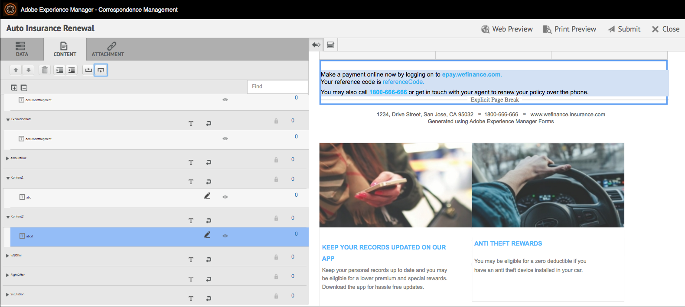

# 使用代理UI准备和发送交互式通信 {#prepare-and-send-interactive-communication-using-the-agent-ui}

>[!CAUTION]
>
>AEM 6.4已结束扩展支持，本文档将不再更新。 有关更多详细信息，请参阅 [技术支助期](https://helpx.adobe.com/cn/support/programs/eol-matrix.html). 查找支持的版本 [此处](https://experienceleague.adobe.com/docs/).

代理UI允许代理准备交互式通信并将其发送到后处理。 代理根据允许进行所需的修改，并将交互式通信提交到帖子流程，如电子邮件或打印。

## 概述 {#overview}

创建交互式通信后，代理可以在代理UI中打开交互式通信，并通过输入数据并管理内容和附件来准备特定于收件人的副本。 最后，代理可将交互式通信提交到后处理。

在使用代理UI准备交互式通信时，代理在将交互式通信提交到帖子流程之前，会在代理UI中管理交互式通信的以下方面：

* **数据**:“代理”UI的“数据”选项卡显示“交互式通信”中任何可编辑的代理变量和已解锁的表单数据模型属性。 这些变量/属性是在编辑或创建包含在交互式通信中的文档片段时创建的。 “数据”选项卡还包含XDP/打印渠道模板中构建的任何字段。 “数据”选项卡仅在代理可编辑的交互式通信中存在任何变量、表单数据模型属性或字段时才显示。
* **内容**:在“内容”选项卡中，代理管理交互式通信中的内容，如文档片段和内容变量。 在这些文档片段的属性中创建交互式通信时，代理可以根据允许在文档片段中进行更改。 代理还可以重新排序、添加/删除文档片段以及添加分页符（如果允许）。
* **附件**:仅当交互式通信具有任何附件或代理具有库访问权限时，“附件”选项卡才会在代理UI中显示。 代理人可以（也可以不允许）更改或编辑附件。

## 使用代理UI准备交互式通信 {#prepare-interactive-communication-using-the-agent-ui}

1. 选择 **[!UICONTROL Forms]** > **[!UICONTROL Forms和文档]**.
1. 选择相应的交互式通信并点按 **[!UICONTROL Open Agent UI]**.

   >[!NOTE]
   >
   >代理UI仅在选定的交互式通信具有打印渠道时才起作用。

   

   根据交互式通信的内容和属性，将显示代理UI，其中包含以下三个选项卡：数据、内容和附件。

   

   继续输入数据、管理内容和管理附件。

### 输入数据 {#enter-data}

1. 在数据选项卡中，根据需要输入变量、表单数据模型属性和打印模板(XDP)字段的数据。 填写标有星号(&amp;ast;)的所有必填字段，以启用 **提交** 按钮。

   点按“交互式通信”预览中的数据字段值，以在“数据”选项卡中突出显示相应的数据字段，反之亦然。

### 管理内容 {#manage-content}

在“内容”选项卡中，在交互式通信中管理内容，如文档片段和内容变量。

1. 选择 **[!UICONTROL 内容]**. 此时将显示交互式通信的内容选项卡。

   

1. 在“内容”选项卡中，根据需要编辑文档片段。 要将焦点集中在内容层次结构中的相关片段，您可以点按交互式通信预览中的相关行或段落，也可以直接点按内容层次结构中的片段。

   例如，在下图的预览中选择了行为“立即联机付款……”的文档片段，并且在“内容”选项卡中选择了相同的文档片段。

   

   在“内容”或“数据”选项卡中，点按高亮显示内容中的选定模块( )，您可以在预览中点按/选择相关文本、段落或数据字段后，禁用或启用功能以转到文档片段。

   创建交互式通信时允许代理编辑的片段具有编辑选定内容( )图标。 点按编辑选定内容图标，以在编辑模式下启动片段并在其中进行更改。 使用以下选项设置文本格式和管理文本：

   * [格式选项](#formattingtext)

      * [从其他应用程序中复制粘贴格式文本](#pasteformattedtext)
      * [突出显示部分文本](#highlightemphasize)
   * [特殊字符](#specialcharacters)
   * [键盘快捷键](/help/forms/using/keyboard-shortcuts.md)

   有关代理用户界面中可用于各种文档片段的操作的更多信息，请参阅 [代理用户界面中可用的操作和信息](#actionsagentui).

1. 要向交互式通信的打印输出添加分页符，请将光标放在要插入分页符的位置，然后选择“分页前”或“分页后”( )。

   在交互式通信中插入显式分页符占位符。 要查看显式分页符对交互式通信的影响，请参阅打印预览。

   

   继续管理交互式通信的附件。

### 管理附件 {#manage-attachments}

1. 选择 **[!UICONTROL 附件]**. 代理UI在创建交互式通信时显示设置的可用附件。

   您可以通过点按视图图标，选择不连同交互式通信一起提交附件，然后可以点按附件中的十字，从交互式通信中删除附件（如果允许代理删除或隐藏附件）。 对于在创建交互式通信时指定为必需的附件，将禁用“查看”和“删除”图标。

   

1. 点按库访问( )图标以访问内容库，以将DAM资产作为附件插入。

   >[!NOTE]
   >
   >仅当在创建交互式通信时启用了库访问（在打印渠道的文档容器属性中）时，才可使用库访问图标。

1. 如果在创建交互式通信时未锁定附件的顺序，则可以通过选择附件并点按向下和向上箭头来重新排序附件。
1. 使用“Web预览”和“打印预览”可查看这两个输出是否符合您的要求。

   如果您发现预览效果令人满意，请点按 **[!UICONTROL 提交]** 将交互式通信提交/发送到帖子进程。 或者，要进行更改，请退出预览以返回进行更改。

## 设置文本格式 {#formattingtext}

在代理UI中编辑文本片段时，工具栏会根据您选择进行的编辑类型而发生更改：字体、段落或列表：

 

字体工具栏

段落工具栏

列表工具栏

### 突出显示/强调部分文本 {#highlightemphasize}

要突出显示可编辑片段中的部分文本，请选择文本，然后点按高亮显示颜色。

### 粘贴格式化文本 {#pasteformattedtext}

### 在文本中插入特殊字符 {#specialcharacters}

代理UI内置了对210个特殊字符的支持。 管理员可以 [通过自定义添加对更多/自定义特殊字符的支持](/help/forms/using/custom-special-characters.md).

#### 附件投放 {#attachmentdelivery}

* 当使用服务器端API作为交互式或非交互式PDF呈现交互式通信时，呈现的PDF包含附件作为PDF附件。
* 当使用代理UI将与交互式通信关联的后处理作为提交的一部分加载时，附件将作为列表传递&lt;com.adobe.idp.document> inAttachmentDocs参数。
* 投放机制工作流（如电子邮件和打印）还会发送附件以及交互式通信的PDF版本。

## 代理用户界面中可用的操作和信息 {#actionsagentui}

### 文档片段 {#document-fragments}

* **向上/向下箭头**:在交互式通信中向上或向下移动文档片段的箭头。
* **删除**:如果允许，请从交互式通信中删除文档片段。
* **分页时间之前** （适用于目标区域的子片段）：在文档片段之前插入分页符。
* **缩进**:增加或减少文档片段的缩进。
* **之后分页** （适用于目标区域的子片段）：在文档片段之后插入分页符。

* 编辑（仅限文本片段）：打开富文本编辑器以编辑文本文档片段。 有关更多信息，请参阅 [设置文本格式](#formattingtext).

* 选择（眼睛图标）：包括\排除交互式通信中的文档片段。
* 未填充的值（信息）：指示文档片段中未填充变量的数量。

### 列出文档片段 {#list-document-fragments}

* 插入空行：插入新的空行。
* 选择（眼睛图标）：包括\排除交互式通信中的文档片段。
* 跳过项目符号/编号：启用以跳过列表文档片段中的项目符号/编号。
* 未填充的值（信息）：指示文档片段中未填充变量的数量。
