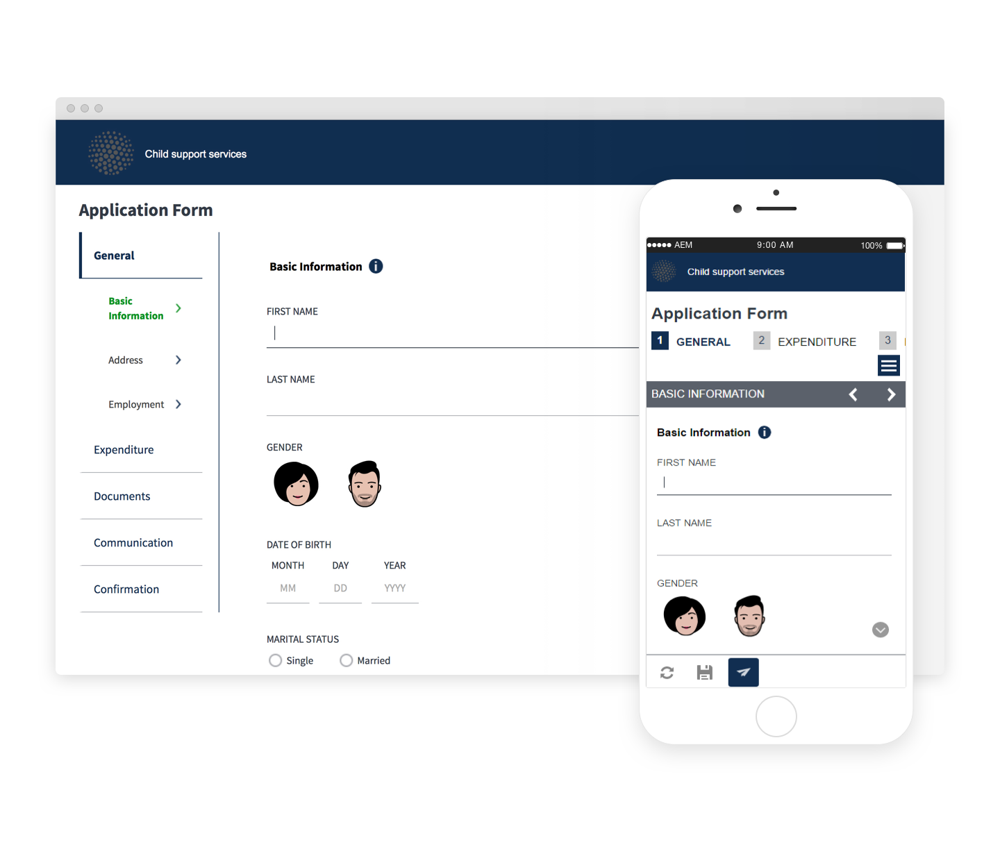

# 参考主题 {#reference-themes}

>[!CAUTION]
>
>AEM 6.4已结束扩展支持，本文档将不再更新。 有关更多详细信息，请参阅 [技术支助期](https://helpx.adobe.com/cn/support/programs/eol-matrix.html). 查找支持的版本 [此处](https://experienceleague.adobe.com/docs/).

[主题](/help/forms/using/themes.md) 允许您在不深入了解CSS的情况下设置表单样式。 除了默认主题之外，您还可以通过安装[AEM Forms附加组件包](https://experienceleague.adobe.com/docs/experience-manager-release-information/aem-release-updates/forms-updates/aem-forms-releases.html):

* 柏利
* 执行
* Exec-Light
* 利伯蒂
* 超海洋
* 厄巴纳
* 美国Web设计标准
* 宁静

每个主题都包含独特而优雅的风格，您可以使用这些风格为用户创建有趣的自适应表单。 它包含选择器的唯一样式，例如面板、文本框、数字框、单选按钮、表和开关。 这些主题中的样式是基于要求的。 例如，在特定情景中，您需要具有简洁字体的极简主义主题。 自由主题让你能够达到这种效果。

此包中包含的主题是响应式的，这些主题中的样式是为移动设备和桌面显示屏定义的。 各种设备上的大多数现代浏览器都可以轻松渲染使用其中一个主题应用的表单。

有关安装包的更多信息，请参阅 [如何使用包](/help/sites-administering/package-manager.md).

## 柏利 {#beryl}

柏力主题由 [We.Gov自适应表单](/help/forms/using/gov-reference-site-walkthrough.md)，并强调背景图像、透明度和大型平面图标的使用。 在下面的屏幕截图中，您可以看到Beryl主题的外观，以及它如何增强表单的样式。

[单击放大](assets/beryl-1.png)

## 执行 {#exec}

执行主题避免使用实体背景填充来强调表单组件。 选择并单击组件会更改字体颜色。 与默认的画布主题相比，选定选项卡中文本的字体颜色将变为深蓝色。 请注意导航和提交按钮与Beryl主题有何不同。

[单击放大](assets/exec-1.png)

## 执行指示灯 {#exec-light}

“执行光”主题使用空格来创建无缝体验。 “下一步”(Next)和“提交”(Submit)按钮可获得实心填充和3D阴影。 左侧的选定选项卡会获得一个箭头，而不是双复选标记。

[单击放大](assets/exec-light-1.png)

## 利伯蒂 {#liberty}

自由主题采用极简主义的方式来强调这一重要因素。 例如，已访问选项卡的字体颜色将变为绿色。 您只能看到文本框的下边框，该边框模拟基于纸的表单的线条外观。 活动文本框的底部轮廓为黑色，而其他文本框的底部轮廓为浅灰色。

[单击放大](assets/liberty-1.png)

## 宁静 {#tranquil}

宁静的主题提供宁静色彩方案的浅色和深色色调，以突出表单的不同组成部分。 例如，单选按钮、面板和选项卡的绿色阴影不同。

[单击放大](assets/tranquil-1.png)

## 超海洋 {#ultramarine}

Ultramarine主题使用深蓝色阴影来突出显示组件，如选项卡、面板、文本框和按钮。

## 厄巴纳 {#urbane}

都市主题强调您的形式极简而实用。 将城市主题应用于表单时，您可以看到组件是平的。 这些面板具有细轮廓以创造现代外观。

[单击放大](assets/urbane-1.png)

## 美国Web设计标准 {#u-s-web-design-standards}

如名称所示，美国Web设计标准主题使用美国Web设计标准草案网站中描述的字体和样式。 联邦组织使用Web标准来创建跨联邦政府网站的一致Web体验。

[单击放大](assets/usgov.png)
